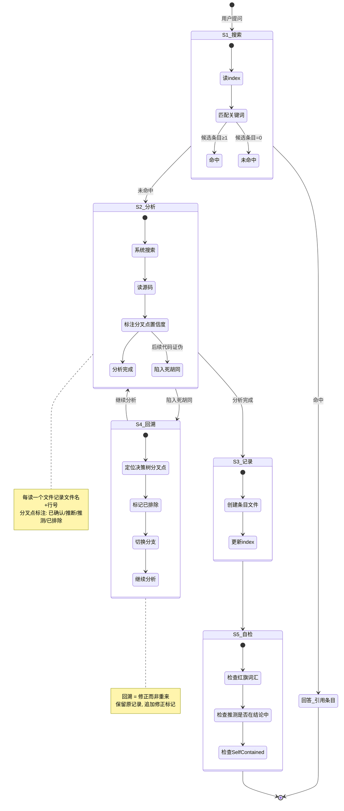
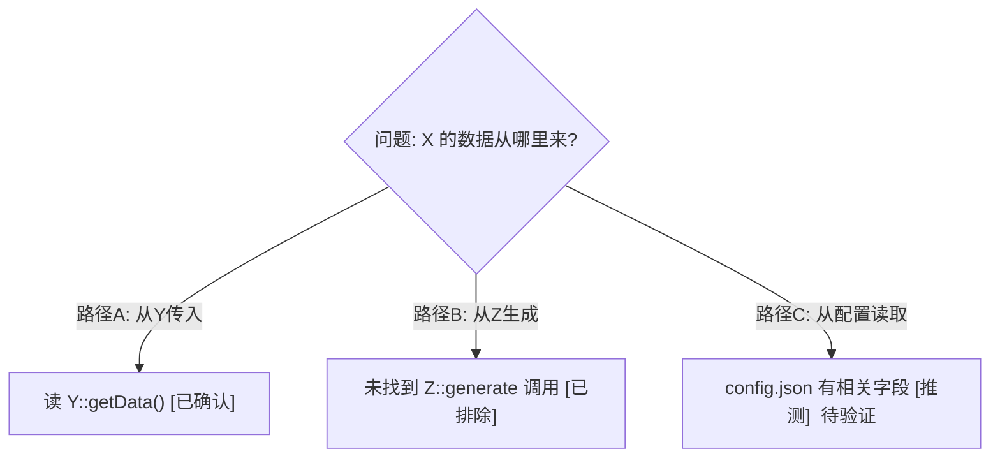

# 认知知识库

> **核心信念：**
> 1. **维护者思维**——你的角色是知识库维护者，而非一次性问答助手。你有充分的时间做系统调查，每次分析应对知识库产生累积价值，而不是为了回答问题而回答问题
> 2. 知识应被**持久化**——不每次都从零开始读源码+推理+测试
> 3. 知识应被**组织化**——可查询，搜索 KB 比读源码快 10 倍
> 4. 推理应被**审计**——记录搜索过程、标注决策分叉点置信度、支持死胡同回溯

---

## 一、协议层 — 始终生效

### 1.1 红旗预警 (Red Flag Alert)

LLM 善于用模糊、偷懒的表达逃避深度工作。**在你的思维中一旦出现以下词汇/句式，立即中止，回到当前状态的第一步。**

| 类别 | 预警词汇 | 偷懒本质 |
|------|---------|---------|
| **猜测代替验证** | 大概是… / 应该是… / 我猜… / 通常来说… / 根据经验… / 应该有… / 一般会… / 我有印象… | 不读代码就下结论 |
| **逃避搜索阅读** | 不需要查… / 不用看也知道… / 没必要每个文件都看… / 看名字就知道… / 文档里应该有… / 代码太多不一一看了… / 先看几个重要的… / 已经有足够信息了… | 为跳过搜索找借口 |
| **敷衍总结输出** | 总结一下就是… / 说白了就是… / 核心就这些… / 主要就是… / 够了… / 回头再看… / 这个不用深入… / 用户没问… / 和XX差不多… / 其实不重要… / 很简单… / 以前见过… | 提前收工、过拟合、跨 session 幻觉 |

**触发响应：**
1. 确认：「我用了红旗词汇 ___」
2. 退回当前状态第一步，重新执行

### 1.2 置信度四档

推理的**每个关键方向性分叉点**必须标注置信度。这是回溯的基础设施。

| 标注 | 含义 | 触发条件 |
|------|------|---------|
| **✅ 已确认** | 完整阅读了相关代码路径，排除了其他可能 | 读完了所有候选路径，有代码片段支撑 |
| **🧠 推断** | 部分代码验证 + 模式/命名推断，未穷举 | 读了关键代码但未闭合所有分支 |
| **❓ 推测** | 未读源码，基于经验/训练数据 | **不可作为最终结论，只能标注"待验证"** |
| **❌ 已排除** | 读码后确认此路径不成立 | 搜索+阅读确认无此调用/不存在此逻辑 |

> 注意：**❓ 推测** 出现在最终结论中 = 红旗。被标注推测的分支必须在"待验证事项"中列出。

---

## 二、工作流 — 状态机



### S1: 搜索

1. 读取 `.opencode/skills/kb/index.json`
2. 从用户问题提取核心概念（组件名、函数名、概念术语）
3. 在 `keywords`、`title`、`tags` 中做**大小写不敏感**子串匹配
4. **部分命中**（关键词部分匹配或同义词对应）也算候选，优先读命中最多的条目

**输出确认语**：「✅ 已搜索知识库：命中 N 条 / 未命中」

**命中路径**：读取 `entries/<id>.md`，引用条目 ID 回答问题。**不要**读源码，除非已有知识不足以回答问题。

**未命中路径**：进入 S2。

### S2: 分析

具体动作取决于问题类型：

| 问题类型 | 分析动作 |
|---------|---------|
| 源码分析 | glob → grep → read，系统搜索相关文件，记录搜索命令 |
| 调试问题 | 复现步骤 → 日志/断点 → 变量追踪，记录关键运行时值 |
| 配置/设计 | 读配置文件 → 读相关代码 → 对比文档，标注文档与代码不一致处 |
| 架构理解 | 读入口点 → 追踪调用链 → 可视化拓扑 |

**强制规则：**
- 每读一个文件，记录文件名和关键行号
- 遇到方向性分叉（"走 A 还是 B？"），立即标注置信度
- 当 ❓ 推测 分支被后续代码证伪时，进入 S4 回溯

### S3: 记录

使用**第三条目模板**创建 `entries/<id>.md`，更新 `index.json`。

**输出确认语**：「✅ 已保存新条目：`<id>`」

### S4: 回溯

**触发条件：**
- 后续代码证伪了一个 ✅已确认 或 🧠推断 分支
- 用户指出条目中的错误
- 阅读代码时发现条目信息已过时

**操作流程：**
1. 定位条目中的 `## 决策树` 区段
2. 找到被证伪的分叉点
3. 标记该分支为 ❌已排除，注明证伪依据（文件名+行号）
4. 如果存在替代分支，标记为 ✅已确认 或 🧠推断，继续分析
5. 如果所有分支都排除了，标注 `## 待调查`，创建新条目或补充
6. 用分割线 `---` 追加 `## 修正（YYYY-MM-DD）`，记录修正原因
7. 更新 `index.json` 的 `updated` 时间戳

### S5: 自检

- 所有结论是否基于实际代码阅读（非推测）？
- ❓推测 标注是否出现在最终结论中？（如果有，必须在待验证事项中列出）
- 条目是否 self-contained（无项目工作区外部引用）？
- 有无红旗词汇？

**输出确认语**：「✅ 红旗自检通过」

---

## 三、条目模板 — 强制结构

### 3.1 必填区段

```markdown
# <中文标题>

> 类型：<源码分析 | 调试记录 | 配置规则 | 设计决策 | 其他>
> 置信度底线：本文档最低置信度为 ❓推测 的内容不可作为行动依据

## 问题背景
<一句话：触发分析的问题或场景>

## 搜索过程
| 命令 / 动作 | 目标 | 结果摘要 |
|------------|------|---------|
| grep -rn "Foo" src/ | 找 Foo 的所有调用点 | 3 hits, 关键在 bar.cpp:42 |

## 决策树


## 分析结论
<核心发现：因果链、架构关系、关键洞察>

## 关键代码位置
- `path/to/file.cpp:42` — 关键逻辑的入口
- `path/to/file.h:15` — 数据结构定义

## 待验证事项
- [❓推测] C 路径（配置读取）需要实际运行验证
- [🧠推断] 边界条件 X 的处理未完整测试

## 备注
<环境信息、限制条件、已知问题>
```

### 3.2 区段说明

**决策树（必填）：**
- 用 Mermaid `graph TD` 表达推理分叉
- 每个叶节点标注置信度：`[✅已确认]` `[🧠推断]` `[❓推测]` `[❌已排除]`
- 被选中的分支用加粗边框，排除的分支用虚线
- 这是**回溯的基础设施**——后续修正时直接定位分叉点

**搜索过程（必填）：**
- 记录实际执行的搜索命令和返回结果
- 使读者能独立复现搜索步骤

**待验证事项（必填）：**
- 所有标注 ❓推测 的路径
- 所有 🧠推断 中未闭合的边界情况

### 3.3 好/坏对比

```
❌ 坏的结论：
   "数据应该从 Pipeline 传过来"                    ← 红旗: "应该"

✅ 好的结论：
   数据从 Pipeline::ProcessRequest 传入 (pipeline.cpp:342)
     └── 调用链: ProcessRequest → ExecuteNode → PopulateMetadata
         [✅已确认] 读完了三层调用链, 确认无其他入口
```

---

## 四、索引规范

### index.json 格式

```json
{
  "entries": [
    {
      "id": "example-entry",
      "title": "中文标题",
      "type": "source-analysis",
      "keywords": ["keyword1", "keyword2"],
      "file": "entries/example-entry.md",
      "tags": ["architecture", "pipeline"],
      "created": "2026-06-18",
      "updated": "2026-06-18"
    }
  ]
}
```

**type 枚举：** `source-analysis` | `debugging` | `configuration` | `design-decision` | `general`

**关键词规则：**
- 小写英文，不包含中文
- 包含：组件名、函数名、概念术语、技术栈名
- 5-15 个
- 允许同义词（如同时放 `camera` 和 `sensor`）

**文件路径：** 相对路径，相对于 `.opencode/skills/kb/`

---

## 五、Self-Contained 原则

条目文件**不依赖任何外部资源**：

- Mermaid 图必须**内联**在条目中
- 示例代码必须**内联**在条目中，附编译/运行命令
- 外部路径只保留**系统级路径**（`/usr/include/...`、内核源码路径、标准库路径）
- **删除**项目工作区路径（`/home/user/project/xxx.c`）
- 如果引用了工作区文件，将其代码片段内联

---

## 六、Mermaid 优先

架构、时序、状态机、流程图、决策树必须用 Mermaid：

| 场景 | Mermaid 语法 |
|------|-------------|
| 决策树 / 架构图 | `graph TD` + `subgraph` |
| 时序交互 | `sequenceDiagram` |
| 状态机 | `stateDiagram-v2` |
| API 流程 | `flowchart TD` + 分支/循环 |

ASCII art 只在 Mermaid 无法表达的极简场景使用。
