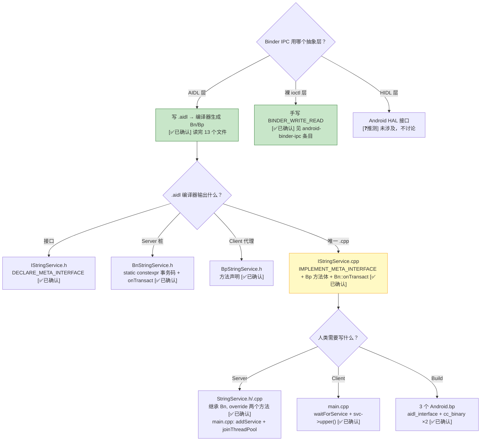
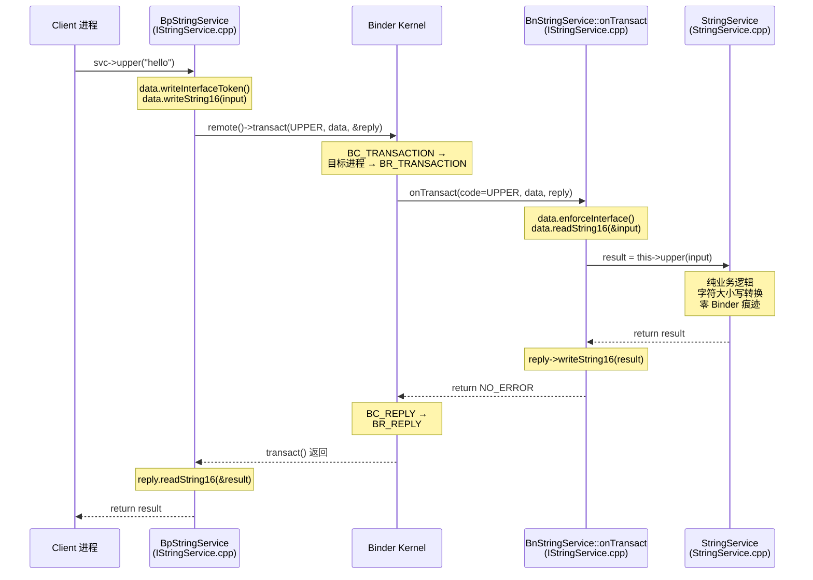
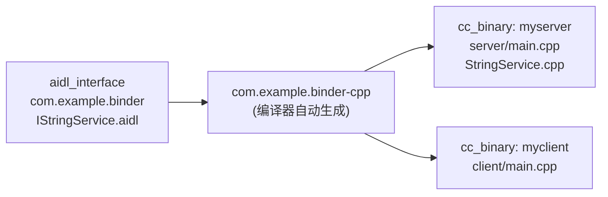

# AIDL Binder Demo — .aidl → 编译器生成代码 → Server/Client 完整剖析

> 类型：源码分析
> 置信度底线：本文档最低置信度为 ❓推测 的内容不可作为行动依据
> 完整可编译源码：`resources/aidl-demo/`

## ❓ 问题背景

Android Binder IPC 有两条学习路径：(1) 裸 `ioctl()` 层 — 手写 `BC_TRANSACTION`/`BR_REPLY`；(2) AIDL 层 — `.aidl` 接口定义 → 编译器自动生成 Bn/Bp 桩和代理 → 业务代码只写纯逻辑。本条目覆盖路径 (2)，是 KB 条目 `android-binder-ipc`（裸 ioctl 层）的上层抽象。

## 🔍 搜索过程

| 动作 | 目标 | 结果摘要 |
|------|------|---------|
| `ls aidl_demo/` | 了解目录结构 | 5 个子目录：aidl/、server/、client/、gen/ + README.md |
| `read aidl_demo/README.md` | 全局概览 | 已有详尽的对照表和调用链 |
| `read aidl_demo/aidl/.../IStringService.aidl` | AIDL 接口定义 | 9 行，package + interface + 2 方法 |
| `read server/{main,StringService}.cpp` | 人类写的 Server 代码 | 41 + 36 行，纯业务逻辑 |
| `read client/main.cpp` | 人类写的 Client 代码 | 39 行 |
| `read gen/.../IStringService.cpp` | 编译器生成的核心实现 | 129 行，Bp::method + Bn::onTransact |
| `read gen/.../{I,Bn,Bp}StringService.h` | 编译器生成的头文件 | 46 + 54 + 31 行 |

## 🌳 决策树



## 💡 分析结论

### .aidl 接口定义（9 行 = 整个系统的契约）

```cpp
// IStringService.aidl — 人类写的唯一接口文件
package com.example.binder;

interface IStringService {
    String upper(String input);
    String lower(String input);
}
```

**package 名决定 namespace，interface 名决定类名。** 这 3 行是 Client 和 Server 的唯一公共依赖。

### 编译器生成 4 个文件（双向 Parcel 编解码 + 事务分发）

| 文件 | 核心内容 | 谁 include |
|------|---------|-----------|
| `IStringService.h` | 纯虚接口 `upper()` / `lower()` + `DECLARE_META_INTERFACE` + `IStringServiceDefault` | Server & Client |
| `BnStringService.h` | `TRANSACTION_upper = FIRST_CALL+0` / `lower = FIRST_CALL+1` + `onTransact()` 声明 | Server (继承用) |
| `BpStringService.h` | 代理方法声明（方法体在 .cpp） | 只有 IStringService.cpp |
| `IStringService.cpp` | `IMPLEMENT_META_INTERFACE` + `Bp::method` 的 `write→transact→read` + `Bn::onTransact` 的 `read→this->method→write` | 链接进 `com.example.binder-cpp` 库 |

**关键洞察：** `BpStringService` 对 Server/Client 的源码完全透明。Client 拿的是 `sp<IStringService>`，方法签名和本地调用一样。

### Bp 方法体模板（AIDL 编译器机械生成，零业务逻辑）

```cpp
// BpStringService::upper — 每个方法 = write入参 + transact + read出参
::android::String16 BpStringService::upper(const ::android::String16& input) {
    ::android::Parcel data, reply;
    data.writeInterfaceToken(IStringService::getInterfaceDescriptor());
    data.writeString16(input);                                // 序列化
    remote()->transact(BnStringService::TRANSACTION_upper, data, &reply);
    ::android::String16 result;
    reply.readString16(&result);                              // 反序列化
    return result;
}
```

### Bn::onTransact 模板（与 Bp 严格对称，AIDL 编译器保证）

```cpp
// BnStringService::onTransact — switch(code) 分发，每个 case = read + this->method() + write
status_t BnStringService::onTransact(uint32_t code, const Parcel& data, Parcel* reply, ...) {
    switch (code) {
    case TRANSACTION_upper: {
        data.enforceInterface(...);
        ::android::String16 input;
        data.readString16(&input);                           // 反序列化
        ::android::String16 result = this->upper(input);     // ★ 调子类业务方法
        reply->writeString16(result);                        // 序列化
        return NO_ERROR;
    }
    // TRANSACTION_lower 同理...
    }
}
```

### 人类写的代码：纯业务逻辑（零 Binder 痕迹）

```cpp
// StringService.cpp — 继承 BnStringService，只覆写 upper/lower
// 看不到 Parcel、transact、IBinder 任何一个词
::android::String16 StringService::upper(const ::android::String16& input) {
    // ... 纯字符大小写转换逻辑 ...
}
```

### 调用链



### 编译：3 个 Android.bp target



## 📍 关键代码位置

| 位置 | 说明 |
|------|------|
| `resources/aidl-demo/aidl/com/example/binder/IStringService.aidl:4-8` | AIDL 接口定义 |
| `resources/aidl-demo/gen/com/example/binder/IStringService.cpp:49-73` | BpStringService::upper/lower 方法体 |
| `resources/aidl-demo/gen/com/example/binder/IStringService.cpp:87-125` | BnStringService::onTransact 分发逻辑 |
| `resources/aidl-demo/gen/include/com/example/binder/BnStringService.h:19-30` | TRANSACTION_upper/lower 事务码定义 |
| `resources/aidl-demo/server/StringService.cpp:10-32` | 人类写的纯业务逻辑 |
| `resources/aidl-demo/server/main.cpp:22-39` | Server 入口：addService + joinThreadPool |
| `resources/aidl-demo/client/main.cpp:20-38` | Client 入口：waitForService + svc->upper() |
| KB 条目 `android-binder-ipc` | 裸 ioctl 层 Binder IPC（本条目是 AIDL 上层封装） |

## ⚠️ 待验证事项

- [🧠推断] `IStringServiceDelegator`（BnStringService.h:35-50）的使用场景未深入分析 — 设计模式上的委托机制
- [🧠推断] `IStringServiceDefault`（IStringService.h:31-42）在 stub API 版本化中的作用 — 未读相关 AOSP 文档
- [❓推测] AIDL 编译器（aidl-cpp）的具体工作流程和模板引擎 — 未读编译器源码

## 📝 备注

- 本条目偏重 AIDL 层的**代码生成机制**和**调用链**，Binder 内核驱动层（`BC_TRANSACTION`/`binder_transaction`）已在 `android-binder-ipc` 条目中覆盖
- 完整可编译源码位于 `resources/aidl-demo/`，包含 `README.md`（更详细的对照表）
- 编译需要 AOSP 源码树环境：`mm` 在 `aidl-demo/` 目录下执行
- 依赖库：`libbinder`、`libutils`（均来自 AOSP 系统），非 standalone
