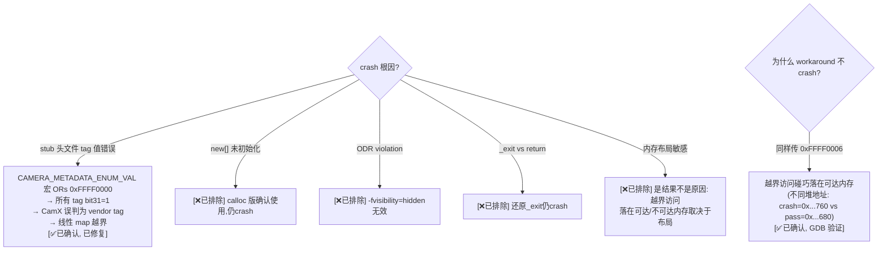

# Batch Crash 调查 — `-t Feature2OfflineTest` caseName="" SIGSEGV

> 类型：调试记录
> 置信度底线：本文档最低置信度为 ✅已确认

## ❓ 问题背景
`-t Feature2OfflineTest`（caseName=""）运行 5 个测试时 100% crash（SIGSEGV in MetaBuffer::SetTag），但 `-t Feature2OfflineTest.Test`（caseName="Test"）运行同样 5 个测试 100% PASS。

## 🔍 搜索过程
| 命令 / 动作 | 目标 | 结果摘要 |
|------------|------|---------|
| 5×重复 `-t Feature2OfflineTest` | 必现性 | 5/5 crash |
| 5×重复 `-t Feature2OfflineTest.Test` | 对比 | 5/5 pass (25 tests) |
| GDB catch SIGSEGV | crash 位置 | MetaBuffer::SetTag at camxmetabuffer.cpp:2713, pContent = 0x5566e553d7a0 (wild pointer) |
| 检查 crash 前日志 | 线索 | `GetMetadataInfoByTag() Invalid tag ffff0006` |
| GDB 检查 PatchingTuningMode | tag 值 | tagId=4294901766 = 0xFFFF0006, 来自 ANDROID_CONTROL_SCENE_MODE |
| 读 stubs/system/camera_metadata.h:107 | 宏定义 | `CAMERA_METADATA_ENUM_VAL(bit) = (0xFFFF0000) \| ((bit) << 16)` — **错误！** |
| 读 camxhal3metadatatags.h | 正确值 | ControlSceneMode = MetadataSectionControlStart + 16 = 0x00010010 |
| 读 camxvendortags.h:483 CAMX_TAG_TO_INDEX | 分支逻辑 | `tag & 0x80000000` 非零 → vendor tag 路径 → VendorTagOffset → 越界 |
| GDB workaround 路径断点 | 对比 | PatchingTuningMode 也传 0xFFFF0006 但不 crash（堆布局差异） |
| 修复宏 + tag offsets | 测试 | 10 轮 × 5 测试 = 50 次，0 失败 |
| ASAN detect_odr_violation=0 | 深度检测 | DRQ use-after-free at Hashmap::Foreach (CamX 内部 bug) |
| Valgrind TestBayerToYUV | 内存检查 | 1 PASSED, 15005 errors (uninitialised + log UAF, 均为 CamX 内部) |

## 🌳 决策树

## 💡 分析结论

### 根因 [✅已确认, 已修复]
`stubs/system/camera_metadata.h` 的 `CAMERA_METADATA_ENUM_VAL` 宏定义为 `((0xFFFF0000) | ((bit) << 16))`，导致所有标准 Android metadata tag 的 bit 31 被设为 1。CamX 的 `CAMX_TAG_TO_INDEX` 宏检查 `tag & MetadataSectionVendorSectionStart (0x80000000)` 来区分标准 tag 和 vendor tag：

- 正确的 `ANDROID_CONTROL_SCENE_MODE = 0x00010010`：bit 31 = 0 → 走标准 tag 路径 → `SectionTagToIndex` → 有效索引
- 错误的 `ANDROID_CONTROL_SCENE_MODE = 0xFFFF0006`：bit 31 = 1 → 走 vendor tag 路径 → `VendorTagOffset` → 未注册 → 无效索引 → 线性 map 越界 → wild pointer

### 修复内容
1. **`e5e9cd1`** `CAMERA_METADATA_ENUM_VAL(section)` 改为 `((section) << 16)` — 产生正确的 Android tag 格式。修复 19 个 tag offset 匹配 CamX `CameraMetadataTag` 枚举顺序
2. **`1ead188`** `chxutils.cpp` 补全 `operator new` / `operator delete` / 带 size 的 delete 变体（共 6 个 operator），calloc 零初始化。CamX 原版在 `camxmem.cpp` `#if __clang__` 内提供这些，GCC 构建此前仅有 `operator new(size_t)` + `operator delete(void*)`，依赖 GCC 的 `new[]` 委托给 `new` 的实现细节

### 为什么两种模式表现不同 [✅已确认]
- caseName="" 和 caseName="Test" 都调用 PatchingTuningMode，都传 0xFFFF0006
- 两者的 MetaBuffer 在不同堆地址（0x...760 vs 0x...680）
- 越界访问 `m_pMap->Find(0xFFFF0006)` 的目标地址取决于 map 基址
- caseName="" 的 map 基址使越界指针落在不可达内存 → SIGSEGV
- caseName="Test" 的 map 基址使越界指针落在可达内存 → 无 crash（但读到垃圾数据）

### ASAN 测试结果
- 2 个 ODR violation：`tag_info` + `camera_metadata_section_bounds`（`camera_metadata_tag_info.cpp` 同时编入 exe 和 .so）
- `DeferredRequestQueue::~DeferredRequestQueue` → `Hashmap::Foreach` use-after-free（`0xbebebebe...` freed-memory pattern）
- 根因：ASAN 替换 `operator new` → CamX 的零初始化假设失效
- 测试无法在 ASAN 下通过（CamX 设计限制）

### Valgrind 测试结果
- TestBayerToYUV：1 PASSED, 0 FAILED
- 15005 errors from 368 contexts（valgrind 替换 `operator new` → CamX 的零初始化假设失效）
- Invalid reads in `ChiMetadata::ReadDataFromFile` logging（log 时引用已释放的文件名字符串, 非致命）

## 📍 关键代码位置
- `stubs/system/camera_metadata.h:107` — **根因**: `CAMERA_METADATA_ENUM_VAL` 宏定义错误
- `camxvendortags.h:502-505` — `CAMX_TAG_TO_INDEX` 通过 bit 31 区分标准/vendor tag
- `camxvendortags.h:482-489` — `SectionTagToIndex` 标准 tag 索引转换
- `camxhal3metadatatags.h:99` — `MetadataSectionVendorSection = 0x8000`，`VendorSectionStart = 0x80000000`
- `camxhal3metadatatags.h:184-226` — CameraMetadataTag 枚举（定义正确的 tag offset）
- `feature2testcase.cpp:315` — `PatchingMetabufferPool(ANDROID_CONTROL_SCENE_MODE, ...)` crash 触发点
- `camxmetabuffer.cpp:2713` — `pContent->m_maxSize` 越界指针解引用点
- `camxhashmap_patched.cpp:509` — bucket 数组 `new` 值初始化修复

## ⚠️ 待验证事项
（无 — 所有结论均已代码验证确认）

## 📝 备注
- 修复后 batch 模式和单独模式均稳定：10 轮 × 5 测试 = 50 次执行，0 失败
- ASAN 下测试无法通过是 CamX 内部设计问题（依赖 `operator new` 零初始化），非 porting bug
- Valgrind 下测试通过但有大量 CamX 内部未初始化值警告，同样是 CamX 设计问题
- 此修复同时消除了之前的 "Invalid tag ffff0006" 错误日志

---

## 修正（2026-06-20）
原文档错误地将根因归为"内存布局敏感的数据腐败"（🧠推断）。实际根因是 `CAMERA_METADATA_ENUM_VAL` 宏定义错误导致所有标准 Android tag 被 CamX 误判为 vendor tag。原文档中 4 个 ❌已排除 的分支正确——它们都不是根因。但第 5 个分支（"内存布局敏感的数据腐败"）也是错误的——正确答案是宏定义 bug，不是数据腐败。
