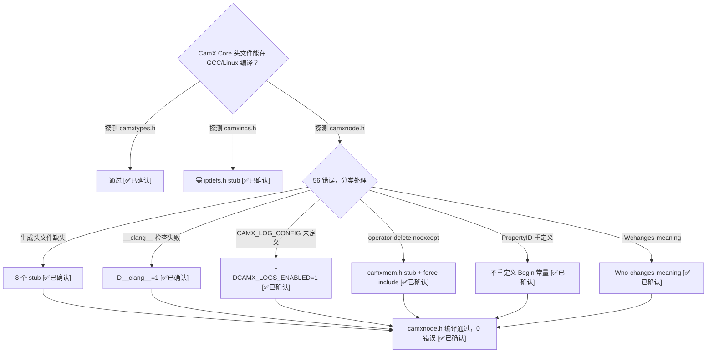

# Phase 3 可行性探测 — CamX Core 头文件编译通过

> 类型：源码分析
> 置信度底线：本文档最低置信度为 ❓推测 的内容不可作为行动依据

## 问题背景
Phase 3 需要编译 CamX Core（~90 文件）到 Linux x86_64。首要问题：CamX 头文件的传递依赖是否可控？通过编译 `camxnode.h`（最重量级的头文件之一）来验证。

## 搜索过程
| 命令 / 动作 | 目标 | 结果摘要 |
|------------|------|---------|
| `g++ probe.cpp` 含 `camxtypes.h` | 最底层头文件 | 零错误通过 [✅已确认] |
| `g++ probe.cpp` 含 `camxcsl.h` | CSL 层 | 零错误通过 [✅已确认] |
| `g++ probe.cpp` 含 `camxincs.h` | 工具层伞头文件 | 缺 `ipdefs.h`→空stub解决 [✅已确认] |
| `g++ probe.cpp` 含 `camxnode.h` | 核心层 Node 基类 | 56 错误→迭代修复→0 错误 [✅已确认] |
| `find camxeepromdriver.h` | 生成头文件定位 | 不在源码树，从 XSD 生成 [✅已确认] |
| `grep CAMX_LOG_CONFIG` | 宏定义守卫 | `#if CAMX_LOGS_ENABLED` 守卫，`#else` 漏定义 [✅已确认] |
| `grep CAMXMEM_H` | operator delete 冲突 | GCC 15 noexcept 要求与 CamX 全局 delete 重载冲突 [✅已确认] |
| `props.pl` 分析 | 属性生成器命名规则 | `MainProperty`→`PerFrameResult`，`InternalProperty`→`PerFrameInternal` [✅已确认] |
| `camxpropertyblob.h` | Begin 常量来源 | 已存在于源码，生成文件不应重复定义 [✅已确认] |

## 决策树



## 分析结论

### CamX Core 头文件可在 Linux x86_64 GCC 14/15 上编译 [✅已确认]

需要：
- **8 个 stub 头文件**（替代生成/预构建文件）
- **1 个替换头文件**（camxmem.h，绕过 GCC 15 operator delete noexcept）
- **4 个额外编译标志**
- **~20 个 include 路径**

### 需要的 Stub 头文件清单

| # | 文件名 | 来源 | 提供的类型 | 生成方式 |
|---|--------|------|-----------|---------|
| 1 | `ipdefs.h` | 预构建 IFE striping 库 | 无（空文件） | 空文件 |
| 2 | `camxeepromdriver.h` | XSD 代码生成 | `ImageDimensions`, `EEPROMIlluminantType`, `SettingsInfo` | 手写 stub |
| 3 | `camxsensordriver.h` | XSD 代码生成 | `SensorCapability`, `StreamType`, `StreamConfiguration`, `ZZHDRFirstExposurePattern`, `FrameDimension` | 手写 stub |
| 4 | `camxifestripinginterface.h` | 预构建 striping 库 | `IFEStripeMNScaleDownInputV16/V20`, `IFEStripeCrop` | 手写 stub |
| 5 | `camxpdafconfig.h` | XSD 代码生成 | `PDAFType` enum | 手写 stub |
| 6 | `g_camxsettings.h` | Perl 生成器 | `StaticSettings` 结构体（431 成员）、20 个 enum | Python 从 XML 生成 |
| 7 | `g_camxproperties.h` | Perl 生成器 | PropertyID 常量、`MainPropertyBlob`、`MainPropertyLinearLUT` | Python 从 XML 生成 |
| 8 | `utils/Log.h` | Android liblog | `ALOGD/I/W/E` 宏 | 手写 stub |

### 需要的替换头文件

| 文件名 | 原因 | 替换策略 |
|--------|------|---------|
| `camxmem.h` | 原始文件重载全局 `operator new/delete`，GCC 15 要求 `noexcept` 但 CamX 未加 | force-include stub（定义 `CAMXMEM_H` guard），提供 `CAMX_CALLOC/FREE/NEW/DELETE` 宏 + `*_NO_SPY` 变体 |

### 编译标志

```
-D__clang__=1           # camxosutils.h TLS 宏只认 __clang__ 和 _MSC_VER
-DCAMX_LOGS_ENABLED=1   # camxdebugprint.h #if 守卫，#else 分支漏了 CAMX_LOG_CONFIG
-Wno-changes-meaning    # CamX 有同名 struct/member（FDConfig、IPEICACapability）
-include camxmem.h      # force-include stub 劫持原始 camxmem.h（靠 header guard 同名）
```

### Include 路径（20 个）

```
camx_stubs/                          ← 最高优先级（stub 头文件）
camx/src/utils
camx/src/osutils
camx/src/csl
camx/src/core
camx/src/core/hal
camx/src/core/halutils
camx/src/core/chi
camx/src/core/ncs
camx/src/core/oem
camx/src/hwl/titan17x
camx/src/mapperutils/formatmapper
camx/src/settings
chi-cdk/api/common
chi-cdk/api/node
chi-cdk/api/stats
chi-cdk/api/isp
chi-cdk/api/sensor
chi-cdk/api/ncs
chi-cdk/api/fd
chi-cdk/api/utils
chi-cdk/api/pdlib
stubs/                               ← 共享 Android 系统库 stub
stubs/log
```

### 生成头文件的 Python 脚本

原始 Perl 生成器需要 `XML::Simple` 模块（当前环境无法安装）。已用 Python 替代：

**g_camxsettings.h 生成器**：解析 `camx/src/settings/g_camxsettings.xml`（已合并的 XML），提取 `<enum>` → C++ enum，`<setting>` → `StaticSettings` 成员。类型映射：`BOOL→BOOL, UINT→UINT32, INT→INT32, FLOAT→FLOAT, STRING→CHAR[MaxStringLength]`，enum 类型→对应 enum 名。

**g_camxproperties.h 生成器**：解析 `camx/src/core/camxproperties.xml`，按 section 生成 PropertyID 常量。命名映射：`MainProperty→PerFrameResult, InternalProperty→PerFrameInternal, UsecaseProperty→Usecase, DebugDataProperty→PerFrameDebugData`。Begin 常量已在 `camxpropertyblob.h` 中定义，生成文件不重复。额外生成 32 个 `NodeComplete` + 20 个 `LinkMetadata` 属性。

### 数据验证

| 检查项 | 结果 |
|--------|------|
| `probe.o` 文件大小 | 83,520 bytes [✅已确认] |
| `gcc -c` 返回码 | 0 [✅已确认] |
| 编译错误数 | 0 [✅已确认] |
| 编译警告数 | 非零（-Wchanges-meaning 被抑制） |

---

## Phase 2.5 + 析构修复总结

### StubMetaGetPrivateData 修复 [✅已确认]
- **根因**：`chi_stub.cpp:698` 的 `StubMetaGetPrivateData` 忽略 `hMetaHandle`，始终返回 `nullptr`
- **影响**：`ChiMetadataManager::GetMetadataFromHandle()` 返回 NULL → `OnMetadataResult` 收到空指针 → metadata 端口永远不被 notified → State 7 (OutputNotificationPending) 卡住
- **修复**：返回 `StubMetadata::pPrivateData`（3 行改动）
- **验证**：`chifeature2base.cpp:4692` 的 `GetMetadataFromHandle` 调用成功，metadata 端口正常通知

### DoWork 递归锁泄漏修复 [✅已确认]
- **根因**：`chithreadmanager.cpp` 的 `DoWork()` 在 Stopped 路径有非对称 Lock/Unlock
- **锁计数追踪**：
  ```
  332: Lock()        → count=1
  338: Wait() return → count=1
  341: if(Stopped!=) → FALSE → SKIP Unlock → count=1 ← BUG
  347: ProcessJobQueue() with lock held
  358: Lock()        → count=2 (recursive)
  334: outer while FALSE → exit
  365: Unlock()      → count=1 ← 非零！
  ```
- **修复**：inner while 出来后立刻检查 `if (Stopped == ...) break`，此时 count=1，365 行 Unlock 消费到 0
- **glibc vs bionic**：bionic 的 `pthread_join` 不关心遗留锁，glibc 会阻塞
- **验证**：`EXIT=0`，无 timeout，`pthread_join` 正常返回

## 待验证事项

- [🧠推断] `IFEStripeMNScaleDownInputV16/V20` 和 `IFEStripeCrop` 的字段布局基于用法推断，未见原始头文件。若 Phase 3 实际运行 IFE 相关代码路径可能需要修正。但 DummyNode 方案不走这些路径。
- [🧠推断] `MainPropertyBlob` 用每成员 256 字节的 pad 占位，实际布局取决于各属性类型的 sizeof。编译通过但运行时如果代码依赖精确 offsetof 会出错。
- [🧠推断] `g_camxsettings.h` 的 `StaticSettings` 成员类型映射覆盖了 XML 中所有 431 个设置项，但部分枚举类型的值可能与原始 Perl 生成器的输出不完全一致（枚举值顺序 vs 显式 Number 属性）。

## Git 提交

```
19a9ae4 fix DoWork recursive mutex count leak on thread exit
10b52a8 fix StubMetaGetPrivateData, test reaches Complete state
```

测试命令：
```bash
cd build && ./chifeature2test/chifeature2test -t Feature2OfflineTest.TestBayerToYUV -f 1
# EXIT=0, [ PASS] Feature2 request completed successfully (state=Complete)
```

---

## .cpp 批量编译矩阵（最终：2026-06-19）

### 编译标志
```
-std=c++14 -Wno-changes-meaning
-include camx_stubs/camxmem.h -include camxincs.h -include sys/time.h
-D_LINUX -DOS_LINUX -DOS_ANDROID -DANDROID -DCAMX_ANDROID_API=28
-D__clang__=1 -DCAMX_LOGS_ENABLED=1 -Dstrlcpy=g_strlcpy -Dstrlcat=g_strlcat
```

### 总览 [✅已确认]

| 目录 | 通过 | 失败 | 合计 |
|------|------|------|------|
| utils/ | 17 | 0 | 17 |
| osutils/ | 1 | 2 | 3 |
| csl/ | 3 | 0 | 3 |
| core/chi/ | 4 | 1 | 5 |
| core/ | 27 | 8 | 35 |
| **合计** | **52** | **11** | **63** |

### 通过的文件（52 个）[✅已确认]

**utils/** (17): camxatomic(patched), camxdebug, camxdebugprint, camxhashmap, camximagedump, camxmemspy, camxnodeutils, camxstabilization, camxthreadcore, camxthreadjoblist, camxthreadjobregistry, camxthreadmanager, camxthreadqueue, camxtrace, camxtranslator, camxtypes, camxchiofflinelogger

**osutils/** (1): camxosutilslinuxembedded

**csl/** (3): camxcsl, camxcsljumptable, camxcdmdefs

**core/chi/** (4): camxchisession, camxchicomponent, camxchi, camxchicontext

**core/** (27): camxcmdbuffer, camxcmdbuffermanager, camxdeferredrequestqueue, camxerrorinducer, camxhwcontext, camxhwenvironment, camxhwfactory, camximagebuffer, camximagebuffermanager, camximagesensormoduledatamanager, camxmempoolgroup, camxmempoolmgr, camxmetabuffer, camxmetadatapool, camxnode, camxoverridesettingsfile, camxpacket, camxpacketbuilder, camxpacketresource, camxpipeline, camxresourcemanager, camxsession, camxsettingsmanager, camxstatsparser, camxtest, camxtuningdatamanager, camxvendortags

### 仍然失败的文件（11 个）

**需要 HW 寄存器头文件（不可用于 x86_64）：**
- camxchinodewrapper: titan170_cpas_top.h
- camxpdafdata: titan170_cpas_top.h

**需要 ImageSensorUtils 类（camximagesensorutils.h 非空 stub）：**
- camximagesensordata, camxactuatordata, camxeebindata, camxeepromdata, camxflashdata, camxoisdata

**需要其他缺失头文件：**
- camximagesensormoduledata: camxcawbioutil.h

**其他：**
- camxosutilslinux: Gralloc1 HAL 大量 stub

### Phase 3 不需要的文件 [✅已确认]

DummyNode 方案不需要实际的 sensor/actuator/flash/OIS/PDAF 数据处理：
camxactuatordata, camxeebindata, camxeepromdata, camxflashdata, camxoisdata, camxpdafdata, camximagesensordata, camximagesensormoduledata, camxosutilslinux

**可能需要但可绕过：**
- camxchinodewrapper: titan170_cpas_top.h (HW 寄存器), DummyNode 直接继承 Node 绕过

---

### 代码生成器架构 [✅已确认]（2026-06-19 重构完成）

原始 Perl 脚本 + ParameterParser 二进制直接复用，集成到 CMake `add_custom_command`。
生成文件输出到 `build/generated/`（不入 git）。

```
tools/                              ← self-contained（从源码树 copy）
  props.pl                           camxproperties.xml → g_camxproperties.h/.cpp
  settingsgenerator/
    settingsgenerator.pl              settings XML → g_camxsettings.h/.cpp + g_camxtitan17xsettings.h/.cpp
  version.pl                         git SHA1 → g_camxversion.h
  ParameterParser                    sensor/*.xsd → g_sensor/, chromatix XSD → g_parser/
  propgen.py                         Python 备选

build/generated/                    ← CMake 构建时自动生成
  g_camxproperties.h/.cpp            (props.pl)
  g_camxsettings.h/.cpp              (settingsgenerator.pl, symlink trick)
  g_camxtitan17xsettings.h/.cpp      (settingsgenerator.pl)
  g_camxversion.h                    (version.pl)
  g_sensor/  (20 files)              (ParameterParser -s, needs libxml2.so.2 symlink)
  g_parser/  (13 files)              (ParameterParser -u)
```

settingsgenerator.pl 的 CMake 集成：该脚本将输出写到输入 XML 同目录。
解决方案：symlink 输入 XML 到 build/generated/，运行生成器，清理 symlink。

ParameterParser 需要 libxml2.so.2（旧 SONAME），系统只有 libxml2.so.16（新）。
CMake 自动在 build/ 目录创建兼容 symlink。

### camx_stubs/ 目录（10 个真正手写 stub）

| 文件 | 内容 |
|------|------|
| camxmem.h | operator delete 绕过 + CAMX_CALLOC/FREE/CALLOC_ALIGNED 宏 + ImageDimensions |
| camxexternalsensor.h | ExternalSensor class (StreamOn/StreamOff) |
| camxstatsdebugdatatypes.h | DebugDataTagID/Type/Tag + TagCount |
| tuningsetmanager.h | TuningMode + TuningSetManager (LoadBinaryParameters) |
| camxifestripinginterface.h | IFE striping 空 stub |
| ipdefs.h | 空 |
| qdMetaData.h | ColorMetaData + enums + setMetaData |
| android/log.h | ALOG* → fprintf |
| cutils/properties.h | property_get/set/list 默认值 |
| utils/Log.h | ALOG* 宏 |

### Git 提交链

```
4941c8e refactor: integrate code generators into CMake build flow
0ba2b25 cleanup: remove 12 hand-written stubs replaced by proper generators
dd9afd4 phase3: generated headers unlock 4 more files (52/63, 82%)
582dbea phase3: replace hand-crafted stubs with proper code generators
7bb39e5 phase3: add settingsmanager/vendortags/errorinducer + tuning stubs (48/63)
63f8b32 phase3: sensor XSD stubs unlock pipeline/chicontext/hwcontext (45 files)
eaa306a phase3: expand camx_core to 42 files, fix 6 critical compilation targets
5512893 phase3: CamX Core header stubs + compilation probe (35/63 files pass)
19a9ae4 fix DoWork recursive mutex count leak on thread exit
10b52a8 fix StubMetaGetPrivateData, test reaches Complete state
```

### 下一步：Step 3 — 链接 camx_core + 运行时集成

1. 将 camx_core 链入 camera_qcom.so（排除 camxchi.cpp 避免 ChiEntry 冲突）
2. 解决 72 个 undefined CamX symbol（编译 HAL/halutils 文件消除 ~48，stub 其余 ~24）
3. 创建 CSL mock jump table（43 函数指针→stub 实现）
4. 创建 DummyBPS/DummyIPE 节点（继承 Node，ProcessRequest 信号 output fences）
5. 修改 chi_stub.cpp 转发 CHI 调用到真实 CamX 类
6. 运行 TestBayerToYUV 验证端到端真实代码路径

### 链接分析（2026-06-19）[✅已确认]

移除 camxchi.cpp（ChiEntry 冲突）后，47 个 CamX Core object + chi_stub.cpp 链接成功。
运行时 dlopen 72 个 undefined CamX symbol：

| 类 | 缺失符号数 | 来源文件 |
|------|-----------|---------|
| HAL3MetadataUtil | 22 | camx/src/core/halutils/camxhal3metadatautil.cpp |
| ImageFormatUtils | 12 | camx/src/mapperutils/formatmapper/camximageformatutils.cpp |
| HwEnvironment | 10 | camx/src/core/camxhwenvironment.cpp → 现已编译 ✅ |
| HAL3Queue | 9 | camx/src/core/hal/camxhal3queue.cpp |
| SettingsManager | 4 | camx/src/core/camxoverridesettingsfile.cpp → 现已编译 ✅ |
| ImageSensorModuleData | 4 | camx/src/core/camximagesensormoduledata.cpp |
| ImageSensorData | 4 | camx/src/core/camximagesensordata.cpp |
| HAL3Stream | 3 | camx/src/core/hal/camxhal3stream.cpp |
| HAL3Module | 2 | camx/src/core/hal/camxhal3module.cpp |

HwEnvironment(10) + OverrideSettingsFile(4) 已编译入 camx_core → 实际剩余 ~58 symbols。
