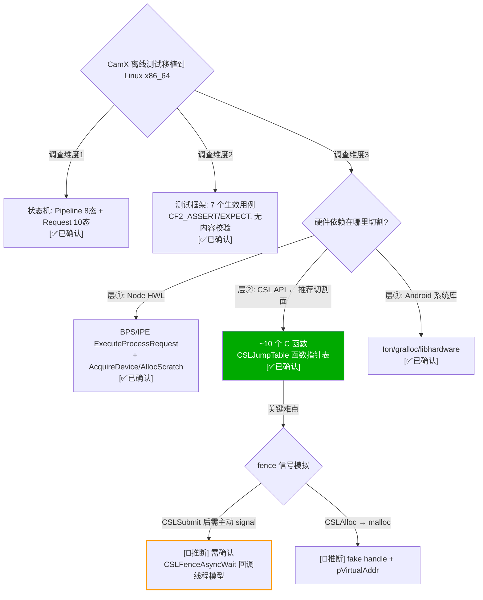
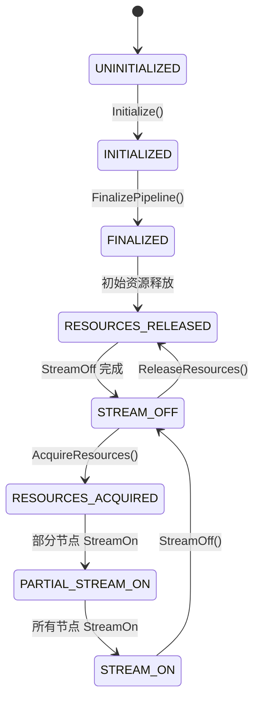
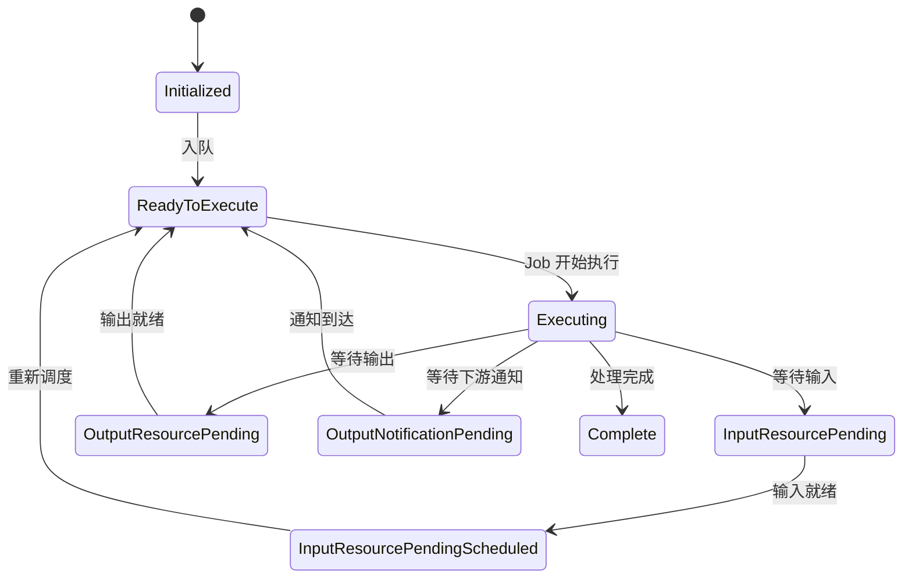
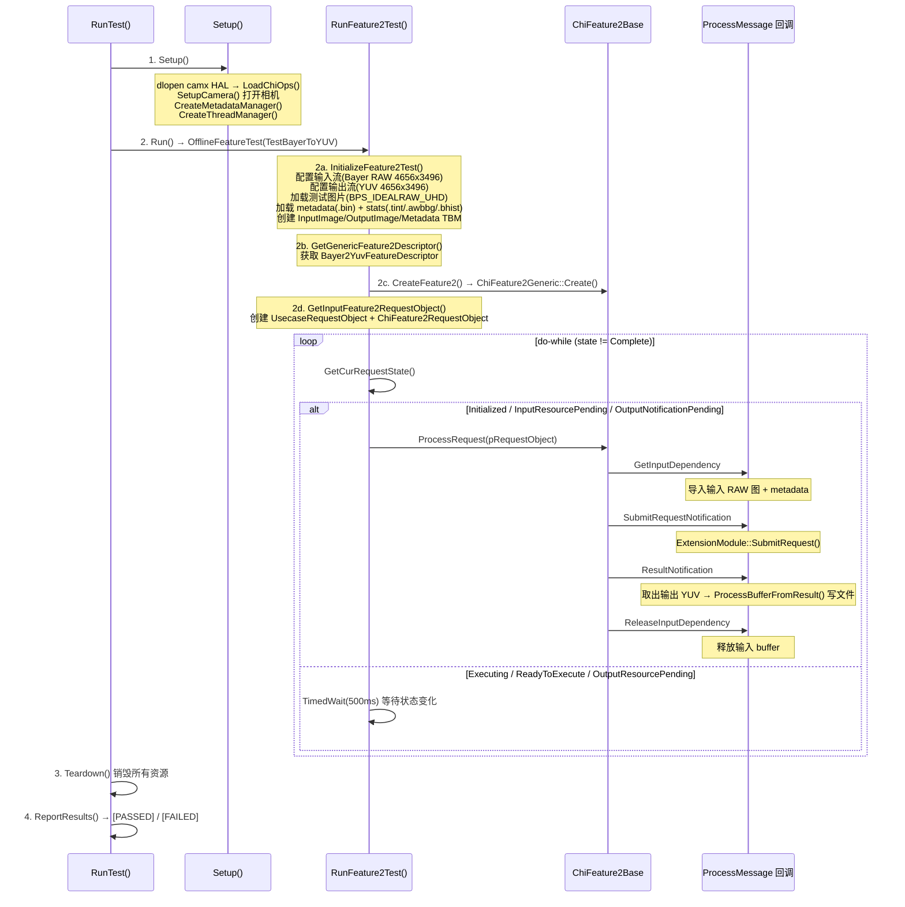
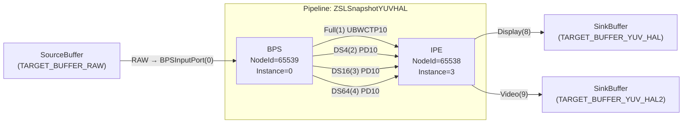
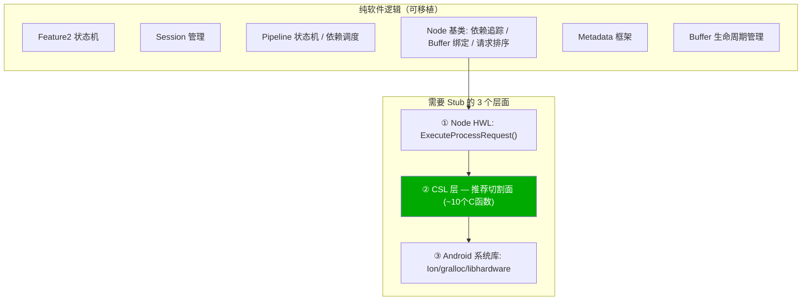

# CamX 状态机、测试框架全景与 CSL Mock 移植方案

> 类型：源码分析
> 置信度底线：本文档最低置信度为 ❓推测 的内容不可作为行动依据

## ❓ 问题背景
以 `chifeature2test` 模块为切入点，系统调查 CamX Pipeline / Feature2 Request 状态机、测试框架架构、TestBayerToYUV 完整执行流程与 PASS/FAIL 判定机制，并基于三层硬件依赖分析制定 CSL 层 Mock 移植方案。

## 🔍 搜索过程
| 命令 / 动作 | 目标 | 结果摘要 |
|------------|------|---------|
| grep "PipelineStatus" camxpipeline.h | Pipeline 状态枚举 | camxpipeline.h:60, 8 种状态 |
| grep "ChiFeature2RequestState" chifeature2requestobject.h | Request 状态枚举 | chifeature2requestobject.h:49, 10 种状态 |
| glob "*test*" chi-cdk/test/ | 测试代码分布 | 5 个模块, ~100+ 文件 |
| read Android.mk (chifeature2test) | 二进制编译源 | 仅 chifeature2testmain.cpp |
| read Android.mk (libchifeature2testframework) | 框架库编译源 | 16 个 cpp, 不含 chifeature2testbase.cpp |
| grep "CHIFEATURE2TEST_TEST" *.cpp | 用例注册 | 7 个 DEFAULT + 3 个 ORDERED（后者不编译） |
| read chifeature2testrequestobject.cpp | Request 状态流转测试 | RunBasicCallFlow 被 #if 0 禁用 |
| read feature2offlinetest.cpp:92 | TestBayerToYUV 入口 | OfflineFeatureTest → RunFeature2Test |
| read feature2testcase.cpp:655 | 状态机驱动主循环 | do-while 轮询至 Complete |
| read chifeature2test.cpp:80 | Check() PASS/FAIL 判定 | SetFailed() + 日志, result=0 为 PASS |
| read chifeature2bayer2yuvdescriptor.cpp:148 | Feature 描述符 | pipeline: ZSLSnapshotYUVHAL |
| read g_camxZSLSnapshotYUVHAL.xml | Pipeline XML 拓扑 | 2 Node (BPS+IPE), 7 Link |
| grep "CSL" camxbpsnode.cpp | BPS 硬件调用 | CSLAcquireDevice:2512, CSLAlloc:2490, Submit:2008 |
| grep "CSL" camxipenode.cpp | IPE 硬件调用 | CSLAcquireDevice:7417, CSLAlloc:7386/11594, Submit:6856 |
| grep "CSL" camxpipeline.cpp | Pipeline 硬件调用 | CSLClose:91, CSLOpenRequest:1067, StreamOn:727 |
| read camxhwcontext.cpp:241 | HwContext::Submit | → CSLSubmit(hSession, hDevice, memHandle, offset) |

## 🌳 决策树



---

## 💡 分析结论

### 一、CamX 核心状态机

#### 1.1 Pipeline 状态（8 种）

定义于 `camx/src/core/camxpipeline.h:60`：



| # | 状态 | 说明 |
|---|------|------|
| 1 | UNINITIALIZED | 初始状态 |
| 2 | INITIALIZED | Pipeline 初始化完成 |
| 3 | FINALIZED | Pipeline 终结完成 |
| 4 | RESOURCES_RELEASED | 流资源已释放 |
| 5 | STREAM_OFF | 流已关闭 |
| 6 | RESOURCES_ACQUIRED | 流资源已获取 |
| 7 | PARTIAL_STREAM_ON | 部分流已开启 |
| 8 | STREAM_ON | 流已开启，可处理请求 |

**没有任何测试用例显式测试 Pipeline 状态流转。** 搜索 chi-cdk/test/ 下所有 .cpp 文件，未找到对 PipelineStatus 枚举的引用。[✅已确认]

#### 1.2 Feature2 Request 状态（10 种）

定义于 `chi-cdk/core/chifeature2/chifeature2requestobject.h:49`：



| # | 状态 | 说明 |
|---|------|------|
| 1 | Initialized | 已初始化 |
| 2 | ReadyToExecute | 已入队，准备执行 |
| 3 | Executing | 正在执行 |
| 4 | InputResourcePending | 等待输入资源 |
| 5 | InputResourcePendingScheduled | 输入依赖已满足，已提交执行任务 |
| 6 | OutputResourcePending | 等待输出资源 |
| 7 | OutputErrorResourcePending | 等待输出资源（带错误） |
| 8 | OutputNotificationPending | 等待下游 Feature 的输出通知 |
| 9 | OutputErrorNotificationPending | 等待下游输出通知（带错误） |
| 10 | Complete | 请求处理完成 |

`chifeature2testrequestobject.cpp` 有专门的状态流转测试 `RunBasicCallFlow()`，验证完整的 `Initialized → ReadyToExecute → Executing → InputResourcePending → ... → Complete` 链路，但整个函数被 `#if 0` 禁用，且该文件不在 Android.mk 编译列表中。[✅已确认]

---

### 二、测试框架与用例

#### 2.1 CamX 仓库测试代码分布

| 模块 | 目录 | 文件数 | 用途 |
|------|------|--------|------|
| nativechitest | chi-cdk/test/nativetest/nativechitest/ | 37 | CHI API 集成测试 |
| chifeature2test | chi-cdk/test/chifeature2test/ | 3 | Feature2 测试二进制入口 |
| libchifeature2testframework | chi-cdk/test/chifeature2testframework/ | 44 | Feature2 测试框架静态库 |
| chiofflinepostproctest | chi-cdk/test/chiofflinepostproctest/ | 4 | 离线后处理测试 |
| f2player | chi-cdk/test/f2player/ | 3 | Feature2 播放器 |
| camx 自测试 | camx/src/core/camxtest.cpp/.h | 2 | 框架内部自测试基类（stub） |

测试框架**不使用 GoogleTest**，使用自定义 `CHIFEATURE2TEST_TEST` 宏 + `CF2_ASSERT`/`CF2_EXPECT` 断言体系。

#### 2.2 chifeature2test 实际生效的 7 个用例

`chifeature2test` 二进制 = `chifeature2testmain.cpp`（1 个 cpp） + 静态链接 `libchifeature2testframework`（16 个 cpp）。

`chifeature2testbase.cpp` 和 `chifeature2testrequestobject.cpp` **不在** `LOCAL_SRC_FILES` 中，其 3 个 `CHIFEATURE2TEST_TEST_ORDERED` 用例不会被编译。[✅已确认]

| # | 测试套件 | 用例名 | 注册位置 | 实现文件 |
|---|---------|--------|---------|---------|
| 1 | Feature2OfflineTest | TestBayerToYUV | chifeature2testmain.cpp:55 | feature2offlinetest.cpp |
| 2 | Feature2OfflineTest | TestYUVToJpeg | chifeature2testmain.cpp:60 | feature2offlinetest.cpp |
| 3 | Feature2OfflineTest | TestMultiStage | chifeature2testmain.cpp:65 | feature2offlinetest.cpp |
| 4 | Feature2OfflineTest | TestBPS | chifeature2testmain.cpp:80 | feature2offlinetest.cpp |
| 5 | Feature2OfflineTest | TestIPE | chifeature2testmain.cpp:85 | feature2offlinetest.cpp |
| 6 | Feature2RealTimeTest | RealTime | chifeature2testmain.cpp:70 | feature2realtimetest.cpp |
| 7 | Feature2MFXRTest | TestMFXR | chifeature2testmain.cpp:75 | feature2mfxrtest.cpp |

所有实现文件位于 `chi-cdk/test/chifeature2testframework/`。

#### 2.3 PASS/FAIL 判定机制

定义于 `chi-cdk/test/chifeature2testframework/chifeature2test.h:122-142`：

| 宏 | 失败行为 | 类比 |
|---|---------|------|
| `CF2_ASSERT(cond, msg)` | `Check()` → `SetFailed()` → `return`（终止当前测试） | gtest ASSERT_* |
| `CF2_EXPECT(cond, msg)` | `Check()` → `SetFailed()`（继续执行） | gtest EXPECT_* |
| `CF2_FAIL(msg)` | 无条件 `SetFailed()` → `return` | gtest FAIL() |

`Check()` 函数 (chifeature2test.cpp:80)：
```cpp
bool Check(ChiFeature2Test *funcObj, bool passed, ...) {
    if (!passed) {
        funcObj->SetFailed();       // result = 1 → FAIL
        CF2_LOG_ERROR("CONDITION FAILED! %s:%d ...");
    }
    return (passed);
}
```

宏生成类中 `result` 字段初始为 `0`（PASS），任何断言失败置为 `1`（FAIL）。
`GetPassed()` 返回 `result == 0 ? 1 : 0`；`GetFailed()` 返回 `result > 0 ? 1 : 0`。

最终报告 (chifeature2test.cpp:152)：
```cpp
CF2_LOG_INFO("\"%s\" report -> %s", fullName, (failed == 0) ? "[PASSED]" : "[FAILED]");
```

`RunTests()` 返回值: 0 = 全部 PASSED, 1 = 有 FAILED。

**关键发现：测试不校验输出图像内容。** feature2testcase.cpp:744 有注释：
```cpp
//ValidateResult(pFeatureRequestObject); //TODO: validate result
```

PASS 仅意味着：流程从 Initialized 跑到 Complete，没有崩溃，没有触发断言失败。[✅已确认]

实际断言检查点：
| 位置 | 断言 | 含义 |
|------|------|------|
| feature2testcase.cpp:41 | CF2_ASSERT(SetupCamera()) | 相机打开失败 |
| feature2testcase.cpp:42 | CF2_ASSERT(LoadChiOps()) | HAL 加载失败 |
| feature2testcase.cpp:47 | CF2_EXPECT(LoadBufferLibs()) | buffer 库加载失败 |
| feature2testcase.cpp:662 | CF2_ASSERT(VerifyFeature2Interface()) | 接口函数指针为 NULL |
| feature2offlinetest.cpp:274 | CF2_ASSERT(InitializeBufferManagers()) | buffer 分配失败 |
| feature2offlinetest.cpp:298 | CF2_ASSERT(InitializeInputMetaBufferPool()) | metadata 加载失败 |

---

### 三、TestBayerToYUV 完整执行流程

#### 3.1 时序图



#### 3.2 使用的是真实 Pipeline

Bayer2YuvFeatureDescriptor (chifeature2bayer2yuvdescriptor.cpp:148) 引用 pipeline `"ZSLSnapshotYUVHAL"`，类型 `ChiFeature2PipelineType::CHI`（真实 CHI pipeline，非 mock）。

提交链路：`ProcessSubmitRequestMessage() → ExtensionModule::SubmitRequest() → camx HAL → 真实 BPS/IPE 硬件`。

离线模式：输入从文件加载（BPS_IDEALRAW_UHD），不依赖实时 sensor。但 ISP 硬件（BPS→IPE）是真实执行的。**必须在高通真机上运行**。[✅已确认]

---

### 四、ZSLSnapshotYUVHAL Pipeline 拓扑

定义于 `chi-cdk/oem/qcom/topology/usecase-components/pipelines/g_camxZSLSnapshotYUVHAL.xml`。

**2 个处理 Node，7 条连接。**



| # | 源端口 | 目标端口 | Buffer 格式 |
|---|--------|---------|------------|
| 1 | SourceBuffer:RAW | BPS:InputPort(0) | 外部输入 RAW |
| 2 | BPS:OutputPortFull(1) | IPE:InputPortFull(0) | ChiFormatUBWCTP10 |
| 3 | BPS:OutputPortDS4(2) | IPE:InputPortDS4(1) | ChiFormatPD10 |
| 4 | BPS:OutputPortDS16(3) | IPE:InputPortDS16(2) | ChiFormatPD10 |
| 5 | BPS:OutputPortDS64(4) | IPE:InputPortDS64(3) | ChiFormatPD10 |
| 6 | IPE:OutputPortDisplay(8) | SinkBuffer:YUV_HAL | 外部输出 YUV |
| 7 | IPE:OutputPortVideo(9) | SinkBuffer:YUV_HAL2 | 外部输出 YUV |

中间 buffer: Ion heap 分配, BufferImmediateAllocCount=2, BufferQueueDepth=8。[✅已确认]

---

### 五、硬件依赖 — 三层分析



#### 5.1 层① Node HWL 硬件触点

**BPS Node** (camxbpsnode.cpp)：
| CSL 调用 | 行号 | 上下文 |
|---------|------|--------|
| CSLAlloc | 2490 | AcquireDevice: 分配 FW config IO buffer |
| CSLAcquireDevice | 2512 | AcquireDevice: 获取 BPS 硬件设备 |
| CSLReleaseDevice | 2558 | ReleaseDevice: 释放设备 |
| CSLReleaseBuffer | 272 | 析构: 释放 m_configIOMem |
| HwContext::Submit | 1292 | 提交 firmware region info |
| HwContext::Submit | 2008 | **提交 IQ packet（主处理）** |

**IPE Node** (camxipenode.cpp)：
| CSL 调用 | 行号 | 上下文 |
|---------|------|--------|
| CSLAlloc | 2441, 7386, 11594, 11698 | UBWC stats / config IO / scratch buffer |
| CSLAcquireDevice | 7417 | 获取 IPE 硬件设备 |
| CSLReleaseDevice | 7467 | 释放设备 |
| CSLReleaseBuffer | 415, 7864, 7875, 11550 | 析构/释放 scratch/UBWC stats |
| HwContext::Submit | 5925 | 提交 firmware region info |
| HwContext::Submit | 6856 | **提交 IQ packet（主处理）** |

#### 5.2 层② CSL API（推荐切割面）

**Pipeline 层的 CSL 调用** (camxpipeline.cpp)：
| CSL 调用 | 行号 | 作用 |
|---------|------|------|
| CSLClose | 91 | 析构: 关闭 CSL session |
| CSLRegisterMessageHandler | 671, 2035 | StreamOn/FinalizePipeline: 注册消息回调 |
| CSLOpenRequest | 1067, 1075 | ProcessRequest: 开启 CSL 请求 |
| CSLAddReference | 1796 | Initialize: 共享 session 引用 |
| HwContext::StreamOn → CSLStreamOn | 727 | 通过 camxhwcontext.cpp:203 |
| HwContext::StreamOff → CSLStreamOff | 816 | 通过 camxhwcontext.cpp:228 |
| HwContext::Link → CSLLink | 891 | 通过 camxhwcontext.cpp:153 |
| HwContext::Unlink → CSLUnlink | 915 | 通过 camxhwcontext.cpp:179 |

**完整硬件提交调用链**：
```
Node::ProcessRequest()                              [camxnode.cpp:1659]
  → ExecuteProcessRequest()                          [virtual, BPS/IPE override]
    → ProgramIQConfig()                              — IQ 模块编程
    → GetHwContext()->Submit(session, device, packet) [camxhwcontext.cpp:241]
      → CSLSubmit(hSession, hDevice, memHandle, offset) [camxcsl.cpp:440]
        → CSLJumpTable 函数指针派发
          → CSLHwInternalDefaultSubmit()              [camxcslhwinternal.cpp:3202]
            → ioctl(fd, VIDIOC_CAM_CONTROL, &cmd)     ★ 硬件边界
```

CSL 使用 **CSLJumpTable** (camxcsljumptable.h) 函数指针表派发所有调用，天然适合 mock 替换。[✅已确认]

#### 5.3 层③ Android 系统库

| 库 | 替代方案 |
|---|---------|
| libhardware (hw_get_module) | stub: 返回 mock camera_module_t |
| libcamera_metadata | 可直接编译 AOSP 源码（纯 C） |
| Ion/gralloc (buffer 分配) | CSLAlloc mock 覆盖 |
| libutils/libcutils | stub 或移植（参考 refbase-port 条目） |
| liblog | 重定向到 printf |

---

### 六、CSL 层 Mock 移植方案

#### 6.1 架构总览

```
┌──────────────────────────────────────────────────────────┐
│                  chifeature2test binary                   │
├──────────────────────────────────────────────────────────┤
│ Feature2 框架 (REAL)                                      │
│   chifeature2base / graph / requestobject / generic       │
├──────────────────────────────────────────────────────────┤
│ CHI Override 层 (REAL)                                    │
│   ExtensionModule → ChiOverride → CamX HAL               │
├──────────────────────────────────────────────────────────┤
│ CamX Core (REAL)                                          │
│   Session → Pipeline → DRQ → Node → BPS/IPE              │
│   状态机、依赖调度、buffer 绑定、metadata 传播            │
├──────────────────────────────────────────────────────────┤
│ CSL Mock 层 (STUB) ← ★ 切割面                            │
│   mock_csl.cpp: ~10 个 C 函数                             │
├──────────────────────────────────────────────────────────┤
│ ✗ KMD / 硬件 (不需要)                                     │
└──────────────────────────────────────────────────────────┘
```

#### 6.2 需要 Mock 的 CSL 函数清单

| CSL 函数 | Mock 行为 | 备注 |
|---------|----------|------|
| CSLOpen | 返回 fake session handle | |
| CSLClose | no-op | |
| CSLAcquireDevice | 返回 fake device handle | |
| CSLReleaseDevice | no-op | |
| CSLAlloc | malloc/aligned_alloc + fake handle | 需要填充 pVirtualAddr, size |
| CSLReleaseBuffer | free | |
| CSLSubmit | **立即 signal 完成 fence** | 关键：模拟 HW 即时完成 |
| CSLStreamOn | no-op | |
| CSLStreamOff | no-op | |
| CSLLink / CSLUnlink | no-op | |
| CSLOpenRequest | 返回 success | |
| CSLCreateFence | 创建 fake fence 对象 | |
| CSLFenceAsyncWait | 记录回调，在 Submit 时触发 | |
| CSLRegisterMessageHandler | 记录回调 | |

#### 6.3 关键难点：Fence 信号模拟

真实流程：
```
CSLSubmit(packet) → KMD 处理 → 硬件完成 → KMD signal fence → Node 收到完成通知
```

Mock 流程：
```
MockCSLSubmit(packet) → 解析 packet 中的 output fence → 直接 signal fence
```

注意事项：
- fence signal 的线程模型（同步 vs 异步）需要匹配 CamX 的期望
- output buffer 内容为空/全零，不影响框架逻辑测试
- 是否需要延迟 signal 模拟处理耗时

#### 6.4 CSLAlloc Mock 示例

```cpp
CamxResult MockCSLAlloc(const char* pStr, CSLBufferInfo* pBufferInfo,
                         size_t bufferSize, size_t alignment,
                         uint32_t flags, ...) {
    void* pMem = aligned_alloc(alignment ? alignment : 4096, bufferSize);
    if (NULL == pMem) return CamxResultENoMemory;
    memset(pMem, 0, bufferSize);
    pBufferInfo->hHandle    = GenerateFakeHandle();
    pBufferInfo->pVirtualAddr = pMem;
    pBufferInfo->size       = bufferSize;
    pBufferInfo->fd         = -1;
    return CamxResultSuccess;
}
```

#### 6.5 CSLJumpTable 替换方式

CSL 初始化时通过 `CSLModeManager` 选择 JumpTable（HW / Presil / EmulatedSensor）。Mock 可以：
- **方案 A**: 新增一个 `CSLModeEmulated` 模式，提供 mock JumpTable
- **方案 B**: 编译时直接链接 mock_csl.o 替换真实 CSL 实现

#### 6.6 分阶段实施计划

**Phase 1: 基础 Mock CSL + 最小编译集**

| 步骤 | 内容 | 预估工作量 |
|------|------|----------|
| 1.1 | 实现 mock_csl.cpp（~10-15 个函数） | 1 天 |
| 1.2 | 编译 camx/src/core/ 核心（Session, Pipeline, Node, DRQ, HwContext, Topology） | 2-3 天 |
| 1.3 | 编译 camx/src/hwl/bps/ 和 camx/src/hwl/ipe/ | 1-2 天 |
| 1.4 | 处理 Android 系统库依赖 stub | 2-3 天 |
| 1.5 | 端到端联调：TestBayerToYUV 跑通到 Complete | 2-3 天 |

**Phase 2: 验证与扩展**

| 步骤 | 内容 |
|------|------|
| 2.1 | 验证 Pipeline 完整 8 态流转 |
| 2.2 | 验证 Request 完整 10 态流转 |
| 2.3 | 跑通其余 6 个测试用例 |
| 2.4 | 添加输出 buffer dump 可视化验证 |

**Phase 3: 深度扩展**

| 步骤 | 内容 |
|------|------|
| 3.1 | 支持 nativechitest 模块 |
| 3.2 | 支持 Realtime pipeline（需 mock sensor/IFE node） |
| 3.3 | 框架 overhead profiling |

---

## 📍 关键代码位置

**状态机**:
- `camx/src/core/camxpipeline.h:60` — PipelineStatus 枚举
- `chi-cdk/core/chifeature2/chifeature2requestobject.h:49` — ChiFeature2RequestState 枚举

**测试框架**:
- `chi-cdk/test/chifeature2test/chifeature2testmain.cpp:55` — 用例注册
- `chi-cdk/test/chifeature2testframework/chifeature2test.h:122` — CF2_ASSERT 宏
- `chi-cdk/test/chifeature2testframework/chifeature2test.cpp:80` — Check() 判定
- `chi-cdk/test/chifeature2testframework/chifeature2test.cpp:152` — ReportResults()
- `chi-cdk/test/chifeature2testframework/feature2offlinetest.cpp:92` — OfflineFeatureTest()
- `chi-cdk/test/chifeature2testframework/feature2testcase.cpp:655` — RunFeature2Test() 状态机主循环

**Pipeline 拓扑**:
- `chi-cdk/oem/qcom/topology/usecase-components/pipelines/g_camxZSLSnapshotYUVHAL.xml` — XML
- `chi-cdk/oem/qcom/feature2/chifeature2graphselector/chifeature2bayer2yuvdescriptor.cpp:148` — Bayer2YuvFeatureDescriptor

**Node HWL**:
- `camx/src/hwl/bps/camxbpsnode.cpp` — BPS Node 全部 CSL 调用见上表
- `camx/src/hwl/ipe/camxipenode.cpp` — IPE Node 全部 CSL 调用见上表

**CSL 硬件边界**:
- `camx/src/csl/camxcsl.h` — CSL API 声明
- `camx/src/csl/camxcsljumptable.h` — CSLJumpTable 函数指针表（Mock 入口）
- `camx/src/core/camxhwcontext.cpp:241` — HwContext::Submit → CSLSubmit
- `camx/src/csl/hw/camxcslhwinternal.cpp:3224` — ioctl(VIDIOC_CAM_CONTROL) 硬件边界

**Pipeline CSL 调用**:
- `camx/src/core/camxpipeline.cpp:91` — CSLClose
- `camx/src/core/camxpipeline.cpp:727` — HwContext::StreamOn
- `camx/src/core/camxpipeline.cpp:816` — HwContext::StreamOff
- `camx/src/core/camxpipeline.cpp:1067` — CSLOpenRequest

## ⚠️ 待验证事项
- [🧠推断] Phase 1 需要编译 100+ 源文件 — 实际数量取决于 BPS/IPE IQ 模块的引入深度，可能通过条件编译减少
- [🧠推断] CSL mock 的 fence signal 需要匹配 CamX 的回调线程模型 — 需要确认 CSLFenceAsyncWait 是否在独立线程池中回调
- [❓推测] BPS/IPE 的 IQ 模块（3A 算法参数、tuning data 加载）可能依赖固件文件或硬件寄存器映射 — 需要验证是否可以用空 tuning data 绕过
- [🧠推断] CSLJumpTable 的替换时机 — 需要确认是在 CSLInitialize() 中设置还是编译时静态链接

## 📝 备注
- 本文档是对已有条目 `testbayertoyuv-port-analysis` 的补充，后者侧重于 CMake 构建的 stub 方案，本文侧重于状态机全景和 CSL 层 mock 方案
- chifeature2testbase.cpp 和 chifeature2testrequestobject.cpp 不在 Android.mk 中，其 ORDERED 用例不会编译
- 测试不校验输出图像正确性（ValidateResult 被注释为 TODO）
- CSL 的 JumpTable 模式天然适合 mock 替换，是最清晰的 stub 边界
- 此测试必须在高通 ISP 真机上运行（除非完成 CSL mock 移植）
