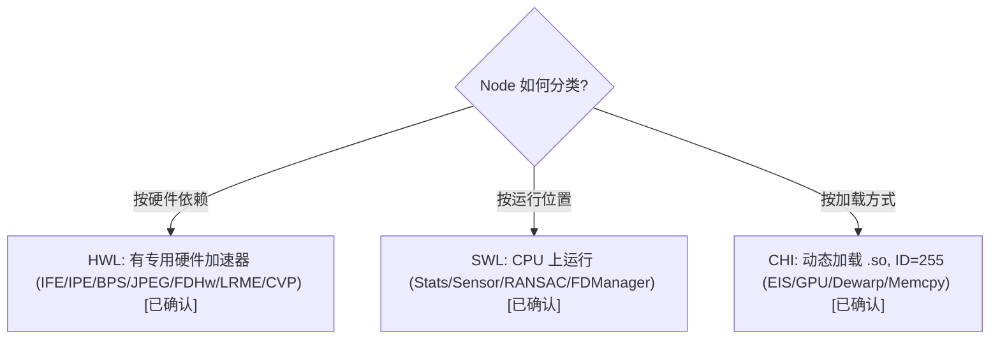
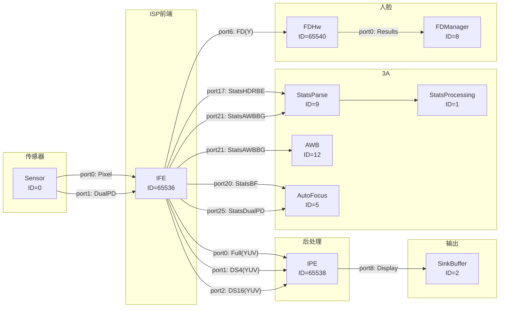
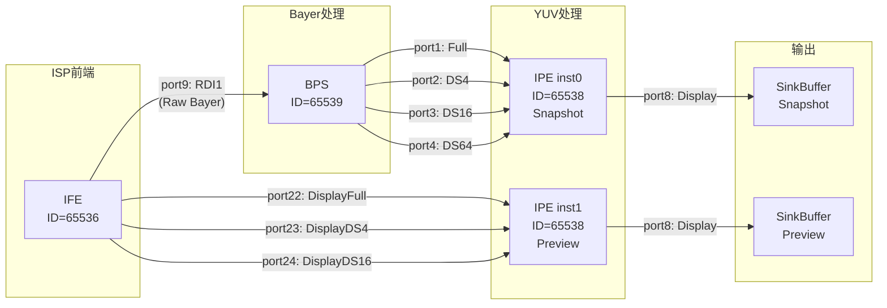
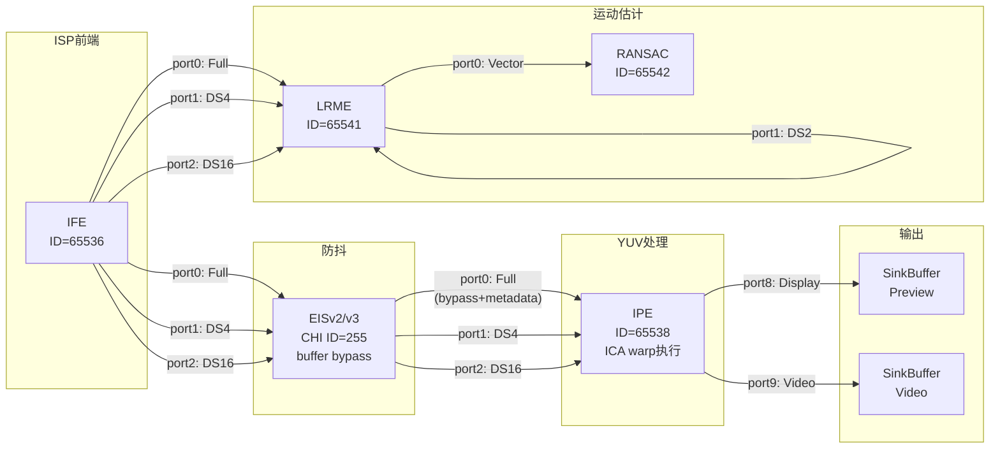

# CamX 全量 Node 目录 — HWL/SWL/CHI 三层节点分类与功能

> 类型：源码分析
> 置信度底线：✅已确认（四路并行目录遍历 + 头文件阅读 + 2026-06-23 六路并行审计修正）

## ❓ 问题背景
系统调查 CamX 源代码中有哪些常用 Node，以及各 Node 的主要功能。

## 🔍 搜索过程
| 命令 / 动作 | 目标 | 结果摘要 |
|------------|------|---------|
| ls camx/src/hwl/ | HWL 节点目录 | bps, ife, ipe, jpeg, fd, lrme, cvp, tfe |
| ls camx/src/swl/ | SWL 节点目录 | stats, sensor, eisv2, eisv3, ransac, fd, jpeg, offlinestats, swregistration |
| ls chi-cdk/oem/qcom/node/ | CHI 自定义节点 | 11 个节点目录 |
| read camxhwdefs.h | Node ID 定义 | SW 0-14, HW 65536+, CHI 255 |
| read camxcslresourcedefs.h + camxifenode.cpp + g_pipelines.h | IFE Full 端口输出格式 | Pixel path=YUV (7 条证据交叉验证), RDI path=Raw Bayer |
| read camxcslresourcedefs.h:186-255 | IPE/BPS/JPEG 端口 | IPE 10in+6out, BPS 1in+8out, JPEG 1in+1out |
| read camxhwdefs.h:50-92 | SW Node 端口 | StatsProcessing 17in+1out, Sensor 5out |
| read pipeline XML topologies | 实际节点连接 | 3 条代表性 Pipeline 端口级连接验证 |
| **审计 (2026-06-23)** | 6 路并行源码交叉验证 | 发现 4 HIGH + 6 MEDIUM 问题，全部修复 |

## 🌳 决策树


## 💡 分析结论

### Node ID 编号规则 (camxhwdefs.h:20-48)

| 范围 | 类型 | 说明 |
|------|------|------|
| 0-14 | CamX 软件节点 | Sensor, Stats, FD, JPEG 聚合等 |
| 255 | ChiExternalNode | CHI 自定义节点统一入口, 通过 NodePropertyCustomLib 字符串区分 |
| 65536+ (1<<16) | CamX 硬件节点 | IFE, JPEG, IPE, BPS, FDHw, LRME, RANSAC, CVP |

### 一、硬件节点 (HWL) — 有专用硬件加速器

| ID | 名称 | 源码目录 | 主要功能 |
|----|------|---------|---------|
| 65536 | IFE | hwl/ife/ | Image Front End — Raw 处理入口: 黑电平、坏点、LSC、Demosaic、Crop、DS4/DS16 降采样、Stats 采集(AWBBG/HDRBE/BHIST/RS/CS) |
| 65537 | JPEG | hwl/jpeg/ | JPEG 硬件编码器 — YUV → JPEG 压缩 |
| 65538 | IPE | hwl/ipe/ | Image Processing Engine — YUV 域: CC、GTM/LTM 色调映射、TNR/SF 降噪、DSX 缩放、ICA warp(EIS 执行点)、2D LUT |
| 65539 | BPS | hwl/bps/ | Bayer Processing Segment — Bayer 域: Demosaic、GIC(绿色不平衡校正)、HNR降噪(Titan175)、LSC、离线 Stats、Reg1/Reg2(MFSR配准) |
| 65540 | FDHw | hwl/fd/ | Face Detection 硬件 — 人脸检测加速, 输出人脸坐标和置信度 |
| 65541 | LRME | hwl/lrme/ | Low-Res Motion Estimation — 块级运动向量, 用于 EIS 和多帧 TNR |
| 65543 | CVP | hwl/cvp/ | Computer Vision Processor — DME 视差图、透视变换、Grid 估计 |

### IFE vs BPS vs IPE 的区别

| 维度 | IFE | BPS | IPE |
|------|-----|-----|-----|
| 输入域 | Raw Bayer (inline from sensor) | Raw Bayer (from DDR) | YUV |
| 典型场景 | 实时预览/视频 | 离线拍照 | 预览+拍照+视频后处理 |
| 降采样 | DS4/DS16 路径 | DS4/DS16/DS64 路径 | DSX(任意缩放) |
| Stats | 产出 3A Stats (17种) | 产出离线 Stats (AWBBG/HDRBHist) | 无 Stats |
| 运动补偿 | 无 | 无 | ICA warp (EIS 输出在此执行) |
| Bayer 降噪 | ABF (Adaptive Bayer Filter) | ABF + GIC(BPS独有) + HNR(Titan175) | — |
| YUV 域降噪 | — | — | LENR/HNR/TNR(时域)/ANR |
| 色差校正 | 无 | 无 | CAC (IPE独有) |
| 色调映射 | GTM(全局) + Gamma | GTM + Gamma | LTM(局部) |
| MFSR/MFNR 配准 | 无 | Reg1/Reg2 输出 | TF(时域融合) |
| 数据来源 | Sensor MIPI inline (不落地 DDR) | DDR buffer (始终离线读取) | DDR buffer |

> **审计修正 (2026-06-23)**: 原表 IFE 降噪/色调映射标"无"有误——IFE 有 ABF + GTM + Gamma。原表 BPS 标 LENR/CAC 有误——LENR 和 CAC 是 IPE 独有模块，BPS 独有的是 GIC。详见 KB: `ife-vs-bps-b2y-split`。

### 二、软件节点 (SWL) — CPU 运行

| ID | 名称 | 源码目录 | 主要功能 |
|----|------|---------|---------|
| 0 | Sensor | swl/sensor/ | 传感器驱动: 配置 Sensor、Actuator(对焦马达)、OIS(光学防抖)、Flash、CSI PHY |
| 1 | StatsProcessing | swl/stats/ | 3A 总调度: 将 IFE Stats 分发给 AEC/AWB/AF 处理器 |
| 5 | AutoFocus | swl/stats/ | AF 算法: PDAF(相位检测)/TOF(飞行时间)/反差 AF |
| 12 | AutoWhiteBalance | swl/stats/ | AWB 算法: BG Stats → WB 增益 + CCM 矩阵 |
| 9 | StatsParse | swl/stats/ | Stats 解析: 原始 IFE Stats buffer → 结构化数据 |
| 6 | JPEGAggregator | swl/jpeg/ | JPEG 聚合: 收集 metadata 和帧数据, 触发 JPEG 编码 |
| 8 | FDManager | swl/fd/ | FD 管理: 协调 HW FD 引擎和 SW 后处理 |
| 7 | FDSw | — | SW 人脸检测(纯软件路径) |
| 10 | OfflineStats | swl/offlinestats/ | 离线 AWB: 拍照时 AWB 精调 |
| 11 | Torch | swl/sensor/ | 手电筒: 通过 Flash 子模块控制 |
| 13 | HistogramProcess | swl/stats/ | 直方图/IHDRI: 计算色调曲线用于 HDR 增强 |
| 14 | Tracker | swl/stats/ | 目标跟踪: 将 IFE 图像送入 CHI tracker 算法 |
| 65542 | RANSAC | swl/ransac/ | 运动估计: RANSAC 算法计算帧间变换矩阵(虽有 HW ID 但实际 SW 实现) |
| 2 | SinkBuffer | core/ | 框架节点: 有 buffer 的输出 Sink |
| 3 | SinkNoBuffer | core/ | 框架节点: 无 buffer 的输出 Sink |
| 4 | SourceBuffer | core/ | 框架节点: 输入 Source |

### 三、CHI 自定义节点 — 动态加载 .so, ID=255

| 库名 | 源码目录 | 主要功能 |
|------|---------|---------|
| com.qti.eisv2 | swl/eisv2/ | EIS v2: 陀螺仪 → ICA 变换(纯 metadata, buffer bypass) |
| com.qti.eisv3 | swl/eisv3/ | EIS v3: 15 帧 lookahead 增强防抖 |
| com.qti.node.memcpy | node/memcpy/ | GPU/Cache 图像拷贝 + 1/2、1/4 降采样 |
| com.qti.node.dewarp | node/dewarp/ | GPU (OpenGL ES) EIS Dewarp: 执行透视/网格变换 |
| com.qti.node.gpu | node/gpu/ | OpenCL GPU 通用: memcpy、旋转、翻转、降采样(4/16/64x) |
| com.qti.node.depth | node/depth/ | 深度传感器: 输出 RAW_DEPTH / DEPTH16 / 点云 |
| com.qti.node.remosaic | node/remosaic/ | Quad-Bayer 重拼: 四合一像素 → 全分辨率 Bayer |
| com.qti.node.fcv | node/fcv/ | FastCV 旋转: 0/90/180/270 度 |
| com.qti.node.swcac | node/swcac/ | SW 色差校正 (CAC3): YUV 帧上修正横向色差 |
| com.qti.node.dummysat | node/dummysat/ | 多摄 SAT: 基于 zoom ratio 主副摄切换 |
| com.qti.node.dummyrtb | node/dummyrtb/ | 多摄 RTB: 摄像头过渡混合 |
| com.qti.node.dummystich | node/dummystich/ | 多摄拼接: 双摄 buffer 左右拼接 |
| com.qti.node.customhw | node/customhwnode/ | 自定义 HW 透传: 对接自定义 ISP 硬件 |

> **审计补充 (2026-06-23)**: `chi-cdk/oem/qcom/node/` 还包含 10 个辅助目录未列入上表：`aecwrapper`/`afwrapper`/`awbwrapper`（3A 算法包装器）、`hafoverride`/`afoverride`（AF 策略覆盖）、`hvx`（Hexagon DSP 扩展）、`staticaecalgo`/`staticafalgo`/`staticawbalgo`/`staticpdlibalgo`（静态链接 3A 算法库）、`nodeutils`（节点工具函数）。这些是算法/工具组件，非独立 Pipeline 节点。

### 四、典型 Pipeline 组合

**实时预览:**
```
Sensor(0) → IFE(65536) → IPE(65538) → SinkBuffer(2) [display]
                 └→ StatsProcessing(1) → AEC/AWB/AF
```

**拍照(ZSL Snapshot):**
```
IFE(RDI output) → BPS(65539) → IPE(65538) → JPEG(65537) → JPEGAgg(6) → SinkBuffer(2)
```

**视频录制+EIS:**
```
Sensor → IFE → EISv3(CHI, metadata only) → IPE(ICA warp) → SinkBuffer [video]
              └→ LRME(65541) → RANSAC(65542) [为 EIS 提供运动向量]
```

**多帧降噪(MFNR):**
```
IFE → BPS → IPE(TNR blend) × N帧 → SinkBuffer
```

**多摄融合:**
```
Sensor_Wide → IFE → IPE → DummySAT(CHI) → SinkBuffer
Sensor_Tele → IFE → IPE ↗
```

### 五、3A Stats 子系统

StatsProcessing(1) 是 3A 的调度中心:

```
IFE → [BG/HDRBE/BHIST Stats buffers]
  → StatsParse(9): 解析原始 Stats buffer
    → StatsProcessing(1): 分发到各处理器
      ├→ AECStatsProcessor: 测光 → 曝光参数
      ├→ AWBStatsProcessor: 白平衡 → WB 增益/CCM
      ├→ AFStatsProcessor: 对焦 → Actuator 位置
      └→ ASDStatsProcessor: 场景检测
```

### 六、主要 Node 输入/输出端口（源码验证）

#### IFE（camxtitan17xdefs.h:30-67）

| 方向 | ID | 端口名 | 数据类型 |
|------|-----|--------|---------|
| IN | 0 | CSIDTPG | 测试模式 (CSID Test Pattern Generator) |
| IN | 1 | CAMIFTPG | 测试模式 (CAMIF TPG) |
| IN | 2 | Sensor | Raw Bayer (MIPI/CSI) |
| IN | 3-5 | RDI0/RDI1/RDI2 | RDI 输入(用于 RDI 读回场景) |
| IN | 6 | DualPD | PDAF 像素 |
| IN | 7 | CustomHW | 自定义硬件输入 |
| OUT | 0 | Full | **YUV** 全尺寸（Pixel path: Demosaic→CC→Crop→YUV, CSL=0x3000, BW=DataPathVideo）|
| OUT | 1 | DS4 | **YUV** 1/4 降采样（同 Pixel path）|
| OUT | 2 | DS16 | **YUV** 1/16 降采样（同 Pixel path）|
| OUT | 3 | CAMIFRaw | Raw CAMIF 诊断输出 |
| OUT | 4 | LSCRaw | LSC 后 Raw 诊断输出 |
| OUT | 5 | GTMRaw | GTM 后 Raw 诊断输出 |
| OUT | 6 | FD | 人脸检测用 Y 通道 |
| OUT | 7 | PDAF | 相位检测 AF 数据 |
| OUT | 8-11 | RDI0-3 | **Raw Bayer** 直出（RDI bypass path, 不经 Demosaic, BW=DataPathRDI）|
| OUT | 12 | StatsRS | Ramp Statistics |
| OUT | 13 | StatsCS | Column Sum |
| OUT | 15 | StatsIHIST | Input Histogram |
| OUT | 16 | StatsBHIST | Bayer Histogram |
| OUT | 17 | StatsHDRBE | HDR Bayer Exposure |
| OUT | 18 | StatsHDRBHIST | HDR Bayer Histogram |
| OUT | 19 | StatsTLBG | Tintless Bayer Grid |
| OUT | 20 | StatsBF | Bayer Focus (AF 用) |
| OUT | 21 | StatsAWBBG | AWB Bayer Grid |
| OUT | 22 | DisplayFull | **YUV** Display 路径全尺寸（同 Pixel path）|
| OUT | 23 | DisplayDS4 | **YUV** Display 路径 DS4 |
| OUT | 24 | DisplayDS16 | **YUV** Display 路径 DS16 |
| OUT | 25 | StatsDualPD | 双 PD Stats |
| OUT | 26 | RDIIRD | RDI Raw 直读 |
| OUT | 27 | LCR | Low-Cost Reprocessing 输出 |

**IFE Full 端口输出 YUV 的证据链 [✅已确认]：**

IFE 内部有两条独立数据路径。Pixel path（Full/DS4/DS16/FD/Display）从 Raw Bayer 经 Demosaic→色彩校正→Crop→输出 **YUV**；RDI path（RDI0-3）旁路所有 ISP 处理，直出 **Raw Bayer**。

| # | 证据 | 来源 |
|---|------|------|
| 1 | CSL 资源 ID 注释: `CSLIFEPortIdFull = 0x3000, ///< IFE full pixel path output` | camxcslresourcedefs.h:58 |
| 2 | BW 路径 = `DataPathVideo`（RDI 端口用 `DataPathRDI0` 等） | camxifenode.cpp:14899 |
| 3 | `IsPixelOutputPortSourceType(port0)` 返回 TRUE | camxifenode.cpp:692 |
| 4 | BW 预算算在 `leftPixelVote`（RDI 端口算在 `rdiVote[]`） | camxifenode.h:388 |
| 5 | 格式设置分路径: Pixel 端口走 `SetRDIOutputPortFormat` 中 `PortSrcTypePixel` case（line 727），输出 YUV；RDI 端口走 `PortSrcTypePDAF`(line 731)/`PortSrcTypeMeta`(line 764) case，输出 Raw | camxifenode.cpp:716-780 |
| 6 | 实际 Pipeline 拓扑: IFE port0 → IPE，格式 `ChiFormatUBWCTP10`（10-bit YUV）。IPE 只接受 YUV 输入 | g_pipelines.h:710 |
| 7 | RDI 端口有独立的格式设置函数 `SetRDIOutputPortFormat`（line 716），内部按 `portSourceTypeId` 分流，与 Pixel 路径完全隔离 | camxifenode.cpp:716 |

#### BPS（camxcslresourcedefs.h:216-233）

| 方向 | ID | 端口名 | 数据类型 |
|------|-----|--------|---------|
| IN | 0 | Image | Raw Bayer（来自 IFE RDI） |
| OUT | 1 | Full | 处理后全尺寸 |
| OUT | 2 | DS4 | 1/4 降采样 |
| OUT | 3 | DS16 | 1/16 降采样 |
| OUT | 4 | DS64 | 1/64 降采样 |
| OUT | 5 | StatsBG | AWB Bayer Grid Stats |
| OUT | 6 | StatsHDRBHist | HDR Bayer Histogram |
| OUT | 7 | Reg1 | 配准图像 1（MFSR 用） |
| OUT | 8 | Reg2 | 配准图像 2（MFSR 用） |

#### IPE（camxcslresourcedefs.h:188-212）

| 方向 | ID | 端口名 | 数据类型 |
|------|-----|--------|---------|
| IN | 0 | Full | YUV 全尺寸 |
| IN | 1 | DS4 | YUV 1/4 |
| IN | 2 | DS16 | YUV 1/16 |
| IN | 3 | DS64 | YUV 1/64 |
| IN | 4-7 | FullRef/DS4Ref/DS16Ref/DS64Ref | 时域降噪参考帧 |
| IN | 14 | Input2Full | 第二路全尺寸输入(firmware-aligned) |
| IN | 15 | Input2DSX | 第二路 DSX 输入(firmware-aligned) |
| OUT | 8 | Display | 显示输出 |
| OUT | 9 | Video | 视频输出 |
| OUT | 10-13 | FullRef/DS4Ref/DS16Ref/DS64Ref | 时域降噪参考输出（回环） |
| IN | 16 | ScratchBuffer | IPE 内部暂存 buffer |

#### JPEG（camxcslresourcedefs.h:243-255）

| 方向 | ID | 端口名 | 数据类型 |
|------|-----|--------|---------|
| IN | 0 | InputImage | YUV |
| OUT | 1 | OutputImage | JPEG 码流 |

#### StatsProcessing（camxhwdefs.h:72-92）

| 方向 | ID | 端口名 | 数据类型 |
|------|-----|--------|---------|
| IN | 0 | HDRBE | HDR Bayer Exposure Stats |
| IN | 1 | AWBBG | AWB Bayer Grid Stats |
| IN | 2 | HDRBHist | HDR Bayer Histogram |
| IN | 3 | BHist | Bayer Histogram |
| IN | 4 | BF | Bayer Focus |
| IN | 5-7 | IHist/CS/RS | 其他 Stats |
| IN | 8-16 | RDIPDAF/TintlessBG/... | 9 种扩展 Stats 输入 |
| OUT | 0 | Output | 3A 处理结果 metadata |

#### LRME（camxtitan17xdefs.h:146-156）

| 方向 | ID | 端口名 | 数据类型 |
|------|-----|--------|---------|
| IN | 2/4/6 | TARIFEFull/DS4/DS16 | 目标帧（当前帧） |
| IN | 3/5/7 | REFIFEFull/DS4/DS16 | 参考帧（前帧） |
| IN | 8 | REFLRMEDS2 | LRME 自身降采样回环 |
| OUT | 0 | Vector | 运动向量 |
| OUT | 1 | DS2 | 降采样参考（自回环至 IN 8） |

> **注**: LRME IN/OUT 端口的整数 ID 定义在 camxcslresourcedefs.h 中 CSLLRMEInputPort*/CSLLRMEOutputPort* 枚举。camxtitan17xdefs.h:146-155 通过 alias 引用。RANSAC 端口: `RANSACOutputPort0 = 1`, `RANSACInputPortVector = 1`。

#### Sensor（camxhwdefs.h:50-54）

| 方向 | ID | 端口名 | 数据类型 |
|------|-----|--------|---------|
| OUT | 0-4 | SensorOutputPort0-4 | Pixel/PDAF/HDR/Meta |

### 七、Pipeline 拓扑 Mermaid 图（源码验证）

#### 实时预览 Pipeline (UsecasePreview, g_pipelines.h:360-731)



> **审计修正 (2026-06-23)**: Preview 使用 IFE Full/DS4/DS16 端口(0/1/2)，**非** Display 端口(22/23/24)。Display 端口仅在 Snapshot Pipeline 中使用（为 preview stream 服务）。

#### 拍照 Pipeline（UsecaseSnapshot, g_pipelines.h:10007-10484）



> **审计修正 (2026-06-23)**: Snapshot Pipeline 中**没有 JPEG/JPEGAgg 节点**，IPE0 直接输出 YUV 到 SinkBuffer。JPEG 编码在 VideoEIS Pipeline 中。此外 Snapshot Pipeline 包含两个 IPE 实例：IPE0 处理 BPS→Snapshot 路径，IPE1 处理 IFE Display→Preview 路径（Display 端口 22/23/24 在此使用）。

#### 视频录制 + EIS 防抖 Pipeline



## 📍 关键代码位置
- `camx/src/core/camxhwdefs.h:20-48` — Node ID 定义 (SW 0-14, HW 65536+)
- `camx/src/core/camxhwdefs.h:50-92` — SW Node 端口 ID 定义 (Sensor/StatsProcessing/AF/AWB)
- `camx/src/hwl/titan17x/camxtitan17xdefs.h:30-67` — IFE 输入/输出端口 ID
- `camx/src/hwl/titan17x/camxtitan17xdefs.h:146-162` — LRME/RANSAC 端口 ID
- `camx/src/csl/camxcslresourcedefs.h:186-255` — IPE/BPS/JPEG CSL 端口 ID
- `camx/src/utils/camxdefs.h:52` — ChiExternalNode = 255
- `camx/src/hwl/titan17x/camxtitan17xfactory.cpp:84-163` — HW Node 工厂 (nodeId → 构造器)
- `chi-cdk/oem/qcom/topology/usecase-components/pipelines/` — 实际 Pipeline XML 拓扑定义

## ⚠️ 待验证事项
- [🧠推断] TFE (Thin Front-End) 和 OPE (Offline Processing Engine) 在 enum 中定义但未找到完整实现 — 可能是下一代芯片的新 IP
- [🧠推断] CVP 节点在部分芯片上可能不可用 — 取决于 SoC 硬件配置（工厂代码中受 `CVPENABLED` 宏控制）
- [🧠推断] LRME IN/OUT 端口的整数 ID (2/4/6/3/5/7/0/1) 来源于 CSL 枚举，未逐一确认整数值
- [🧠推断] Pipeline 拓扑省略了大量 Stats 连接（RS/CS/BHIST/IHIST/TLBG/HDRBE/HDRBHIST→StatsParse→StatsProcessing）

---

## 📝 备注
- IFE 是实时路径的核心, BPS 是离线路径的核心, IPE 是两者共用的后处理
- EIS 节点不处理像素, 只算变换参数; 真正的 warp 由 IPE 的 ICA 子模块执行
- CHI 自定义节点通过 NodePropertyCustomLib 字符串加载, 都使用 ID=255
- 所有 HW 节点继承 CamX Node 基类; CHI 节点不继承 Node, 通过 ChiNodeCallbacks 接口
- RANSAC 虽然有 HW Node ID (65542), 但实际实现在 swl/ransac/ (纯软件)
- HWL 目录还包含 7 个支撑子目录（dspinterfaces, iqinterpolation, iqsetting, isphwsetting, ispiqmodule, statsparser, titan17x），非独立 Node
- **Preview 使用 IFE Full/DS4/DS16 (port 0/1/2)**; **Snapshot 使用 IFE DisplayFull/DS4/DS16 (port 22/23/24) 作为 preview stream**
- FDHw 和 FDManager 在 LE_CAMERA 构建中被禁用（工厂代码条件编译）

---

## 🔄 修正记录

### 2026-06-23: 六路并行审计修正

**修正 HIGH 级错误：**

| # | 原内容 | 修正 | 根因 |
|---|--------|------|------|
| 1 | Preview Pipeline: IFE port 22/23/24 → IPE | 改为 port 0/1/2 (Full/DS4/DS16) | 混淆 Preview 与 Snapshot 中的 IFE 输出端口；Display 端口仅在 Snapshot 中用于 preview stream |
| 2 | Snapshot Pipeline: IPE → JPEG → JPEGAgg → Sink | 删除 JPEG 链，IPE0 直接输出到 SinkBuffer | JPEG 链存在于 VideoEIS Pipeline，非 Snapshot |
| 3 | 证据 #5: TranslateFormatToISPImageFormat "仅映射 YUV" | 改为描述 SetRDIOutputPortFormat 中 PortSrcTypePixel vs PDAF/Meta 分支 | 该函数处理所有格式，不区分端口 |
| 4 | 证据 #7: "camxifenode.cpp:727 RDI 独立路径" | 改为 line 716 (SetRDIOutputPortFormat 函数), RDI 分支从 731 开始 | 727 是 PortSrcTypePixel case，是 Pixel 路径非 RDI |
| 5 | RANSAC "OUT 0: Vector" | 添加注释 RANSACOutputPort0=1 | 源码中赋值为 1 |

**补充 MEDIUM 级遗漏：**
- IFE: +5 输出端口 (CAMIFRaw/LSCRaw/GTMRaw/RDIIRD/LCR), +6 输入端口 (CSIDTPG/CAMIFTPG/RDI0-2/CustomHW)
- IPE: +3 端口 (Input2Full/Input2DSX/ScratchBuffer)
- CHI: +10 辅助目录（3A wrappers/static algos/nodeutils）
- LRME: +1 输入端口 (REFLRMEDS2)
- Snapshot Pipeline: 补充 IPE1 preview stream 路径
- HWL: 注明 7 个支撑子目录
