# camxnode.cpp / camxpipeline.cpp 原版 vs patched diff — W1/W2/W5 根因与修复方案

> 类型：源码分析 / 设计决策
> 置信度底线：✅已确认（全量调用链追踪完成，CAMX_ASSERT/ASSERT_MASK/DEBUG 三重验证，栈 UB 确认）

## 问题背景

当前项目编译 2 个 patched 文件（patched version 替换原始 `camx/src/core/` 版本）：
- `camx_patched_srcs/camxnode.cpp` → 2 处差异
- `camx_patched_srcs/camxpipeline.cpp` → 5 处差异

目标：消除所有 patch，直接使用原版源码。

## 搜索过程

| 命令 / 动作 | 目标 | 结果摘要 |
|------------|------|---------|
| diff 原版 vs patched camxnode.cpp | W2/W5 差异 | 2 处：L1403 (pSensorCaps) + L6953 (BufferMgr) |
| diff 原版 vs patched camxpipeline.cpp | W1+ 差异 | 5 处：SessionMetadata + sensorMode NULL + 5×ASSERT 移除 + IsRealTime guard |
| read camxhwenvironment.cpp:405-484 | GetCameraInfo 实现 | 依赖 m_numberSensors，CAMX_ASSERT guard (L413) |
| read camxhwenvironment.cpp:597-709 | ProbeImageSensorModules | m_numberSensors 仅在 probe 成功时递增 |
| read camximagesensormoduledatamanager.cpp:37-62 | DataManager::Create | 先 Create 再 Initialize |
| read camximagesensormoduledatamanager.cpp:302-347 | DataManager::Initialize | 先 CreateAllSensorModuleSetManagers 再调用 ImageSensorModuleData::Create |
| read camximagesensormoduledatamanager.cpp:175-264 | CreateAllSensorModuleSetManagers | 扫描 SensorModulesPath (".") 下的 .bin 文件 |
| read camx_runtime_stubs.cpp:202-206 | ImageSensorModuleData::Create stub | 返回 CamxResultEUnsupported |
| read camxdebug.h:1-148 | CAMX_ASSERT 宏 | DEBUG 未定义 → CAMX_ASSERTS_ENABLED=0 → no-op |
| read camxdebug.cpp:15 | g_runtimeAssertMask | 初始值 0x0 → CamxFireAssert 不触发 |
| read camxosutils.h:177-182 | PerformSoftwareBreakpoint | raise(SIGTRAP) |
| read chifeature2test.cpp:296-298 | signal handler | 注册 SIGSEGV/SIGFPE/SIGILL，不含 SIGTRAP |
| read camxhwenvironment.h:119-134 | HwCameraInfo struct | POD 类型，栈变量未初始化

## 决策树

```mermaid
graph TD
    Q{"patched camxnode.cpp + camxpipeline.cpp 的 7 处差异"}
    
    subgraph "W2: pSensorCaps NULL guard (camxnode.cpp:1403)"
        W2A["Node::Initialize() 调用 GetCameraInfo()
        [✅已确认]"]
        W2A --> W2B["HwCameraInfo cameraInfo; /★ 未初始化！★/
        [✅已确认]"]
        W2B --> W2C{"DEBUG 定义?"}
        W2C -->|"❌ 未定义"| W2D["CAMX_ASSERT = no-op
        [✅已确认] camxdebug.h:18"]
        W2C -->|"✅ 已定义"| W2E["CAMX_ASSERT 触发 → CamxLogAssert → CamxFireAssert
        [✅已确认]"]
        W2D --> W2F["if (cameraID < m_numberSensors) → false
        → pSensorCaps 保持栈垃圾值
        [✅已确认]"]
        W2E --> W2G{"g_runtimeAssertMask & assertType?"}
        W2G -->|"0x0 (默认)"| W2D
        W2G -->|"非零"| W2H["raise(SIGTRAP) → 未捕获 → core dump
        [✅已确认] signal handler 不含 SIGTRAP"]
        
        W2F --> W2I{"pSensorCaps 的值?"}
        W2I -->|"NULL (栈刚分配/已清零)"| W2J["原版: ERROR + EInvalidPointer → Initialize 失败
         Patched: WARN + 继续"]
        W2I -->|"非 NULL 垃圾值"| W2K["原版 & Patched 均: 野指针解引用 → SIGSEGV
        [✅已确认] UB"]
    end
    
    subgraph "W5: BufferMgr 创建失败 (camxnode.cpp:6953)"
        W5A["ImageBufferManager::Create 失败
        → MemPoolMgr::RegisterBufferManager(MPM) 失败
        [🧠推断]"]
        W5A --> W5B["根因: MPMEnable=TRUE 但无 MPM 后端"]
        W5B --> W5D["修复: MPMEnable=FALSE (camx_runtime_stubs.cpp:513 已就位)"]
    end
    
    subgraph "W1: SessionMetadata NULL (camxpipeline.cpp:429)"
        W1A["Pipeline::FinalizeCreatePipeline()
        没有 init metadata"]
        W1A --> W1B["原版: 返回失败
         Patched: MetaBuffer::Create(NULL) 创建默认 metadata → 继续"]
        W1B --> W1C["修复: 让上层提供初始 metadata
         或保留此 patch（低耦合）"]
    end
    
    subgraph "W3/W6/W7: sensorMode + ASSERT + IsRealTime (camxpipeline.cpp:1806-1826)"
        W3A["pSensorModeInfo 可能 NULL
        [🧠推断]"]
        W3B["5 个 CAMX_ASSERT(PoolStatus==Initialized) 移除
        [✅已确认] pools 在 mock 环境可能未 Initialized"]
        W3C["IsRealTime guard 缩窄: 原版 ExternalSensor 也 publish
        [✅已确认]"]
    end
```



### W2 根因链（完整追踪）

```
1. SensorModulesPath="." (Linux) → CreateAllSensorModuleSetManagers 扫描 *.bin
   → fileCount=0 → 返回 CamxResultEFailed

2. ImageSensorModuleDataManager::Initialize() 失败
   → ImageSensorModuleDataManager::Create() 返回 EFailed

   (备选失败路径: 即使 CreateAllSensorModuleSetManagers 成功，
    ImageSensorModuleData::Create stub 也返回 EUnsupported
    → camx_runtime_stubs.cpp:202-206)

3. ProbeImageSensorModules() 永远不进入 probe 循环
   → m_numberSensors 始终为 0

4. Node::Initialize() 调用 GetCameraInfo(cameraId, &cameraInfo)
   → CAMX_ASSERT(cameraID < m_numberSensors) = no-op (DEBUG 未定义)
   → if (cameraID < m_numberSensors) → false → return EInvalidArg
   → cameraInfo 完全未修改 → pSensorCaps = 栈垃圾

5. 原版 camxnode.cpp: if (pSensorCaps != NULL) ... else ERROR → fail
   Patched: if (pSensorCaps != NULL) ... else WARN → continue
```

### CAMX_ASSERT 三重防线（全部关闭）

| 防线 | 机制 | 状态 |
|------|------|------|
| 宏开关 | `#if DEBUG` → `CAMX_ASSERTS_ENABLED 1` else `0` | **关闭**: DEBUG 未定义 |
| 运行时 Mask | `g_runtimeAssertMask = 0x0` | **关闭**: 仅 settingsmanager.cpp:300 可修改 |
| Signal Handler | chifeature2test 注册 SIGSEGV/SIGFPE/SIGILL | **不捕获** SIGTRAP |

## 分析结论

### W2: pSensorCaps NULL（camxnode.cpp:1403）

**根本原因：** `m_numberSensors=0` → `GetCameraInfo()` 不填充 `cameraInfo` → `pSensorCaps` 保留未初始化栈值 → 原版 `result=EInvalidPointer` 导致 `Node::Initialize()` 失败。

**关键发现：**
1. `HwCameraInfo cameraInfo` 声明在栈上且**未零初始化**（`camxhwenvironment.h:119-134` 为 POD struct）。`GetCameraInfo()` 失败时完全不修改该变量，`pSensorCaps` 是随机值——可能 NULL（栈页刚分配时）也可能是垃圾值（野指针解引用 = UB/crash）
2. **DEBUG 未定义** → `CAMX_ASSERT` 完全无操作。即使定义了 DEBUG，`g_runtimeAssertMask=0x0` 也阻止 `CamxFireAssert` 调用 `raise(SIGTRAP)`
3. **`GetCameraInfo()` 返回值被忽略** — 即使返回 `EInvalidArg`，调用方也不检查
4. **测试能运行的唯一原因：** Linux 内核为新的栈页分配零化内存 → `pSensorCaps=NULL` 碰巧成立。这是未定义行为，不保证跨平台/编译器/优化级别稳定

### W5: Buffer Manager 创建失败（camxnode.cpp:6953）

根因：`MPMEnable=TRUE` 但无 HW MPM 后端 → `RegisterBufferManager` 失败。已在 `camx_runtime_stubs.cpp:513` 修复（设置 `pSettings->MPMEnable = FALSE`）。

### W1: SessionMetadata NULL（camxpipeline.cpp:429）

`FinalizeCreatePipeline()` 无初始 metadata 时，patched 版本创建空 `MetaBuffer::Create(NULL)` 作为默认值并继续。原版直接返回错误。

### W3/W6/W7: camxpipeline.cpp 其他 5 处

- `pSensorModeInfo` NULL guard（L1810）: sensor 模式信息可能为空时跳过读取
- 5 个 `CAMX_ASSERT(PoolStatus::Initialized)` 移除（L1829-1843）: meta pools 在 mock 环境可能未到 Initialized 状态
- `IsRealTime` guard 缩窄（L1847-1857）: 原版 ExternalSensor 也调用 `PublishSensorUsecaseProperties`

## 完整的 patched 文件清单

```
camera.qcom.so/CMakeLists.txt:
  213: ${CMAKE_SOURCE_DIR}/camx_patched_srcs/camxnode.cpp       (W2, W5)
  218: ${CAMX_PATCHED_DIR}/camxpipeline.cpp                     (W1, W3, W6, W7)
```

## 修复优先级

| 优先级 | Patch | 修复方式 | 改动文件 |
|--------|-------|---------|---------|
| **P0** | W5 | `MPMEnable=FALSE` | `camx_runtime_stubs.cpp:513` ✅ 已就位 |
| **P0** | W2 | 让 `GetCameraInfo` 无 sensor 时填充 dummy 数据 | `camxhwenvironment.cpp:412-484` |
| **P1** | W1 | 上游提供 init metadata 或保留 patch | 待定 |
| **P1** | W3/W6/W7 | 逐个验证根因 | `camxhwenvironment.cpp` / stubs |

## 修复后的切回步骤

1. **W5**: `MPMEnable=FALSE` — ✅ 已在 `camx_runtime_stubs.cpp:513` 设置
2. **W2**: 在 `HwEnvironment::GetCameraInfo()` 开头添加：
   ```cpp
   // 当无 sensor 时填充 dummy 默认值
   if (0 == m_numberSensors) {
       static SensorModuleStaticCaps s_defaultCaps = {};
       static PlatformStaticCaps s_defaultPlatform = {};
       static HwEnvironmentStaticCaps s_defaultEnvCaps = {};
       pCameraInfo->pSensorCaps = &s_defaultCaps;
       pCameraInfo->pPlatformCaps = &s_defaultPlatform;
       pCameraInfo->pHwEnvironmentCaps = &s_defaultEnvCaps;
       return CamxResultSuccess;
   }
   ```
3. **切回**: 将 `camera.qcom.so/CMakeLists.txt` 中 patched 路径改为原始 `CAMX_ROOT/camx/src/core/` 路径
4. **验证**: clean build + 全量压测（10 轮 × 5 用例 = 50/50 PASS）

## 关键代码位置

### W2 链
- `camxnode.cpp:1392-1404` — `HwCameraInfo cameraInfo;` **未初始化** + pSensorCaps guard
- `camxhwenvironment.cpp:405-484` — `GetCameraInfo()`: CAMX_ASSERT + if-guard → 返回 EInvalidArg 时**不修改 pCameraInfo**
- `camxhwenvironment.cpp:597-709` — `ProbeImageSensorModules()`: sensor count 仅在 probe 成功时递增 (L692)
- `camximagesensormoduledatamanager.cpp:37-62` — `DataManager::Create` → `Initialize()` → 失败则 Destroy
- `camximagesensormoduledatamanager.cpp:302-347` — `Initialize()`: 先 CreateAllSensorModuleSetManagers 再 ImageSensorModuleData::Create (stub 返回 EUnsupported)
- `camximagesensormoduledatamanager.cpp:175-264` — `CreateAllSensorModuleSetManagers()`: 扫描 "." 下 .bin 文件, fileCount=0 → EFailed
- `camx_runtime_stubs.cpp:202-206` — `ImageSensorModuleData::Create` stub → `EUnsupported`
- `camxhwenvironment.h:119-134` — `HwCameraInfo` POD struct 定义
- `camxosutils.h:135-136` — `SensorModulesPath="."`, `MmSensorModulesPath="."` (Linux)

### CAMX_ASSERT 防线
- `camxdebug.h:18` — `CAMX_ASSERTS_ENABLED 1` (仅当 DEBUG 定义)
- `camxdebug.h:114` — `CAMX_ASSERT_EX` → 当 ENABLED=1 时调用 CamxLogAssert；否则 `void(0)`
- `camxdebug.cpp:15` — `g_runtimeAssertMask = 0x0` (默认禁用)
- `camxdebug.cpp:128-134` — `CamxFireAssert`: 仅当 `assertType & g_runtimeAssertMask` 时 raise(SIGTRAP)
- `camxosutils.h:177-182` — `PerformSoftwareBreakpoint()` → `raise(SIGTRAP)`
- `chifeature2test.cpp:296-298` — signal handler: SIGSEGV/SIGFPE/SIGILL (不含 SIGTRAP)
- `camxsettingsmanager.cpp:300` — 唯一修改 `g_runtimeAssertMask` 的地方

### W5 链
- `camxnode.cpp:6944-6956` — `CreateImageBufferManager()` → W5 guard
- `camximagebuffermanager.cpp:134-180` — `Initialize()` → MPM::RegisterBufferManager
- `camx_runtime_stubs.cpp:511-513` — `pSettings->MPMEnable = FALSE` (W5 修复 ✅ 已就位)

### camxpipeline.cpp patches (W1 + W3 + W6 + W7)
- `camxpipeline.cpp:429-443` — W1: SessionMetadata NULL → `MetaBuffer::Create(NULL)` + `result=Success`
- `camxpipeline.cpp:1806-1826` — W3: `pSensorModeInfo` NULL guard; W6: 5 个 `CAMX_ASSERT(PoolStatus)` 移除; W7: `IsRealTime` guard 缩窄

## 备注

- **关键安全发现:** `HwCameraInfo cameraInfo` 在栈上未初始化 (`camxnode.cpp:1392`)。`GetCameraInfo` 失败时完全不写入该变量，导致 `pSensorCaps` 为随机值。原版代码依赖 `NULL != pSensorCaps` 检查，但此为栈随机值——仅当新栈页被内核零化时才碰巧为 NULL。这是未定义行为，不同优化级别/编译器/平台可能表现不同。
- **栈零化机制:** Linux `mmap(MAP_ANONYMOUS)` 返回的页面会预清零。新创建线程的栈或函数首次使用的栈帧可能落在零化页，使 `pSensorCaps=NULL` 成立。但这不可依赖。
- **CAMX_ASSERT 三重防线全关:** DEBUG 宏未定义 → `CAMX_ASSERT_EX = void(0)` → `g_runtimeAssertMask=0x0` → `CamxFireAssert` 无操作。signal handler 也不含 SIGTRAP。即使 assert 触发也不会有可见效果。
- W5 与 W4 同根因（MPMEnable=TRUE 但无 HW 后端），已在 `camx_runtime_stubs.cpp:513` 修复

## 关联条目

- **`mpm-portability-risk-analysis`** — MPM 完整移植风险调查
- **`phase3-workaround-inventory`** — Phase 3 已知 workaround 全量清单（含 W1-W7）
- **`nativechitest-crash-sensor-module`** — nativechitest 同名 sensor 缺失崩溃

---

## 修正（2026-06-29）

**修正对象:** 原条目中 CAMX_ASSERT 行为分析有误

**原描述:** "CAMX_ASSERT 触发 → raise(SIGTRAP) → 未捕获 → 进程 core dump"，将 `CAMX_ASSERTS_ENABLED` 默认假定为 1。

**修正后:** 通过三重验证确认 assert 在当前构建中完全无效：
1. `#if DEBUG` 宏 → DEBUG 未定义 → `CAMX_ASSERTS_ENABLED=0`
2. `g_runtimeAssertMask=0x0` → 即使 ENABLED=1 也不触发
3. signal handler 不含 SIGTRAP

同时修正了 `pSensorCaps=NULL` 的归因——原条目认为 GetCameraInfo 会将其置 NULL，实际是未初始化栈值，依赖内核栈页零化巧合。

---

## 最终修复方案（2026-06-29）

**目标达成：原版 camxnode.cpp 可直接编译使用，压测 50/50 PASS。**

| Patch | 根因 | Mock 位置 | 文件 | 
|-------|------|-----------|------|
| W1 | `pSessionMetadata` NULL → Pipeline::Initialize 在 L468 失败 | `CamXAdapter_CreatePipelineDescriptor` 设置 `hPipelineMetadata = MetaBuffer::Create(NULL)` | `camx_runtime_stubs.cpp` |
| W2 | `GetCameraInfo` 在 `m_numberSensors==0` 时不写入 `pCameraInfo` → 栈未初始化 → pSensorCaps 随机值 | `GetCameraInfo` 加 `if (0 == m_numberSensors)` early-return dummy | `camxhwenvironment.cpp` |
| W3 | `isInputSensor=0` 时 union 误读 `sensorInfo.pSensorModeInfo` → 栈垃圾 | NULL guard | `camxpipeline.cpp` (最小 patched) |
| W4/W5 | MPMEnable=TRUE 但无 HW 后端 → BufferMgr 创建失败 | `pSettings->MPMEnable = FALSE` | `camx_runtime_stubs.cpp:513` |
| W7 | `pSensorModuleData=NULL` → `IsExternalSensor()` crash; `PublishSensorUsecaseProperties(NULL)` crash | NULL guard + IsRealTime guard 缩窄 | `camxpipeline.cpp` (最小 patched) |

**camx_patched_srcs 最终状态：** camxnode.cpp 已删除，camxhwenvironment.cpp 新增，camxpipeline.cpp 最小化（仅 W3+W7）。
