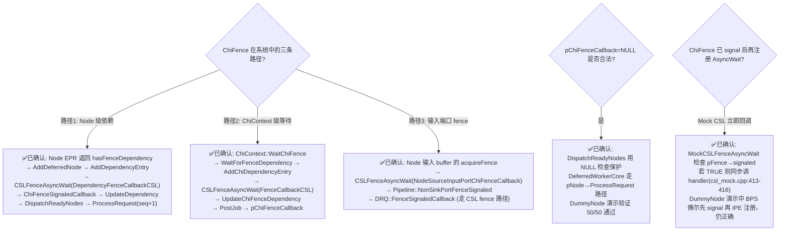
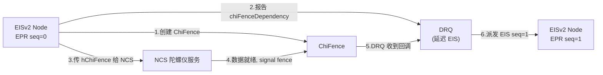
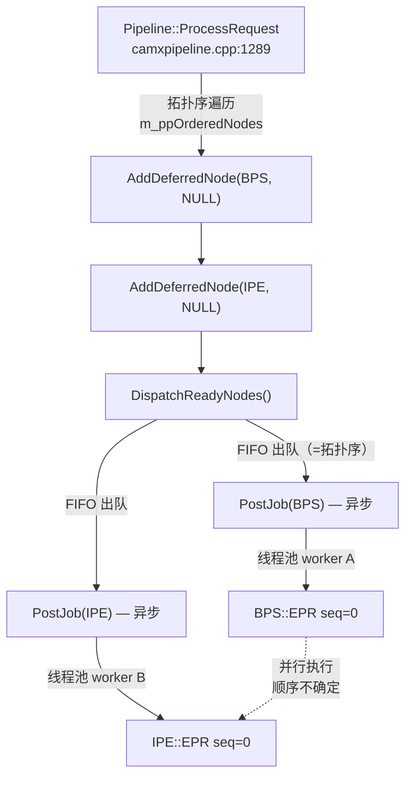

# ChiFence 依赖机制深度分析 — 数据结构 + DRQ 三路径 + DummyNode 演示

> 类型：源码分析
> 置信度底线：本文档所有内容为 ✅已确认（全部经过源码阅读 + DummyNode 运行验证）

## ❓ 问题背景

DRQ 四种依赖类型中，ChiFence 是最复杂的一种——它在 CHI 层创建，跨越 CHI→CamX→CSL 三层，通过 CSL fence 回调链最终通知 DRQ。需要完整理解其数据结构、注册路径、信号路径。

## 🌳 决策树



## 💡 核心数据结构

### ChiFence 对象 [✅已确认]

```cpp
// camx/src/core/chi/camxchi.h:27-47
enum ChiFenceState { ChiFenceInit=0, ChiFenceSuccess, ChiFenceFailed, ChiFenceInvalid };

struct ChiFence {
    CHIFENCEHANDLE  hChiFence;    // 指向自身 (self-referential handle)
    CHIFENCETYPE    type;         // ChiFenceTypeInternal / Native / EGL
    INT             aRefCount;    // 引用计数 (atomic)
    CSLFence        hFence;       // 内部 CSL fence (DRQ 通过此 fence 做 AsyncWait)
    ChiFenceState   resultState;  // 信号状态
    union { UINT64 eglSync; INT nativeFenceFD; };
};
```

关键：`ChiFence` 包裹一个 `CSLFence`。DRQ 对 ChiFence 的等待/通知全部通过内部 CSL fence 的 AsyncWait/Signal 完成。

### DependencyUnit.chiFenceDependency [✅已确认]

```cpp
// camx/src/core/camxnode.h:141-148
struct {
    UINT                chiFenceCount;                          // Chi fence 数量
    ChiFence*           pChiFences[MaxDependentFences];         // Chi fence 指针数组
    BOOL*               pIsChiFenceSignaled[MaxDependentFences];// 信号状态 (可选)
    PFNCHIFENCECALLBACK pChiFenceCallback;                     // 所有 fence 满足后的回调 (可为 NULL)
    VOID*               pUserData;                             // 回调用户数据
} chiFenceDependency;
```

Node 通过 `dependencyFlags.hasFenceDependency = TRUE` 激活此依赖类型。

### DRQ Dependency 结构中的 ChiFence 字段 [✅已确认]

```cpp
// camx/src/core/camxdeferredrequestqueue.h:50-75 (摘录)
struct Dependency {
    // ... property, CSL fence 字段 ...
    ChiFence*           pChiFences[MaxDependentFences]; // Chi Fence 指针
    UINT32              chiFenceCount;                  // Chi fence 总数
    UINT32              chiSignaledCount;               // 已 signal 数
    PFNCHIFENCECALLBACK pChiFenceCallback;              // 回调函数指针
    VOID*               pUserData;                      // 回调用户数据
};
```

满足条件：`chiFenceCount == chiSignaledCount`（与 property/CSL fence 三者同时满足才派发）。

### DependencyKey [✅已确认]

```cpp
// camx/src/core/camxdeferredrequestqueue.h:38-46
struct DependencyKey {
    UINT64 requestId;
    UINT64 pipelineId;
    UINT32 dataId;      // PropertyID（ChiFence 时为 PropertyIDInvalid）
    VOID*  pFence;      // CSL fence 指针（ChiFence 时为 NULL）
    VOID*  pChiFence;   // ★ ChiFence 指针（作为 hashmap key）
};
```

## 💡 路径1：Node 级 ChiFence 依赖（DummyNode 演示路径）[✅已确认]

```
Node::ExecuteProcessRequest
  │ 设 hasFenceDependency=TRUE, 填 chiFenceDependency
  │ 返回 numDependencyLists=1
  ▼
Node::ProcessRequest (框架层)
  │ 检测 numDependencyLists > 0
  ▼
Pipeline::AddDeferredNode(requestId, pNode, &dependencyInfo[i])
  ▼
DRQ::AddDeferredNode (camxdeferredrequestqueue.cpp:651)
  │ 691: if (hasFenceDependency)
  │ 693:   for each chiFence: pDependency->pChiFences[count++] = pChiFences[i]
  │ 698:   pDependency->pChiFenceCallback = pChiFenceCallback
  │ 699:   pDependency->pUserData = pUserData
  ▼
DRQ::AddDependencyEntry (camxdeferredrequestqueue.cpp:387)
  │ 563-640: for each ChiFence:
  │   创建 DependencyKey{0,0,PropertyIDInvalid,NULL,pChiFence}
  │   插入 m_pDependencyMap hashmap
  │   if (ChiFenceTypeInternal):
  │     CSLFenceAsyncWait(pChiFence->hFence, DependencyFenceCallbackCSL, pData)
  │     ★ pData 含 {pDRQ, pChiFence, requestId}
  │ 节点加入 m_deferredNodes 链表
  ▼
[等待 CSLFenceSignal]
  ▼
DRQ::DependencyFenceCallbackCSL (camxdeferredrequestqueue.cpp:1392)
  │ 验证 hSyncFence == pData->pChiFence->hFence
  │ if (CSLFenceResultSuccess):
  ▼
DRQ::ChiFenceSignaledCallback (camxdeferredrequestqueue.cpp:1199)
  │ UpdateDependency(PropertyIDInvalid, NULL, pChiFence, requestId, 0, TRUE, FALSE)
  ▼
DRQ::UpdateOrRemoveDependency (camxdeferredrequestqueue.cpp:1788)
  │ 1842: pMapKey->pChiFence != NULL → pDependency->chiSignaledCount++
  │ 1851-1853: if (propertyCount==publishedCount &&
  │                fenceCount==signaledCount &&
  │                chiFenceCount==chiSignaledCount):
  │   从 m_deferredNodes 移到 m_readyNodes
  ▼
DRQ::DispatchReadyNodes (camxdeferredrequestqueue.cpp:1029)
  │ 1084: if (pChiFenceCallback != NULL) → 调回调
  │ if (pNode != NULL) → PostJob → DeferredWorkerCore
  ▼
DRQ::DeferredWorkerCore (camxdeferredrequestqueue.cpp:271)
  │ pNode->ProcessRequest(processSequenceId=N)
  ▼
Node::EPR(seq=N)  ← ChiFence 依赖已满足
```

### 路径2：ChiContext 级等待 [✅已确认]

用于 CHI 框架层（非 Node 级）等待 ChiFence：

```
ChiContext::WaitChiFence (camxchicontext.cpp:3755)
  │ if (pCallback == NULL): CSLFenceWait (同步阻塞)
  │ if (pCallback != NULL):
  ▼
DRQ::WaitForFenceDependency (camxdeferredrequestqueue.cpp:722)
  │ CAMX_CALLOC(Dependency), 无 pNode
  │ AddChiDependencyEntry → 加入 m_CHIFenceDependencies 链表
  │ CSLFenceAsyncWait(hFence, FenceCallbackCSL, pData)
  ▼
[CSLFenceSignal]
  ▼
DRQ::FenceCallbackCSL → UpdateChiFenceDependency
  │ chiSignaledCount++
  │ if (all satisfied): PostJob → DeferredWorkerCore
  ▼
DeferredWorkerCore: pNode==NULL
  │ → pChiFenceCallback(hChiFence, pUserData) 直接调回调
```

### 路径3：输入端口 ChiFence [✅已确认]

用于 Node 输入 buffer 携带 ChiFence acquire fence：

```
Node::SetupRequestInputPorts (camxnode.cpp:2218)
  │ if (acquireFence.valid && ChiFenceTypeInternal):
  │   pChiFence = (ChiFence*)hChiFence
  │   phCSLFence = pChiFence->hFence
  │   if (已 signal): pIsFenceSignaled = TRUE
  │   else: CSLFenceAsyncWait(hFence, NodeSourceInputPortChiFenceCallback, pData)
  ▼
NodeSourceInputPortChiFenceCallback
  ▼
Pipeline::NonSinkPortFenceSignaled(phFence, requestId)
  ▼
DRQ::FenceSignaledCallback  ← 走 CSL fence 路径（非 ChiFence 路径）
```

## 💡 真实代码中的 ChiFence 使用者

### ChiNodeWrapper (唯一设 hasFenceDependency 的地方) [✅已确认]

```cpp
// camx/src/core/chi/camxchinodewrapper.cpp:2724-2775
if (0 < info.pDependency->chiFenceCount) {
    for (UINT i = 0; i < info.pDependency->chiFenceCount; i++) {
        CHIFENCEHANDLE hChiFence = info.pDependency->pChiFences[i];
        if (NULL == hChiFence) continue;
        pNodeRequestData->dependencyInfo[0].chiFenceDependency.pChiFences[i]
            = static_cast<ChiFence*>(hChiFence);
        fenceCount++;
    }
    // 分配 CHIFENCECALLBACKINFO 作为 pUserData
    pFenceCallbackInfo->hChiSession = static_cast<CHIHANDLE>(this);
    pFenceCallbackInfo->pUserData   = GetChiContext();
    
    dep.hasFenceDependency   = TRUE;
    dep.chiFenceCount        = fenceCount;
    dep.pUserData            = pFenceCallbackInfo;
    dep.pChiFenceCallback    = ChiFenceDependencyCallback;  // 释放 fence+callbackInfo
}
```

`ChiFenceDependencyCallback` 仅做清理：`ReleaseChiFence(hChiFence) + CAMX_FREE(pCallbackInfo)`。

### ChiContext 创建/信号 ChiFence [✅已确认]

```cpp
// camxchicontext.cpp
CreateChiFence:
  ChiFence* p = CAMX_CALLOC(sizeof(ChiFence));
  p->hChiFence = p;                        // self-referential
  p->type = pInfo->type;
  p->aRefCount = 1;
  p->resultState = ChiFenceInit;
  CSLCreatePrivateFence("ChiFence", &p->hFence);

SignalChiFence:
  SetChiFenceResult(pChiFence, ChiFenceSuccess/Failed);
  CSLFenceSignal(pChiFence->hFence, CSLFenceResultSuccess/Failed);

ReleaseChiFence:
  if (atomicDec(aRefCount) == 0):
    CSLReleaseFence(hFence);
    CAMX_FREE(pChiFence);
```

## 💡 DummyNode ChiFence 演示（EIS 自依赖模式）[✅已确认 — 日志 + 压测验证]

### git diff（相对于无 ChiFence 的基线）

```diff
+#include "camxchi.h"
+#include "camxhwdefs.h"
+#include <thread>

+static void AsyncServiceCallback(ChiFence* pFence)
+{
+    std::thread([pFence]() {
+        std::this_thread::sleep_for(std::chrono::milliseconds(1));
+        pFence->resultState = ChiFenceSuccess;
+        CSLFenceSignal(pFence->hFence, CSLFenceResultSuccess);
+        CSLReleaseFence(pFence->hFence);
+        CAMX_FREE(pFence);
+    }).detach();
+}

 // 在 ExecuteProcessRequest 内：
+    if (Type() == BPS && pNodeReqData->processSequenceId == 0)
+    {
+        ChiFence* pFence = static_cast<ChiFence*>(CAMX_CALLOC(sizeof(ChiFence)));
+        CSLCreatePrivateFence("ChiFenceDemo", &pFence->hFence);
+        pFence->hChiFence   = static_cast<CHIFENCEHANDLE>(pFence);
+        pFence->type        = ChiFenceTypeInternal;
+        pFence->aRefCount   = 1;
+        pFence->resultState = ChiFenceInit;
+
+        DependencyUnit& dep              = pNodeReqData->dependencyInfo[0];
+        dep.dependencyFlags.hasFenceDependency = 1;
+        dep.chiFenceDependency.chiFenceCount   = 1;
+        dep.chiFenceDependency.pChiFences[0]   = pFence;
+        dep.processSequenceId                  = 1;
+        pNodeReqData->numDependencyLists       = 1;
+
+        AsyncServiceCallback(pFence);
+        return CamxResultSuccess;
+    }
 // 其余节点/seq：直接信号 output fences（原逻辑不变）
```

改动量：+3 include、+10 行 AsyncServiceCallback、+15 行 BPS seq=0 分支。其余函数零改动。

### 与 EIS 的对照

| 步骤 | EIS (camxchinodeeisv2.cpp) | DummyNode (dummy_node.cpp) |
|------|---------------------------|---------------------------|
| 创建 | `pCreateFence("ChiInternalFence_EISV2")` :2013 | `CAMX_CALLOC + CSLCreatePrivateFence` :55-61 |
| 注册自依赖 | `pDependency->pChiFences[0] = hFence` :2033 | `dep.chiFenceDependency.pChiFences[0] = pFence` :67 |
| 异步请求 | `pGetData(NCS请求)` :2035 | `AsyncServiceCallback(pFence)` :72 |
| 信号 | NCS `m_signalChiFence` :1211 | async thread `CSLFenceSignal` :21 |
| 释放 | NCS `m_releaseChiFence` :1212 | async thread `CSLReleaseFence + CAMX_FREE` :22-23 |
| 生命周期 | 堆分配（pCreateFence 内部 CAMX_CALLOC），局部变量持有 handle | 堆分配（直接 CAMX_CALLOC），局部变量持有指针 |

### 运行时日志（TestBayerToYUV）

```
18:34:07.418587 [thread 238985] BPS seq=0: created hFence=7, registered self-dep, requesting async data
18:34:07.419786 [thread 239003] async service signaling hFence=7        (+1.2ms, 独立线程)
18:34:07.419922 [thread 238984] BPS seq=1: signaling output fences      (DRQ 派发)
```

### 日志验证矩阵

| 用例 | BPS 在 pipeline | `[ChiFence]` 日志 |
|------|:-:|:-:|
| TestBayerToYUV | Y | `hFence=7` 创建→信号 ✅ |
| TestMultiStage | Y | `hFence=20` 创建→信号 ✅ |
| TestBPS | Y | `hFence=28` 创建→信号 ✅ |
| TestYUVToJpeg | N | 无 ✅ |
| TestIPE | N | 无 ✅ |

## 📍 关键代码位置

### 数据结构定义
- `camxchi.h:27-47` — ChiFence 结构体 + ChiFenceState 枚举
- `camxnode.h:141-148` — DependencyUnit.chiFenceDependency 子结构
- `camxdeferredrequestqueue.h:50-75` — DRQ Dependency 结构（含 ChiFence 字段）
- `camxdeferredrequestqueue.h:38-46` — DependencyKey（含 pChiFence 指针）
- `camxdeferredrequestqueue.h:95-100` — DeferredFenceCallbackData
- `chicommon.h:266-271` — CHIFENCETYPE 枚举
- `chicommon.h:273-283` — CHIFENCECREATEPARAMS
- `chicommon.h:285-293` — CHIFENCECALLBACKINFO
- `chicommon.h:500` — PFNCHIFENCECALLBACK typedef

### DRQ 处理 ChiFence
- `camxdeferredrequestqueue.cpp:691-699` — AddDeferredNode 中拷贝 chiFenceDependency
- `camxdeferredrequestqueue.cpp:563-640` — AddDependencyEntry 中注册 CSLFenceAsyncWait
- `camxdeferredrequestqueue.cpp:1392-1418` — DependencyFenceCallbackCSL（Node 级）
- `camxdeferredrequestqueue.cpp:1371-1390` — FenceCallbackCSL（ChiContext 级）
- `camxdeferredrequestqueue.cpp:1199-1208` — ChiFenceSignaledCallback
- `camxdeferredrequestqueue.cpp:1788-1884` — UpdateOrRemoveDependency（1842 行 ChiFence 分支）
- `camxdeferredrequestqueue.cpp:1510-1618` — UpdateChiFenceDependency（ChiContext 路径）
- `camxdeferredrequestqueue.cpp:1029-1119` — DispatchReadyNodes（1084 行 callback 检查）
- `camxdeferredrequestqueue.cpp:271-353` — DeferredWorkerCore（346 行 callback 调用）
- `camxdeferredrequestqueue.cpp:722-794` — WaitForFenceDependency

### ChiContext ChiFence API
- `camxchicontext.cpp:3540` — AttachChiFence（atomic increment refcount）
- `camxchicontext.cpp:3561` — ReleaseChiFence（atomic decrement → CSLReleaseFence + free）
- `camxchicontext.cpp:3613` — SignalChiFence（SetChiFenceResult + CSLFenceSignal）
- `camxchicontext.cpp:3755` — WaitChiFence（同步/异步分支）

### ChiNodeWrapper ChiFence 使用
- `camxchinodewrapper.cpp:2724-2775` — EPR 中设 hasFenceDependency
- `camxchinodewrapper.cpp:3312-3328` — ChiFenceDependencyCallback（清理回调）
- `camxchinodewrapper.cpp:886-908` — FNWaitFenceAsync

### Node 输入端口 ChiFence
- `camxnode.cpp:2218-2266` — SetupRequestInputPorts 中检测 ChiFence acquireFence
- `camxnode.cpp:9086-9134` — NodeSourceInputPortChiFenceCallback

### DummyNode 演示
- `dummy_node.cpp:15-24` — AsyncServiceCallback（异步线程 signal + release）
- `dummy_node.cpp:50-73` — BPS seq=0 堆分配 ChiFence + 注册自依赖 + 发起异步

### CSL Mock
- `csl_mock.cpp:402-419` — MockCSLFenceAsyncWait（已 signal 时立即回调）
- `csl_mock.cpp:441-464` — MockCSLFenceSignal（先 signal 再遍历调 waiters）

### 真实 ChiFence 使用者
- `camxchinodeeisv2.cpp:2033-2034` — EISv2 创建 ChiFence + 报告 chiFenceDependency（自依赖模式）
- `camxchinodeeisv3.cpp:2237-2238` — EISv3 同一模式
- `chitargetbuffermanager.cpp:477-499` — TBM 创建 ChiFence（buffer release fence）
- `chitargetbuffermanager.cpp:1568` — TBM 信号 ChiFence
- `chifeature2base.cpp:5832,5993` — Feature2Base 设 `isChiFenceEnabled`（受 EnableTBMChiFence 控制）
- `chifeature2base.cpp:5995-6003` — MFSR Blend 端口专用 ChiFence 覆盖

### EPR 执行顺序
- `camxpipeline.cpp:1889-1896` — m_ppOrderedNodes 拓扑排序（反转为源→汇）
- `camxpipeline.cpp:1289-1323` — 拓扑序 AddDeferredNode + DispatchReadyNodes
- `camxdeferredrequestqueue.cpp:412-419` — 无依赖节点直接入 m_readyNodes
- `camxdeferredrequestqueue.cpp:1070` — FIFO 出队 Head
- `camxdeferredrequestqueue.cpp:1098` — PostJob(isBlocking=FALSE) 异步派发

## ⚠️ 待验证事项

无。本文档所有内容均通过源码阅读 + 运行时验证确认。

## 📝 备注

- ChiFence 仅在 `ChiFenceTypeInternal` 类型时通过 CSL fence 走 DRQ。`ChiFenceTypeNative` 和 `ChiFenceTypeEGL` 的路径在 WaitForFenceDependency 中有 `CAMX_NOT_IMPLEMENTED()` 标记
- `EnableMFSRChiFence()` 和 `EnableTBMChiFence()` 在我们的 stub 中返回 FALSE，不影响 DummyNode 演示
- DummyNode 的 ChiFence 使用方式与 ChiNodeWrapper 的 canonical 用法略有不同：DummyNode 直接在 CamX Node 层设 chiFenceDependency，跳过了 ChiNodeWrapper 的封装层。但 DRQ 处理逻辑完全相同

---

## 修正（2026-06-22）— 深度调查：真实使用者 + 执行顺序 + 架构偏差

### 真实 ChiFence 使用者 [✅已确认]

全源码搜索结果：仅 **2 个 CHI 节点** 在 Node 级设置 `chiFenceDependency`：

**EISv2**（`camx/src/swl/eisv2/camxchinodeeisv2.cpp:2033-2034`）：
```cpp
hFence = g_ChiNodeInterface.pCreateFence(hSession, "ChiInternalFence_EISV2");
ncsRequest.hChiFence = hFence;     // 传给 NCS 陀螺仪数据服务
pProcessRequestInfo->pDependency->pChiFences[0] = hFence;
pProcessRequestInfo->pDependency->chiFenceCount = 1;
// NCS 数据就绪后 signal fence → DRQ 派发 EIS 继续处理
```

**EISv3**（`camx/src/swl/eisv3/camxchinodeeisv3.cpp:2237-2238`）：同一模式。

**OEM 节点**（chi-cdk/oem/qcom/node/）：**零使用**。

#### 关键模式：自依赖（Self-Dependency）



**节点自己创建 fence、自己依赖 fence、由外部服务信号 fence。** 不是跨节点信号。

#### TBM 层 ChiFence（独立机制）[✅已确认]

`CHITargetBufferManager`（`chitargetbuffermanager.cpp`）使用 ChiFence 管理 buffer release fence 生命周期：

- `chitargetbuffermanager.cpp:477-499` — 创建 ChiFence（`ExtensionModule::CreateChiFence`）
- `chitargetbuffermanager.cpp:1568` — 信号 ChiFence（`SignalChiFence`）
- `chitargetbuffermanager.cpp:1769` — 释放 ChiFence（`ReleaseChiFence`）
- 受 `EnableTBMChiFence()` + `EnableMFSRChiFence()` 开关控制
- **MFSR 专用**：仅 Blend 端口启用（`chifeature2base.cpp:5995-6003`）
- 这是 buffer 生命周期管理，**不走** `DependencyUnit.chiFenceDependency` 路径

### EPR 执行顺序机制 [✅已确认]



| 层次 | 顺序 | 代码依据 |
|------|------|---------|
| `AddDeferredNode` 调用 | 确定性拓扑序 | `m_ppOrderedNodes` 在 `FinalizePipeline` 反转为源→汇（`camxpipeline.cpp:1889-1896`） |
| `m_readyNodes` 入队 | 确定性 FIFO | `InsertToTail`（`camxdeferredrequestqueue.cpp:418`） |
| `PostJob` 发出 | 确定性拓扑序 | `while` 循环从 Head 取（`camxdeferredrequestqueue.cpp:1070`） |
| **EPR 实际执行** | **非确定性** | `PostJob(isBlocking=FALSE)` → 多 worker 线程并行（`camxdeferredrequestqueue.cpp:1098`） |

seq=0 的 BPS 和 IPE **被并行派发到线程池**，谁先执行取决于 OS 调度。这解释了运行日志中 BPS/IPE 交错出现的现象。

### DummyNode 架构偏差标注

| 方面 | 真实系统（EISv2/v3） | DummyNode Demo |
|------|---------------------|----------------|
| ChiFence 创建者 | 节点自己（EIS EPR 内） | IPE 创建、BPS 信号 |
| 依赖模式 | 自依赖（节点等自己创建的 fence） | 跨节点依赖（IPE 等 BPS 信号的 fence） |
| Fence 信号者 | 外部服务（NCS） | 另一个节点（BPS） |
| 创建 API | `g_ChiNodeInterface.pCreateFence()` | 直接构造 `ChiFence` struct + `CSLCreatePrivateFence` |
| DRQ 处理路径 | 完全相同 | 完全相同 |

**DRQ 不关心 ChiFence 由谁创建、由谁信号** — 它只关心 `ChiFence.hFence`（CSL fence）的 AsyncWait/Signal 回调链。因此 DummyNode 的"跨节点"模式虽然不是 canonical 用法，但 DRQ 处理逻辑正确。

### 修正前文错误

- ~~"真实系统中 ChiFence 主要用于 MFNR/MFSR 等多帧特征——上一帧的输出 fence 作为下一帧的输入依赖"~~ → ❌ 不准确。MFNR 未使用 ChiFence；MFSR 仅在 TBM 层用 ChiFence 管理 Blend buffer release（非 Node 级依赖）。Node 级 ChiFence 实际用于 **EIS 等待陀螺仪数据**
- 真实的 Node 级 ChiFence 使用者是 EISv2/EISv3（camx/src/swl/），不是 Feature2 或 OEM 节点
