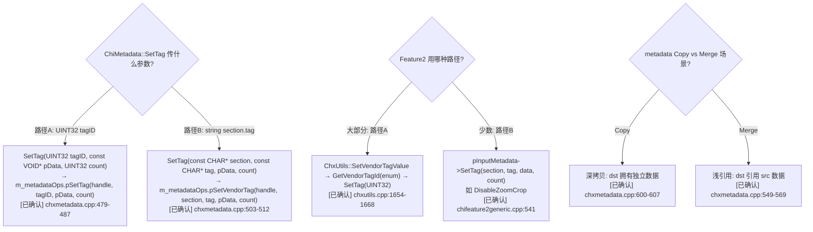
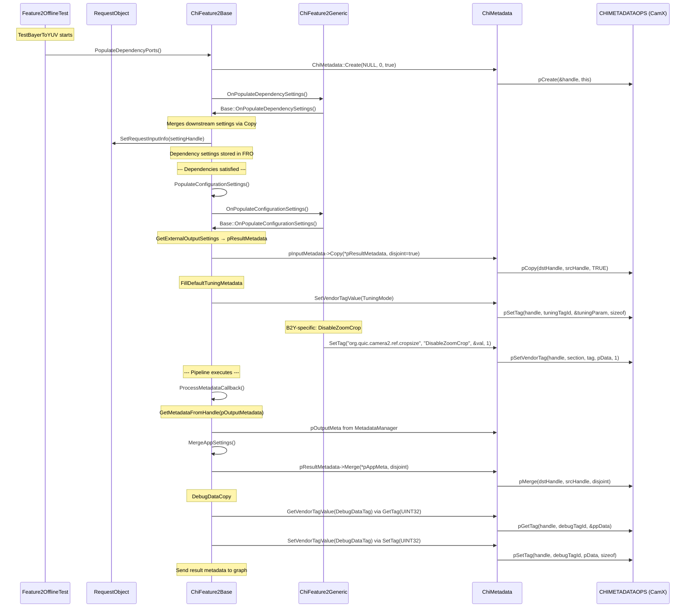

# ChiMetadata 类与 Feature2 Bayer2Yuv 元数据操作全景分析

> 类型：源码分析
> 置信度底线：本文档最低置信度为 🧠推断 的内容不可作为行动依据

## 问题背景
研究 chi-cdk Feature2 框架在 TestBayerToYUV 执行期间如何调用元数据操作 (CHIMETADATAOPS)。

## 搜索过程
| 命令 / 动作 | 目标 | 结果摘要 |
|------------|------|---------|
| grep "class ChiMetadata" chi-cdk/ | 找 ChiMetadata 定义 | nativechitest/chiutils/chxmetadata.h:476 (cmake copy), real: chi-cdk/core/chiutils/chxmetadata.h |
| grep "CHIMETADATAOPS" chi.h | 找 struct 定义 | chi-cdk/api/common/chi.h:1962-2030 |
| read chi.h 1250-1600 | PFN_CMB_* 函数指针签名 | 全部 35+ 函数指针类型定义 |
| read chxmetadata.cpp | ChiMetadata 方法实现 | 每个方法直接转发到 m_metadataOps.pXxx |
| grep Feature2 base metadata | chifeature2base.cpp 中的 metadata 用法 | SetTag/GetTag/Copy/Merge 30+ 处 |
| read chifeature2generic.cpp | Bayer2Yuv Generic feature | OnPopulateDependencySettings/OnPopulateConfigurationSettings |
| read chifeature2bayer2yuvdescriptor.cpp | 描述符定义 | 输入输出端口、metadata port |
| read chxutils.cpp FillDefaultTuningMetadata | 调优元数据填充 | SetVendorTag(TuningMode) |
| read chxutils.cpp GetVendorTagValue/SetVendorTagValue | Vendor tag helper | 通过 ExtensionModule::GetVendorTagId -> ChiMetadata::SetTag(UINT32) |

## 决策树



## 分析结论

### Part 1: ChiMetadata 类

**存储结构** [已确认]
- `CHIMETADATAHANDLE m_metaHandle` — 不透明句柄 (`typedef VOID* CHIMETAHANDLE`, chi.h:86)
- `CHIMETADATAOPS m_metadataOps` — 函数指针表 (chi.h:1962-2030)
- `CHIMETADATACLIENTID m_metadataClientId` — 位域结构: {frameNumber:24, clientIndex:7, reserved:1} (chi.h:779-784)

**包装方式** [已确认]
每个 ChiMetadata 公共方法都是对 `m_metadataOps.pXxx(m_metaHandle, ...)` 的薄封装:

| ChiMetadata 方法 | 调用的函数指针 | 参数模式 |
|---|---|---|
| `GetTag(UINT32 tagID)` | `pGetTag(handle, tagID, &ppData)` | tagID=UINT32, 返回 VOID* |
| `GetTag(UINT32, ChiMetadataEntry&)` | `pGetTagEntry(handle, tagID, &entry)` | 返回完整 entry (tagID, pTagData, count, size, type) |
| `GetTag(section, tagName)` | `pGetVendorTag(handle, section, tagName, &ppData)` | 字符串键, 返回 VOID* |
| `SetTag(UINT32, pData, count)` | `pSetTag(handle, tagID, pData, count)` | UINT32 tagID + 数据 |
| `SetTag(section, tagName, pData, count)` | `pSetVendorTag(handle, section, tagName, pData, count)` | 字符串键 + 数据 |
| `Copy(src, disjoint)` | `pCopy(dstHandle, srcHandle, disjoint)` | 深拷贝 |
| `Merge(src, disjoint)` | `pMerge(dstHandle, srcHandle, disjoint)` | 浅引用(引用 src 的 tag 数据) |
| `Clone()` | `pClone(srcHandle, &dstHandle)` | 返回新句柄, 包装为新 ChiMetadata |
| `Invalidate()` | `pInvalidate(handle)` | 清空所有 tag |
| `Count()` | `pCount(handle, &count)` | 返回 tag 计数 |
| `AddReference(clientName)` | `pAddReference(handle, clientId, &refCount)` | 引用计数管理 |
| `ReleaseReference(clientName)` | `pReleaseReference(handle, clientId, &refCount)` | 引用计数管理 |
| `SetAndroidMetadata(camera_metadata_t*)` | `pSetAndroidMetadata(handle, pAndroidMeta)` | 批量导入 Android metadata |
| `DeleteTag(tagID)` | `pDeleteTag(handle, tagID)` | 删除单个 tag |
| `TranslateToCameraMetadata(...)` | `pFilter(handle, pAndroidMeta, frameworkOnly, filterProps, ...)` | CHI→Android 转换 |
| `DumpDetailsToFile(filename)` | `pDump(handle, filename)` | 文本转储 |
| `BinaryDump(filename)` | `pBinaryDump(handle, filename)` | 二进制转储 |
| `MergeMultiCameraMetadata(...)` | `pMergeMultiCameraMeta(dst, count, srcArray, cameraIds, primaryId)` | 多摄合并 |

**关键问题: SetTag 传什么?** [已确认]

两种路径:
1. **UINT32 tagID 路径** (主要): `SetTag(tagID, pData, count)` → `pSetTag(handle, tagID, pData, count)`
   - tagID 是 UINT32 枚举值 (标准 Android tag 如 `ANDROID_CONTROL_ENABLE_ZSL`, 或 vendor tag 的数字 ID)
   - Vendor tag 的 UINT32 ID 通过 `PFNCHIQUERYVENDORTAGLOCATION` 查询获得
   - ChxUtils::SetVendorTagValue 内部: `ExtensionModule::GetVendorTagId(tagEnum)` → `pMetadata->SetTag(tagId, ...)`

2. **字符串路径** (少数): `SetTag(sectionName, tagName, pData, count)` → `pSetVendorTag(handle, section, tag, pData, count)`
   - 传两个 `const CHAR*` 字符串 (如 "org.quic.camera2.ref.cropsize", "DisableZoomCrop")
   - CamX 内部通过 vendor tag ops 查找对应的 UINT32 tagID

### Part 2: CHIMETADATAOPS 完整定义

chi-cdk/api/common/chi.h:1962-2030, 共 35 个函数指针 + 8 个保留位:

```c
typedef struct ChiMetadataOps {
    // Basic Operations
    PFN_CMB_CREATE                      pCreate;                    // (CHIMETAHANDLE*, CHIMETAPRIVATEDATA) → CDKResult
    PFN_CMB_CREATE_WITH_TAGARRAY        pCreateWithTagArray;        // (const UINT32* tags, UINT32 count, CHIMETAHANDLE*, CHIMETAPRIVATEDATA) → CDKResult
    PFN_CMB_CREATE_WITH_ANDROIDMETADATA pCreateWithAndroidMetadata; // (const VOID* androidMeta, CHIMETAHANDLE*, CHIMETAPRIVATEDATA) → CDKResult
    PFN_CMB_DESTROY                     pDestroy;                   // (CHIMETAHANDLE, BOOL force) → CDKResult
    PFN_CMB_GET_TAG                     pGetTag;                    // (handle, UINT32 tagID, VOID** ppData) → CDKResult
    PFN_CMB_GET_TAG_ENTRY               pGetTagEntry;               // (handle, UINT32 tagID, CHIMETADATAENTRY*) → CDKResult
    PFN_CMB_GET_VENDORTAG               pGetVendorTag;              // (handle, const CHAR* section, const CHAR* tag, VOID** ppData) → CDKResult
    PFN_CMB_GET_VENDORTAG_ENTRY         pGetVendorTagEntry;         // (handle, section, tag, CHIMETADATAENTRY*) → CDKResult
    PFN_CMB_SET_TAG                     pSetTag;                    // (handle, UINT32 tagID, const VOID* pData, UINT32 count) → CDKResult
    PFN_CMB_SET_VENDORTAG               pSetVendorTag;              // (handle, section, tag, const VOID* pData, UINT32 count) → CDKResult
    PFN_CMB_SET_ANDROIDMETADATA         pSetAndroidMetadata;        // (handle, const VOID* androidMeta) → CDKResult
    PFN_CMB_DELETE_TAG                  pDeleteTag;                 // (handle, UINT32 tagID) → CDKResult
    PFN_CMB_INVALIDATE                  pInvalidate;                // (handle) → CDKResult
    PFN_CMB_MERGE                       pMerge;                     // (dstHandle, srcHandle, BOOL disjoint) → CDKResult
    PFN_CMB_COPY                        pCopy;                      // (dstHandle, srcHandle, BOOL disjoint) → CDKResult
    PFN_CMB_CLONE                       pClone;                     // (srcHandle, CHIMETAHANDLE*) → CDKResult
    PFN_CMB_CAPACITY                    pCapacity;                  // (handle, UINT32*) → CDKResult
    PFN_CMB_TAG_COUNT                   pCount;                     // (handle, UINT32*) → CDKResult
    PFN_CMB_PRINT                       pPrint;                     // (handle) → CDKResult
    PFN_CMB_DUMP                        pDump;                      // (handle, const CHAR* filename) → CDKResult
    PFN_CMB_BINARYDUMP                  pBinaryDump;                // (handle, const CHAR* filename) → CDKResult

    // Reference Management
    PFN_CMB_ADD_REFERENCE               pAddReference;              // (handle, CHIMETADATACLIENTID, UINT32*) → CDKResult
    PFN_CMB_RELEASE_REFERENCE           pReleaseReference;          // (handle, CHIMETADATACLIENTID, UINT32*) → CDKResult
    PFN_CMB_REFERENCE_COUNT             pReferenceCount;            // (handle, UINT32*) → CDKResult

    // Metadata Table Query
    PFN_CMB_GET_METADATA_TABLE          pGetMetadataTable;          // (CHIMETADATAENTRY*) → CDKResult
    PFN_CMB_GET_METADATA_ENTRY_COUNT    pGetMetadataEntryCount;     // (UINT32*) → CDKResult

    // Iterator
    PFN_CMB_ITERATOR_CREATE             pIteratorCreate;            // (handle, CHIMETADATAITERATOR*) → CDKResult
    PFN_CMB_ITERATOR_DESTROY            pIteratorDestroy;           // (iterator) → CDKResult
    PFN_CMB_ITERATOR_BEGIN              pIteratorBegin;             // (iterator) → CDKResult
    PFN_CMB_ITERATOR_NEXT               pIteratorNext;              // (iterator) → CDKResult
    PFN_CMB_ITERATOR_GETENTRY           pIteratorGetEntry;          // (iterator, CHIMETADATAENTRY*) → CDKResult

    // Default Settings
    PFN_CMB_GET_DEFAULT_ANDROIDMETADATA pGetDefaultAndroidMeta;     // (cameraId, const VOID**) → CDKResult
    PFN_CMB_GET_DEFAULT_METADATA        pGetDefaultMetadata;        // (cameraId, CHIMETAHANDLE*) → CDKResult

    // Extended
    PFN_CMB_FILTER                      pFilter;                    // (handle, androidMeta, frameworkOnly, filterProps, filterCount, filterArray) → CDKResult
    PFN_CMB_GET_PRIVATE_DATA            pGetPrivateData;            // (handle, CHIMETAPRIVATEDATA*) → CDKResult
    PFN_CMB_RELEASE_ALL_REFERENCES      pReleaseAllReferences;      // (handle, BOOL chiAndCamx) → CDKResult
    PFN_CMB_MERGE_MULTICAMERA_METADATA  pMergeMultiCameraMeta;      // (dst, count, srcArray, cameraIds, primaryId) → CDKResult
    PFN_CMB_GET_TAG_BY_CAMERAID         pGetTagByCameraId;          // (handle, tagID, cameraId, VOID**) → CDKResult
    VOID*                               reserved[8];
} CHIMETADATAOPS;
```

### Part 3: Feature2 Bayer2Yuv 元数据操作时序



### Part 4: Tags read/written during Bayer2Yuv execution

**Tags SET during configuration** [已确认]:
1. **TuningMode** (VendorTag::TuningMode) — `ChiTuningModeParameter` struct containing:
   - Default mode, Sensor mode index, Usecase mode, Feature1 mode, Feature2 mode, Scene mode, Effect mode
   - Set via `ChxUtils::FillDefaultTuningMetadata()` → `SetVendorTagValue()` → `SetTag(UINT32 tagId, ...)`
   - chifeature2base.cpp:7121, chxutils.cpp:2702

2. **DisableZoomCrop** ("org.quic.camera2.ref.cropsize", "DisableZoomCrop") — BOOL
   - Only if `m_disableZoomCrop == TRUE` in B2Y feature
   - Set via `SetTag(section, tag, ...)` → `pSetVendorTag`
   - chifeature2generic.cpp:541

3. **DebugDataTag** (VendorTag::DebugDataTag) — DebugData struct
   - Read from input metadata, copies buffer for offline processing, re-sets vendor tag
   - chifeature2base.cpp:6430, 6484

4. **DebugDumpConfig** (VendorTag::DebugDumpConfig) — DumpFileName struct
   - Set only when debug dump is enabled
   - chifeature2base.cpp:7646

**Tags READ during execution** [已确认]:
1. **ANDROID_CONTROL_ENABLE_ZSL** — INT, checked for ZSL queue selection
   - chifeature2base.cpp:5065
2. **ZSLTimestampRange** (VendorTag::ZSLTimestampRange) — INT64[2], ZSL time window
   - chifeature2base.cpp:5075
3. **ANDROID_SENSOR_TIMESTAMP** — UINT64, sensor timestamp from TBM metadata
   - chifeature2base.cpp:5137
4. **DebugDataTag** — read before copy, chifeature2base.cpp:6430
5. **DebugDumpConfig** — read before override, chifeature2base.cpp:7639
6. **ANDROID_HOT_PIXEL_MODE** — read during UpdateMetadataWithInputSettings
   - chxutils.cpp:2729
7. **ANDROID_CONTROL_MODE / ANDROID_CONTROL_SCENE_MODE** — read for scene mode
   - chxutils.cpp:1680-1685
8. **ANDROID_CONTROL_EFFECT_MODE** — read for effect mode
   - chxutils.cpp:1300

### Part 5: Metadata Copy/Merge between stages

**Copy (deep copy)** [已确认]:
- `OnPopulateConfigurationSettings()` copies result metadata disjoint into input metadata:
  `pInputMetadata->Copy(*pResultMetadata, disjoint=true)`
  - chifeature2base.cpp:7117
  - disjoint=true means: only copy tags NOT already in destination
  - Internally: `pCopy(dstHandle, srcHandle, TRUE)` — allocates new memory for each tag

- `OnPopulateDependencySettings()` copies downstream feature settings:
  `pFeatureSettings->Copy(*pSrcFeatureSetting, disjoint=true)`
  - chifeature2base.cpp:6998

**Merge (shallow reference)** [已确认]:
- `MergeAppSettings()` merges app request settings into result metadata:
  `pResultMetadata->Merge(*pAppMeta, isDisjoint)`
  - chifeature2base.cpp:7066
  - Tags in result metadata REFERENCE the app metadata buffer (no deep copy)
  - isDisjoint parameter controls overlap behavior

**Neither Copy nor Merge — direct pipeline metadata flow:**
- Pipeline output metadata (`pOutputMetadata`) comes back through `CHICAPTURERESULT`
- `GetMetadataFromHandle()` retrieves the `ChiMetadata*` from the opaque handle
- This metadata is forwarded as-is to the graph via `ProcessFeatureMessage`

### Part 6: Bayer2Yuv descriptor metadata ports

chifeature2bayer2yuvdescriptor.cpp defines:

```
Input ports:
  {0,0,0} ExternalInput ImageBuffer  "RDI_In"     → TARGET_BUFFER_RAW
  {0,0,1} ExternalInput MetaData     "B2Y_Input_Metadata"  → NULL (no TBM)

Output ports:
  {0,0,0} ExternalOutput ImageBuffer "YUV_Out"    → TARGET_BUFFER_YUV_HAL
  {0,0,1} ExternalOutput MetaData    "YUV_Metadata_Out" → NULL
  {0,0,2} ExternalOutput ImageBuffer "YUV_Out2"   → TARGET_BUFFER_YUV_HAL2
```

The metadata port {0,0,1} flows through the same pipeline as image buffers.
Metadata is populated as input settings (configuration) and received back as output metadata (result).

## 关键代码位置
- `chi-cdk/api/common/chi.h:86-88` — CHIMETAHANDLE, CHIMETADATAITERATOR, CHIMETAPRIVATEDATA typedefs
- `chi-cdk/api/common/chi.h:493-500` — CHIMETADATAENTRY struct
- `chi-cdk/api/common/chi.h:779-784` — CHIMETADATACLIENTID struct
- `chi-cdk/api/common/chi.h:1296-1600` — All PFN_CMB_* function pointer typedefs
- `chi-cdk/api/common/chi.h:1962-2030` — CHIMETADATAOPS struct definition
- `chi-cdk/core/chiutils/chxmetadata.h:476-986` — ChiMetadata class
- `chi-cdk/core/chiutils/chxmetadata.cpp:84-904` — ChiMetadata implementation
- `chi-cdk/core/chiutils/chxutils.cpp:1273-1288` — GetVendorTagValue (enum → UINT32 → GetTag)
- `chi-cdk/core/chiutils/chxutils.cpp:1654-1668` — SetVendorTagValue (enum → UINT32 → SetTag)
- `chi-cdk/core/chiutils/chxutils.cpp:2673-2704` — FillDefaultTuningMetadata
- `chi-cdk/core/chifeature2/chifeature2base.cpp:6688-6731` — PopulateDependencyPorts (creates ChiMetadata)
- `chi-cdk/core/chifeature2/chifeature2base.cpp:7076-7126` — PopulateConfigurationSettings + OnPopulateConfigurationSettings
- `chi-cdk/core/chifeature2/chifeature2base.cpp:7038-7071` — MergeAppSettings (Merge)
- `chi-cdk/core/chifeature2/chifeature2base.cpp:4670-4750` — ProcessMetadataCallback
- `chi-cdk/core/chifeature2/chifeature2base.cpp:6408-6502` — DebugDataCopy
- `chi-cdk/oem/qcom/feature2/chifeature2generic/chifeature2generic.cpp:470-506` — OnPopulateDependencySettings
- `chi-cdk/oem/qcom/feature2/chifeature2generic/chifeature2generic.cpp:511-551` — OnPopulateConfigurationSettings
- `chi-cdk/oem/qcom/feature2/chifeature2graphselector/chifeature2bayer2yuvdescriptor.cpp:1-156` — Bayer2Yuv descriptor

## 待验证事项
- [🧠推断] ANDROID_CONTROL_ENABLE_ZSL, ZSLTimestampRange, SENSOR_TIMESTAMP tags may not all fire during TestBayerToYUV (depends on test mode - offline tests may bypass ZSL queue)
- [🧠推断] DisableZoomCrop vendor tag path assumes m_disableZoomCrop is set in test; depends on ChiFeature2CreateInputInfo

## 备注
- CHIMETADATAOPS 函数指针表由 CamX 实现, 通过 `ExtensionModule::GetMetadataOps()` 获取
- 在 cmake 测试中, 这些函数指针由 camera.qcom.so 通过 CHI API entry point 提供
- Copy = 深拷贝 (分配+复制数据), Merge = 浅引用 (dst tag 指向 src 的数据)
- Clone = 完整克隆, 返回新的独立句柄
