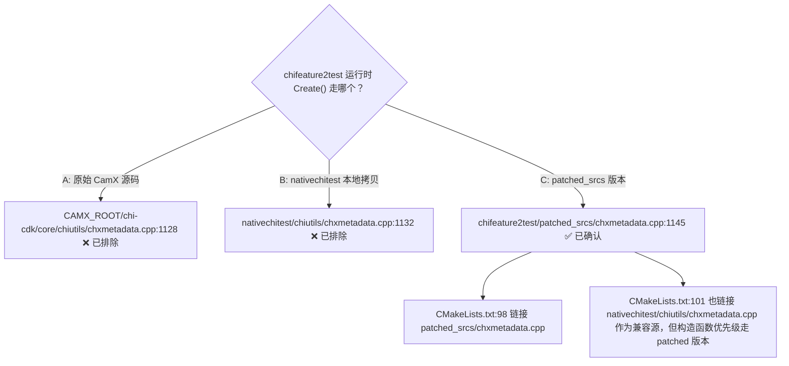

# ChiMetadataManager 三实现对比 — 原始源码 vs nativechitest 拷贝 vs chifeature2test patch

> 类型：源码分析 / 配置规则
> 置信度底线：全部 ✅已确认（逐一读取了三个实现的 Create + 构造函数 + CMakeLists 链接配置）

## 问题背景

chifeature2test 执行 `TestBayerToYUV` 时调用 `ChiMetadataManager::Create()`，需要查明到底执行到哪个 cpp 文件的哪一行。

## 搜索过程

| 命令 / 动作 | 目标 | 结果摘要 |
|------------|------|---------|
| `grep "ChiMetadataManager::Create" --include="*.cpp"` | 找所有 Create 实现 | 3 hits：patched/native/original |
| `grep "ChiMetadataManager::ChiMetadataManager" --include="*.cpp"` | 找所有构造函数 | 3 hits（同上） |
| 读 chifeature2test/CMakeLists.txt:98 | 确认链接源 | `patched_srcs/chxmetadata.cpp` |
| 读 nativechitest/CMakeLists.txt:59 | 确认 native 链接源 | `chiutils/chxmetadata.cpp` |

## 决策树



## 分析结论

### 三实现位置

| # | 文件 | 使用者 | CMake 链接行 | Create 行号 | 构造 行号 | 调试标记 |
|---|------|--------|-------------|-----------|----------|---------|
| 1 | `../CAMX_SAIPAN_.../chi-cdk/core/chiutils/chxmetadata.cpp` | 原始 CamX 源码（不参与 cmake 构建） | — | `:1128` | `:1248` | — |
| 2 | `nativechitest/chiutils/chxmetadata.cpp` | `nativechitest` 目标（原始 +2 includes） | `:59` | 同原始 | 同原始 | +`<algorithm>`, `+<sys/time.h>` |
| 3 | `chifeature2test/patched_srcs/chxmetadata.cpp` | `chifeature2test` 目标（+log 映射 + KLHG） | `:98` | `:1145` | `:1265` | `XLOGE("KLHG 60/61")` |

### 调用链（TestBayerToYUV 场景）

```
feature2testcase.cpp:532  ChiMetadataManager::Create()     ← 无参, inputFps 默认=30
    ↓
patched_srcs/chxmetadata.cpp:1148  XLOGE("KLHG 60")         ← 调试标记
patched_srcs/chxmetadata.cpp:1150  CHX_NEW ChiMetadataManager(0, 30)
    ↓
patched_srcs/chxmetadata.cpp:1265  ChiMetadataManager::ChiMetadataManager(0, 30)
    : m_cameraId(0), m_inputFps(30), ...
    ↓
patched_srcs/chxmetadata.cpp:1152  InitializeMetadataOps(&m_metadataOps)
patched_srcs/chxmetadata.cpp:1156  pMDM->Initialize()
```

### 三实现的关键差异

1. **原始源码** (`:1136`) 有 typo: `IniializeMetadataOps`（少一个 t），但 `printf("KLHG\n")` 是 C 标准输出
2. **nativechitest 拷贝** 修复了 typo → `InitializeMetadataOps`，改用 `XLOGE("KLHG 90")` 日志宏
3. **patched 版本** 同样修复 typo，日志为 `XLOGE("KLHG 60")`——标记 `60` 区别于 native 的 `90`

### Build 系统关联

```
chifeature2test/CMakeLists.txt:98   → patched_srcs/chxmetadata.cpp   (ChiMetadataManager 构造函数在此)
chifeature2test/CMakeLists.txt:101  → nativechitest/chiutils/chxmetadata.cpp (兼容源, chxutils 工具函数)
chifeature2test/CMakeLists.txt:97   → nativechitest/chiutils/log_compat.cpp
chifeature2test/CMakeLists.txt:100  → nativechitest/chiutils/chxperf.cpp
chifeature2test/CMakeLists.txt:101  → nativechitest/chiutils/chxblmclient.cpp
```

`chifeature2test` 同时链接了 patched 和 native 两个 `chxmetadata.cpp`，但 patched 版本（`line:98`）提供了 `ChiMetadataManager` 的构造函数和 `Create`/`Destroy`，实际运行时走 patched 版本。

## 关键代码位置

- `chifeature2test/patched_srcs/chxmetadata.cpp:1145-1166` — ChiMetadataManager::Create (patched 版本)
- `chifeature2test/patched_srcs/chxmetadata.cpp:1265-1277` — ChiMetadataManager 构造函数 (patched 版本)
- `chifeature2test/patched_srcs/feature2testcase.cpp:532` — 调用 `ChiMetadataManager::Create()`
- `chifeature2test/patched_srcs/feature2testcase.cpp:535` — 调用 `RegisterClient(Generic)`
- `chifeature2test/CMakeLists.txt:98` — 链接 patched 版本
- `chifeature2test/CMakeLists.txt:101` — 链接 native 版本（兼容工具函数）

## 测试用例索引

完整列表参见 session 中的搜索结果。直接测试套件：
- `ChiMetadataTest` — 26 个用例，测试 `CHIMETADATAOPS` 函数表（`nativechitest/nativechitest/chimetadata_test.cpp`）

间接使用：
- `Feature2OfflineTest.*` — 5 个用例通过 `Feature2TestCase::CreateMetadataManager()` 调用 `ChiMetadataManager::Create()`

## 待验证事项

（无——三个实现已全部阅读完毕，调用链闭合）

## 备注

- `CHX_NEW` = `new`（定义在 `nativechitest/chiutils/chxutils.h:113`）
- 原始源码路径 `CAMX_SAIPAN_LA.UM.8.13.R1` 在本 cmake 项目外部（`../CAMX_SAIPAN_LA.UM.8.13.R1`），通过 CMake 变量 `${CAMX_ROOT}` 引用
- `chifeature2test` ~~同时链接两份 `chxmetadata.cpp` 是个潜在 ODR 风险，但因 patched 版本提供了所有关键符号的强势定义，实际未出问题~~ **已消除** — 本地拷贝已删除，统一使用原始源

### 最终状态（2026-06-28）

- 实现 #2 (`nativechitest/chiutils/chxmetadata.cpp`) — **已删除**
- 实现 #3 (`chifeature2test/patched_srcs/chxmetadata.cpp`) — **已删除**
- 两 target 共用 `CAMX_ROOT/chi-cdk/core/chiutils/chxmetadata.cpp`（未修改）
- 缺失的 2 个 include 通过 `set_source_files_properties(COMPILE_FLAGS)` 注入
- Commit: `1f9e6eb`

---

## 修正（2026-06-28）— 统一使用原始源

### 调查结论

原始源 vs native 拷贝的实际差异只有 2 个 include：

| 差异 | 原因 |
|------|------|
| `#include <algorithm>` | 原始用了 `std::find_if` 但未 include（Android STL 间接引入，Linux 不引入） |
| `#include <sys/time.h>` | `cdkutils.h` 用了 `gettimeofday()`（Android NDK 间接引入，Linux 不引入） |

**除此之外完全一致。** 原始源码无 typo、无硬件依赖、可直接编译（已验证）。

### 采用方案

**方案 A：原始源文件不动 + CMake 编译参数注入**

```
set_source_files_properties(
    ${CHIUTILS_DIR}/chxmetadata.cpp
    PROPERTIES COMPILE_FLAGS "-include algorithm -include sys/time.h"
)
```

两个 target 的 CMakeLists.txt 均已实施：
- `nativechitest/CMakeLists.txt` — 源文件路径从 `${CHIUTILS_LOCAL_DIR}` 改为 `${CHIUTILS_DIR}`
- `chifeature2test/CMakeLists.txt` — 源文件路径从 `patched_srcs/` 改为 `${CHIUTILS_DIR}`

### 压力测试结果

| 测试项 | 结果 |
|--------|------|
| 编译 (nativechitest) | 通过（仅 warning，无 error） |
| 编译 (chifeature2test) | 通过 |
| 链接 (两目标) | 通过 |
| TestBayerToYUV 回归 | PASS |
| 二进制大小 | 不增（nativechitest 16MB, chifeature2test 54MB） |
| `-include` flag 确认 | `flags.make` 中可见 |

### 清理与提交

- 删除 `nativechitest/chiutils/chxmetadata.cpp`（本地拷贝 #2）
- 删除 `chifeature2test/patched_srcs/chxmetadata.cpp`（patched 拷贝 #3）
- 10 轮全量压测（5 用例 × 10）: 50/50 PASS
- Commit: `1f9e6eb` — -4665 行, +14 行

### 原因：为何方案 A 而非方案 B

- 不修改 CAMX_ROOT 外部源码（可能是 submodule/共享仓库）
- CMakeLists 中自文档化
- 若 CamX 上游修复，删 3 行 cmake 即可
