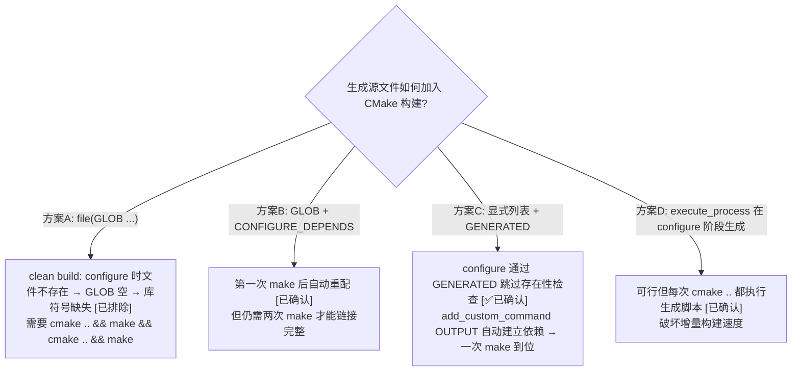

# CMake 生成源文件构建模式 — GLOB vs 显式列表 + GENERATED

> 类型：配置规则
> 置信度底线：本文档最低置信度为 ❓推测 的内容不可作为行动依据

## ❓ 问题背景
CMake 项目中有 `add_custom_command` 生成的 `.cpp` 文件需要加入 `add_library` 的源列表。clean build 时生成文件尚不存在，如何正确收集？

## 🔍 搜索过程
| 命令 / 动作 | 目标 | 结果摘要 |
|------------|------|---------|
| 实验：`file(GLOB ...)` + clean build + `nm -D` | 验证 GLOB 在生成文件场景的行为 | GLOB 在 configure 阶段执行，生成文件不存在 → 源列表为空 → 库符号缺失 |
| 实验：`file(GLOB ... CONFIGURE_DEPENDS ...)` | 测试 CMake 3.12+ 自动重配 | 第一次 make 后需第二次 make 才触发重配，非一步到位 |
| 实验：显式文件列表 + `GENERATED` 属性 | 测试标准解法 | configure 通过，一次 make 完成编译和链接 ✅ |

## 🌳 决策树


## 💡 分析结论

**推荐方案**：显式文件列表 + `set_source_files_properties(GENERATED TRUE)`

```cmake
# ❌ 坏：GLOB — clean build 需要两次 cmake .. && make
file(GLOB GEN_SOURCES ${GEN_DIR}/*.cpp)

# ✅ 好：显式列表 + GENERATED — 一次到位
set(GEN_SOURCES
    ${GEN_DIR}/file1.cpp
    ${GEN_DIR}/file2.cpp
)
set_source_files_properties(${GEN_SOURCES} PROPERTIES GENERATED TRUE)
add_library(mylib ${GEN_SOURCES})
```

**原理**：
1. `GENERATED` 属性告诉 CMake 源文件将由 `add_custom_command` 在 build 阶段生成，configure 时不检查存在性
2. `add_custom_command(OUTPUT ...)` 与 `add_library` 在同一目录时，CMake 自动将生成命令作为库的编译依赖
3. 一次 `make` 即可：先生成文件 → 再编译 → 再链接

**CONFIGURE_DEPENDS 的局限**（方案B）：Makefile generator 下，第一次 build 中文件生成后不会在同一次 make 调用中重配，需要第二次 make。Ninja generator 行为更好，但并非所有平台可用。

## 📍 关键代码位置
- `camera.qcom.so/CMakeLists.txt:176-192` — 当前项目的显式列表 + GENERATED 实现
- `camera.qcom.so/CMakeLists.txt:35-109` — `add_custom_command` 生成脚本（props.pl, settingsgenerator.pl, ParameterParser）
- `camera.qcom.so/CMakeLists.txt:211-222` — `add_library(camx_core OBJECT ...)` 使用 CAMX_SENSOR_GEN_SOURCES

## ⚠️ 待验证事项
- 无。方案C已在项目 clean build 中验证通过。

## 📝 备注
- 之前因方案A导致 `libcamera_qcom.so` 缺 `ImageSensorModuleSetManager` 符号，dlopen 失败，测试无法运行
- 显式列表需与 `add_custom_command` 的 OUTPUT 精确匹配。本项目由高通 `ParameterParser` 二进制生成，16 个文件固定不变
