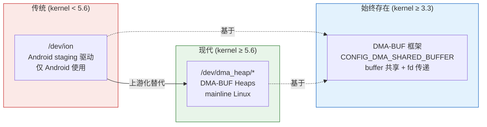
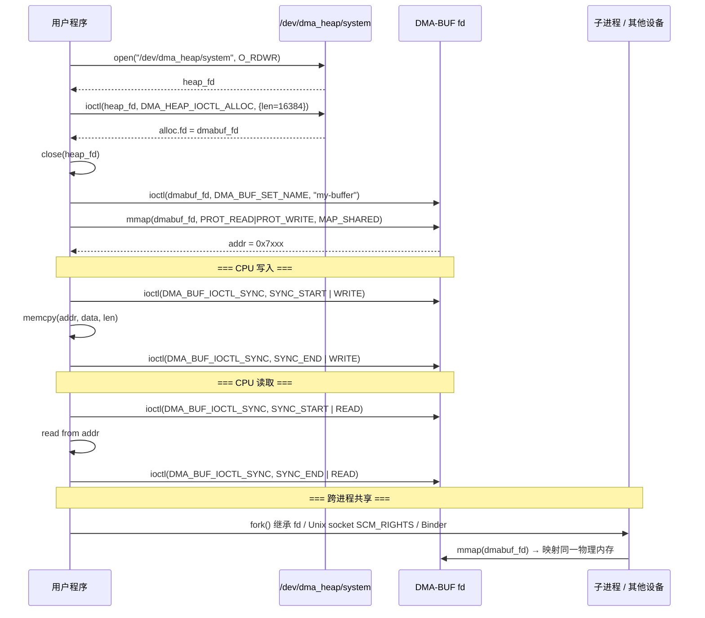
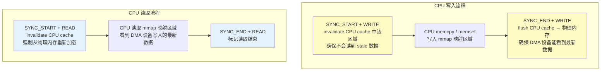
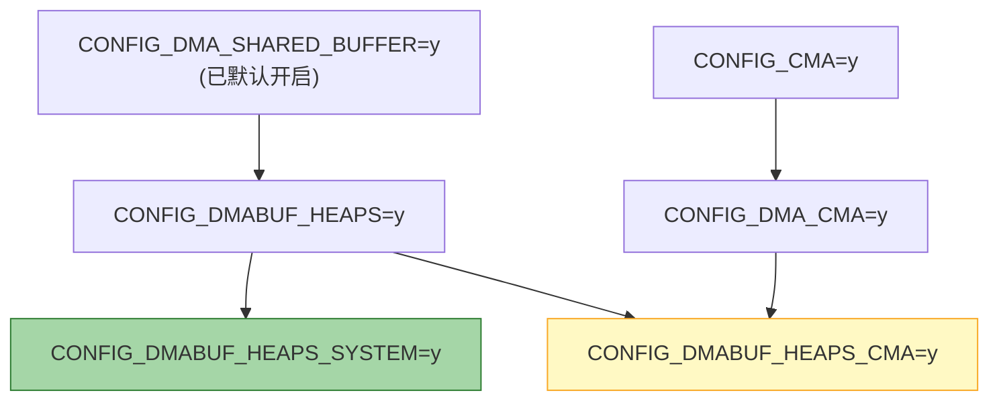
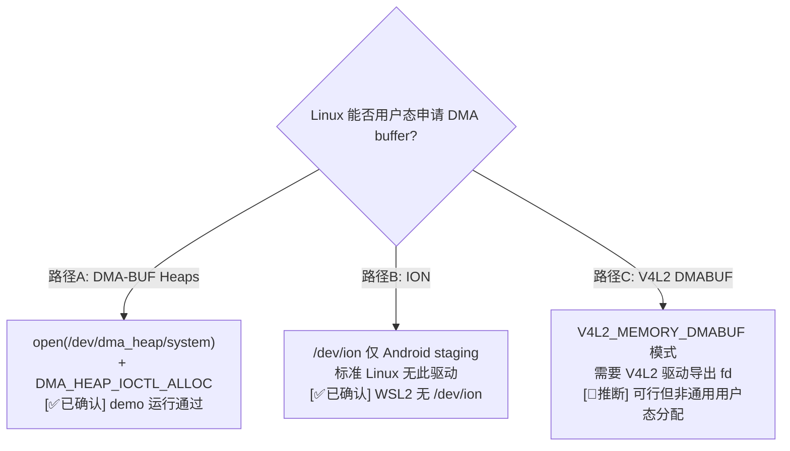

# DMA-BUF Heaps — Linux 用户态 DMA Buffer 分配 (Android/Linux 通用)

> 类型：源码分析
> 置信度底线：本文档最低置信度为 🧠推断 的内容不可作为行动依据

## 问题背景
Android 下可以通过 ION / DMA-BUF Heaps 申请 DMA buffer，Linux 下是否也可以？答案是可以——DMA-BUF Heaps 是 Linux 内核原生特性 (kernel 5.6+)，Android 和标准 Linux 共用同一套代码。

---

## 一、DMA Buffer 分配方案演进



| | Android ION (已废弃) | DMA-BUF Heaps (现行) |
|--|---------------------|---------------------|
| 设备节点 | `/dev/ion` | `/dev/dma_heap/system`, `/dev/dma_heap/linux,cma` |
| 内核版本 | 3.x ~ 5.x staging | ≥ 5.6 mainline |
| 分配 ioctl | `ION_IOC_ALLOC` | `DMA_HEAP_IOCTL_ALLOC` |
| 返回 | dmabuf fd | dmabuf fd |
| Android 使用 | 是 | 是 (≥ Android 12) |
| 标准 Linux 使用 | 否 | **是** |
| 内核 CONFIG | `CONFIG_ION` | `CONFIG_DMABUF_HEAPS` |

---

## 二、Heap 类型

| Heap | 设备节点 | 物理特性 | 内核 CONFIG | 典型用途 |
|------|---------|---------|------------|---------|
| System | `/dev/dma_heap/system` | 物理不连续，依赖 IOMMU 做连续映射 | `CONFIG_DMABUF_HEAPS_SYSTEM` | GPU、视频编解码、通用 DMA |
| CMA | `/dev/dma_heap/linux,cma` | 物理连续 (Contiguous Memory Allocator) | `CONFIG_DMABUF_HEAPS_CMA` + `CONFIG_DMA_CMA` + `CONFIG_CMA` | 无 IOMMU 的 DMA 设备、ISP、display controller |

---

## 三、用户态 API 全景



### 关键数据结构

```c
// <linux/dma-heap.h>
struct dma_heap_allocation_data {
    __u64 len;        // [in]  请求分配大小
    __u32 fd;         // [out] 返回的 DMA-BUF fd
    __u32 fd_flags;   // [in]  O_CLOEXEC | O_RDWR
    __u64 heap_flags; // [in]  当前必须为 0
};
#define DMA_HEAP_IOCTL_ALLOC  _IOWR('H', 0x0, struct dma_heap_allocation_data)

// <linux/dma-buf.h>
struct dma_buf_sync {
    __u64 flags;      // DMA_BUF_SYNC_{START|END} | DMA_BUF_SYNC_{READ|WRITE|RW}
};
#define DMA_BUF_IOCTL_SYNC   _IOW('b', 0, struct dma_buf_sync)
#define DMA_BUF_SET_NAME      _IOW('b', 1, const char *)
```

### DMA_BUF_IOCTL_SYNC 的作用



**为什么需要 sync？** CPU cache 和 DMA 设备看到的物理内存可能不一致。sync bracket 告诉内核在合适时机做 cache invalidate/flush，保证一致性。在纯 CPU 场景 (如 WSL2 无硬件 DMA) 下 sync 是 no-op，但代码仍应正确使用以保证可移植性。

---

## 四、/proc/self/fdinfo 解读

```
pos:    0
flags:  02000002          ← O_CLOEXEC | O_RDWR
mnt_id: 12
ino:    1
size:   16384             ← 分配大小
count:  1                 ← 引用计数 (mmap 后仍为 1, fork 后子进程 mmap 也不增加)
exp_name: system          ← 导出者 = system heap
name:   my-demo-buffer    ← DMA_BUF_SET_NAME 设置的 debug name
```

---

## 五、完整 Demo 代码

```c
#include <stdio.h>
#include <stdlib.h>
#include <string.h>
#include <fcntl.h>
#include <unistd.h>
#include <errno.h>
#include <sys/ioctl.h>
#include <sys/mman.h>
#include <sys/wait.h>
#include <linux/dma-heap.h>
#include <linux/dma-buf.h>

#define BUF_SIZE (4096 * 4)
#define HEAP_PATH "/dev/dma_heap/system"

static int xioctl(int fd, unsigned long request, void *arg)
{
    int r;
    do {
        r = ioctl(fd, request, arg);
    } while (r == -1 && errno == EINTR);
    return r;
}

static void dmabuf_sync(int dmabuf_fd, int start, int rw)
{
    struct dma_buf_sync sync = {0};
    sync.flags = rw;
    sync.flags |= start ? DMA_BUF_SYNC_START : DMA_BUF_SYNC_END;

    if (xioctl(dmabuf_fd, DMA_BUF_IOCTL_SYNC, &sync) < 0) {
        perror("DMA_BUF_IOCTL_SYNC");
        exit(1);
    }
}

static void show_dmabuf_fdinfo(int dmabuf_fd)
{
    char path[64];
    char buf[4096];
    snprintf(path, sizeof(path), "/proc/self/fdinfo/%d", dmabuf_fd);
    int fd = open(path, O_RDONLY);
    if (fd < 0)
        return;
    ssize_t n = read(fd, buf, sizeof(buf) - 1);
    close(fd);
    if (n > 0) {
        buf[n] = '\0';
        printf("=== fdinfo (dmabuf_fd=%d) ===\n%s", dmabuf_fd, buf);
        printf("============================\n");
    }
}

int main(void)
{
    int heap_fd, dmabuf_fd;
    void *map;

    /* 1. 打开 DMA-BUF Heap */
    heap_fd = open(HEAP_PATH, O_RDWR);
    if (heap_fd < 0) {
        perror("open " HEAP_PATH);
        return 1;
    }
    printf("[1] heap 打开成功: %s (fd=%d)\n", HEAP_PATH, heap_fd);

    /* 2. 分配 DMA Buffer */
    struct dma_heap_allocation_data alloc = {
        .len      = BUF_SIZE,
        .fd_flags = O_CLOEXEC | O_RDWR,
    };
    if (xioctl(heap_fd, DMA_HEAP_IOCTL_ALLOC, &alloc) < 0) {
        perror("DMA_HEAP_IOCTL_ALLOC");
        close(heap_fd);
        return 1;
    }
    dmabuf_fd = alloc.fd;
    printf("[2] DMA buffer 分配成功: size=%llu, dmabuf_fd=%d\n",
           (unsigned long long)alloc.len, dmabuf_fd);
    close(heap_fd);

    /* 3. 设置 debug name */
    if (xioctl(dmabuf_fd, DMA_BUF_SET_NAME, "my-demo-buffer") < 0)
        perror("DMA_BUF_SET_NAME (non-fatal)");
    else
        printf("[3] 设置 debug name: my-demo-buffer\n");
    show_dmabuf_fdinfo(dmabuf_fd);

    /* 4. mmap */
    map = mmap(NULL, BUF_SIZE, PROT_READ | PROT_WRITE, MAP_SHARED, dmabuf_fd, 0);
    if (map == MAP_FAILED) {
        perror("mmap");
        close(dmabuf_fd);
        return 1;
    }
    printf("[4] mmap 成功: addr=%p, size=%d\n", map, BUF_SIZE);

    /* 5. CPU 写入 + sync bracket */
    printf("[5] 写入数据...\n");
    dmabuf_sync(dmabuf_fd, 1, DMA_BUF_SYNC_WRITE);
    const char *msg = "Hello from DMA-BUF heap!";
    memset(map, 0, BUF_SIZE);
    memcpy(map, msg, strlen(msg) + 1);
    unsigned char *pixels = (unsigned char *)map + 256;
    for (int i = 0; i < 1024; i++)
        pixels[i] = (unsigned char)(i & 0xFF);
    dmabuf_sync(dmabuf_fd, 0, DMA_BUF_SYNC_WRITE);

    /* 6. CPU 读回验证 */
    printf("[6] 读回验证...\n");
    dmabuf_sync(dmabuf_fd, 1, DMA_BUF_SYNC_READ);
    printf("    读回字符串: \"%s\"\n", (char *)map);
    int ok = 1;
    for (int i = 0; i < 1024; i++) {
        if (pixels[i] != (unsigned char)(i & 0xFF)) {
            ok = 0;
            break;
        }
    }
    printf("    pattern 校验: %s\n", ok ? "通过" : "失败");
    dmabuf_sync(dmabuf_fd, 0, DMA_BUF_SYNC_READ);

    /* 7. fork 跨进程共享 */
    printf("[7] fork 跨进程共享...\n");
    int fl = fcntl(dmabuf_fd, F_GETFD);
    fcntl(dmabuf_fd, F_SETFD, fl & ~FD_CLOEXEC);
    pid_t pid = fork();
    if (pid == 0) {
        void *child_map = mmap(NULL, BUF_SIZE, PROT_READ, MAP_SHARED, dmabuf_fd, 0);
        dmabuf_sync(dmabuf_fd, 1, DMA_BUF_SYNC_READ);
        printf("    [child] 读到: \"%s\"\n", (char *)child_map);
        dmabuf_sync(dmabuf_fd, 0, DMA_BUF_SYNC_READ);
        munmap(child_map, BUF_SIZE);
        close(dmabuf_fd);
        _exit(0);
    } else {
        waitpid(pid, NULL, 0);
    }

    /* 8. 清理 */
    munmap(map, BUF_SIZE);
    close(dmabuf_fd);
    printf("[8] 清理完成\n");
    return 0;
}
```

### 编译运行

```bash
gcc -Wall -Wextra -O2 -o dma_heap_demo dma_heap_demo.c
sudo ./dma_heap_demo
```

### 验证输出

```
[1] heap 打开成功: /dev/dma_heap/system (fd=3)
[2] DMA buffer 分配成功: size=16384, dmabuf_fd=4
[3] 设置 debug name: my-demo-buffer
=== fdinfo (dmabuf_fd=4) ===
pos:    0
flags:  02000002
mnt_id: 12
ino:    1
size:   16384
count:  1
exp_name:       system
name:   my-demo-buffer
============================
[4] mmap 成功: addr=0x74a1967b1000, size=16384
[5] 写入数据...
[6] 读回验证...
    读回字符串: "Hello from DMA-BUF heap!"
    pattern 校验: 通过
[7] fork 跨进程共享...
    [child] 读到: "Hello from DMA-BUF heap!"
[8] 清理完成
```

---

## 六、WSL2 内核开启 DMA-BUF Heaps

### 前提

内核源码已克隆，且已编译过一次。

### 步骤

```bash
# 1. 编辑 .config
#    找到 DMABUF options 区段，修改:
#    CONFIG_DMABUF_HEAPS=y            (原为 # CONFIG_DMABUF_HEAPS is not set)
#    在其后新增:
#    CONFIG_DMABUF_HEAPS_SYSTEM=y

# 2. 解析依赖
make olddefconfig

# 3. 增量编译 (只重编 dma-heap.o + system_heap.o)
make -j$(nproc) bzImage

# 4. 部署
sudo cp arch/x86/boot/bzImage /mnt/c/Users/<username>/bzImage

# 5. Windows PowerShell:
#    wsl --shutdown
#    (重新打开 WSL)

# 6. 验证
ls /dev/dma_heap/
# → system
```

### Kconfig 依赖链



**最小配置**只需左侧绿色路径：`DMA_SHARED_BUFFER → DMABUF_HEAPS → DMABUF_HEAPS_SYSTEM`。
CMA heap 需要额外开启 CMA 子系统，WSL2 环境无硬件 DMA 设备，不需要。

---

## 决策树



## 关键代码位置
- `drivers/dma-buf/dma-heap.c` — DMA-BUF Heaps 框架核心，创建 `/dev/dma_heap/` 字符设备
- `drivers/dma-buf/heaps/system_heap.c` — system heap 实现，从 buddy allocator 分配物理页
- `drivers/dma-buf/heaps/cma_heap.c` — CMA heap 实现，从 CMA 区域分配连续物理内存
- `include/linux/dma-heap.h` (内核) — 内核侧 heap 注册接口
- `/usr/include/linux/dma-heap.h` (UAPI) — 用户态 `dma_heap_allocation_data` + `DMA_HEAP_IOCTL_ALLOC`
- `/usr/include/linux/dma-buf.h` (UAPI) — 用户态 `dma_buf_sync` + `DMA_BUF_IOCTL_SYNC` + `DMA_BUF_SET_NAME`

## 待验证事项
- [🧠推断] V4L2 DMABUF 模式 (`V4L2_MEMORY_DMABUF`) 可将 DMA-BUF heap 分配的 fd 直接传给 V4L2 驱动，未实际测试
- [🧠推断] CMA heap 在 WSL2 上开启 CMA 后是否正常工作，未测试

## 备注
- 测试环境: WSL2 + kernel 6.18.26.3-microsoft-standard-WSL2+
- 所有结论基于实际 demo 编译运行验证
- demo 代码位于 `~/code/dma/dma_heap_demo.c`
- DMA-BUF Heaps 是 Android ION 的上游替代，kernel 5.6 合入 mainline，Android 12+ 已迁移
