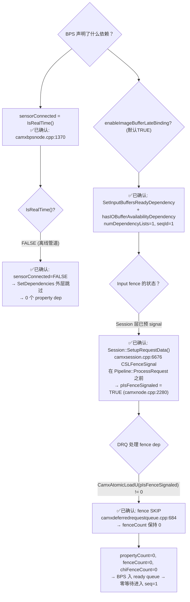

# BPS Node 依赖满足机制 — Session 预 signal + DRQ fence skip → 零等待

> 类型：源码分析
> 置信度底线：本文档最低置信度为 ✅已确认

## ❓ 问题背景

调查 TestBayerToYUV 离线测试中，BPS node 声明的 DRQ 依赖如何被满足。发现：**input CSL fence 在 Session 层被预先 signal，DRQ 的 `pIsFenceSignaled` 检查使其被跳过 → fenceCount=0 → 零等待。**

## 🔍 搜索过程

| 命令 / 动作 | 目标 | 结果摘要 |
|------------|------|---------|
| `read camxbpsnode.cpp:3430-3539` | SetDependencies 完整代码 | sensorConnected 条件决定全部 property dep |
| `read camxsettings.xml:4688-4705` | enableImageBufferLateBinding | TRUE（默认） |
| `read camxdeferredrequestqueue.cpp:680-688` | fence dep 时检查 pIsFenceSignaled | 已 signal → skip |
| `read camxsession.cpp:6646-6677` | SetupRequestData | CSLFenceSignal 发生于 Pipeline 之前 |
| `read camxnode.cpp:2280` | SetupRequestInputPorts | pIsFenceSignaled = TRUE |
| `read camxsession.cpp:3811-3834` | Session::ProcessRequest fence create | CSLCreatePrivateFence (unsignaled) |

## 🌳 决策树



## 💡 分析结论

### 完整调用链

```
Session::ProcessCaptureRequest()
  └── Session::ProcessRequest()                           [camxsession.cpp:3598]
        │
        ├── CSLCreatePrivateFence("InputBufferFence_...") [line 3821]  ← 创建 unsignaled fence
        │
        ├── SetupRequestData(&rRequest, ...)               [line 3961]
        │     └── for each input buffer:
        │           CSLFenceSignal(hInternalCSLFence, ...) [line 6676] ★ 在此 signal
        │
        └── Pipeline::ProcessRequest(...)                  [line 3968]
              │                                          ← 此时 fence 已 signal
              ├── Node::SetupRequestInputPorts
              │     └── pInputPort->pIsFenceSignaled = TRUE               [camxnode.cpp:2280]
              │
              └── DRQ dispatch BPS seq=0
                    ├── BPS::ExecuteProcessRequest(seq=0)
                    │     └── SetDependencies:
                    │           sensorConnected=FALSE → 0 property dep
                    │           SetInputBuffersReadyDependency → fence dep (指针指向 &TRUE)
                    │           numDependencyLists=1
                    │
                    ├── DRQ::AddDeferredNode(BPS, &dependencyInfo[0])
                    │     └── CamxAtomicLoadU(pIsFenceSignaled) == 1      [drq.cpp:684]
                    │     └── fence SKIP → fenceCount=0
                    │     └── propertyCount=0, chiFenceCount=0
                    │     └── BPS 入 ready queue（非 deferred）
                    │
                    └── DispatchReadyNodes → BPS seq=1
                          └── bindIOBuffers=TRUE → BindInputOutputBuffers
                          └── ExecuteProcessRequest(seq=1) → 实际处理
```

### DRQ fence skip 机制

`camxdeferredrequestqueue.cpp:680-688`:

```cpp
if (TRUE == pDependencyUnit->dependencyFlags.hasInputBuffersReadyDependency)
{
    for (UINT i = 0; i < pDependencyUnit->bufferDependency.fenceCount; i++)
    {
        if (0 == CamxAtomicLoadU(pDependencyUnit->bufferDependency.pIsFenceSignaled[i]))
        {
            // 只有 unsignaled 的 fence 才加入依赖列表
            pDependency->phFences[pDependency->fenceCount++] = ...;
        }
        // pre-signaled fence → SKIP，fenceCount 不增加
    }
}
```

### 三步归结

| 步骤 | 位置 | 操作 | 效果 |
|------|------|------|------|
| 1. 预 signal | `camxsession.cpp:6676` | `CSLFenceSignal(...)` | Session 层标记 fence 完成 |
| 2. 记录标志 | `camxnode.cpp:2280` | `pIsFenceSignaled = TRUE` | Node 层记录 pointer flag |
| 3. DRQ skip | `camxdeferredrequestqueue.cpp:684` | `AtomicLoadU(pIsFenceSignaled) == 1` | fence 不被加入依赖列表 |

三步联合 → `fenceCount = 0`，与 `propertyCount = 0`（离线管道 `sensorConnected = FALSE`）组合 → BPS 入 ready queue → **零等待**。

### 对比：实时管道

```
sensorConnected=TRUE → SetDependencies:
  PropertyIDSensorCurrentMode
  + PropertyIDPostSensorGainId
  + PropertyIDAECFrameControl
  + PropertyIDAWBFrameControl
  + ... (共 ~11 个)
  + SetInputBuffersReadyDependency
  + hasIOBufferAvailabilityDependency

依赖由上游 node (Sensor/AEC/AWB/IFE) 的 WriteDataList
→ Pool → DRQ::OnPropertyUpdate → UpdateDependency 逐步满足
```

## 📍 关键代码位置

| 文件 | 行号 | 内容 |
|------|------|------|
| `camxsession.cpp` | 3821 | `CSLCreatePrivateFence("InputBufferFence_...")` — 创建 input fence |
| `camxsession.cpp` | 6676 | **`CSLFenceSignal(hInternalCSLFence, ...)`** — ★ 预 signal |
| `camxsession.cpp` | 3961 | `SetupRequestData(...)` 调用点 |
| `camxsession.cpp` | 3968 | `Pipeline::ProcessRequest(...)` — 此时 fence 已 signal |
| `camxnode.cpp` | 2280 | `pInputPort->pIsFenceSignaled[reqId] = TRUE` |
| `camxbpsnode.cpp` | 1370-1373 | `sensorConnected = IsRealTime()` |
| `camxbpsnode.cpp` | 3440 | property dep 外层 gate |
| `camxbpsnode.cpp` | 3516 | `enableImageBufferLateBinding` — fence dep gate |
| `camxdeferredrequestqueue.cpp` | 680-688 | **`pIsFenceSignaled` 原子检查** — pre-signaled → skip |
| `camxdeferredrequestqueue.cpp` | 412-424 | `AddDependencyEntry` — 零 dep → ready queue |

## 📝 备注

- 调查日期：2026-06-29
- TestBayerToYUV 是单管道（ZSLSnapshotYUVHAL = BPS+IPE），无预览管道、无 Sensor node
- 相关条目：`drq-dependency-mechanism`、`drq-bps-ipe-dependency-registration`
