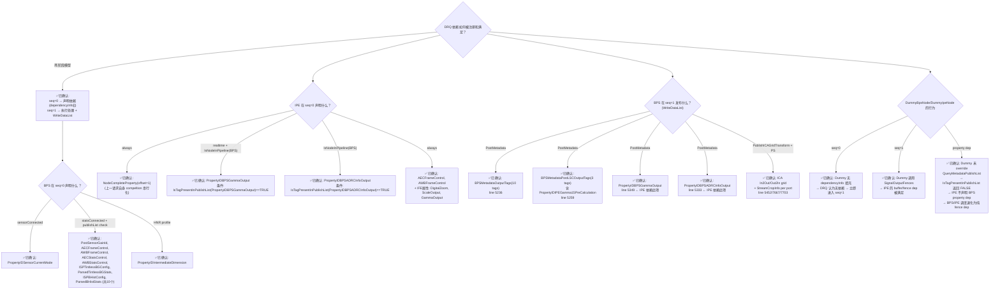

# DRQ 依赖注册完整链路 — BPS/IPE 在 TestBayerToYUV 中的实际行为

> 类型：源码分析
> 置信度底线：本文档最低置信度为 ✅已确认

## ❓ 问题背景

调查 TestBayerToYUV 中真实 BPS node 和 IPE node 如何向 DRQ 注册依赖、如何发布数据，以及当前 DummyBpsNode/DummyIpeNode 的依赖行为差异。

## 🔍 搜索过程

| 命令 / 动作 | 目标 | 结果摘要 |
|------------|------|---------|
| `read camxdeferredrequestqueue.h/cpp` | DRQ API + 依赖注册流程 | 四个 observer 回调 + 两阶段 seq=0/1 模型 |
| `read camxbpsnode.cpp:SetDependencies` (L3430-3539) | BPS 声明什么依赖 | sensorCurrentMode + 11 个 stats 属性 |
| `read camxbpsnode.cpp:PostMetadata` (L5083-5478) | BPS 发布什么数据 | 6 次 WriteDataList + PS publishes |
| `read camxipenode.cpp:SetDependencies` (L8689-8882) | IPE 声明什么依赖 | PropertyIDBPSGammaOutput + PropertyIDBPSADRCInfoOutput（gate: IsTagPresentInPublishList） |
| `read g_camxZSLSnapshotYUVHAL.xml` | 拓扑定义 | BPS(65539) + IPE(65538) 端口直连 |
| `read chifeature2bayer2yuvdescriptor.cpp` | Feature2 描述符 | pipelineId=0 → ZSLSnapshotYUVHAL |

## 🌳 决策树



## 💡 分析结论

### 1. DRQ 两阶段执行模型 [✅已确认]

每个 Node 的 `ExecuteProcessRequest` 被 DRQ 在**两个 processSequenceId** 各调用一次：

```
Pipeline::ProcessRequest
    → DRQ::AddDeferredNode(requestId, node, NULL)   // 初始无依赖，立即 dispatch
    → Node::ProcessRequest()
        → ExecuteProcessRequest(seq=0)                // 节点声明依赖
            → 填充 dependencyInfo[]
    → DRQ worker 读取 dependencyInfo[]
        → GetUnpublishedList()                       // 检查 pool 中是否已有
        → 已有 → 立即 dispatch seq=1
        → 暂无 → 入 m_deferredNodes 等待
    → 当上游 node 调用 WriteDataList → Pool → DRQ::OnPropertyUpdate
        → UpdateDependency → 满足后 dispatch
    → ExecuteProcessRequest(seq=1)                    // 真实处理
        → WriteDataList → 发布输供下游
```

### 2. IsTagPresentInPublishList Gate 机制 [✅已确认]

IPE 声明 `PropertyIDBPSGammaOutput` 依赖的条件（`camxipenode.cpp:8780`）：

```cpp
if (TRUE == IsTagPresentInPublishList(PropertyIDBPSGammaOutput))
{
    pNodeRequestData->dependencyInfo[0].propertyDependency.properties[rCount++] =
        PropertyIDBPSGammaOutput;
}
```

- `IsTagPresentInPublishList()` 遍历 pipeline 中**所有 Node 的 QueryMetadataPublishList() 注册表**
- 如果 BPS(node) 的 `QueryMetadataPublishList` 返回了 `PropertyIDBPSGammaOutput`，则返回 TRUE
- 如果返回 FALSE（如 DummyBpsNode 未 override），则 IPE **不声明**该 property 依赖
- 类似 gate 也用于 `PropertyIDBPSADRCInfoOutput`

### 3. Dummy 与真实 Node 的依赖差异

| 维度 | 真实 BPS/IPE | DummyBpsNode/DummyIpeNode |
|------|-------------|--------------------------|
| **seq=0 依赖声明** | BPS: sensor/stats properties<br/>IPE: BPSGamma + BPSADRC + ... | 无 → DRQ 认为无依赖 |
| **seq=1 数据发布** | WriteDataList × 6+ | SignalOutputFences only |
| **QueryMetadataPublishList** | BPS: 注册 10+ 个 tags<br/>IPE: 注册 14 个 tags | 未 override → 空列表 |
| **IPE 对 BPS 的 property 依赖** | 有 (IsTagPresentInPublishList=TRUE) | 无 (IsTagPresentInPublishList=FALSE) |
| **IPE 对 BPS 的 fence 依赖** | 有 (Input Buffers Ready) | 有 (SignalOutputFences 满足) |

### 4. 当前 Dummy 调度退化为纯 Fence 链 [✅已确认]

因为 `IsTagPresentInPublishList` gate 阻止了 IPE 声明 property 依赖：

```
BPS: seq=0(无依赖) → seq=1(SignalOutputFences)
                                ↓ (CSL fence callback)
                               DRQ::FenceSignaledCallback
                                ↓
IPE: seq=0(无依赖) → seq=1(处理)
```

BPS/IPE 之间仅通过 CSL fence 传递调度，没有 property 依赖。这足以让测试通过，因为：
- Buffer linkage（端口映射）在 XML topology 中由 BPS→IPE 连线定义
- Fence signaling/callback 驱动了节点间的拓扑顺序
- 无 property 数据不影响 pass（测试不检查 IQ 质量）

## 📍 关键代码位置

| 文件 | 行号 | 内容 |
|------|------|------|
| `camxbpsnode.cpp` | 1331-1392 | `ExecuteProcessRequest` 入口 + seq=0/1 分发 |
| `camxbpsnode.cpp` | 3430-3539 | `SetDependencies` — BPS 依赖声明 |
| `camxbpsnode.cpp` | 5083-5478 | `PostMetadata` — BPS 数据发布 |
| `camxbpsnode.cpp` | 5236 | `WriteDataList(BPSMetadataOutputTags, ...)` |
| `camxbpsnode.cpp` | 5259 | `WriteDataList(BPSMetadataPostLSCOutputTags, ...)` |
| `camxbpsnode.cpp` | 5349 | `WriteDataList(PropertyIDBPSGammaOutput, ...)` ← IPE 依赖 |
| `camxbpsnode.cpp` | 5333 | `WriteDataList(PropertyIDBPSADRCInfoOutput, ...)` ← IPE 依赖 |
| `camxbpsnode.cpp` | 7014-7088 | `QueryMetadataPublishList` — BPS 注册可发布的 tags |
| `camxipenode.cpp` | 6024-6046 | seq=0/1 分发逻辑 |
| `camxipenode.cpp` | 8689-8882 | `SetDependencies` — IPE 依赖声明 |
| `camxipenode.cpp` | 8780-8782 | `IsTagPresentInPublishList(PropertyIDBPSGammaOutput)` gate |
| `camxipenode.cpp` | 9759-9762 | `IsNodeInPipeline(BPS) && IsTagPresentInPublishList(PropertyIDBPSADRCInfoOutput)` gate |
| `camxipenode.cpp` | 8300-8469 | `PostMetadata` — IPE 数据发布 |
| `camxbpsnode.h` | 84-96 | `BPSMetadataOutputTags[]` (10 个标准 camera metadata tags) |
| `camxbpsnode.h` | 99-107 | `BPSMetadataPostLSCOutputTags[]` (3 个, 含 IPEGamma15PreCalculation) |
| `camxdeferredrequestqueue.cpp` | 309-322 | DRQ worker 读取 `dependencyInfo[]` 并 re-queue |
| `camxdeferredrequestqueue.cpp` | 1125-1169 | `GetUnpublishedList()` — 检查 pool 是否已有 |
| `g_camxZSLSnapshotYUVHAL.xml` | - | BPS(65539)→IPE(65538) 端口连线 |

## ⚠️ 待验证事项

- [❓推测] 如果 future test 需要 property 依赖（例如要验证 IQ 数据），DummyNode 需要 override `QueryMetadataPublishList` 并调用 `WriteDataList`
- [❓推测] 内存序：seq=0 入 m_deferredNodes 后，DRQ 的 `DispatchReadyNodes` 是否保证 BPS seq=1 先于 IPE seq=1 执行？（当前测试中两者被 dispatch 到不同 thread，但 fence callback 提供了串行化保证）
- [❓推测] `IsTagPresentInPublishList` 是 Pipeline 级方法，遍历的是所有 Node 的注册表还是仅当前 pipeline 的 nodes？

## 📝 备注

- 调查日期：2026-06-29
- 环境：CamX SAIPAN LA.UM.8.13.R1, x86 CMake port
- 相关条目：`drq-dependency-mechanism`（四种依赖类型通识）、`dummynode-vs-camxnode-architecture`（DummyNode 架构对比）
