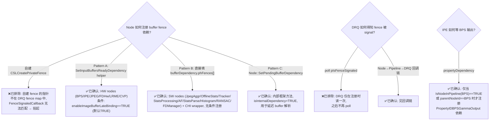

# DRQ 依赖机制与 DummyNode 依赖演示

> 类型：源码分析
> 置信度底线：本文档最低置信度为 ✅已确认

## ❓ 问题背景

在 TestBayerToYUV 中为 DummyNode 添加最简依赖链：BPS 依赖 fence → 发布 property → IPE 等待 property，以演示 DRQ 核心调度机制。

## 🌳 决策树



## 💡 分析结论

### 四种 DRQ 依赖类型

| 类型 | DependencyFlags 标志 | 注册方式 | DRQ 通知机制 |
|------|---------------------|---------|-------------|
| **CSL Buffer Fence** | `hasInputBuffersReadyDependency` | `bufferDependency.phFences[]`（Pattern A helper 或 Pattern B 直接填充） | Node::CSLFenceCallback → Pipeline → DRQ::FenceSignaledCallback |
| **Property** | `hasPropertyDependency` | `propertyDependency.properties[]` | WriteDataList → MetadataSlot::PublishMetadata → DRQ::OnPropertyUpdate |
| **IO Buffer** | `hasIOBufferAvailabilityDependency` | 直接设 flag | DRQ 内部管理（`bindIOBuffers`，内存分配完成时） |
| **CHI Fence** | `hasFenceDependency` | `chiFenceDependency.pChiFences[]` + callback/userData | DRQ 存 pChiFences，通过 pChiFenceCallback 通知 |

### Buffer Fence 注册的三种模式 [✅已确认]

**Pattern A: `SetInputBuffersReadyDependency` helper**（camxnode.cpp:8858）
- 调用者：BPS, IPE, FDHw, JPEG enc, LRME, CVP（所有 HW nodes）
- 条件：`enableImageBufferLateBinding == TRUE`（默认 TRUE，camxsettings.xml:4694）
- 行为：遍历输入端口，填 `bufferDependency.phFences[]` + 设 `hasInputBuffersReadyDependency = TRUE`
- 额外：去重 composite fence（同一 fence handle 的多个输入端口）

**Pattern B: 直接填充 `bufferDependency`**
- 调用者：JpegAggr(917), OfflineStats(385), Tracker(444), StatsProcessing(308), AutoFocus(987), StatsParse(229), HistogramProcess(323), RANSAC(209), FDManager(3306), CHI wrapper(2419/2663)
- 无条件（不检查 late binding）
- 行为：手动遍历输入端口，填相同字段 + 设 `hasInputBuffersReadyDependency = TRUE`
- JPEG enc 两种都用：late binding 时 Pattern A（SetDependencies:1638），packet 构建时 Pattern B（EPR:771）

**Pattern C: `Node::SetPendingBufferDependency`**（camxnode.cpp:8056）
- 内部框架方法，用于延迟/pending buffer 解析
- 额外设 `isInternalDependency = TRUE` + `processSequenceId = ResolveDeferredInputBuffers`
- 自动 `numDependencyLists++`

**共同本质**：三种模式都使用**输入端口 fence**（`pPort->phFence`），这些 fence 实际是上游节点的**输出 fence**，由 `SetupRequestOutputPortFence` 创建时已注册 `CSLFenceAsyncWait(fence, Node::CSLFenceCallback)`。自建的 `CSLCreatePrivateFence` 不在此回调链中。

### Fence 回调链 [✅已确认]

```
Node::SetupRequestOutputPortFence (camxnode.cpp:6300)
  └→ CSLCreatePrivateFence → 创建 fence
  └→ CSLFenceAsyncWait(fence, Node::CSLFenceCallback) → 注册回调

CSLFenceSignal(fence) (由 DummyNode EPR 调用)
  └→ MockCSLFenceSignal → 调所有 asyncWaiters
    └→ Node::CSLFenceCallback (camxnode.cpp:4377)
      └→ Node::ProcessFenceCallback
        └→ Pipeline::NonSinkPortFenceSignaled (camxpipeline.h:706)
          └→ DRQ::FenceSignaledCallback (camxdeferredrequestqueue.cpp:1189)
            └→ UpdateDependency(phFence) → 从 map 移除
            └→ DispatchReadyNodes() → 派发就绪节点
```

关键：此回调链仅为 Node 基类通过 `SetupRequestOutputPortFence` 创建的 fence 建立。自建的 `CSLCreatePrivateFence` 不会自动注册此链路。

### Property 通知链 [✅已确认]

```
Node::WriteDataList (camxnode.cpp:4025)
  └→ Node::WriteData → MetadataSlot::SetMetadataByTag + PublishMetadata
    └→ MetadataPool subscriber notification
      └→ DRQ::OnPropertyUpdate
        └→ UpdateDependency(propertyID) → 从 map 移除
  └→ m_pDRQ->DispatchReadyNodes()
```

`WriteDataList` 不检查 publish list，任何 Node 都可以写任意 PropertyID。

### DummyNode 当前实现（ChiFence 自依赖演示）

> 详细 ChiFence 机制分析见 KB 条目 `chifence-dependency-flow`
> EIS 真实用例分析见 KB 条目 `eis-chifence-usage`

模仿 EIS 的自依赖模式（节点自己创建 fence、自己依赖、外部异步服务 signal）：

```cpp
// BPS (Type 65539) seq=0:
ChiFence* pFence = CAMX_CALLOC(sizeof(ChiFence));   // 堆分配（与 EIS pCreateFence 等价）
CSLCreatePrivateFence("ChiFenceDemo", &pFence->hFence);
dep.hasFenceDependency = 1;
dep.chiFenceDependency.pChiFences[0] = pFence;       // 自依赖：自己创建，自己等待
dep.processSequenceId = 1;
AsyncServiceCallback(pFence);                         // 模拟 NCS：独立线程 1ms 后 signal+release
// → DRQ 延迟 BPS

// BPS seq=1 (ChiFence 满足后):
// 信号 output fences

// 其他节点 (IPE/JPEG/...)：直接信号 output fences
```

运行时序（TestBayerToYUV）：
```
BPS seq=0     → 创建 ChiFence(hFence=7), 注册自依赖, 异步请求
async thread  → 1ms 后 signal + release ChiFence      (+1.2ms, 独立线程)
BPS seq=1     → DRQ 派发, 信号 output fences
IPE seq=0     → 直接信号 output fences
→ Complete
```

ChiFence 仅在有 BPS 的 pipeline 中激活（TestBayerToYUV / TestMultiStage / TestBPS）。

## 📍 关键代码位置

- `camxnode.h:109-151` — DependencyUnit 结构定义（四种依赖类型的 flags + 各自数据结构）
- `camxnode.h:237-245` — NodeProcessRequestData（numDependencyLists, processSequenceId）
- `camxnode.h:4230` — SetInputBuffersReadyDependency（protected，DummyNode 可调）
- `camxnode.cpp:8858` — SetInputBuffersReadyDependency 实现（Pattern A：遍历输入端口 fence + 去重 composite）
- `camxnode.cpp:8056` — SetPendingBufferDependency 实现（Pattern C：延迟 buffer + isInternalDependency）
- `camxnode.cpp:4025` — WriteDataList 实现（不检查 publish list）
- `camxnode.cpp:6300` — SetupRequestOutputPortFence（CSLCreatePrivateFence + CSLFenceAsyncWait 注册回调）
- `camxnode.cpp:4377` — Node::CSLFenceCallback（fence signal 入口）
- `camxdeferredrequestqueue.cpp:675-706` — DRQ AddDependency：检查 hasPropertyDependency(675) → hasInputBuffersReadyDependency(680) → hasFenceDependency(691) → hasIOBufferAvailabilityDependency(705)
- `camxdeferredrequestqueue.cpp:1029` — DispatchReadyNodes（消费 m_readyNodes 队列）
- `camxdeferredrequestqueue.cpp:1189` — FenceSignaledCallback（UpdateDependency + DispatchReadyNodes）
- `camxhwdefs.h:38-47` — HW node type 定义（BPS=65539, IPE=65538）
- `g_camxproperties.h:81` — PropertyIDBPSGammaOutput = PropertyIDPerFrameResultBegin + 0x33
- `camxbpsnode.cpp:3516-3531` — 真实 BPS: `if(enableImageBufferLateBinding)` → `SetInputBuffersReadyDependency`
- `camxipenode.cpp:8688-8882` — 真实 IPE SetDependencies: 15+ property 依赖 + 条件 fence dep
- `camxipenode.cpp:8778` — IPE 检查 `IsNodeInPipeline(BPS)` 后才注册 PropertyIDBPSGammaOutput
- `camxjpegaggrnode.cpp:905-927` — Pattern B 典型: 直接填 bufferDependency + hasInputBuffersReadyDependency
- `camxsettings.xml:4688-4696` — enableImageBufferLateBinding 定义（默认 TRUE）
- `csl_mock.cpp:402` — MockCSLFenceAsyncWait（处理 already-signaled 情况）
- `dummy_node.cpp` — DummyNode DRQ 依赖演示实现

## ⚠️ 待验证事项

- [🧠推断] `hasIOBufferAvailabilityDependency` 在当前测试中可能立即满足（buffer 预分配），未确认延迟场景
- [🧠推断] TestMultiStage 中第二个 stage 的 IPE 因在独立 pipeline（无 BPS）而跳过 ChiFence，但未深入验证跨 stage 的 CSL fence 传递是否正确
- [✅已完成] DummyNode IPE 分支已实现 `IsNodeInPipeline(BPS)` 保护（2026-06-22，ChiFence 演示）

## 📝 备注

- `m_pDRQ` 和 `m_pPipeline` 均为 Node 的 private 成员（camxnode.h:5757-5758），DummyNode 不能直接访问
- DRQ 对 CSL buffer fence 不使用 CSLFenceAsyncWait（仅对 ChiFence 使用），而是存 phFences 指针到依赖 map，等 FenceSignaledCallback 回调来移除
- CamX 全部 node 类型：8 HW (IFE/JPEG/IPE/BPS/FDHw/LRME/RANSAC/CVP) + 8+ SW (Stats/AF/AWB/EIS/Sensor/FD/...) + 15+ CHI OEM nodes
- 测试需要 `build/testdata/` 目录（Bayer2Yuv_image_4656x3496_0.raw 等 dummy 文件），否则 InitializeBufferManagers 失败
- CMakeLists.txt 已添加 `CMAKE_EXPORT_COMPILE_COMMANDS ON`，compile_commands.json symlink 到项目根

---

## 修正（2026-06-21）

**触发**：用户指出文档 fence 依赖注册描述需验证，重新阅读原始源码

**修正内容**：
1. ~~仅 `SetInputBuffersReadyDependency` 一种 fence 注册方式~~ → 实际有 3 种模式（Pattern A/B/C）
2. ~~三种 DRQ 依赖类型~~ → **四种**（补充 `hasFenceDependency` CHI fence 类型，DRQ:691-699）
3. ~~HW nodes 无条件调用 `SetInputBuffersReadyDependency`~~ → 仅当 `enableImageBufferLateBinding==TRUE` 时（默认 TRUE）
4. ~~IPE 无条件注册 BPSGammaOutput 依赖~~ → 真实 IPE 用 `IsNodeInPipeline(BPS)` 保护（camxipenode.cpp:8778/8821）
5. 补充 `Node::SetPendingBufferDependency`（Pattern C，内部框架用）
6. 补充 SW nodes 的直接 `bufferDependency` 填充模式（Pattern B，无条件）
