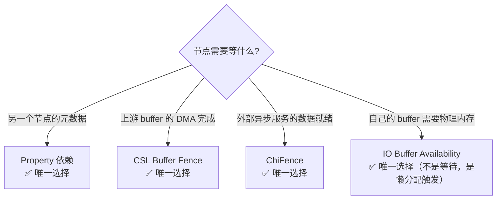

# DRQ 四种依赖类型设计原理 — 不可替代性与组合使用

> 类型：源码分析
> 置信度底线：本文档所有内容为 ✅已确认

## ❓ 问题背景

DRQ 有四种依赖类型：Property、CSL Buffer Fence、ChiFence、IO Buffer Availability。每种为什么存在？能否互相替代？

## 🌳 决策树



## 💡 四种机制全景对比 [✅已确认]

| 维度 | Property | CSL Buffer Fence | ChiFence | IO Buffer Availability |
|------|----------|-----------------|----------|----------------------|
| **等什么** | 元数据就绪 | Buffer DMA 写入完成 | 外部异步数据就绪 | 不等待（懒分配触发） |
| **信号者** | 任意 Node（WriteDataList） | 内核 DMA 驱动 | 外部服务（NCS 等） | 框架自身 |
| **机制** | MetadataPool pub/sub | 内核 fence fd | CSL fence via CHI API | Boolean flag |
| **DRQ 追踪** | hashmap(PropertyID) → publishedCount | hashmap(phFence) → signaledCount | hashmap(pChiFence) → chiSignaledCount | 不追踪，存为 bindIOBuffers |
| **满足条件** | publishedCount == propertyCount | signaledCount == fenceCount | chiSignaledCount == chiFenceCount | 其他依赖全部满足时自动满足 |
| **典型用户** | IFE(3A设置)、Sensor(AEC/AF)、IPE(BPS输出) | BPS/IPE/JPEG(输入buffer) | EISv2/v3(陀螺仪数据) | 所有 HW 节点(late binding) |

## 💡 Property 依赖 [✅已确认]

### 通知链

```
Node::WriteDataList(propertyIds[], data[], sizes[], count)
  → Node::WriteData → MetadataSlot::SetMetadataByTag + PublishMetadata
    → MetadataPool::NotifyImmediate
      → IPropertyPoolObserver::OnPropertyUpdate（DRQ 注册为订阅者）
        → DRQ::UpdateDependency(propertyId, ...) → publishedCount++
  → m_pDRQ->DispatchReadyNodes()（批量发布后统一派发）
```

### 关键约束

- **写端无 ACL**：任意 Node（或持有 Node* 的代码）可发布任意 PropertyID。Actuator、Flash、Stats 处理器等非 Node 类通过 `m_pParentNode->WriteDataList()` 发布
- **读端有检查**：`IsTagPresentInPublishList()` 在设依赖时检查该 PropertyID 是否有 Node 会发布（编译期/初始化期注册）
- **不可跨进程**：MetadataPool 是进程内数据结构，内核驱动和外部服务无法触发 PublishMetadata

### 为什么 CSL Fence / ChiFence 不能用 Property 替代

Property 的信号源是 `MetadataSlot::PublishMetadata`，只能从进程内的 Node 代码调用。内核 DMA 驱动完成 buffer 写入时无法调用 `PublishMetadata`；NCS 陀螺仪服务也无法调用。

## 💡 CSL Buffer Fence [✅已确认]

### 本质

内核级同步原语（file descriptor），由 `CSLCreatePrivateFence` 在 `Node::SetupRequestOutputPortFence` 中创建（`camxnode.cpp:6300`）。fence 引用计数 = 1(本节点) + N(下游连接端口数)。

`hasInputBuffersReadyDependency` 的含义：等上游节点的 output buffer DMA 写入完成。节点的输入端口连接到上游节点的输出端口。上游输出端口有一个 CSL fence，当硬件 DMA 把数据写完后内核信号这个 fence。设此 flag 就是告诉 DRQ："我的所有输入 buffer 的 fence 都信号了再派发我"。

### 存储结构：per-output-port × per-request [✅已确认]

不是"一个输出端口一个 fence"，是**一个输出端口 × 一帧 = 一个 CSL fence**：

```
OutputPort
├── pFenceHandlerData[0].hFence   ← request 0 的 fence
├── pFenceHandlerData[1].hFence   ← request 1 的 fence
├── ...
└── pFenceHandlerData[N].hFence   ← request N 的 fence
                                     ring buffer, 大小 = maxRequestQueueDepth
```

每帧 `SetupRequestOutputPortFence` 为该端口创建一个新 CSL fence。

### 上游→下游连接 [✅已确认]

```
上游 BPS 输出端口                      下游 IPE 输入端口
┌──────────────┐                      ┌───────────────┐
│ outputFence  │─── CSL fence ───────→│ phFences[0]   │
│(DMA 完成信号)│                      │ (等待此 fence)│
└──────────────┘                      └───────────────┘
```

框架在连接端口时把上游输出端口的 fence handle 写入下游输入端口的 `phFences[reqIdx]`。下游注册依赖时，写入该 fence 的**指针地址**：

```cpp
dep.bufferDependency.phFences[count] = &pInputPort->phFences[requestIdIndex];
//                                     ↑ CSLFence* 指针
```

DRQ 用此**指针值**做 hashmap key。上游 fence signal 后，回调链传入**同一指针**匹配 hashmap → `signaledCount++`。

### 三种 buffer 相关 flag 的区别 [✅已确认]

| Flag | 等什么 | 信号者 |
|------|--------|--------|
| `hasInputBuffersReadyDependency` | 输入 buffer 的**数据**就绪 | 内核 DMA 驱动 |
| `hasIOBufferAvailabilityDependency` | 自己 buffer 的**物理内存**分配 | 框架（late binding） |
| `hasFenceDependency` | 外部服务的**异步结果**就绪 | 外部服务（NCS 等） |

### 生命周期

```
SetupRequestOutputPortFence
  → CSLCreatePrivateFence("NodeOutputPortFence_BPS_Port0")
  → CSLFenceAsyncWait(hFence, Node::CSLFenceCallback)
  → [硬件 DMA 完成]
  → 内核信号 fence
  → Node::CSLFenceCallback → ProcessFenceCallback
  → Pipeline::NonSinkPortFenceSignaled
  → DRQ::FenceSignaledCallback → signaledCount++
```

### 注册机制：flag 与 fence 列表是两个独立职责 [✅已确认]

`hasInputBuffersReadyDependency = TRUE` 声明"我有输入 buffer fence 依赖"，`bufferDependency.phFences[]` 指定具体等哪些 fence。**DRQ 不会自动查询输入端口**，只从 Node 预填的列表中取：

```cpp
// Node 侧（二选一）：
// Pattern A: helper 自动遍历输入端口
SetInputBuffersReadyDependency(pExecData, depIndex);
// Pattern B: 手动填
dep.bufferDependency.phFences[0] = pInputPort->phFences[reqIdx];
dep.bufferDependency.fenceCount  = 1;
// 两者都需设 flag
dep.dependencyFlags.hasInputBuffersReadyDependency = TRUE;

// DRQ 侧（camxdeferredrequestqueue.cpp:680-689）：
// 只从 Node 填好的 bufferDependency.phFences[] 中拷贝未信号的 fence
// 若 Node 设了 flag 但 fenceCount=0，等于无 fence 依赖
```

### 为什么不能用 Property 替代

| 维度 | CSL Fence | Property |
|------|-----------|----------|
| 信号源 | 内核 DMA 驱动（硬件事件） | 进程内 Node 代码 |
| 粒度 | per-buffer per-port | per-PropertyID per-request |
| 等待机制 | epoll/poll 内核阻塞 | MetadataPool 订阅回调 |

DMA 完成是硬件事件，Property 无法捕获。即使设计一个"BufferReady"PropertyID，谁来发布？只有内核驱动知道 DMA 何时完成，但内核驱动不能调用 MetadataPool。

## 💡 ChiFence [✅已确认]

### 本质

CHI 层 fence，内部包裹一个 CSL fence。创建者和依赖者是同一个 Node（自依赖），信号者是外部异步服务。

### 为什么不能用 Property 替代

NCS 陀螺仪服务不是 CamX Node，没有 `Node*` 指针，无法调用 `WriteDataList`。即使有，NCS 运行在独立线程，写入 MetadataPool 需要跨线程同步，且 NCS 不知道 requestId/pipelineId 等 CamX 概念。

ChiFence 的 CSL fence 内核原语天然支持跨线程/跨服务信号（fd-based），NCS 只需调 `m_signalChiFence(handle)` 即可。

### 为什么不能用 CSL Buffer Fence 替代

CSL Buffer Fence 绑定到 Node 的**输出端口**（SetupRequestOutputPortFence），由框架自动创建和管理。节点不能自己创建任意 CSL fence 然后注册到 DRQ 的 buffer fence 路径——DRQ 只追踪输入端口 fence（`pInputPort->phFences[]`），不接受任意 fence。

ChiFence 提供了一个独立的注册路径（`chiFenceDependency.pChiFences[]`），允许节点自由创建 fence 并交给外部服务信号。

## 💡 IO Buffer Availability [✅已确认]

### 本质

**不是等待机制，是懒分配触发器。** 当 `enableImageBufferLateBinding=TRUE`（默认）时，`ImageBufferManager::GetImageBuffer()` 返回无物理内存的 ImageBuffer 对象。节点设 `hasIOBufferAvailabilityDependency=TRUE` 告诉框架："派发我时请先分配物理内存"。

### DRQ 处理

```
AddDeferredNode: pDependency->bindIOBuffers = hasIOBufferAvailabilityDependency  (line 705)
  ↓ 不进 hashmap，不作为等待条件
当其他依赖（property/fence）全部满足 → 节点移入 readyNodes
  ↓
DeferredWorkerCore: processRequest.bindIOBuffers = pDependency->bindIOBuffers  (line 283)
  ↓
Node::ProcessRequest: if (bindIOBuffers) BindInputOutputBuffers()  (line 1778)
  → ImageBuffer::BindBuffer() → Allocate() → 分配 GPU 内存
```

### 注释原文的关键警告

> "Nodes have to carefully set this flag when it *really* needs buffers, setting this early even if buffers are not needed on this dependency unit, will cause unnecessary memory consumption." — camxnode.h:119-125

### 为什么独立存在

如果没有这个 flag，late binding 模式下节点会拿到无内存的 ImageBuffer，DMA 操作会失败。如果不用 late binding，所有 buffer 在 GetImageBuffer 时就分配，浪费内存（特别是多路/多分辨率场景）。

## 💡 组合使用模式 [✅已确认]

真实节点通常组合多种依赖：

```cpp
// IFE: Property + IO Buffer
dep.hasPropertyDependency = TRUE;                    // 等 3A 设置（AEC/AWB/AF 共 12+ properties）
dep.hasIOBufferAvailabilityDependency = TRUE;         // 同时请求 buffer 分配
dep.processSequenceId = 1;

// BPS: CSL Fence + IO Buffer
SetInputBuffersReadyDependency(pExecData, 0);         // 等上游 buffer DMA 完成
dep.hasIOBufferAvailabilityDependency = TRUE;          // 同时请求 buffer 分配
dep.processSequenceId = 1;

// EISv2: Property（seq=0）+ ChiFence（seq=1）+ 最终执行（seq=2）
// seq=0: 等 QTimer、ExposureTime 等元数据
// seq=1: 创建 ChiFence，请求 NCS 陀螺仪数据
// seq=2: 数据就绪，执行 EIS 算法
```

DRQ 对同一 DependencyUnit 内的多种依赖做**与操作**：`propertyCount==publishedCount && fenceCount==signaledCount && chiFenceCount==chiSignaledCount` 全部满足才派发（`camxdeferredrequestqueue.cpp:1851-1853`）。

## 📍 关键代码位置

### Property
- `camxnode.h:99-106` — PropertyDependency 结构定义
- `camxnode.cpp:4025-4047` — WriteDataList 实现（无发布者身份检查）
- `camxnode.cpp:3871-3991` — WriteData 内部分发（按 group 选 pool）
- `camxmetadatapool.cpp:1304-1339` — PublishMetadata → NotifyImmediate
- `camxdeferredrequestqueue.cpp:675-677` — GetUnpublishedList 过滤已发布属性
- `camxdeferredrequestqueue.cpp:1213-1220` — OnPropertyUpdate → UpdateDependency

### CSL Buffer Fence
- `camxnode.cpp:6238-6473` — SetupRequestOutputPortFence（创建 fence + AsyncWait）
- `camxnode.cpp:4377-4524` — CSLFenceCallback → ProcessFenceCallback
- `camxpipeline.cpp:2804` — NonSinkPortFenceSignaled → DRQ
- `camxdeferredrequestqueue.cpp:680-689` — AddDeferredNode 中拷贝未信号 fence
- `camxdeferredrequestqueue.cpp:1189-1196` — FenceSignaledCallback

### ChiFence
- 见 KB 条目 `chifence-dependency-flow` 和 `eis-chifence-usage`

### IO Buffer Availability
- `camxnode.h:119-125` — hasIOBufferAvailabilityDependency 注释（含"unnecessary memory consumption"警告）
- `camxdeferredrequestqueue.cpp:705` — 存为 bindIOBuffers（不进 hashmap）
- `camxdeferredrequestqueue.cpp:283` — DeferredWorkerCore 传递 bindIOBuffers
- `camxnode.cpp:1778-1793` — ProcessRequest 调 BindInputOutputBuffers
- `camxsettings.xml:4691-4694` — enableImageBufferLateBinding 默认 TRUE

### DRQ 满足条件检查
- `camxdeferredrequestqueue.cpp:1851-1853` — 三个 count 全等才派发

## ⚠️ 待验证事项

无。

## 📝 备注

- Property 可带 offset（偏移 N 帧），支持跨帧依赖（如依赖上一帧的 NodeComplete）
- CSL fence 的引用计数 = 1(自身) + N(下游端口) + bypass 端口，精确管理 fence 生命周期
- IO Buffer Availability 的注释强调"仅在真正需要 buffer 时才设"——过早设置会导致 GPU 内存在管线空闲时仍被占用
- 四种依赖在同一 DependencyUnit 内做与操作，但多个 DependencyUnit（多个 `numDependencyLists`）之间是**顺序执行**（seq=0 满足→seq=1→…）
