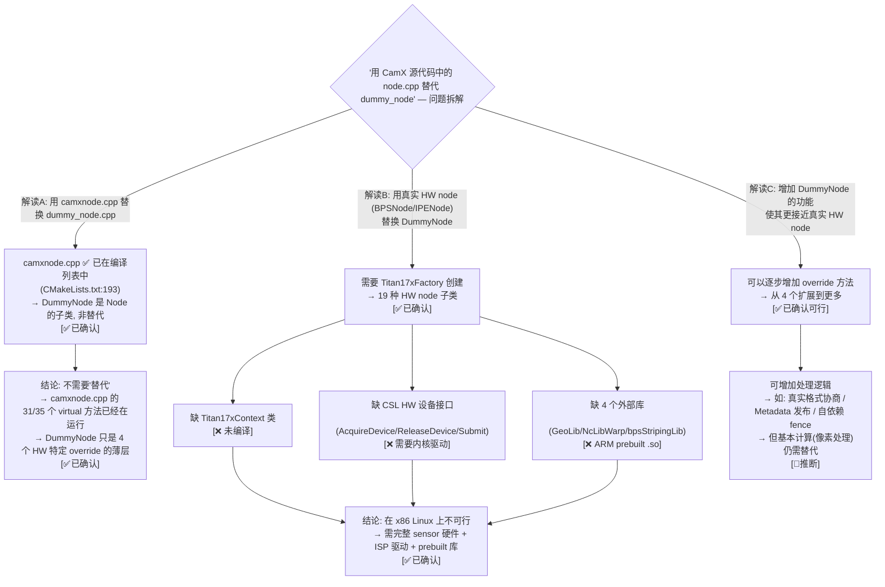

# DummyNode vs CamX Node 架构评估 — 用 camxnode.cpp 替代 dummy_node 的可行性

> 类型：源码分析 / 设计决策
> 置信度底线：全部 ✅已确认（完整阅读 Node.h 5840行 + camxnode.cpp 11704行 + dummy_node.cpp 236行 + BPSNode.h 1922行 + Titan17xFactory + CMakeLists 编译列表）

## 问题背景

当前 `Feature2OfflineTest.TestBayerToYUV` 使用 `DummyNode` 作为 BPS/IPE/JPEG 节点的替代实现。评估是否可以使用 CamX 源代码中真正的 `camxnode.cpp` + 真实的 HW node 类来替代 `dummy_node.cpp`。

## 搜索过程

| 命令 / 动作 | 目标 | 结果摘要 |
|------------|------|---------|
| grep KB index.json | 查找已有 Node/dummy_node 条目 | 命中 13 条（drq-dependency, chifence, phase3-audit 等） |
| read dummy_node.cpp (236 lines) | DummyNode 完整实现 | 5 个方法 override |
| read camxnode.cpp (11704 lines) | 真实 Node 类实现 | 35 个 virtual 方法 + 完整 buffer/fence/metadata 管理 |
| read camxhwfactory.h | HwFactory 抽象接口 | 2 个纯虚方法 |
| read camxtitan17xfactory.cpp | Titan17xFactory 实现 | 19 种 HW node 的子类创建 |
| read BPSNode.h (1922 lines) | BPSNode 完整方法列表 | 70+ 个方法，4 个外部库依赖 |
| read BPSNode.cpp (7943 lines) ExecuteProcessRequest | BPS 执行流程 | 传感器/3A/tuning/GeoLib/bandwidth 全路径 |
| read camera.qcom.so/CMakeLists.txt:128-200 | 编译源列表 | 已编译 camx_patched_srcs/camxnode.cpp |
| count HWL sources in CMakeLists | HWL 文件编译情况 | 0 个 HWL .cpp 编译（仅 generated settings + include path） |

## 决策树



## 核心发现

### 发现 1: camxnode.cpp 已经在用，DummyNode 不是替代品

```
当前 build 中的架构:

  CMakeLists.txt:193  →  camx_patched_srcs/camxnode.cpp   ← 11,704行的真实 Node 基类 ✅ 已编译
  CMakeLists.txt:…    →  camera.qcom.so/dummy_node.cpp     ← 236行的 DummyNode + DummyHwFactory ✅ 已编译
  
  dummy_node.cpp:15   →  class DummyNode final : public Node  ← DummyNode 继承自 Node!
```

**DummyNode 不是 camxnode.cpp 的替代品，而是其子类**。它只 override 了 4 个 HW 特定的 virtual 方法：

| # | 方法 | Node 默认实现 | DummyNode 实现 |
|---|------|-------------|---------------|
| 1 | `ProcessingNodeInitialize` | 返回成功（空） | 设置 maxInputPorts/maxOutputPorts=16 |
| 2 | `ExecuteProcessRequest` | **纯虚** (=0) | 信号输出 fence → 返回成功 |
| 3 | `ProcessingNodeFinalizeInputRequirement` | 返回成功（空） | 聚合子端口 buffer 需求 |
| 4 | `FinalizeBufferProperties` | 空（什么都不做） | 从输入端复制 width/height 到输出端 |

**Node 基类有 35 个 virtual 方法，DummyNode 只改了 4 个。剩余的 31 个全部走真实 camxnode.cpp 实现。**

### 发现 2: 真实 Node 基类提供的完整功能（11,704行代码）

以下功能全部来自 camxnode.cpp，当前离线测试中已验证运行：

| 功能模块 | 关键方法 | 代码量 |
|---------|---------|--------|
| Buffer 管理 | `CreateImageBufferManager`, `BindInputOutputBuffers`, buffer negotiation | ~2000行 |
| Fence 管理 | CSLFence 创建/异步等待/信号/释放, FenceHandler 回调, ChiFence | ~1500行 |
| Metadata 处理 | `WriteData`, `WriteDataList`, PS metadata 队列, publish list, notify | ~2500行 |
| DRQ 依赖 | `SetPendingBufferDependency`, `DispatchReadyNodes`, property/fence 触发 | ~1000行 |
| Pipeline 集成 | ChiStreamWrapper, ChiStream, PortLink, 格式协商 | ~1500行 |
| 线程安全 | 5 个 Mutex (EPR/Buffer/Fence/Cmd/Release) | ~500行 |
| Vendor Tag | `CacheVendorTagLocation`, 14+ vendor tag 查询 | ~300行 |
| 初始化 | `Node::Initialize` (530行), 端口分配, 设备保护, watermark | ~1000行 |
| 销毁 | `Node::Destroy` (310行), fence 释放, buffer 释放, 内存回收 | ~400行 |

**在 TestBayerToYUV 执行路径中，这些功能全部被实际调用。**

### 发现 3: 真实 HW Node (BPSNode) 的需求差距

BPSNode (7943行) 的需求 vs 当前环境：

| 依赖 | BPSNode 需要 | 当前状态 | 缺口 |
|------|-------------|---------|------|
| **Titan17xContext** | `static_cast<Titan17xContext*>(GetHwContext())` → Titan17xSettingsManager, Titan17xStaticSettings | `camxtitan17xcontext.cpp` 未编译 | **不可用** |
| **CSL 设备操作** | `AcquireDevice()`, `ReleaseDevice()`, `CSLStreamOn`, `CSLSubmit` | CSL mock 无 HW 设备 | **不可用** |
| **命令缓冲区** | `CmdBufferManager`, `CreateFWCommandBufferManagers`, CDM 编程 | CmdBuffer 系统存在但无 HW 后端 | **不可用** |
| **外部库** | `GeoLib.h` (LDC/warp), `NcLibWarp.h` (ICA grid), `bpsStripingLib.h` (图像分条) | ARM prebuilt .so，x86 不可用 | **不可用** |
| **传感器数据** | `GetSensorModeData()`, `SensorPDAFInfo`, sensor 模式信息 | CSL mock 无真实 sensor | **不可用** |
| **Tuning 数据** | `TuningDataManager`, `BPSTuningMetadata`, `PreTuningDataManager` | Tuning 框架存在但无数据 | **不可用** |
| **ISP IQ 模块** | 40+ 个方法配置 ISP 子模块 (GIC/HNR/LSC/GTM/gamma/demosaic...) | IQ 接口存在但无 Titan17x 实现 | **不可用** |
| **带宽/时钟** | `CalculateBPSRdBandwidth`, `CalculateBPSWrBandwidth`, `UpdateClock` | 无 ISP 硬件参数 | **不可用** |

### 发现 4: CMake 编译现状

```
camx/src/core/*.cpp   → 24 个文件已编译 (包括 camxnode.cpp, camxpipeline.cpp)
camx/src/hwl/*.cpp    → 0 个文件已编译!
camx/src/hwl/titan17x → 仅 include path 被引用, 仅 g_camxtitan17xsettings.cpp(自动生成) 编译
```

**当前项目编译了 CamX Core 层但完全没有编译 HWL 层**。这正是 DummyNode + DummyHwFactory 存在的根本原因 — 它们替代了整个 HWL 层。

### 发现 5: Node 类虚拟方法全景

```
Node 基类: 35 个 virtual 方法 (camxnode.h:5840)
  ├── public virtual:     4 个
  ├── protected virtual: 22 个 (含 1 个纯虚 ExecuteProcessRequest)
  └── private virtual:    9 个
  
DummyNode overrides:      4 个 (protected 2 + private 2)
BPSNode overrides:       11 个 (protected 6 + private 5)
  额外 BPSNode 独有:    70+ 个 private 方法 (HW 配置)
```

## 结论

### 简洁回答

**"用 camxnode.cpp 替代 dummy_node" 这个问题本身存在误解**:
- `camxnode.cpp` 已经在用，**不需要替代** — 它是 Node 基类，DummyNode 是它的子类
- `dummy_node.cpp` 替代的是 **整个 Titan17x HWL 层** (camxtitan17xfactory + 19 种 HW node 子类)，而非 camxnode.cpp

### 三种可行方案

| 方案 | 描述 | 工作量 | 价值 |
|------|------|--------|------|
| **A: 维持现状** | DummyNode 继续做 4 个 HW override | 0 | 5 个用例全 PASS，够用 |
| **B: 丰富 DummyNode** | 增加更多 override 实现 (如真实 metadata 发布、格式协商、Dependency 处理) | 中（~500行） | 加强对 CamX Node 协议的验证 |
| **C: Mock HW 层** | 编译 Titan17xFactory + BPSNode/IPENode 并 mock 其 CSL/设备/库依赖 | 非常高（数千行 mock + stub） | 可测试真实 Node 初始化/协商逻辑，但仍无法在 x86 上做像素处理 |

### 方案 B 的具体可扩展点

DummyNode 当前只 override 了 35 个 virtual 方法中的 4 个。以下方法可以在不引入 HW 依赖的前提下增强：

| 方法 | 当前状态 | 增强方向 |
|------|---------|---------|
| `QueryMetadataPublishList` | 继承默认（空列表） | 返回 BPS/IPE 常发布的 metadata tag 列表 |
| `PostPipelineCreate` | 继承默认（成功） | 验证 pipeline 拓扑连接正确性 |
| `GetOutputPortName` | 继承默认（null） | 返回 "BPS"/"IPE"/"JPEG" 名称 |
| `GetInputPortName` | 继承默认（null） | 返回 "RDI"/"IPEInput" 等名称 |
| `SetProducerFormatParameters` | 继承默认（NV12） | 根据 topology 设置正确的生产格式 |
| `SetConsumerFormatParameters` | 继承默认（NV12） | 支持 P010/YUV 等消费格式 |

## 关键代码位置

- `camera.qcom.so/CMakeLists.txt:193` — camx_patched_srcs/camxnode.cpp 在编译列表
- `camera.qcom.so/CMakeLists.txt:128-200` — 24 个 camx/src/core/*.cpp 编译列表
- `camera.qcom.so/dummy_node.cpp:15` — `class DummyNode final : public Node`
- `camera.qcom.so/dummy_node.cpp:204-229` — `DummyHwFactory` 类 → 替代 Titan17xFactory
- `../CAMX_SAIPAN.../camx/src/core/camxnode.h:731` — `class Node` 声明 (5840行)
- `../CAMX_SAIPAN.../camx/src/core/camxnode.h:3723` — `ExecuteProcessRequest` 唯一纯虚方法
- `../CAMX_SAIPAN.../camx/src/core/camxhwfactory.h:77` — `HwCreateNode` 纯虚 (HwFactory 接口)
- `../CAMX_SAIPAN.../camx/src/hwl/titan17x/camxtitan17xfactory.cpp:84-163` — Titan17xFactory 创建 19 种 HW node
- `../CAMX_SAIPAN.../camx/src/hwl/bps/camxbpsnode.cpp:204` — BPSNode 构造函数 (依赖 GetStaticSettings/OEM)
- `../CAMX_SAIPAN.../camx/src/hwl/bps/camxbpsnode.cpp:370` — BPSNode::ProcessingNodeInitialize (依赖 Titan17xContext)
- `../CAMX_SAIPAN.../camx/src/hwl/bps/camxbpsnode.cpp:1331` — BPSNode::ExecuteProcessRequest (依赖传感器/3A/tuning/GeoLib)
- `../CAMX_SAIPAN.../camx/src/hwl/bps/camxbpsnode.h:15-27` — BPSNode 外部库依赖 (GeoLib, NcLibWarp, bpsStripingLib)

## 备注

- Node 类的销毁路径 (Node::Destroy, 310行) 完全由真实 camxnode.cpp 处理，DummyNode 的 `~DummyNode() = default` 无需自己做任何清理
- CSL Fence 信号机制是 DummyNode::ExecuteProcessRequest 唯一需要做的事 — 下游节点等待 fence 信号才能被 DRQ 调度
- Gralloc 仅在 EGL heap 的 sink port 上被调用 — TestBayerToYUV 的离线 pipeline 不走此路径
- BPSNode.h 有 1922 行但在 HWL 目录下，HWL 层整体未编译（0 个 HWL .cpp）
- `camx/src/hwl/` 下有 200+ 个 .cpp/.h 文件但全部不在编译列表中

## 关联条目

- **`camxnode-patches-w2-w5-analysis`** — W2 (sensor caps) + W5 (buffer manager) 的根因分析与修复方案
- **`mpm-portability-risk-analysis`** — MemPoolMgr 完整移植风险调查（W4/W5 的 MPM 后端分析）
- **`phase3-workaround-inventory`** — 所有 workaround 的完整清单与清理状态
- **`nativechitest-crash-sensor-module`** — Sensor 模块缺失导致的崩溃链（与 W2 同一根因）
