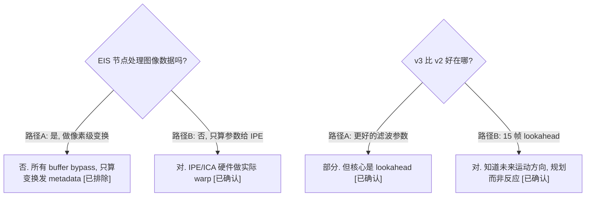

# EIS 电子防抖原理 — 陀螺仪数据流 + Margin/Warp 机制 + v2/v3 对比

> 类型：源码分析
> 置信度底线：本文档所有结论为 ✅已确认（基于四路并行源码阅读）

## ❓ 问题背景
系统调查 EIS（Electronic Image Stabilization）的工作原理，包括算法原理、陀螺仪数据链路、v2/v3 差异。

## 🔍 搜索过程
| 命令 / 动作 | 目标 | 结果摘要 |
|------------|------|---------|
| read camxchinodeeisv2.cpp 全文 | v2 实现 | 3 sequence, 0-frame lookahead, IS_TYPE_EIS_2_0 |
| read camxchinodeeisv3.cpp 全文 | v3 实现 | 5 sequence, 15-frame lookahead, IS_TYPE_EIS_3_0 |
| read camxchinodeeisv2.h + camxchinodeeisv3.h | 数据结构 | EISV3PerspectiveGridTransforms, 函数指针表 |
| read chiipedefs.h + chieisdefs.h | IPE ICA 接口 | IPEICAPerspectiveTransform, IPEICAGridTransform |
| read camxncsintfqsee.cpp | NCS 陀螺仪链路 | SSC protobuf → ring buffer → ChiFence async |

## 🌳 决策树


## 💡 分析结论

### 1. EIS 核心原理：Margin + Warp + Crop

EIS 不动传感器（那是 OIS），也不在 EIS 节点内处理像素。它的策略是：

1. **Margin（稳定余量）**：IFE 采集比最终输出更大的帧。多出的区域（默认 20%）是稳定余量
2. **Warp（变换计算）**：根据陀螺仪检测到的相机旋转，计算一个反向透视变换/网格
3. **Crop（硬件裁切）**：IPE/ICA 硬件读取 EIS 发布的变换参数，对大帧做 warp + crop → 稳定的输出帧

公式：`输入帧 = 输出帧 × (1 + margin)`。默认 20% margin → 输入比输出大 ~25%。

### 2. EIS 节点是纯计算节点

EIS 节点（ChiEISV2Node / ChiEISV3Node）**不继承 CamX Node**，是 CHI 自定义节点。

关键行为：
- **所有 buffer bypass**（camxchinodeeisv2.cpp:3263-3269）：`isBypassNeeded = TRUE`，图像数据直接传递
- **输入**：只读 metadata（帧时间、IFE crop 信息、陀螺仪数据）
- **输出**：只写 metadata（ICA 透视矩阵 + warp 网格 + 对齐矩阵）
- **不访问任何像素数据**

### 3. 陀螺仪数据链路

```
物理 IMU → Snapdragon Sensor Core (SSC) → protobuf 消息
  → SensorCallback (camxncsintfqsee.cpp:1835)
    → FillSensorData (camxncsintfqsee.cpp:2023)
      → 减去校准偏置 bias[x,y,z]
      → 写入环形缓冲区 NCSDataGyro{x,y,z,timestamp_QtTicks}
      → 缓冲区大小 = sizeof(NCSDataGyro) × 采样率 × 3秒

EIS 节点:
  sequence 1: SetGyroDependency()
    → GetGyroInterval: 根据 SOF/曝光/卷帘快门计算所需陀螺仪时间窗
    → 创建 ChiFenceTypeInternal
    → pGetData(ChiFetchData, tStart, tEnd, hChiFence) — 异步请求
    → NCS 数据就绪 → fence signal

  sequence 2: FillGyroData()
    → pGetData(ChiFetchData, tStart, tEnd) — 同步获取
    → 遍历采样: ChiIterateData(index 0..N-1)
    → 转换: Qtimer ticks → nano → micro
    → 填充 gyro_data_t{samples[i].data[x,y,z], samples[i].ts_micro}
    → 最多 512 采样/帧
```

### 4. 每帧处理流程

#### EISv2（3 个 sequence）

| Seq | 动作 | 关键代码 |
|-----|------|---------|
| 0 | 设 metadata 依赖（SOF/曝光/帧时长/FOVC）+ 顺序执行依赖 | camxchinodeeisv2.cpp:3157-3238 |
| 1 | 创建 ChiFence → 异步请求陀螺仪数据 | camxchinodeeisv2.cpp:3242-3256 |
| 2 | ExecuteAlgo → eis2_process → UpdateMetaData 直接发布 ICA 变换 | camxchinodeeisv2.cpp:3259-3326 |

#### EISv3（5 个 sequence）

| Seq | 动作 | 关键代码 |
|-----|------|---------|
| 0 | 设 metadata 依赖 + 录像状态管理 | camxchinodeeisv3.cpp:3637-3757 |
| 1 | 创建 ChiFence → 异步请求陀螺仪数据 + 设 IFE crop 依赖 | camxchinodeeisv3.cpp:3760-3776 |
| 2 | ExecuteAlgo → eis3_process → 缓存到 EISV3PerspectiveGridTransformTagId → **设前向依赖等第 N+15 帧** | camxchinodeeisv3.cpp:3780-3878 |
| 3 | 第 N+15 帧处理完 → 读取第 N+15 帧结果 → PublishICAMatrix 为第 N 帧发布 ICA 变换 | camxchinodeeisv3.cpp:3883-3911 |
| -1 | 停止录像：从环形缓冲区回放最后 N 帧的变换 | camxchinodeeisv3.cpp:3402-3633 |

v3 的核心差异在 sequence 2-3：先缓存结果（seq 2），等未来帧处理完再发布（seq 3）。

### 5. 算法接口

算法从闭源共享库加载（`com.qti.eisv2` / `com.qti.eisv3`）：

**初始化：**
```
eis2_initialize(handle, is_init_data_common, is_init_data_sensor[], num_sensors)
  is_init_data_common:
    is_type = IS_TYPE_EIS_2_0 / IS_TYPE_EIS_3_0
    deployment_type = DEP_TYPE_ICA_V20/V30/GPU_PRE
    output_frame_width/height, frame_fps
    buffer_delay = lookahead + 1 (v2=1, v3=16)
  is_init_data_sensor:
    ife_input_dimensions, mount_angle, camera_position
    chromatix data (margins, gyro频率, focal length, LDC grids)
```

**每帧处理：**
```
eis2_process(handle, is_input_t, is_output_type)
  输入 is_input_t:
    frame_id, active_sensor_idx
    gyro_data: {samples[512]{x,y,z,ts_micro}, num_elements}
    frame_times: {sof_micro, frame_time_micro, exposure_micro, rolling_shutter_skew_micro}
    window_regions: eis_utility_convert_to_window_regions 输出
    focus_distance, sat_transform(多摄)
  输出 is_output_type:
    has_output: bool
    stabilizationTransform.matrices: NcLibWarpMatrices (透视矩阵)
    stabilizationTransform.grid: NcLibWarpGrid (warp 网格)
    alignment_matrix_domain_stabilized: 陀螺仪对齐矩阵
```

### 6. 输出发布到 IPE

EIS 通过 per-stream metadata (pSetPSMetadata) 发布：

| 输出 | 数据结构 | Vendor Tag | 用途 |
|------|---------|-----------|------|
| 透视矩阵 | IPEICAPerspectiveTransform (3×3, 最多 9 组) | ICAInPerspectiveTransformTagId | IPE ICA 硬件编程 |
| Warp 网格 | IPEICAGridTransform (ICA10:33×25, ICA20:35×27, ICA30:67×51) | ICAInGridOut2InTransformTagId | IPE ICA 网格查表 |
| 对齐矩阵 | IPEICAPerspectiveTransform | ICAReferenceParamsTagId | 陀螺仪-图像对齐校正 |

当算法无输出时（前 buffer_delay 帧或禁用 EIS），发布单位矩阵和默认网格。

ICA 网格格式：每个点 (x,y) 对，描述从输出域到输入域的映射。IPE 硬件逐像素查表插值完成 warp。

### 7. EISv2 vs EISv3 完整对比

| 维度 | EISv2 | EISv3 |
|------|-------|-------|
| Lookahead | 0 帧 | 15 帧（默认） |
| 处理模型 | 即时算→即时发布 | 算完缓存→等未来帧→延迟发布 |
| 算法类型 | IS_TYPE_EIS_2_0 | IS_TYPE_EIS_3_0 |
| 共享库 | com.qti.eisv2 | com.qti.eisv3 |
| Processing sequences | 3 (0,1,2) | 5 (0,1,2,3,-1) |
| buffer_delay | 1 | 16 (lookahead+1) |
| 传感器融合 | 仅陀螺仪 | 支持 OIS/加速度计/磁力计/方向 |
| GPU 部署 | 无 | ChiICAMax → DEP_TYPE_GPU_PRE |
| 录像结束处理 | 无 | m_pEndOfStreamOutputArray 环形缓冲区 |
| 多摄 SAT | 无 | SAT 透视变换输入 |
| 中间存储 tag | 无 | EISV3PerspectiveGridTransformTagId |
| 对齐矩阵 | alignment_matrix_domain_undistorted | + alignment_matrix_domain_stabilized |
| 顺序执行 | 无 | sequentialExecutionNeeded = TRUE |

### 8. Margin 计算

```
GetTotalMargins() (camxchinodeeisv2.cpp:4057):
  1. 读 targetFPS vendor tag
  2. 读 preview/video stream dimensions (取较大者)
  3. 按分辨率+帧率查 chromatix margin 表:
     - FHD(≤1080): requested_total_margins_y_fhd_30/60/120
     - 4K(≤2160): requested_total_margins_y_4k_30/60/120
     - 8K: requested_total_margins_y_8k_30/60/120
  4. width_margin = min(minimal_total_margin, height_margin)
  5. 输入到输出转换: margin_out = 1/(1-margin_in) - 1
  默认: EISV2Margin = 0.2F (20%)
```

### 9. 时间戳域

| 层 | 时间域 | 精度 |
|----|--------|------|
| 传感器硬件 / NCS | Qtimer ticks | 19.2MHz (~52ns) |
| NCS 请求 tStart/tEnd | Qtimer ticks | 同上 |
| 帧 metadata (SOF, 曝光等) | 纳秒 | ns |
| EIS 算法输入 (frame_times, gyro ts) | 微秒 | μs |

转换函数：
- QtimerTicksToQtimerNano = ticks × 1e9 / 19200000
- QtimerNanoToQtimerTicks = nano × 19200000 / 1e9
- NanoToMicro = nano / 1000
- MicroToNano = micro × 1000

### 10. 帧-陀螺仪对齐

eis2_get_gyro_time_interval / eis3_get_gyro_time_interval 是闭源函数。

输入：frame_times_t {sof, frame_time, exposure_time, rolling_shutter_skew}（全部微秒）
输出：gyro_times_t {first_ts, last_ts}（微秒）

算法根据 SOF（帧开始）+ 曝光时间 + 卷帘快门偏移，确定哪些陀螺仪采样覆盖了帧的实际光积分时段。对于卷帘快门，不同行的曝光时间不同，算法可能请求比单次曝光更长的陀螺仪窗口。

## 📍 关键代码位置
- `camx/src/swl/eisv2/camxchinodeeisv2.cpp:3081-3329` — ProcessRequest (v2 3-sequence)
- `camx/src/swl/eisv3/camxchinodeeisv3.cpp:3322-3914` — ProcessRequest (v3 5-sequence)
- `camx/src/swl/eisv2/camxchinodeeisv2.cpp:2743-3052` — ExecuteAlgo (v2)
- `camx/src/swl/eisv3/camxchinodeeisv3.cpp:2947-3247` — ExecuteAlgo (v3)
- `camx/src/swl/eisv2/camxchinodeeisv2.cpp:2527-2626` — FillGyroData (v2)
- `camx/src/swl/eisv3/camxchinodeeisv3.cpp:2732-2830` — FillGyroData (v3)
- `camx/src/swl/eisv2/camxchinodeeisv2.cpp:1855-1984` — GetGyroInterval (v2)
- `camx/src/swl/eisv3/camxchinodeeisv3.cpp:2059-2186` — GetGyroInterval (v3)
- `camx/src/swl/eisv2/camxchinodeeisv2.cpp:1989-2046` — SetGyroDependency (v2)
- `camx/src/swl/eisv3/camxchinodeeisv3.cpp:2193-2249` — SetGyroDependency (v3)
- `camx/src/swl/eisv2/camxchinodeeisv2.cpp:3778-4028` — UpdateMetaData (v2)
- `camx/src/swl/eisv3/camxchinodeeisv3.cpp:4524-4657` — PublishICAMatrix (v3)
- `camx/src/swl/eisv2/camxchinodeeisv2.cpp:991-1244` — InitializeLib (v2)
- `camx/src/swl/eisv3/camxchinodeeisv3.cpp:1087-1355` — InitializeLib (v3)
- `camx/src/swl/eisv2/camxchinodeeisv2.cpp:824-964` — LoadLib (v2)
- `camx/src/csl/camxncsintfqsee.cpp:1835` — SensorCallback (NCS gyro)
- `camx/src/csl/camxncsintfqsee.cpp:2023` — FillSensorData (NCS ring buffer write)
- `chi-cdk/api/isp/chiipedefs.h:75` — IPEICAPerspectiveTransform
- `chi-cdk/api/isp/chiipedefs.h:205` — IPEICAGridTransform
- `chi-cdk/api/isp/chieisdefs.h:32` — StabilizationMargin

## ⚠️ 待验证事项
- [🧠推断] eis2_get_gyro_time_interval 的时间窗计算逻辑 — 闭源库，只能从输入输出推断
- [🧠推断] v3 的 lookahead 内部缓冲机制 — 只看到 buffer_delay=16 传入初始化，内部实现未知
- [🧠推断] ICA 硬件如何插值网格点 — 只知道输出 67×51 网格，IPE 内部插值方式未确认

## 📝 备注
- 算法核心是闭源共享库 (com.qti.eisv2 / com.qti.eisv3)，头文件 (eis2_interface.h) 不在源码树中
- EIS 节点是 CHI 自定义节点，不继承 CamX Node 基类
- 陀螺仪采样率默认 416Hz（从 chromatix 读取，无则用默认值）
- NCS 环形缓冲区保存 3 秒数据，足以覆盖 lookahead 帧的陀螺仪需求
- FOVC (Field of View Compensation) 是可选功能，在 zoom 时进一步调整 crop
- LDC (Lens Distortion Correction) 网格从 ICA chromatix 读取，提供给 EIS 算法做去畸变补偿
