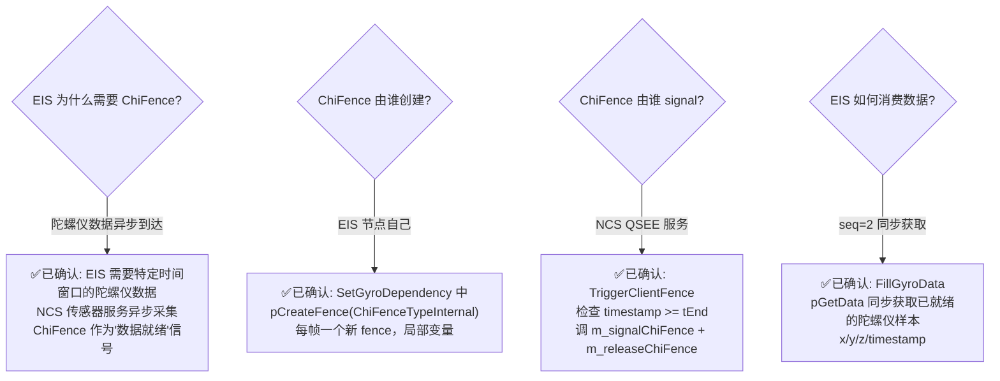
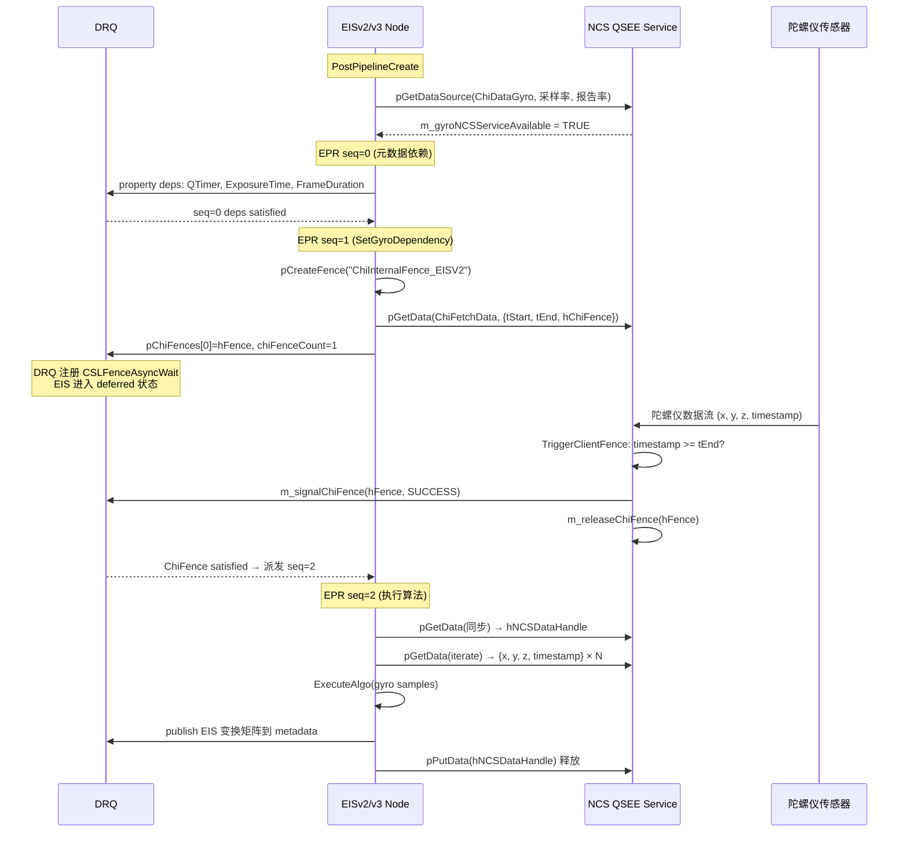

# EIS ChiFence 使用全景 — 唯一的 Node 级 ChiFence 真实用例

> 类型：源码分析
> 置信度底线：本文档所有内容为 ✅已确认（源码阅读确认）

## ❓ 问题背景

EISv2/EISv3（Electronic Image Stabilization）是 CamX 全源码中**唯一在 Node 级设置 `chiFenceDependency`** 的真实使用者。理解 EIS 如何使用 ChiFence 等待陀螺仪数据，是理解 ChiFence 设计意图的关键。

## 🌳 决策树



## 💡 EIS 三步 EPR 流程 [✅已确认]



## 💡 关键代码解析

### SetGyroDependency — ChiFence 创建 + NCS 请求 + 依赖注册 [✅已确认]

```cpp
// camxchinodeeisv2.cpp:1989-2046 (EISv3: 2193-2250, 完全相同模式)
VOID ChiEISV2Node::SetGyroDependency(
    CHINODEPROCESSREQUESTINFO* pProcessRequestInfo, UINT32 sensorIndex)
{
    gyro_times_t      gyroInterval = { 0 };
    ChiNCSDataRequest ncsRequest   = {0, {0}, NULL, 0};

    GetGyroInterval(pProcessRequestInfo->frameNum, sensorIndex, &gyroInterval, NULL);

    // 1. 创建 ChiFence（每帧一个，局部变量）
    CHIFENCECREATEPARAMS chiFenceParams = { 0 };
    chiFenceParams.type = ChiFenceTypeInternal;
    chiFenceParams.size = sizeof(CHIFENCECREATEPARAMS);
    chiFenceParams.pName = "ChiInternalFence_EISV2";
    CHIFENCEHANDLE hFence = NULL;
    g_ChiNodeInterface.pCreateFence(m_hChiSession, &chiFenceParams, &hFence);

    // 2. 构建 NCS 请求：时间窗口 + fence
    ncsRequest.size = sizeof(ChiNCSDataRequest);
    ncsRequest.windowRequest.tStart = QtimerNanoToQtimerTicks(MicroToNano(gyroInterval.first_ts));
    ncsRequest.windowRequest.tEnd   = QtimerNanoToQtimerTicks(MicroToNano(gyroInterval.last_ts));
    ncsRequest.hChiFence = hFence;          // fence 传给 NCS

    CHIDATAREQUEST dataRequest = {};
    dataRequest.requestType = ChiFetchData;
    dataRequest.hRequestPd  = &ncsRequest;

    // 3. 同时：注册 ChiFence 依赖 + 发起异步数据请求
    pProcessRequestInfo->pDependency->pChiFences[0] = hFence;
    pProcessRequestInfo->pDependency->chiFenceCount = 1;
    g_ChiNodeInterface.pGetData(m_hChiSession, GetDataSource(), &dataRequest, NULL);
    // pGetData 异步请求 NCS 数据，NCS 数据就绪后 signal fence
    // DRQ 通过 ChiFence 等待 NCS 完成
}
```

### NCS TriggerClientFence — 信号 ChiFence [✅已确认]

```cpp
// camxncsintfqsee.cpp:1157-1235
CamxResult NCSIntfQSEE::TriggerClientFence(QSEEJob* pJob)
{
    // 遍历 asyncRequestQ（EIS 提交的异步请求队列）
    NCSAsyncRequest* phRequestHandle = static_cast<NCSAsyncRequest*>(pNode->pData);
    CHIFENCEHANDLE   hFence   = phRequestHandle->hChiFence;
    UINT64           tCurrent = pJob->timestamp;

    if (tCurrent < tStart || tCurrent < tEnd)
    {
        break;  // 数据尚未覆盖请求的时间窗口
    }

    // 数据就绪：信号 + 释放
    m_signalChiFence(m_pChiContext, hFence, pJob->resultStatus);  // → ChiContext::SignalChiFence
    m_releaseChiFence(m_pChiContext, hFence);                     // → ChiContext::ReleaseChiFence
}
```

`m_signalChiFence` 最终调用 `ChiContext::SignalChiFence`（`camxchicontext.cpp:3613`），内部执行：
```
SetChiFenceResult(pChiFence, ChiFenceSuccess)
CSLFenceSignal(pChiFence->hFence, CSLFenceResultSuccess)
```
CSL fence signal 触发 DRQ 回调链 → EIS 节点被派发 seq=2。

### FillGyroData — 同步获取陀螺仪数据 [✅已确认]

```cpp
// camxchinodeeisv2.cpp:2527-2624 (seq=2 时调用)
// 此时 ChiFence 已满足，NCS 数据已就绪

// 1. 获取数据句柄
hNCSDataHandle = g_ChiNodeInterface.pGetData(m_hChiSession, pGyroDataSource, &gyroDataRequest, &dataSize);

// 2. 迭代陀螺仪样本
for (UINT i = 0; i < dataSize; i++)
{
    pNCSGyroData = static_cast<ChiNCSDataGyro*>(
        g_ChiNodeInterface.pGetData(m_hChiSession, &accessorObject, &gyroDataIterator, NULL));
    pGyroData->samples[i].data[0] = pNCSGyroData->x;
    pGyroData->samples[i].data[1] = pNCSGyroData->y;
    pGyroData->samples[i].data[2] = pNCSGyroData->z;
    ts = NanoToMicro(QtimerTicksToQtimerNano(pNCSGyroData->timestamp));
}

// 3. 释放数据句柄
g_ChiNodeInterface.pPutData(m_hChiSession, pGyroDataSource, hNCSDataHandle);
```

## 💡 ChiFence 生命周期 [✅已确认]

| 阶段 | 动作 | 执行者 | 代码位置 |
|------|------|--------|---------|
| 创建 | `pCreateFence(ChiFenceTypeInternal)` | EIS EPR seq=1 | `camxchinodeeisv2.cpp:2013` |
| 附加 | `m_attachChiFence(pChiContext, pFence)` | NCS QSEE GetDataAsync | `camxncsintfqsee.cpp:1122` |
| 注册等待 | `CSLFenceAsyncWait(hFence, DependencyFenceCallbackCSL)` | DRQ AddDependencyEntry | `camxdeferredrequestqueue.cpp:626` |
| 信号 | `m_signalChiFence(pChiContext, hFence, SUCCESS)` | NCS TriggerClientFence | `camxncsintfqsee.cpp:1211` |
| 释放 | `m_releaseChiFence(pChiContext, hFence)` | NCS TriggerClientFence | `camxncsintfqsee.cpp:1212` |

**fence 不跨帧复用** — 每帧 seq=1 创建新 fence，NCS signal 后释放。局部变量，非类成员。

## 💡 EISv2 vs EISv3 差异 [✅已确认]

| 方面 | EISv2 | EISv3 |
|------|-------|-------|
| fence 名称 | `"ChiInternalFence_EISV2"` | `"ChiInternalFence_EISV3"` |
| SetGyroDependency 逻辑 | 完全相同 | 完全相同 |
| FillGyroData 逻辑 | 完全相同 | 完全相同 |
| 源文件 | `camx/src/swl/eisv2/camxchinodeeisv2.cpp` | `camx/src/swl/eisv3/camxchinodeeisv3.cpp` |
| ChiFence 创建行号 | 2013 | 2217 |
| chiFenceCount 设置行号 | 2034 | 2238 |

**二者的 ChiFence 使用代码完全对称，仅 fence 名称不同。**

## 💡 关键数据结构

### ChiNCSDataRequest [✅已确认]

```cpp
// chi-cdk/api/ncs/chincsdefs.h:27-38
typedef struct ChiNCSDataRequest {
    size_t         size;
    struct {
        UINT64     tStart;        // 请求时间窗口起始（QTimer ticks）
        UINT64     tEnd;          // 请求时间窗口结束
    } windowRequest;
    CHIFENCEHANDLE hChiFence;     // ★ ChiFence 句柄，NCS 数据就绪后 signal
    UINT           numSamples;    // 请求样本数（0=按时间窗口）
    CDKResult      result;        // 请求结果
} CHINCSDATAREQUEST;
```

### NCSAsyncRequest [✅已确认]

```cpp
// camxncsintfqsee.h:60-64
struct NCSAsyncRequest {
    UINT64         tStart;
    UINT64         tEnd;
    CHIFENCEHANDLE hChiFence;     // ★ 存储 EIS 传来的 fence，数据就绪后 signal
};
```

### NCS 回调函数指针 [✅已确认]

```cpp
// camxncsintf.h:157-159
typedef CamxResult (*NCSAttachChiFence)(VOID* pContext, CHIFENCEHANDLE hChiFence);
typedef CamxResult (*NCSReleaseChiFence)(VOID* pContext, CHIFENCEHANDLE hChiFence);
typedef CamxResult (*NCSSignalChiFence)(VOID* pContext, CHIFENCEHANDLE hChiFence, CamxResult result);
```

在 `NCSService::Initialize` 时从 `NCSInitializeInfo` 注入，指向 `ChiContext::AttachChiFence`/`ReleaseChiFence`/`SignalChiFence`。

## 💡 设计洞察

> 四种 DRQ 依赖类型的完整对比见 KB 条目 `drq-four-dependency-types`

### 为什么 EIS 需要 ChiFence 而非 Property 依赖？

Property 依赖适用于 Node→Node 的元数据发布。但陀螺仪数据来自**进程外传感器服务**（NCS/SSC），不在 CamX Node 图内。ChiFence 提供了一种机制：让 DRQ 等待一个**外部异步事件**，而非另一个 Node 的输出。

### "自依赖"模式的意义

EIS 不是在等另一个 Node 的输出，而是等自己发起的异步请求的完成。ChiFence 的 canonical 用法是：
```
创建者 == 依赖者 == 同一个 Node
信号者 == 外部服务（NCS）
```

这与 CSL buffer fence（Node→Node 同步）和 Property（Node→Node 元数据通知）形成互补：
- CSL fence: 硬件节点之间的 buffer 就绪同步
- Property: 节点之间的元数据发布-订阅
- **ChiFence: 节点与外部异步服务的同步**

## 📍 关键代码位置

### EISv2
- `camxchinodeeisv2.cpp:1989-2046` — SetGyroDependency（完整函数）
- `camxchinodeeisv2.cpp:2013` — pCreateFence 创建 ChiFence
- `camxchinodeeisv2.cpp:2023` — ncsRequest.hChiFence = hFence
- `camxchinodeeisv2.cpp:2033-2034` — pChiFences[0] + chiFenceCount
- `camxchinodeeisv2.cpp:2035` — pGetData 异步请求 NCS 数据
- `camxchinodeeisv2.cpp:2527-2624` — FillGyroData 同步获取陀螺仪样本
- `camxchinodeeisv2.cpp:3081-3329` — ProcessRequest 三步序列流程
- `camxchinodeeisv2.cpp:3334-3379` — PostPipelineCreate NCS 数据源注册

### EISv3
- `camxchinodeeisv3.cpp:2193-2250` — SetGyroDependency
- `camxchinodeeisv3.cpp:2217` — pCreateFence
- `camxchinodeeisv3.cpp:2237-2238` — pChiFences + chiFenceCount
- `camxchinodeeisv3.cpp:2729-2829` — FillGyroData
- `camxchinodeeisv3.cpp:3920-3946` — PostPipelineCreate NCS 注册

### NCS 服务
- `camxncsintfqsee.cpp:1071-1148` — GetDataAsync 接收异步请求 + attach fence
- `camxncsintfqsee.cpp:1157-1235` — TriggerClientFence 信号 fence
- `camxncsintfqsee.h:60-64` — NCSAsyncRequest 结构
- `camxncsintf.h:157-159` — NCS fence 回调函数指针 typedef
- `camxncsservice.h:50-57` — NCSInitializeInfo（注入回调）
- `camxncssensor.cpp:139-146` — NCSSensor::GetDataAsync 转发

### CHI API
- `chinode.h:430-457` — CHIDEPENDENCYINFO（pChiFences + chiFenceCount 字段）
- `chinode.h:710-722` — PFNCHICREATEFENCE typedef
- `chinode.h:824-840` — PFNGETDATA typedef
- `chincsdefs.h:27-38` — ChiNCSDataRequest（hChiFence 字段）
- `chincsdefs.h:63-69` — ChiNCSDataGyro（x, y, z, timestamp）

## ⚠️ 待验证事项

无。

## 📝 备注

- EISv2/v3 是 SWL（Software Library）节点，运行在 ChiNodeWrapper 内，通过 `CHINODEINTERFACE` 函数指针表调用 CamX API
- ChiNodeWrapper（`camxchinodewrapper.cpp:2724-2775`）将 `CHIDEPENDENCYINFO.pChiFences` 翻译为 `DependencyUnit.chiFenceDependency`，为 ChiFence 分配 `CHIFENCECALLBACKINFO`，设回调为 `ChiFenceDependencyCallback`（清理用）
- NCS 回调指针在 `NCSService::Initialize` 时从 `ChiContext` 获取（`camxchicontext.cpp` 中通过 `NCSInitializeInfo` 注入）
- 陀螺仪采样率通过 `GetGyroFrequency(sensorIdx)` 获取，默认 `reportRate = 10000`（微秒级）
- 时间窗口用 QTimer ticks 表示，通过 `QtimerNanoToQtimerTicks(MicroToNano(...))` 转换
