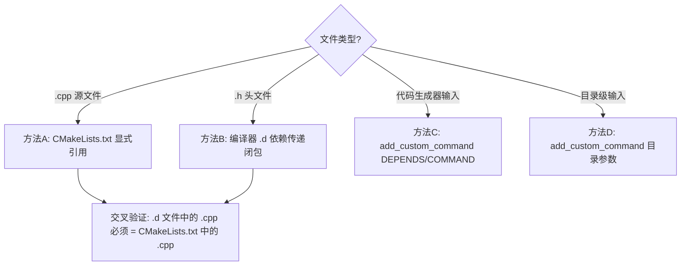

# 判断 CMake 项目外部依赖文件的方法

> 类型：配置规则
> 置信度底线：本文档最低置信度为 ✅已确认

## ❓ 问题背景

CMake 项目通过 `${CAMX_ROOT}` 等变量引用外部源码树中的文件。要实现自包含迁移，需要精确识别所有外部依赖文件——不多不少。

## 🌳 判断框架



## 💡 四种判断方法

### 方法 A：.cpp — CMakeLists.txt 显式引用 [✅已确认]

**原理**：CMake 的 `add_library`/`add_executable` 显式列出每个编译的 .cpp。

**提取命令**：
```bash
# 直接引用 ${CAMX_ROOT} 的文件（简单情况）
grep -h '${CAMX_ROOT}.*\.cpp' */CMakeLists.txt \
  | sed 's|.*\${CAMX_ROOT}/||; s/[[:space:]]*$//' | sort -u

# ⚠️ 不完整！有些 CMakeLists.txt 用中间变量：
#   ${CHIFEATURE2_DIR} = ${CAMX_ROOT}/chi-cdk/core/chifeature2
#   ${F2FRAMEWORK_SRC} = ${CAMX_ROOT}/chi-cdk/test/chifeature2testframework
# 必须手动展开或用 .d 交叉验证
```

**交叉验证命令**（推荐，更可靠）：
```bash
cd build
find . -name "*.cpp.o.d" | xargs cat | tr ' \\' '\n' \
  | grep -v '^\s*$' | grep -v ':$' \
  | grep '/CAMX_SAIPAN_LA.UM.8.13.R1/' \
  | sed 's|.*/CAMX_SAIPAN_LA.UM.8.13.R1/||' \
  | grep -v '^build/' \
  | grep '\.cpp$' | sort -u
```

**判断标准**：
- ✅ 在 CMakeLists.txt 中有 `${CAMX_ROOT}/path/to/file.cpp` 引用 → 需要拷贝
- ✅ 在 .d 文件中出现为外部路径 → 需要拷贝
- ❌ 在 CMakeLists.txt 中定义了变量但变量未被 add_executable/add_library 引用 → 死代码，不需要
- ❌ 有 patched 版本从本地路径编译 → 不需要拷贝外部原始版本

**验证死代码的方法**：
```bash
# 检查变量是否被 target 引用
grep -n 'VARIABLE_NAME' path/to/CMakeLists.txt
# 如果只出现在 set() 但不出现在 add_executable/target_sources → 死代码

# 最终确认：ninja 是否有编译计划
ninja -n -j1 2>&1 | grep filename
# 无输出 → 确认是死代码
```

### 方法 B：.h — 编译器 .d 依赖传递闭包 [✅已确认]

**原理**：GCC/Clang 的 `-MD` 选项生成 `.d` 依赖文件，包含每个 .cpp 的完整 #include 传递闭包（直接 + 间接依赖的所有头文件）。

**提取命令**：
```bash
cd build
find . -name "*.cpp.o.d" | xargs cat | tr ' \\' '\n' \
  | grep -v '^\s*$' | grep -v ':$' \
  | grep '/CAMX_SAIPAN_LA.UM.8.13.R1/' \
  | sed 's|.*/CAMX_SAIPAN_LA.UM.8.13.R1/||' \
  | grep -v '^build/' \
  | grep '\.h$' | sort -u
```

**⚠️ 已知陷阱：路径中包含 `_cmake/` 的误过滤**

patched_srcs 的 .d 文件中，外部头文件路径可能是：
```
/home/.../PROJECT_cmake/../PROJECT/chi-cdk/core/lib/common/g_pipelines.h
```
这个路径**同时包含** `_cmake/` 和外部树路径。如果用 `grep -v '_cmake/'` 过滤本地文件，会把它误过滤掉。

**正确做法**：用 `sed 's|.*/PROJECT/||'` 从最后一个外部树名截取，不用 `grep -v` 排除。

**验证每个 .h 都被引用**：
```bash
cd build
while IFS= read -r h; do
  d=$(find . -name "*.cpp.o.d" -exec grep -l "$h" {} \; | head -1)
  if [ -z "$d" ]; then echo "NOT_FOUND: $h"; fi
done < header_list.txt
# 应输出 0 行 NOT_FOUND
```

**判断标准**：
- ✅ 出现在任何 .d 文件中 → 需要拷贝
- ❌ 仅在 CMakeLists.txt 的 include_directories 中设置了目录，但目录下 0 个 .h 被引用 → 不需要（被 stubs 替代）

### 方法 C：XML — add_custom_command 单文件引用 [✅已确认]

**原理**：代码生成器（perl 脚本等）在 CMakeLists.txt 中通过 `add_custom_command` 调用，其 DEPENDS 和 COMMAND 参数列出输入文件。

**提取命令**：
```bash
grep -n 'DEPENDS.*\.xml\|COMMAND.*\.xml' */CMakeLists.txt
# 筛选含 ${CAMX_ROOT} 的行
```

**判断标准**：
- ✅ 在 add_custom_command 的 DEPENDS 或 COMMAND 参数中被引用 → 需要拷贝

### 方法 D：XSD — add_custom_command 目录级引用 [✅已确认]

**原理**：ParameterParser 等工具按目录递归扫描输入文件，CMakeLists.txt 中传入的是目录路径而非单个文件。

**提取命令**：
```bash
grep -A5 'ParameterParser' */CMakeLists.txt | grep 'CAMX_ROOT'
# 找到目录参数，然后递归计数：
find /path/to/directory -type f | wc -l
```

**判断标准**：
- ✅ 目录被 add_custom_command 的 COMMAND 作为参数传入 → 整目录拷贝
- 不能精确到单文件（工具内部递归扫描逻辑未知）

## 🔍 交叉验证矩阵

| 验证项 | 方法 | 预期结果 |
|--------|------|---------|
| .cpp CMake vs .d | `comm -3 <(cmake列表) <(d列表)` | 0 差异（或差异可解释为死代码） |
| .h 全部被引用 | 逐个 grep .d 文件 | 0 个 NOT_FOUND |
| 无遗漏 .d 文件 | `find build -name "*.cpp.o.d" \| wc -l` vs 已知编译单元数 | 数量一致 |
| patched 文件不重复 | `comm -12 <(patched列表) <(外部cpp列表)` | 0 重复 |
| 无外部路径残留（迁移后） | `grep -rn 'CAMX_ROOT' */CMakeLists.txt` | 0 匹配或仅剩注释 |

## 📍 关键代码位置

- `camera.qcom.so/CMakeLists.txt` — camx_core OBJECT library 的外部 .cpp 列表和 add_custom_command
- `chifeature2test/CMakeLists.txt` — chifeature2test EXE 的外部 .cpp 列表（通过中间变量引用）
- `build/**/*.cpp.o.d` — 编译器生成的依赖文件（-MD 选项产物）

## ⚠️ 待验证事项

（无 — 所有方法均已在 444 文件审计中验证通过）

## 📝 备注

- .d 文件只在成功编译后生成。如果某个 .cpp 编译失败或被 CMake 条件排除，其依赖不会出现在 .d 文件中
- .d 文件的内容取决于编译时的 #ifdef 条件。如果添加新的宏定义可能引入新的头文件依赖
- force-include 头文件（`-include path/to/header.h`）也会出现在 .d 文件中
- 运行时读取的配置文件（如 JSON/XML）不会出现在 .d 文件中，需要通过代码搜索 `fopen`/`ifstream` 等调用来发现
