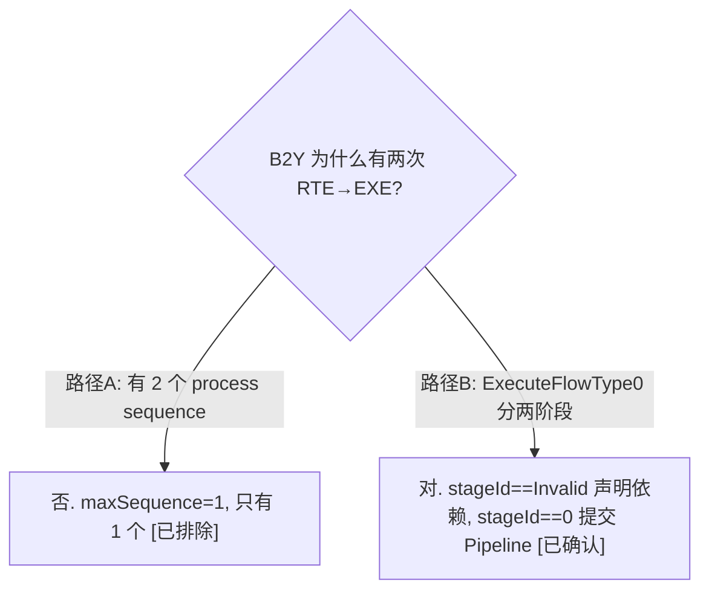
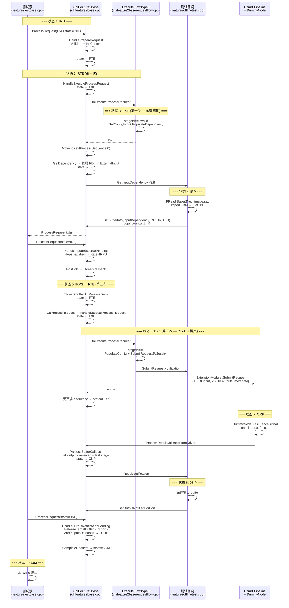

# TestBayerToYUV 逐状态数据流 — 10 个 FRO 状态的输入/处理/转换全追踪

> 类型：源码分析
> 置信度底线：本文档所有结论为 ✅已确认（基于六路并行源码阅读）

## ❓ 问题背景
按时间顺序，以 FRO 状态为分界线，串讲 TestBayerToYUV 完整生命周期。每个状态说明：输入数据是什么，核心做了什么，如何进入下一个状态。

## 🔍 搜索过程
| 命令 / 动作 | 目标 | 结果摘要 |
|------------|------|---------|
| read chifeature2baserequestflow.cpp ExecuteFlowType0 | B2Y 执行流程 | 两阶段：stageId==Invalid 声明依赖，stageId==0 提交 Pipeline |
| read chifeature2bayer2yuvdescriptor.cpp | B2Y 描述符 | 1 Stage、2 Pipeline、3 输出端口、2 输入端口 |
| read chifeature2base.cpp HandlePrepareRequest | INIT→RTE | Validate + InitContext + OnPrepareRequest(no-op) |
| read chifeature2base.cpp GetDependency | 依赖声明 | ExternalInput 端口 → IRP |
| read feature2offlinetest.cpp ProcessGetInputDependencyMessage | 测试提供 buffer | FRead raw 文件 → Import TBM → SetBufferInfo |
| read chifeature2base.cpp SubmitRequestToSession | Pipeline 提交内容 | 1 input(RDI) + 2 output(YUV) + metadata |
| read dummy_node.cpp ExecuteProcessRequest | DummyNode 处理 | CSLFenceSignal on all output ports |
| read chifeature2base.cpp ProcessBufferCallback | ORP→ONP | pOutputPorts.empty && lastStage |
| read feature2offlinetest.cpp ProcessResultNotificationMessage | 测试接收结果 | SetOutputNotifiedForPort |

## 🌳 决策树


## 💡 分析结论

### 前置知识：B2Y 的描述符结构

```
Bayer2YuvFeatureDescriptor (featureId=1, "Bayer2Yuv")
├── 1 Stage: "Bayer2Yuv"
├── 1 Session: "B2Y" (2 pipelines)
│   ├── Pipeline 0: ZSLSnapshotYUVHAL
│   └── Pipeline 1: Bayer2YUVWithSWRemosaic
├── 输入端口 (2):
│   ├── RDI_In        {0,0,0, ExternalInput, ImageBuffer}  target=TARGET_BUFFER_RAW
│   └── B2Y_Input_Metadata {0,0,1, ExternalInput, MetaData}
├── 输出端口 (3):
│   ├── YUV_Out       {0,0,0, ExternalOutput, ImageBuffer}  target=TARGET_BUFFER_YUV_HAL
│   ├── YUV_Metadata_Out {0,0,1, ExternalOutput, MetaData}
│   └── YUV_Out2      {0,0,2, ExternalOutput, ImageBuffer}  target=TARGET_BUFFER_YUV_HAL2
└── 内部链接: 0
```

测试使用的流:
- 输入流: Raw10, 4656×3496, stride=5824
- 输出流: YCbCr420_888, 4656×3496, stride=4672

### 关键机制：ExecuteFlowType0 的两阶段

B2Y 使用 FlowType0（单帧普通流），ExecuteFlowType0 内部用 stageId 区分两个阶段:

| 阶段 | stageId 值 | 动作 | 对应状态转换 |
|------|-----------|------|------------|
| 依赖声明 | InvalidStageId (-1) | SetConfigInfo + PopulateDependency + GetDependency | 第一次 EXE → IRP |
| Pipeline 提交 | 0 | PopulateConfiguration + SubmitRequestToSession | 第二次 EXE → ORP |

这是一个 sequence 被分成两次 HandleExecuteProcessRequest 调用执行的原因。

---

### Phase 0: 测试框架初始化（INIT 之前）

**入口:** `main()` (chifeature2testmain.cpp:23) → `RunTests()` (nativetest.cpp:199)

RunTests 遍历 `g_testFuncContainer->m_TestListDefault`（CF2_TEST 宏注册的 NativeTest* 列表），按 `-t` 参数匹配后，对每个用例调：

```
RunTest(pTest, ...) (nativetest.cpp:173)
  ├── pTest->Setup()    // line 179 — 初始化基础设施
  └── pTest->Run()      // line 184 — 执行用例逻辑
```

**Setup 调用链:**

```
Feature2OfflineTest::Setup() (feature2offlinetest.cpp:55)
  ├── m_pTestObj = this                              // 保存实例供 static 回调使用
  ├── SetFeature2Interface()                          // 设函数指针表:
  │     pInitializeFeature2Test  = InitializeFeature2Test
  │     pGetFeature2Descriptor   = GetGenericFeature2Descriptor
  │     pGetInputFeature2RequestObject = GetInputFeature2RequestObject
  │     pProcessMessage          = ProcessMessage
  │     pCreateFeature2          = CreateFeature2
  │     ...
  └── Feature2TestCase::Setup() (feature2testcase.cpp:29)
        ├── 成员变量初始化 (NULL/0/clear)
        ├── SetupCamera()                             // HAL + CHI 上下文初始化
        ├── LoadChiOps()                              // 加载 CHI 操作表 (chi_stub.cpp)
        ├── Feature2BufferManager::LoadBufferLibs()   // buffer 管理器符号
        ├── CreateMetadataManager()                   // metadata 管理器
        ├── CHIThreadManager::Create()                // 线程池
        └── Mutex::Create() + Condition::Create()     // 同步原语
```

**Run 调用链:**

```
Feature2OfflineTest::Run()
  → OfflineFeatureTest(descriptor, streams, ...)
    → Feature2TestCase::RunFeature2Test()  (feature2testcase.cpp:657)
      ├── pInitializeFeature2Test(...)     // 创建 buffer manager + TBM + 加载测试数据
      ├── pCreateFeature2(...)             // ChiFeature2Generic::Create
      ├── pGetInputFeature2RequestObject(...)  // 创建 FRO (state=INIT)
      └── do-while 泵循环                   // 驱动 FRO 状态机直到 Complete
```

Setup 完成后，CHI 模块、buffer 管理器、metadata 管理器、线程池全部就绪。Run 阶段才创建 Feature 实例和 FRO，进入状态机。

---

### 状态 1: INIT (Initialized)

**此时 FRO 中的数据:**

| 数据 | 值 | 来源 |
|------|------|------|
| URO | frame_number=1, pAppSettings=metadata | feature2offlinetest.cpp:406-416 |
| Feature 实例 | ChiFeature2Generic (B2Y descriptor) | feature2offlinetest.cpp:920 |
| numRequests | 1 | feature2offlinetest.cpp:510 |
| 输出端口配置 | YUV_Out: hBuffer=已导入的输出 buffer handle | feature2offlinetest.cpp:494 |
| Feature Hint | numFrames=1 | feature2offlinetest.cpp:534-536 |
| pGraphPrivateData | test this 指针 | feature2offlinetest.cpp:417 |

**无输入数据、无依赖声明、无 Pipeline 配置。**

---

### 转换 1: INIT → RTE (HandlePrepareRequest)

**触发:** 测试泵 do-while 循环第一次调 ProcessRequest (feature2testcase.cpp:707)

**核心处理 (chifeature2base.cpp:1376-1418):**
1. `ValidateRequest` (line 1312): 检查每个输出端口有 pipeline target 或 output buffer TBM
2. `InitializeFeatureContext` (line 6114): CHX_CALLOC 分配 ChiFeatureRequestContext (空的，无 privData)
3. `OnPrepareRequest` (chifeature2generic.cpp:118): no-op
4. `SetCurRequestState(ReadyToExecute)` (line 1404)

**进入 RTE 后立即继续** — CanRequestContinue(RTE)==TRUE，do-while 循环不退出。

---

### 状态 2: RTE (第一次 ReadyToExecute)

**此时 FRO 新增数据:** ChiFeatureRequestContext (空)

---

### 转换 2: RTE → EXE (第一次 HandleExecuteProcessRequest)

**核心处理 (chifeature2base.cpp:1423-1517):**
1. `SetCurRequestState(Executing)` (line 1453)
2. `OnExecuteProcessRequest` → `ExecuteFlowType0` (chifeature2baserequestflow.cpp:51)
3. **stageId == InvalidStageId** (依赖声明阶段):
   - `SetConfigInfo(pRequestObject, maxSequence=1)` (line 78)
   - `SetNextStageInfoFromStageDescriptor` → 创建 sequence 0 (chifeature2requestobject.cpp:1175)
   - `PopulateDependency` → `OnPopulateDependency` → `PopulateDependencyPorts` (chifeature2base.cpp:6911)
     → 注册 `RDI_In` ({0,0,0, ExternalInput, ImageBuffer}) 为输入依赖
4. 回到 HandleExecuteProcessRequest (line 1455):
   - `GetProcessSequenceId(Next)` 返回 0 → `MoveToNextProcessSequenceInfo` → curSequence=0
   - `InitializeSequenceData` → 设置 frameNumber (chifeature2base.cpp:6319)
   - **`GetDependency(pRequestObject)`** (line 1473):
     - 遍历 DependencyConfigInfo，发现 ExternalInput 端口 (chifeature2base.cpp:4925)
     - `SetCurRequestState(InputResourcePending)` (line 5010)
     - `ProcessDependencyForGraph` → 组装 GetInputDependency 消息 → `ProcessFeatureMessage` (line 4447)
     - → 测试的 ProcessMessage → ProcessGetInputDependencyMessage (feature2offlinetest.cpp:630)

**CanRequestContinue(IRP)==FALSE** → do-while 退出 → ProcessRequest 返回到测试。

---

### 状态 3: EXE → IRP (InputResourcePending)

**此时 FRO 新增数据:**

| 数据 | 值 |
|------|------|
| curProcessSequenceId | 0 |
| stageId | 0 (B2Y stage) |
| inputBuffersDependenciesToBeStatisfied | 1 (RDI_In 端口) |
| pDependencyConfig | B2Y stage 的端口描述符 |

---

### 转换 3: IRP — 测试提供输入数据

**测试的 ProcessGetInputDependencyMessage 同步执行** (feature2offlinetest.cpp:630-737):

1. 从 GetInputDependency 消息中读取依赖端口: `RDI_In` (ImageBuffer, 1 个依赖)
2. `pManager->GetInputBufferForRequest()` (line 662) → 从预加载队列弹出 Raw10 buffer
   - 该 buffer 在初始化时从 `Bayer2Yuv_image_4656x3496_0.raw` 文件 FRead 到内存 (feature2buffermanager.cpp:113-187)
3. `m_pInputImageTBM->ImportExternalTargetBuffer(seqId, streamId, pInputBuffer)` (line 665) → 导入到测试的 TBM
4. `m_pInputImageTBM->SetupTargetBuffer(seqId)` → 获取 TBH (line 669)
5. 组装 bufferMetaInfo: `{hBuffer=TBH, key=(UINT64)m_pInputStream}` (line 675-676)
6. **`pFeatureRequestObj->SetBufferInfo(InputDependency, &RDI_In_port, TBH, key, ...)`** (line 727)
   → chifeature2requestobject.cpp:1821: `inputBuffersDependenciesToBeStatisfied--` (1→0)
   → 端口状态 = DependencyMetWithSuccess

**此时 FRO 输入数据完整:** RDI_In 端口有 Raw10 buffer handle。

---

### 转换 4: IRP → IRPS → RTE

**测试泵 do-while 第二次调 ProcessRequest** (feature2testcase.cpp:710, state=IRP)

**HandleInputResourcePending** (chifeature2base.cpp:1522-1569):
1. `AreInputDependenciesStatisfied()` → `inputBuffersDependenciesToBeStatisfied==0` → TRUE (chifeature2requestobject.cpp:3089)
2. 加锁检查当前状态 == IRP (CAS 语义防重入)
3. `SetCurRequestState(InputResourcePendingScheduled)` (line 1550) → **IRP → IRPS**
4. `HandlePostJob` → `m_pThreadManager->PostJob(m_hFeatureJob, ...)` (chifeature2base.cpp:3871) → **异步**

**ThreadCallback 在线程池触发** (chifeature2base.cpp:1198):
1. `ReleaseDependenciesOnInputResourcePending` (line 1227)
2. `SetCurRequestState(ReadyToExecute)` (line 1228) → **IRPS → RTE**
3. `OnProcessRequest(pRequestObject, curRequestId)` (line 1229) → 进入同步快速路径

---

### 状态 4: RTE (第二次 ReadyToExecute)

**此时 FRO 的数据:**

| 数据 | 值 |
|------|------|
| curProcessSequenceId | 0 |
| stageId | 0 |
| 输入 RDI_In | Raw10 buffer handle (已满足) |
| 输出 YUV_Out | 测试导入的输出 buffer handle |
| 输出 YUV_Out2 | Feature 内部 TBM 分配 |

---

### 转换 5: RTE → EXE (第二次 HandleExecuteProcessRequest)

**核心处理 (chifeature2base.cpp:1423):**
1. `SetCurRequestState(Executing)` (line 1453)
2. `OnExecuteProcessRequest` → `ExecuteFlowType0`
3. **stageId == 0** (Pipeline 提交阶段, chifeature2baserequestflow.cpp:88):
   - `PopulateConfiguration(pRequestObject)` (line 113): 填充 tuning metadata、vendor tags
   - **`SubmitRequestToSession(pRequestObject)`** (line 117): 构建并提交 Pipeline 请求
4. 回到 HandleExecuteProcessRequest:
   - `nextStageId(1) < numStages(1)` → FALSE → 无下一阶段
   - `GetProcessSequenceId(Next)` = Invalid → 无更多 sequence
   - `SetCurRequestState(OutputResourcePending)` (line 1489) → **EXE → ORP**

**SubmitRequestToSession 详细数据 (chifeature2base.cpp:596):**

构建的 CHIPIPELINEREQUEST:

```
pSessionHandle = B2Y Session handle
numRequests = 1
pCaptureRequests[0]:
  frameNumber     = sequence frame number
  hPipelineHandle = ZSLSnapshotYUVHAL pipeline handle
  numInputs       = 1
  pInputBuffers   = [{pStream=Raw10 stream, buffer=RDI raw data}]
  numOutputs      = 2
  pOutputBuffers  = [{pStream=YUV_Out stream, buffer=test output buffer},
                     {pStream=YUV_Out2 stream, buffer=internal TBM buffer}]
  pInputMetadata  = input metadata handle
  pOutputMetadata = output metadata handle
  pPrivData       = ChiFeatureCombinedCallbackData*
```

**提交路径:**
SubmitRequestToSession → SendSubmitRequestMessage → ProcessFeatureMessage
→ 测试 ProcessMessage → ProcessSubmitRequestMessage (feature2offlinetest.cpp:870)
→ ExtensionModule::SubmitRequest → ChiSubmitPipelineRequest (chi_stub.cpp:315)
→ CamXAdapter_SubmitRequest → g_pChiContext->SubmitRequest → CamX Pipeline

---

### 状态 5: ORP (OutputResourcePending)

**此时 FRO 的数据:**
- Pipeline 请求已提交，等待 DummyNode 处理
- 所有输入/输出 buffer 已配置完成

**测试泵 do-while 进入 TimedWait(500ms)** (feature2testcase.cpp:720-726)

---

### 转换 6: ORP → ONP (异步 Pipeline 结果回调)

**DummyNode 处理 (dummy_node.cpp:28-51):**
1. `ExecuteProcessRequest` 被 DRQ 调用
2. 遍历所有输出端口的 fence：`CSLFenceSignal(*rOut.phFence, CSLFenceResultSuccess)`
3. 立即信号所有 fence — 无实际图像处理

**结果回调链:**
```
CSLFenceSignal → Pipeline fence complete → DRQ callback
→ CHISession::DispatchResults (camxchisession.cpp:206)
→ ProcessResultCallbackFromDriver (chifeature2base.h:1987) — static 回调
→ ProcessResult (chifeature2base.cpp:3901)
  → 提取 ChiFeatureCombinedCallbackData
  → ProcessMetadataCallback (如有 metadata)
  → ProcessBufferCallback (chifeature2base.cpp:4764)
```

**ProcessBufferCallback 核心逻辑 (chifeature2base.cpp:4764-4880):**
1. 遍历 CHICAPTURERESULT 中的 output buffers
2. 每个 buffer 通过 pStream 指针匹配到 pFrameCbData->pOutputPorts 中的端口
3. 匹配成功 → 从 vector 中 erase 该端口
4. 调用 `OnBufferResult` 判断 sendToGraph
5. **关键检查 (line 4854):** `pOutputPorts.empty() && (GetNumStages()-1 == stageId)`
   - pOutputPorts 为空 = 所有输出 buffer 已收到
   - 最后一个 stage = B2Y 只有 1 个 stage (index 0)
6. `SetCurRequestState(OutputNotificationPending)` (line 4859) → **ORP → ONP**
7. `ProcessFeatureMessage(ResultNotification)` (line 4868) → 通知测试

**测试的 ProcessResultNotificationMessage (feature2offlinetest.cpp:742):**
1. 遍历结果端口
2. ImageBuffer 端口: 获取 NativeChiBuffer → GenericBuffer → 保存到文件
3. **`SetOutputNotifiedForPort(portIdentifier, 0)`** (line 815) → pOutputNotified[i] = TRUE

---

### 状态 6: ONP (OutputNotificationPending)

**此时 FRO 的数据:**

| 端口 | pOutputGenerated | pOutputNotified | pReleaseAcked |
|------|-----------------|-----------------|---------------|
| YUV_Out | TRUE | TRUE (测试回调中设置) | FALSE |
| YUV_Metadata_Out | TRUE | TRUE | FALSE |

---

### 转换 7: ONP → COM (HandleOutputNotificationPending + CompleteRequest)

**测试泵 do-while 第三次调 ProcessRequest** (feature2testcase.cpp:713, state=ONP)

**HandleOutputNotificationPending (chifeature2base.cpp:1585-1639):**
1. `GetExternalRequestOutput` 获取所有外部输出端口
2. 遍历每个端口 (line 1606-1636):
   - `GetOutputNotifiedForPort` → TRUE
   - `GetReleaseAcknowledgedForPort` → FALSE
   - `ReleaseTargetBuffer(hBuffer)` (line 1624) → TBM refCount--
   - `SetReleaseAcknowledgedForPort` (line 1626) → pReleaseAcked[i] = TRUE, numOutputReleased++
3. `AreOutputsReleased(requestId)` → `numOutputReleased == numRequestOutputs` → TRUE
4. **`CompleteRequest(pRequestObject, requestId)`** (line 1640)

**CompleteRequest (chifeature2base.cpp:1718):**
1. `SetCurRequestState(Complete)` (line 1730) → **ONP → COM**
2. 检查所有 requestId 都为 Complete (numRequests=1, 只有 requestId 0)
3. `DoCleanupRequest(pRequestObject)` (line 1755): 清理 stage 数据
4. 释放 ChiFeatureRequestContext (line 1769)

**测试 do-while 循环退出** (feature2testcase.cpp:733): `GetCurRequestState(0) == Complete`

---

### 完整时序图



## 📍 关键代码位置
- `chi-cdk/oem/qcom/feature2/chifeature2graphselector/chifeature2bayer2yuvdescriptor.cpp:32-63` — B2Y 端口定义
- `chi-cdk/core/chifeature2/chifeature2baserequestflow.cpp:51-149` — ExecuteFlowType0 两阶段
- `chi-cdk/core/chifeature2/chifeature2baserequestflow.cpp:78` — SetConfigInfo maxSequence=1
- `chi-cdk/core/chifeature2/chifeature2base.cpp:1376-1418` — HandlePrepareRequest (INIT→RTE)
- `chi-cdk/core/chifeature2/chifeature2base.cpp:1423-1517` — HandleExecuteProcessRequest (RTE→EXE)
- `chi-cdk/core/chifeature2/chifeature2base.cpp:4890-5015` — GetDependency (EXE→IRP)
- `chi-cdk/core/chifeature2/chifeature2base.cpp:1522-1569` — HandleInputResourcePending (IRP→IRPS)
- `chi-cdk/core/chifeature2/chifeature2base.cpp:1198-1240` — ThreadCallback (IRPS→RTE)
- `chi-cdk/core/chifeature2/chifeature2base.cpp:596-959` — SubmitRequestToSession
- `chi-cdk/core/chifeature2/chifeature2base.cpp:4764-4880` — ProcessBufferCallback (ORP→ONP)
- `chi-cdk/core/chifeature2/chifeature2base.cpp:1585-1639` — HandleOutputNotificationPending (ONP release)
- `chi-cdk/core/chifeature2/chifeature2base.cpp:1718-1770` — CompleteRequest (→COM)
- `chi-cdk/test/chifeature2testcase/feature2offlinetest.cpp:630-737` — ProcessGetInputDependencyMessage
- `chi-cdk/test/chifeature2testcase/feature2offlinetest.cpp:742-820` — ProcessResultNotificationMessage
- `chi-cdk/test/chifeature2testcase/feature2offlinetest.cpp:870-879` — ProcessSubmitRequestMessage
- `chi-cdk/test/chifeature2testcase/feature2testcase.cpp:702-733` — 测试泵 do-while 循环
- `camera.qcom.so/dummy_node.cpp:28-51` — DummyNode CSLFenceSignal

## ⚠️ 待验证事项
- [🧠推断] PopulateConfiguration 填充的具体 vendor tag 列表未逐个追踪
- [🧠推断] YUV_Out2 端口在单流测试中是否实际收到 buffer — DummyNode 信号所有端口 fence, 但测试只导出 YUV_Out

## 📝 备注
- B2Y 只有 1 个 process sequence, 但 ExecuteFlowType0 将其分成两次 HandleExecuteProcessRequest 调用
- 第一次 EXE 不提交 Pipeline, 只声明依赖; 第二次 EXE 才真正提交
- 测试泵共调 ProcessRequest 3 次 + 1 次 PostJob 异步重入 = 驱动完 10 个状态
- DummyNode 立即信号所有 fence, 所以 ORP 持续时间极短 (ms 级)
- 测试 TimedWait(500ms) 是唯一的延迟来源, 不是 Feature2 逻辑延迟
- metadata 端口的依赖/通知流程与 ImageBuffer 端口类似但走不同分支 (MetaData case)
