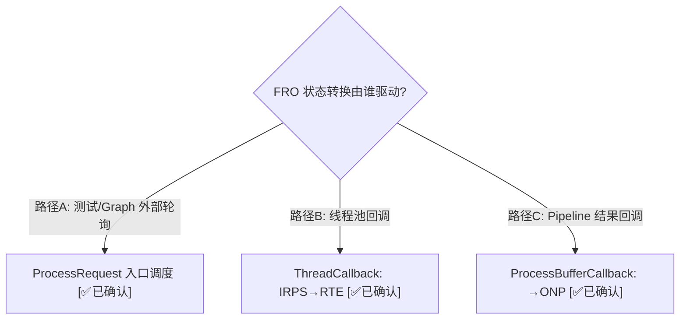
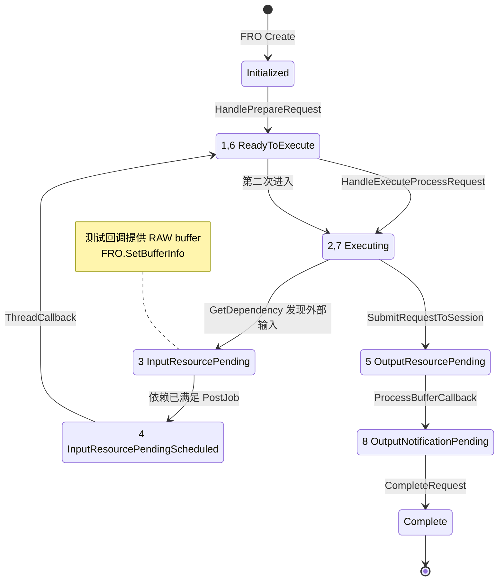
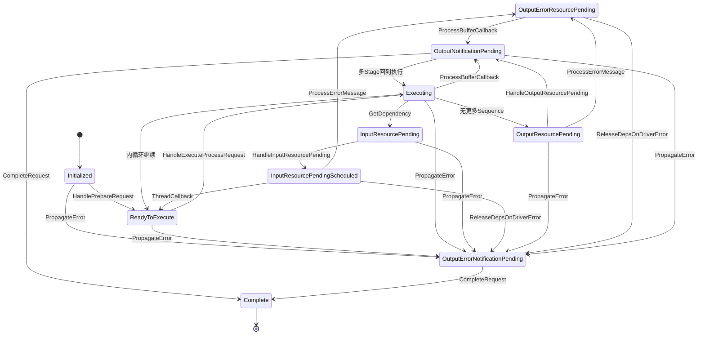
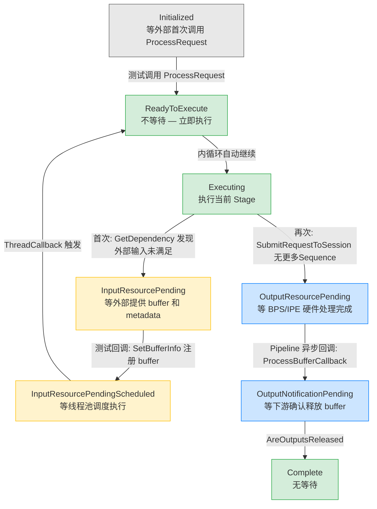

# FRO 十状态状态机 — 以 TestBayerToYUV 为例的完整追踪

> 类型：源码分析
> 置信度底线：本文档最低置信度为 🧠推断 的内容不可作为行动依据

## ❓ 问题背景
Feature2 的核心驱动器是 Feature Request Object (FRO) 的十状态状态机。理解这十个状态及其转换条件，是理解 Feature2 架构的关键。

## 🔍 搜索过程
| 命令 / 动作 | 目标 | 结果摘要 |
|------------|------|---------|
| read chifeature2requestobject.h:48-63 | FRO 状态枚举 | 10+1 个状态 (0-9 + InvalidMax) |
| read chifeature2requestobject.h:88-103 | 合法转换矩阵 | 11×11 bool 表 |
| grep SetCurRequestState chifeature2base.cpp | 状态转换触发点 | ~15 处转换调用 |

## 🌳 决策树


## 💡 分析结论

### 核心设计原则

**每个状态 = 一个独特的等待原因。** 如果两个状态在等同一件事，它们应该合并；如果一个状态在等两件不同的事，它应该拆分。

### 1. 十状态完整定义

| # | 状态 | 缩写 | 在等什么 | 谁能推动它前进 |
|---|------|------|---------|---------------|
| 0 | Initialized | INIT | 等首次 ProcessRequest 调用 | 外部轮询 |
| 1 | ReadyToExecute | RTE | 不等，立即可执行 | 自身 (内循环继续) |
| 2 | Executing | EXE | OnExecuteProcessRequest 运行中 | 自身 (同步返回) |
| 3 | InputResourcePending | IRP | 等外部输入 buffer/metadata | 外部提供 → 再次 ProcessRequest |
| 4 | InputResourcePendingScheduled | IRPS | 输入已到，等线程池执行 | ThreadManager 回调 |
| 5 | OutputResourcePending | ORP | Pipeline 正在处理，等 HW 出结果 | Pipeline 结果回调 |
| 6 | OutputErrorResourcePending | OERP | 同上，但已发生错误 | 错误处理链 |
| 7 | OutputNotificationPending | ONP | 输出已收到，等下游确认释放 buffer | HandleOutputNotificationPending |
| 8 | OutputErrorNotificationPending | OENP | 同上，但有错误需传播 | 错误处理链 |
| 9 | Complete | COM | 无 | — |

### 2. TestBayerToYUV 正常路径状态追踪



### 3. 完整十状态转换图（含错误路径）



**关键观察：ReadyToExecute → Executing 被经过了两次。**
- 第一次：HandleExecuteProcessRequest 调用 GetDependency()，发现外部输入端口 "RDI_In" 和 "B2Y_Input_Metadata"，状态跳到 InputResourcePending
- 中间：测试的 ProcessGetInputDependencyMessage 提供 buffer → IRPS → 线程池 → RTE
- 第二次：HandleExecuteProcessRequest 真正执行 OnExecuteProcessRequest → SubmitRequestToSession → 发送到 CamX Pipeline

### 3.5 每个状态在等什么（颜色图）



颜色含义：灰色=初始态 | 黄色=阻塞等外部资源 | 蓝色=阻塞等异步回调 | 绿色=瞬态/完成

### 3.6 日志验证（5/5 用例全部吻合）

开启 `g_enableChxLogs = 11`（加 CHX_LOG_INFO_MASK=8）后，原始代码 `chifeature2requestobject.cpp:543` 的状态转换日志可见。5 个用例（Bayer2Yuv, JPEG, B2Y-MultiStage, BPS, IPE）全部走完全相同的 9 步路径，与本章分析完全一致。

时间戳分析揭示三个线程驱动状态转换：

```
时间                TID     转换                    线程角色
48.948594        296082  INIT → RTE               主线程(测试轮询)
48.948623        296082  RTE  → EXE               主线程
48.948803        296082  EXE  → IRP               主线程
48.948911        296082  IRP  → IRPS              主线程
48.949013        296107  IRPS → RTE               线程池(ThreadCallback)
48.949065        296107  RTE  → EXE               线程池
48.950160        296107  EXE  → ORP               线程池(含SubmitRequest)
48.952577        296088  ORP  → ONP               Pipeline回调线程
49.449164        296082  ONP  → COM               主线程(TimedWait 500ms超时)
```

三个发现：
- 步骤 1-4 在主线程同步完成 (<1ms) — 一次 ProcessRequest 调用内连续 4 个转换
- 步骤 5-7 在线程池线程 — ThreadCallback 驱动第二轮 RTE→EXE→ORP
- 步骤 8 在 Pipeline 回调线程 — 异步 HW 结果触发 ORP→ONP
- ONP→COM 耗时 497ms — 测试循环 TimedWait(500ms) 超时后才检测到，非真正处理耗时

### 3.7 URO-FRO 数量关系

**FRO 总数 = 参与处理的 Feature 实例数 × URO 数**

1 URO = 1 个 HAL `process_capture_request` = 1 次拍照/预览帧请求

Graph 从 sink 向 source 递归回溯 (WalkBackFromLink)，每个 GraphNode 所有 output links 就绪后创建 1 个 FRO：

```
Graph.ExecuteProcessRequest(URO)
  → WalkBackFromLink (sink → source 递归)
    → CheckAllOutputLinksReadyToProcessRequest
      → ProcessUpstreamFeatureRequest(URO, GraphNode)  // graph.cpp:1124
        → ChiFeature2RequestObject::Create(...)         // graph.cpp:1474
        → Feature.ProcessRequest(FRO)                   // graph.cpp:1498
```

| 场景 | Feature 实例 | 1 URO → FRO 数 |
|------|-------------|----------------|
| TestBayerToYUV（无 Graph） | 1 (Bayer2Yuv) | 1 |
| RTBayer2YUVJPEGFeatureGraph | 4 (RT, B2Y, JPEGGPU, Memcpy) | 4 |
| RTMFSRHDRT1JPEGFeatureGraph | 8 (RT, AnchorSync, Demux, MFSR, B2Y, Serializer, HDRT1, JPEG) | 8 |

多帧场景（如 MFNR 8帧合成）：App 仍然只发 1 个 process_capture_request → 1 URO，内部 8 帧由 FRO 的 Hint.stageSequenceInfo + FlowType1 编排，不是 8 个 URO。

### 4. 关键设计洞察

#### 为什么 IRP 和 IRPS 要拆成两个状态？

IRPS 是一个 **CAS（Compare-And-Swap）语义的锁状态**，防止多线程重复提交：
```
线程A: 检查 state==IRP → 满足 → 设 IRPS → PostJob ✅
线程B: 检查 state==IRPS → 跳过（已有人在处理）❌
```
多个线程（测试轮询 + 其他回调）可能同时检测到依赖已满足，如果直接 IRP→RTE，会重复提交线程池任务。

#### 为什么 ORP 和 ONP 要拆成两个状态？

等的事情不同：
- ORP: HW 还没干完活（等 Pipeline 结果回调）
- ONP: HW 干完了，buffer 还被引用着（等确认释放后回收）

ORP→ONP 的转换发生在 **Pipeline 回调线程** (ProcessBufferCallback base.cpp:4853)，不是外部轮询驱动的。

#### 为什么不是 3 个状态 (Init/Processing/Done)？

| 如果只有 3 个状态... | 问题 |
|---------------------|------|
| "Processing" 混淆 4 种等待 | 等输入、等调度、等 HW、等释放无法区分 |
| 无 IRP/IRPS 拆分 | 多线程重复提交线程池任务 |
| 无 ORP/ONP 拆分 | 不知道 "HW 还没完" 还是 "buffer 还没释放" |
| 无错误状态 | 无法优雅降级 |

**10 个状态的本质**：把请求生命周期中每一个可能被阻塞的地方都建模为独立状态。

### 5. 所有 14 处 SetCurRequestState 调用

| # | 行号 | 目标状态 | 函数 |
|---|------|---------|------|
| 1 | 1223 | ReadyToExecute | ThreadCallback |
| 2 | 1398 | ReadyToExecute | HandlePrepareRequest |
| 3 | 1447 | Executing | HandleExecuteProcessRequest |
| 4 | 1489 | OutputResourcePending | HandleExecuteProcessRequest |
| 5 | 1496 | InvalidMax | HandleExecuteProcessRequest (执行出错) |
| 6 | 1506 | InvalidMax | HandleExecuteProcessRequest (OnEPR 出错) |
| 7 | 1544 | InputResourcePendingScheduled | HandleInputResourcePending |
| 8 | 1699 | OutputNotificationPending | HandleOutputResourcePending |
| 9 | 1724 | Complete | CompleteRequest |
| 10 | 1807 | OutputErrorNotificationPending | PropagateError |
| 11 | 3267 | OutputErrorNotificationPending | ReleaseDependenciesOnDriverError |
| 12 | 3298 | OutputErrorResourcePending | ProcessErrorMessageFromDriver |
| 13 | 4853 | OutputNotificationPending | ProcessBufferCallback |
| 14 | 5004 | InputResourcePending | GetDependency |

### 6. 测试循环结构 (feature2testcase.cpp:700-733)

```
do {
    switch (FRO.GetCurRequestState(0)) {
        case Initialized:              → ProcessRequest() (推动)
        case InputResourcePending:     → ProcessRequest() (推动)
        case OutputNotificationPending:→ ProcessRequest() (推动)
        case OutputErrorNotificationPending: → 标记错误 + ProcessRequest()

        case OutputResourcePending:    → TimedWait(500ms) (等待)
        case InputResourcePendingScheduled: → TimedWait(500ms) (等待)
        case Executing:                → TimedWait(500ms) (等待)
        case ReadyToExecute:           → TimedWait(500ms) (等待)
    }
} while (state != Complete);
```

### 7. 面试故事版 (30秒)

"FRO 有 10 个状态，核心原则是**每个状态对应一个独特的等待原因**。正常路径走 7 个状态：Initialized 后初始化到 ReadyToExecute，进入 Executing 后如果需要外部输入转入 InputResourcePending。输入到达后通过 InputResourcePendingScheduled 防止多线程重复调度，在线程池中回到 ReadyToExecute 真正执行。Pipeline 提交后 OutputResourcePending 等硬件结果，结果回调后 OutputNotificationPending 等 buffer 释放，最后 Complete。另外 3 个错误状态处理 HW 错误传播。这个设计让你一看 FRO 状态就知道请求卡在哪里。"

## 📍 关键代码位置
- `chi-cdk/core/chifeature2/chifeature2requestobject.h:48-63` — 状态枚举定义
- `chi-cdk/core/chifeature2/chifeature2requestobject.h:88-103` — 合法转换矩阵
- `chi-cdk/core/chifeature2/chifeature2base.cpp:179-262` — ProcessRequest 泵入口
- `chi-cdk/core/chifeature2/chifeature2base.cpp:298-387` — OnProcessRequest 内循环
- `chi-cdk/core/chifeature2/chifeature2base.cpp:1370-1410` — HandlePrepareRequest (INIT→RTE)
- `chi-cdk/core/chifeature2/chifeature2base.cpp:1417-1510` — HandleExecuteProcessRequest (RTE→EXE→IRP/ORP)
- `chi-cdk/core/chifeature2/chifeature2base.cpp:1516-1569` — HandleInputResourcePending (IRP→IRPS)
- `chi-cdk/core/chifeature2/chifeature2base.cpp:1193-1264` — ThreadCallback (IRPS→RTE)
- `chi-cdk/core/chifeature2/chifeature2base.cpp:4764-4885` — ProcessBufferCallback (→ONP)
- `chi-cdk/core/chifeature2/chifeature2base.cpp:1579-1645` — HandleOutputNotificationPending (ONP→COM)
- `chi-cdk/core/chifeature2/chifeature2base.cpp:1712-1740` — CompleteRequest (→COM)

## ⚠️ 待验证事项
- [🧠推断] OERP 和 OENP 的完整错误处理路径未用 TestBayerToYUV 追踪（该用例无错误场景）
- [🧠推断] 多 Sequence 场景下 IRP→IRPS→RTE→EXE 循环的次数与 stageSequenceInfo 的关系需要用 MFNR 例子验证

## 📝 备注
- FRO 的 "batch request" 概念：一个 FRO 可包含多个 request（如 burst capture），每个 request 独立管理状态
- TestBayerToYUV 是 numRequests=1 的最简场景
- 本条目聚焦状态机本身；ProcessRequest 泵模型详见 `feature2-processing-loop`（待创建）
