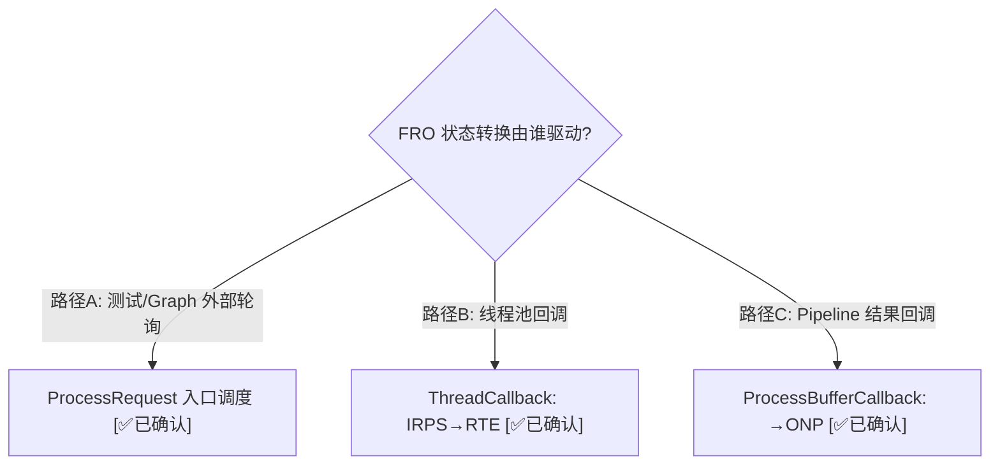

# FRO 十状态状态机 — 以 TestBayerToYUV 为例的完整追踪

> 类型：源码分析
> 置信度底线：本文档最低置信度为 🧠推断 的内容不可作为行动依据

## ❓ 问题背景
Feature2 的核心驱动器是 Feature Request Object (FRO) 的十状态状态机。理解这十个状态及其转换条件，是理解 Feature2 架构的关键。

## 🔍 搜索过程
| 命令 / 动作 | 目标 | 结果摘要 |
|------------|------|---------|
| read chifeature2requestobject.h:48-63 | FRO 状态枚举 | 10+1 个状态 (0-9 + InvalidMax) |
| read chifeature2requestobject.h:88-103 | 合法转换矩阵 | 11×11 bool 表 |
| grep SetCurRequestState chifeature2base.cpp | 状态转换触发点 | ~15 处转换调用 |

## 🌳 决策树


## 💡 分析结论

### 1. 十状态完整定义

| # | 状态 | 缩写 | 含义 | 在等什么 |
|---|------|------|------|---------|
| 0 | Initialized | INIT | FRO 刚创建 | 等 ProcessRequest 首次调用 |
| 1 | ReadyToExecute | RTE | 准备就绪 | 立即可执行 |
| 2 | Executing | EXE | 正在执行 | OnExecuteProcessRequest 运行中 |
| 3 | InputResourcePending | IRP | 等外部输入 | 等 buffer/metadata 从上游或测试到达 |
| 4 | InputResourcePendingScheduled | IRPS | 输入已到达 | 等线程池任务执行 |
| 5 | OutputResourcePending | ORP | 所有 Sequence 完成 | 等 Pipeline 产出 buffer |
| 6 | OutputErrorResourcePending | OERP | 输出等待出错 | 等错误处理完成 |
| 7 | OutputNotificationPending | ONP | 输出已收到 | 等下游确认释放 buffer |
| 8 | OutputErrorNotificationPending | OENP | 通知等待出错 | 等错误传播完成 |
| 9 | Complete | COM | 请求完成 | 无 |

### 2. TestBayerToYUV 正常路径状态追踪

```mermaid
stateDiagram-v2
    direction LR
    [*] --> Initialized: FRO::Create()
    Initialized --> ReadyToExecute: HandlePrepareRequest\n(ValidateRequest + OnPrepareRequest)
    ReadyToExecute --> Executing: HandleExecuteProcessRequest\n(开始执行 Stage)
    Executing --> InputResourcePending: GetDependency()\n(发现外部输入端口)
    InputResourcePending --> InputResourcePendingScheduled: HandleInputResourcePending\n(依赖已满足, PostJob)
    InputResourcePendingScheduled --> ReadyToExecute: ThreadCallback\n(ReleaseDependencies)
    ReadyToExecute --> Executing: HandleExecuteProcessRequest\n(第二次进入)
    Executing --> OutputResourcePending: 无更多 Sequence\n(最后一个 Stage)
    OutputResourcePending --> OutputNotificationPending: HandleOutputResourcePending\n(直接转换)
    OutputNotificationPending --> Complete: HandleOutputNotificationPending\n(AreOutputsReleased == TRUE)
    Complete --> [*]
```

**关键观察：ReadyToExecute → Executing 被经过了两次。**
- 第一次：HandleExecuteProcessRequest 调用 GetDependency()，发现外部输入端口 "RDI_In" 和 "B2Y_Input_Metadata"，状态跳到 InputResourcePending
- 中间：测试的 ProcessGetInputDependencyMessage 提供 buffer → IRPS → 线程池 → RTE
- 第二次：HandleExecuteProcessRequest 真正执行 OnExecuteProcessRequest → SubmitRequestToSession → 发送到 CamX Pipeline

### 3. 三个驱动源

| 驱动源 | 场景 | 代码位置 |
|--------|------|---------|
| **外部轮询** | 测试 do-while 循环反复调 ProcessRequest | feature2testcase.cpp:701-733 |
| **线程池回调** | InputResourcePendingScheduled → ReadyToExecute | chifeature2base.cpp:1198 (ThreadCallback) |
| **Pipeline 结果回调** | Executing → OutputNotificationPending | chifeature2base.cpp:4764 (ProcessBufferCallback) |

### 4. 合法转换矩阵

源码中的 `ChiFeature2RequestStateTransitionTable[11][11]` (chifeature2requestobject.h:88-103) 定义了所有合法转换。`SetCurRequestState` 会检查此表，非法转换会触发 ASSERT。

关键设计：
- **OENP (OutputErrorNotificationPending) 可以转换到几乎任何状态** — 它是错误恢复的"万能中转站"
- **Complete → OENP 是合法的** — 允许已完成的请求在极端情况下重新进入错误处理
- **InvalidMax → 大部分状态都合法** — 用于 Destroy 后的重建场景

## 📍 关键代码位置
- `chi-cdk/core/chifeature2/chifeature2requestobject.h:48-63` — 状态枚举定义
- `chi-cdk/core/chifeature2/chifeature2requestobject.h:88-103` — 合法转换矩阵
- `chi-cdk/core/chifeature2/chifeature2base.cpp:179-262` — ProcessRequest 泵入口
- `chi-cdk/core/chifeature2/chifeature2base.cpp:298-387` — OnProcessRequest 内循环
- `chi-cdk/core/chifeature2/chifeature2base.cpp:1370-1410` — HandlePrepareRequest (INIT→RTE)
- `chi-cdk/core/chifeature2/chifeature2base.cpp:1417-1510` — HandleExecuteProcessRequest (RTE→EXE→IRP/ORP)
- `chi-cdk/core/chifeature2/chifeature2base.cpp:1516-1569` — HandleInputResourcePending (IRP→IRPS)
- `chi-cdk/core/chifeature2/chifeature2base.cpp:1193-1264` — ThreadCallback (IRPS→RTE)
- `chi-cdk/core/chifeature2/chifeature2base.cpp:4764-4885` — ProcessBufferCallback (→ONP)
- `chi-cdk/core/chifeature2/chifeature2base.cpp:1579-1645` — HandleOutputNotificationPending (ONP→COM)
- `chi-cdk/core/chifeature2/chifeature2base.cpp:1712-1740` — CompleteRequest (→COM)

## ⚠️ 待验证事项
- [🧠推断] OERP 和 OENP 的完整错误处理路径未用 TestBayerToYUV 追踪（该用例无错误场景）
- [🧠推断] 多 Sequence 场景下 IRP→IRPS→RTE→EXE 循环的次数与 stageSequenceInfo 的关系需要用 MFNR 例子验证

## 📝 备注
- FRO 的 "batch request" 概念：一个 FRO 可包含多个 request（如 burst capture），每个 request 独立管理状态
- TestBayerToYUV 是 numRequests=1 的最简场景
- 本条目聚焦状态机本身；ProcessRequest 泵模型详见 `feature2-processing-loop`（待创建）
