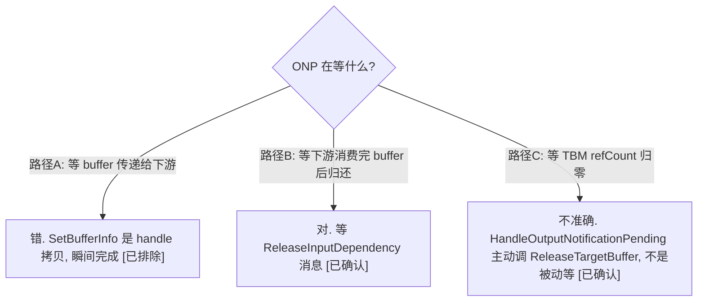
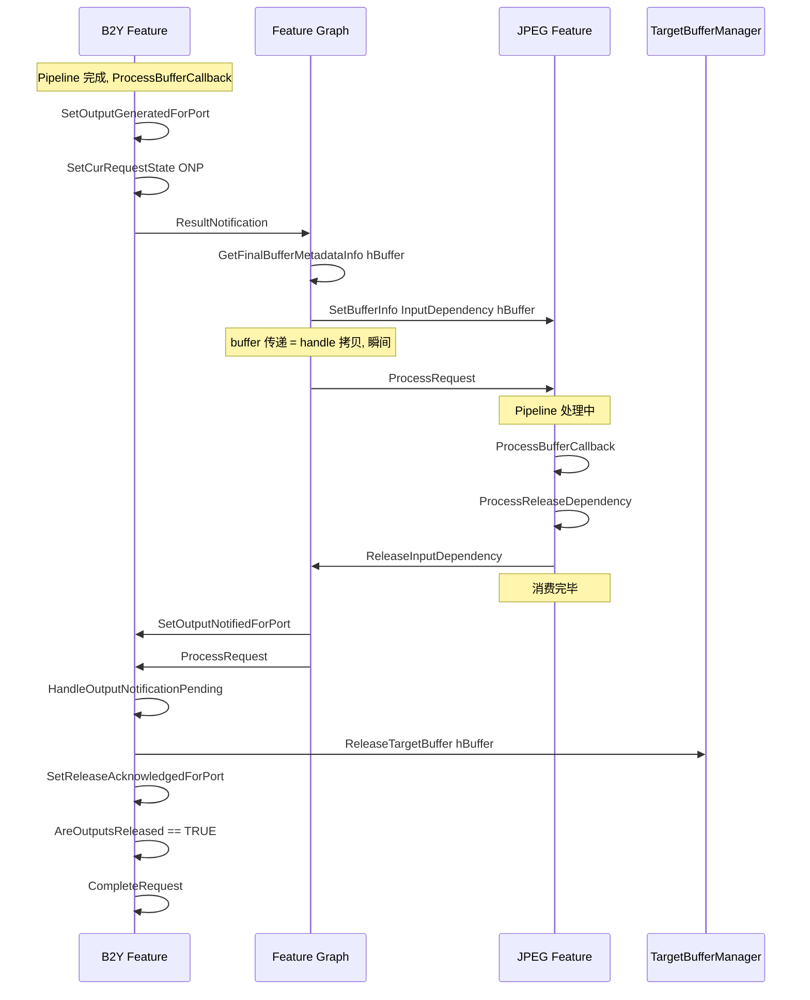

# ONP Buffer 释放机制 — 三标志位 + Graph 路由 + TBM 引用计数

> 类型：源码分析
> 置信度底线：本文档所有结论为 ✅已确认（基于四路并行源码阅读）

## ❓ 问题背景
FRO 的 OutputNotificationPending (ONP) 状态在等什么？为什么不从 ORP 直接到 Complete？"ONP 等的不是 buffer 传递，是下游 Feature 用完 buffer 后归还" 这个论述是否正确？

## 🔍 搜索过程
| 命令 / 动作 | 目标 | 结果摘要 |
|------------|------|---------|
| read chifeature2base.cpp HandleOutputNotificationPending | ONP→Complete 条件 | AreOutputsReleased: numOutputReleased == numRequestOutputs |
| read chifeature2requestobject.h ChiFeature2RequestInfo | per-port 跟踪 | 三组 BOOL 数组 + 三个计数器 |
| read chifeature2graph.cpp ProcessResultMetadataMessage | Graph buffer 路由 | SetBufferInfo(InputDependency, hBuffer) — handle 拷贝 |
| read chifeature2graph.cpp ProcessReleaseInputDependencyMessage | 释放信号回路 | SetOutputNotifiedForPort → ProcessRequest(upstream) |
| read chifeature2base.cpp ProcessBufferCallback | ORP→ONP 触发 | pOutputPorts.empty() && lastStage |
| read chifeature2base.cpp ProcessReleaseDependency | 输入释放 | ExternalInput: 发 ReleaseInputDependency 消息; InternalInput: ReleaseTargetBuffer |

## 🌳 决策树


## 💡 分析结论

### 1. 每个输出端口的三标志位

chifeature2requestobject.h:1604-1626 中 ChiFeature2RequestInfo 结构：

| 标志数组 | 计数器 | 设置函数 | 含义 |
|---------|--------|---------|------|
| pOutputGenerated[i] | numOutputGenerated | SetOutputGeneratedForPort | 本 Feature 已在此端口产出 buffer |
| pOutputNotified[i] | numOutputNotified | SetOutputNotifiedForPort | 下游 Feature 已消费完此 buffer |
| pReleaseAcked[i] | numOutputReleased | SetReleaseAcknowledgedForPort | buffer 已归还 TBM pool |

三个 AreOutputs*() 方法比较各计数器与 numRequestOutputs 是否相等。

### 2. ONP → Complete 的精确条件

HandleOutputNotificationPending (base.cpp:1579-1639) 的逻辑：

```
for each output port:
    if pOutputNotified[i] == TRUE && pReleaseAcked[i] == FALSE:
        ReleaseTargetBuffer(hBuffer)     // TBM refCount--
        SetReleaseAcknowledgedForPort()  // pReleaseAcked[i] = TRUE, numOutputReleased++

if AreOutputsReleased():  // numOutputReleased == numRequestOutputs
    CompleteRequest()     // → state = Complete
```

HandleOutputNotificationPending 是可重入/幂等的 — 可能被多次调用, 每次只处理新变为 notified 的端口。

### 3. Graph 场景下的完整因果链 (B2Y → JPEG)



### 4. 无 Graph 场景 (TestBayerToYUV)

没有下游 Feature, 测试充当消费者:
- ProcessBufferCallback → 设 ONP → 发 ResultNotification → ProcessMessage → 测试回调
- 测试 ProcessResultNotificationMessage 中调 SetOutputNotifiedForPort
- 这发生在 Pipeline 回调线程上, ONP 设置后几乎立即 notified
- 主线程醒来时 HandleOutputNotificationPending → 发现已 notified → ReleaseTargetBuffer → Complete

所以 TestBayerToYUV 的 ONP 非常短暂(测试回调立即 notify), 不等任何下游处理。

### 5. 为什么不能跳过 ONP 直接 ORP → Complete

| 如果没有 ONP | 后果 |
|-------------|------|
| B2Y Complete 时释放 buffer | JPEG 还在 DMA 读 buffer → use-after-free |
| buffer pool 立即回收 | pool 以为 buffer 空闲, 分配给新请求 → 数据覆盖 |
| 无法区分 "HW 未完成" 和 "HW 完成但下游持有" | 调试困难 |

ONP 本质是 inter-Feature buffer 的引用计数等待: 等所有消费者归还引用后才回收。

### 6. ProcessReleaseDependency — Feature 释放自己的输入

ProcessReleaseDependency (base.cpp:4474-4656) 由 ProcessBufferCallback 在最后一个 Stage 的输出全部收到后调用:

- ExternalInput 端口: 发 ReleaseInputDependency 消息给 Graph → Graph 路由到上游 Feature → SetOutputNotifiedForPort
- InternalInput 端口: 直接调 ReleaseTargetBuffer(hBuffer) 释放内部 buffer

这就是 "下游归还 buffer" 的发起点。

## 📍 关键代码位置
- `chi-cdk/core/chifeature2/chifeature2requestobject.h:1604-1626` — ChiFeature2RequestInfo 三标志位定义
- `chi-cdk/core/chifeature2/chifeature2requestobject.cpp:2688-2742` — SetOutputNotifiedForPort
- `chi-cdk/core/chifeature2/chifeature2requestobject.cpp:2874-2920` — SetReleaseAcknowledgedForPort
- `chi-cdk/core/chifeature2/chifeature2requestobject.cpp:2990-3005` — AreOutputsReleased
- `chi-cdk/core/chifeature2/chifeature2base.cpp:1579-1639` — HandleOutputNotificationPending
- `chi-cdk/core/chifeature2/chifeature2base.cpp:4758-4880` — ProcessBufferCallback (ORP→ONP)
- `chi-cdk/core/chifeature2/chifeature2base.cpp:4474-4656` — ProcessReleaseDependency
- `chi-cdk/core/chifeature2/chifeature2graph.cpp:2421-2683` — ProcessResultMetadataMessage (buffer 路由)
- `chi-cdk/core/chifeature2/chifeature2graph.cpp:2276-2416` — ProcessReleaseInputDependencyMessage (释放回路)

## ⚠️ 待验证事项
- [🧠推断] 多输出端口场景 (如 B2Y 有 YUV_Out + YUV_Metadata_Out + YUV_Out2) 下, HandleOutputNotificationPending 被多次调用, 每次处理部分端口 — 未用实际多端口用例验证
- [🧠推断] ReleaseTargetBuffer 的 refCount 归零后 buffer 是否立即可被 pool 复用 — 未深入 TBM 内部验证

## 📝 备注
- TestBayerToYUV 的 ONP 几乎瞬间完成, 因为无下游 Feature, 测试回调立即 notify
- 真实 Graph 场景中 ONP 持续时间 = 下游 Feature 完整 Pipeline 处理时间
- HandleOutputNotificationPending 可重入/幂等: 安全地被多个线程/多次调用
- 三标志位是递进关系: Generated → Notified → Released, 但由不同的触发源在不同时间设置
