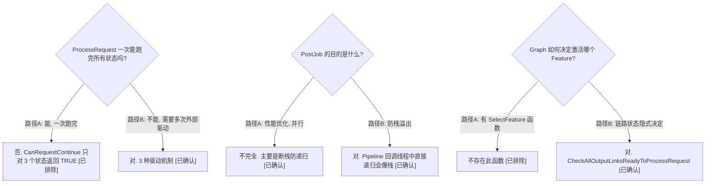

---START---
# ProcessRequest 泵模型 — 谁在推动 FRO 状态前进

> 类型：源码分析
> 置信度底线：本文档所有结论为 ✅已确认（基于三路并行源码阅读）

## ❓ 问题背景
FRO 有 10 个状态，但 ProcessRequest 被调用一次不会跑完全部状态。到底是谁、在什么时机、以什么方式推动状态机前进？

## 🔍 搜索过程
| 命令 / 动作 | 目标 | 结果摘要 |
|------------|------|---------|
| read chifeature2base.cpp ProcessRequest | 主分发逻辑 | switch on state, 调各 Handle 函数 |
| read chifeature2base.cpp OnProcessRequest | 同步快速路径 | do-while + CanRequestContinue |
| read chifeature2base.cpp CanRequestContinue | 同步循环门控 | TRUE for Initialized/RTE/Executing only |
| read chifeature2base.cpp ThreadCallback | PostJob 异步重入 | IRPS→RTE→OnProcessRequest |
| read feature2testcase.cpp RunFeature2Test | 外部泵 | do-while 轮询 + ProcessRequest |
| read chifeature2graph.cpp 全文 | Graph 驱动点 | 5 处 ProcessRequest 调用 |

## 🌳 决策树


## 💡 分析结论

### 1. ProcessRequest 是分发器, 不是执行器

ProcessRequest (base.cpp:179) 的 switch 结构:

| FRO 状态 | 分发到 | 行号 |
|----------|--------|------|
| InputResourcePending | HandleInputResourcePending | 204 |
| OutputResourcePending / ONP / OENP | HandleOutputNotificationPending | 215 |
| Initialized | OnProcessRequest | 226 |
| Complete | OnProcessingDependenciesComplete | 235 |

### 2. 同步快速路径 — do-while + CanRequestContinue

OnProcessRequest (base.cpp:298) 内有 do-while 循环:

```
do {
    switch(state):
        Initialized  → HandlePrepareRequest  → state=RTE
        RTE/Executing → HandleExecuteProcessRequest → state=Executing/IRP/ORP
} while (CanRequestContinue(state))
```

CanRequestContinue (base.cpp:5296) 对以下 3 个状态返回 TRUE:
- Initialized
- ReadyToExecute
- Executing

这意味着**一次 ProcessRequest 调用可同步跑完 INIT→RTE→EXE**, 直到碰到 IRP/ORP 等待点才停。

### 3. 三种推进机制

| 机制 | 触发者 | 同步/异步 | 跨越的状态 | 代码位置 |
|------|--------|-----------|-----------|---------|
| do-while 同步循环 | OnProcessRequest 内部 | 同步 (同一调用栈) | INIT→RTE→EXE | base.cpp:298-387 |
| PostJob → ThreadCallback | 线程池 | 异步 (断栈) | IRP→IRPS→RTE→EXE | base.cpp:1553→3871→1198→1229 |
| 外部泵 | 测试 do-while / Graph 消息路由 | 外部调用 | 任何等待点→下一阶段 | feature2testcase.cpp:702 / graph.cpp:多处 |

### 4. PostJob 断栈防递归

HandleInputResourcePending 发现依赖满足后不直接调 OnProcessRequest, 而是:

```
HandleInputResourcePending (base.cpp:1522)
  → deps met → state=IRPS (CAS 防重入) → HandlePostJob (base.cpp:1553)
    → m_pThreadManager->PostJob(m_hFeatureJob, ...) (base.cpp:3871)
        ↓ [线程池异步]
    ThreadCallback (base.cpp:1198)
      → ReleaseDependenciesOnInputResourcePending
      → state=ReadyToExecute (base.cpp:1228)
      → OnProcessRequest(fro, requestId) (base.cpp:1229)
```

IRPS 是 CAS 锁状态: 防止多个线程同时看到 IRP→deps met, 导致多次 PostJob。

### 5. TestBayerToYUV 完整泵周期 (无 Graph)

```
外部泵 #1: Test calls ProcessRequest [state=Initialized]
  └→ OnProcessRequest 同步快速路径:
       INIT → HandlePrepareRequest → state=RTE → 循环
       RTE  → HandleExecuteProcessRequest → state=EXE → submit to pipeline
              → GetDependency → state=IRP → CanRequestContinue=FALSE → 退出
  └→ 返回

[等待: Pipeline DummyNode fence signal → 依赖满足]

外部泵 #2: Test polls, calls ProcessRequest [state=IRP]
  └→ HandleInputResourcePending → deps met → state=IRPS → PostJob → 返回

[PostJob 异步重入: ThreadCallback fires]
  └→ state=RTE → OnProcessRequest 同步快速路径:
       RTE → HandleExecuteProcessRequest → state=EXE → submit to pipeline
             → 无更多 sequence → state=ORP → CanRequestContinue=FALSE → 退出

[等待: Pipeline DummyNode → ProcessBufferCallback → state=ONP → ResultNotification]

外部泵 #3: Test polls, calls ProcessRequest [state=ONP]
  └→ HandleOutputNotificationPending → release buffers → CompleteRequest → state=Complete

Test loop 退出
```

**3 次外部泵调用 + 1 次 PostJob 异步重入 = 驱动完 10 个状态的完整生命周期**

### 6. Graph 场景 — 5 个 ProcessRequest 触发点

| 标识 | 函数 | 行号 | 触发条件 | 含义 |
|------|------|------|---------|------|
| A | WalkAllExtSrcLinks | graph.cpp:962 | URO state=InputConfigPending, 客户端提供输入 buffer | 初始 kick-start |
| B | ProcessUpstreamFeatureRequest | graph.cpp:1498 | WalkBackFromLink 确认节点所有下游已声明需求 | 反向激活上游 Feature |
| C | ProcessReleaseInputDependencyMessage | graph.cpp:2371 | 下游 Feature 释放输入依赖 | 通知上游 "我用完你的 buffer 了" |
| D | ProcessResultMetadataMessage | graph.cpp:2670 | 内部链路结果传递 | 将 buffer/metadata 传给下游并激活 |
| E | ProcessProcessingDependenciesCompleteMessage | graph.cpp:2722 | 下游处理完成 | 通知上游处理链完成 |

### 7. Graph 反向激活 — WalkBackFromLink

WalkBackFromLink (graph.cpp:1077) 是 Graph 的**递归图遍历引擎**, 从 sink 向 source 反向走:

```
WalkBackFromLink(outputLink)
  ├─ ExternalSource? → 终止 (base case)
  ├─ 所有 output link 都 Disabled? → 禁用此节点所有 input link → 递归上游
  └─ CheckAllOutputLinksReadyToProcessRequest? → 创建 FRO → ProcessRequest(FRO)
```

激活门控 CheckAllOutputLinksReadyToProcessRequest (graph.cpp:2881):
- 至少 1 个 output link 为 OutputPending (有人需要输出)
- 所有 output link 为 OutputPending 或 Disabled (无 NotVisited 的)
- 含义: 所有下游消费者已声明完输入需求, 可以安全激活

### 8. 测试框架的外部泵

feature2testcase.cpp:702-733 的 do-while 循环:

| 状态 | 动作 |
|------|------|
| Initialized, IRP, ONP, OENP | 调 ProcessRequest (主动推进) |
| ORP, IRPS, Executing, RTE | TimedWait(500ms) (被动等待内部状态转换) |
| Complete | 退出循环 |

注意: 条件变量从未被 Signal, TimedWait 纯粹是 500ms sleep 后轮询。真实 Android 中 Graph 异步驱动, 无此轮询。

### 9. ProcessMessage 回调不调 ProcessRequest

测试的 ProcessMessage (feature2offlinetest.cpp:546-625) 处理 5 种消息类型:
- GetInputDependency → 提供 buffer/metadata
- ResultNotification → 接收输出
- ReleaseInputDependency → 释放 buffer
- SubmitRequestNotification → 提交到 Pipeline
- MetadataNotification → no-op

**没有任何一处回调 ProcessRequest**。泵的职责完全在外层 do-while 循环。

## 📍 关键代码位置
- `chi-cdk/core/chifeature2/chifeature2base.cpp:179-262` — ProcessRequest 主分发器
- `chi-cdk/core/chifeature2/chifeature2base.cpp:298-387` — OnProcessRequest 同步快速路径
- `chi-cdk/core/chifeature2/chifeature2base.cpp:5296-5314` — CanRequestContinue (3 个状态返回 TRUE)
- `chi-cdk/core/chifeature2/chifeature2base.cpp:1376-1418` — HandlePrepareRequest → state=RTE
- `chi-cdk/core/chifeature2/chifeature2base.cpp:1423-1517` — HandleExecuteProcessRequest → submit pipeline
- `chi-cdk/core/chifeature2/chifeature2base.cpp:1522-1569` — HandleInputResourcePending → PostJob
- `chi-cdk/core/chifeature2/chifeature2base.cpp:1198-1240` — ThreadCallback (PostJob 目标)
- `chi-cdk/core/chifeature2/chifeature2base.cpp:3871` — HandlePostJob → m_pThreadManager->PostJob
- `chi-cdk/core/chifeature2/chifeature2base.cpp:6383` — RegisterJobFamily(ThreadCallback)
- `chi-cdk/core/chifeature2/chifeature2graph.cpp:103-132` — ExecuteProcessRequest (Graph 入口)
- `chi-cdk/core/chifeature2/chifeature2graph.cpp:1077-1133` — WalkBackFromLink (反向激活)
- `chi-cdk/core/chifeature2/chifeature2graph.cpp:2881-2905` — CheckAllOutputLinksReadyToProcessRequest
- `chi-cdk/core/chifeature2/chifeature2graph.cpp:1658-1716` — ProcessFeatureMessage (消息路由)
- `chi-cdk/test/chifeature2testcase/feature2testcase.cpp:702-733` — 测试泵 do-while 循环

## ⚠️ 待验证事项
- [🧠推断] 多 requestId 场景 (MFNR 多帧) 下 ProcessRequest 的 do-while(requestId++) 遍历逻辑 — 单帧测试不触发
- [🧠推断] HandleBatchRequest (base.cpp:251) 在多 requestId 时的批量依赖处理 — 未用多帧用例验证

## 📝 备注
- OnProcessRequest 无子类覆写 — 全 codebase 无 override
- OnPrepareRequest (虚函数, HandlePrepareRequest 中调用) 基类空实现, 子类可选覆写
- IRPS 是 CAS 锁状态, 不是真正的处理状态 — 仅防多线程重复 PostJob
- TestBayerToYUV 的 ProcessMessage 回调不调 ProcessRequest, 泵的职责完全在测试 do-while 循环
- 真实 Graph 场景中, Graph 的 5 个触发点完全替代了测试的 do-while 循环
---END---