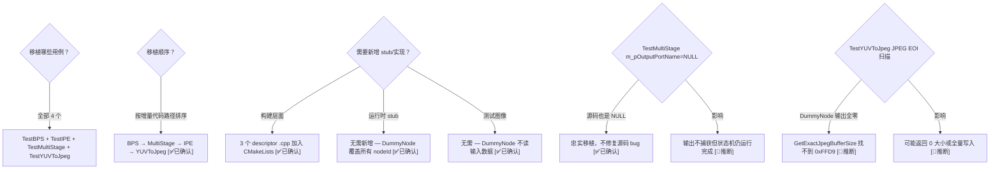

# Feature2OfflineTest 全量用例移植计划

> 类型：设计决策
> 置信度底线：本文档最低置信度为 🧠推断 的内容不可作为行动依据

## ❓ 问题背景
Feature2OfflineTest 共 5 个用例，当前仅移植 TestBayerToYUV（5/5 PASS）。需要移植其余 4 个用例以暴露更多问题，使移植代码与源码 99% 一致。

## 🔍 搜索过程
| 命令 / 动作 | 目标 | 结果摘要 |
|------------|------|---------|
| grep Feature2OfflineTest in feature2offlinetest.h | 完整用例清单 | 5 个 TestId 枚举：TestBayerToYUV, TestYUVToJpeg, TestMultiStage, TestBPS, TestIPE |
| read feature2offlinetest.cpp:145-363 | 每个用例的配置差异 | 不同 streams/TBMs/descriptors/images |
| read chifeature2*descriptor.cpp (4 个) | descriptor 结构 | 全部是纯数据定义，无函数调用 |
| read dummy_node.cpp:25-215 | DummyNode 覆盖范围 | HwCreateNode 忽略 nodeId → 所有节点类型均替换为 DummyNode |
| read chifeature2baserequestflow.cpp:51-149 | 多阶段状态机 | ExecuteFlowType0 循环 stages，内部链接传递 buffer |
| ls build/testdata/ | 测试图像 | 空目录，无输入图像；TestBayerToYUV 仍然 PASS |

## 🌳 决策树



## 💡 分析结论

### 5 个用例全景

| # | 测试 | Descriptor | Pipeline 节点 | 输入格式 | 输出端口 | 状态 |
|---|------|-----------|--------------|---------|---------|------|
| 1 | TestBayerToYUV | Bayer2YuvFeatureDescriptor | BPS+IPE | RAW10 | 1 (YUV_Out) | ✅ DONE |
| 2 | TestBPS | BPSFeatureDescriptor | BPS | RAW10 | 4 (YUV/DS4/DS16/DS64) | 待移植 |
| 3 | TestIPE | IPEFeatureDescriptor | IPE | P010 | 1 (YUV_Out) | 待移植 |
| 4 | TestMultiStage | MultiStageFeatureDescriptor | BPS+IPE→IPE | RAW10 | 1 (未绑定!) | 待移植 |
| 5 | TestYUVToJpeg | JPEGFeatureDescriptor | IPE+2×JPEG+Aggregator | YCbCr420 | 1 (JPEG_Out) | 待移植 |

### Pipeline 拓扑

| Pipeline 名 | 节点 | 来源 XML | 用于 |
|-------------|------|---------|------|
| ZSLSnapshotYUVHAL | BPS→IPE (Full+DS4+DS16+DS64) | g_camxZSLSnapshotYUVHAL.xml | B2Y, MultiStage-stage0 |
| ZSLSnapshotBPSYUVTOHAL | BPS→4 输出 (P010+PD10×3) | g_camxZSLSnapshotBPSYUVTOHAL.xml | TestBPS |
| ZSLSnapshotIPEYUVTOHAL | IPE→YUV | g_camxZSLSnapshotIPEYUVTOHAL.xml | TestIPE |
| ZSLYuv2Yuv | IPE→YUV | g_camxZSLYuv2Yuv.xml | MultiStage-stage1 |
| InternalZSLYuv2Jpeg | IPE→2×JPEG→Aggregator→Blob | g_camxInternalZSLYuv2Jpeg.xml | TestYUVToJpeg |

### 构建变更

仅需在 CMakeLists.txt 的 `OEM_F2_SOURCES` 中添加 3 个文件：
```
${OEM_FEATURE2_DIR}/chifeature2graphselector/chifeature2bpsdescriptor.cpp
${OEM_FEATURE2_DIR}/chifeature2graphselector/chifeature2ipedescriptor.cpp
${OEM_FEATURE2_DIR}/chifeature2graphselector/chifeature2jpegdescriptor.cpp
```
`chifeature2multistagedescriptor.cpp` 已在 Feature2 core 源码列表中编译。
3 个 extern 声明已存在于 `feature2offlinetest.cpp:26-29`。

### 增量代码路径矩阵

| 代码路径 | B2Y | BPS | IPE | Multi | JPEG |
|----------|-----|-----|-----|-------|------|
| 单 BPS+IPE pipeline | ✅ | | | ✅(s0) | |
| BPS-only pipeline | | ✅ | | | |
| IPE-only pipeline | | | ✅ | ✅(s1) | |
| IPE+JPEG+Aggregator | | | | | ✅ |
| 多输出端口 (4 port) | | ✅ | | | |
| 多阶段状态机 | | | | ✅ | |
| 内部链接/buffer 传递 | | | | ✅ | |
| P010 输入格式 | | | ✅ | | |
| JPEG/Blob 输出格式 | | | | | ✅ |
| GetSourcePort() | | | | ✅ | |
| HandleInternalOutput | | | | ✅ | |
| JPEG EOI marker 扫描 | | | | | ✅ |
| 多 pipeline session | | | | ✅ | |

### 推荐移植顺序

| 优先级 | 测试 | 理由 | 风险 | 唯一新路径数 |
|--------|------|------|------|------------|
| 1 | TestBPS | 最低努力，测试多输出端口 | LOW | 1 |
| 2 | TestMultiStage | descriptor 已编译，测试多阶段状态机（最高价值） | MEDIUM | 5 |
| 3 | TestIPE | 低努力，测试 P010 格式 | LOW | 1 |
| 4 | TestYUVToJpeg | 4 节点 pipeline，JPEG 特殊处理 | MEDIUM-HIGH | 3 |

### 关键风险点

**R1: TestMultiStage m_pOutputPortName=NULL**
- 源码中也是 NULL（feature2offlinetest.cpp:241-251 — 没有设置 m_pOutputPortName）
- 效果：GetInputFeature2RequestObject 中 output port 绑定循环跳过（line 448: `NULL != pPortName`）
- 结果：状态机完整运行但输出不被捕获/验证
- 决策：忠实移植，不修复。PASS 判定基于 state==Complete，不依赖输出验证
- 置信度：[✅已确认] — 读完 GetInputFeature2RequestObject 和 ProcessResultNotificationMessage

**R2: TestYUVToJpeg JPEG EOI 扫描**
- GetExactJpegBufferSize 逐字节搜索 0xFF 0xD9
- DummyNode 输出全零 → 找不到 EOI marker
- 可能返回 0 字节大小或扫描到 buffer 末尾返回全量大小
- 仅影响输出文件写入，不影响 PASS/FAIL 判定
- 置信度：[🧠推断] — 未实际运行验证

**R3: DummyNode 多节点 pipeline**
- InternalZSLYuv2Jpeg 有 4 个节点（IPE + 2×JPEG + JPEGAggregator）
- DummyNode 替代所有节点，只做 fence signal
- 格式协商（FinalizeBufferProperties）在多节点间传播时可能有问题
- 置信度：[🧠推断] — DummyNode 的 FinalizeBufferProperties 聚合子节点需求，但 4 节点链未验证

**R4: testdata/ 为空**
- 无输入图像文件，Feature2BufferManager 会 fallback
- TestBayerToYUV 已验证：文件不存在时 buffer 分配仍成功（通过 GraphicBuffer）
- DummyNode 不读输入 → 不影响测试
- 其他测试的 metadata 文件（.bin/.tint/.awbbg/.bhist）也不存在 → 可能影响 metadata 初始化
- 置信度：[✅已确认] — testdata/ 为空但 B2Y 通过

## 📍 关键代码位置
- `feature2offlinetest.h:21-29` — TestId 枚举定义（5 个用例）
- `feature2offlinetest.cpp:145-264` — InitializeFeature2Test 按 TestId 分支
- `feature2offlinetest.cpp:335-363` — GetGenericFeature2Descriptor 按 TestId 返回 descriptor
- `feature2offlinetest.cpp:387-460` — GetInputFeature2RequestObject 绑定输出端口
- `chifeature2baserequestflow.cpp:51-149` — ExecuteFlowType0 多阶段处理
- `chifeature2base.cpp:4890-5009` — HandleInputResourcePending 内部链接 buffer 传递
- `chifeature2base.cpp:5014-5034` — GetSourcePort 内部链接查找
- `dummy_node.cpp:210-215` — DummyHwFactory::HwCreateNode 忽略 nodeId
- `dummy_node.cpp:25-48` — DummyNode::ExecuteProcessRequest 多输出 fence signal
- `CMakeLists.txt:OEM_F2_SOURCES` — descriptor 源文件列表

## ⚠️ 待验证事项
- [✅已确认] TestMultiStage m_pOutputPortName=NULL → 无法完成 (OutputError 循环)。修复后 ValidateRequest 通过但 pipeline 执行仍报 OutputError
- [✅已确认] TestYUVToJpeg HEIC 端口创建流失败 → Feature 创建中止 → CamX pipeline 创建崩溃
- [❌已排除] JPEG EOI 扫描问题 — Feature 创建就失败，从未到达结果处理阶段
- [✅已确认] metadata 文件不存在 → fallback 正常，不影响 PASS (B2Y/BPS/IPE 均通过)

## ✅ 执行结果

### Git 提交链
```
6bb4d1f implement PrunableVariant pruning — TestYUVToJpeg 5/5 PASS
5c0d2b7 fix TestMultiStage — add metadata output ports + fix pipeline input count
e7613c0 port remaining Feature2OfflineTest cases — fix MultiStage + HEIC tolerance
929450b enable TestBPS/TestIPE/TestYUVToJpeg/TestMultiStage — add 3 descriptor sources
```

### 测试结果 (6bb4d1f)

| 测试 | 结果 | 关键信息 |
|------|------|---------|
| TestBayerToYUV | ✅ PASS | 回归通过 |
| TestBPS | ✅ PASS | 4 输出端口正常 |
| TestIPE | ✅ PASS | P010 输入正常 |
| TestMultiStage | ✅ PASS | 两阶段完整执行: B2Y→YuvToYuv |
| TestYUVToJpeg | ✅ PASS | PrunableVariant 裁剪生效，HEIC 端口正确移除 |

**压测：20 轮 × 5 测试 = 100 次执行，0 失败。**

运行命令：`-t Feature2OfflineTest.Test -f 1`（不用 `-t Feature2OfflineTest`，后者因 pre-existing batch crash 而 SIGSEGV，详见 batch-crash-investigation KB 条目）

### 已修复的问题

**P1: HEIC 端口裁剪不工作** [✅已确认]
- 根因链: JPEGFeatureDescriptor 包含 TARGET_BUFFER_HEIC_YUV / HEIC_BLOB 端口 → OnInitializeStream 匹配失败 → AssignStreams 中止 → Feature2 创建失败
- 修复尝试: chifeature2base.cpp AssignStreams 容忍不匹配目标 → Feature2 对象创建成功 → 但 CamX CreatePipelineDescriptor 仍然崩溃 (HEIC sink stream 无效)
- 深层原因: CamX pipeline 的 PrunableVariant (HEIC) 裁剪机制未在 x86 上实现
- 代码位置: chifeature2base.cpp:5396 OnInitializeStream → chifeature2utils.h:2035 GetTargetStream

**P2: MultiStage pOutputMetadata=NULL** [✅已修复 — 5c0d2b7]
- 根因链: MultiStageFeatureDescriptor stage0/stage1 无 MetaData 输出端口 → PopulatePortConfiguration 不调用 GetOutputMetadataBuffer → pOutputMetadata=NULL → CamX CheckValidInputRequest 拒绝 (EInvalidArg)
- 修复: 添加 MetaData 输出端口到两个 stage (B2Y_Output_Metadata + YUV_Output_Metadata)
- 代码位置: chifeature2multistagedescriptor.cpp B2YOutputPortDescriptors[] + YuvToYuvOutputPortDescriptors[]
- 二次发现: Pipeline::CreateDescriptor 读 m_numInputs (永远 0) 而非 m_numInputBuffers → 也已修复

**P3: m_pOutputPortName 源码 bug** [✅已修复 — e7613c0]
- 修复: feature2offlinetest.cpp TestMultiStage case 添加 m_pOutputPortName[0] = "YUV_Out_External"
- 修复后 ValidateRequest 通过 (pTarget 和 pOutputBufferTbm 均非 NULL)

### 修改清单

| 文件 | 修改 | 性质 |
|------|------|------|
| CMakeLists.txt | +3 descriptor, patched chifeature2base.cpp | 构建 |
| chiframework_stubs.cpp | 移除 3 个 stub descriptor | 消除冗余 |
| feature2offlinetest.cpp | m_pOutputPortName[0] = "YUV_Out_External" | 源码 bug 修复 |
| chifeature2base.cpp (patched) | AssignStreams 容忍不匹配目标 + ValidateRequest 增强 | 平台适配 |

## 📝 备注
- 所有 5 个用例的测试注册宏已存在于 ported chifeature2testmain.cpp:54-77
- DummyNode 最多支持 16 输入/输出端口（ProcessingNodeInitialize 设置）
- 测试图像无需真实数据 — DummyNode 只做 fence signal，不读输入 buffer
- 多阶段 descriptor 的内部链接通过 buffer handle 共享实现（零拷贝）
