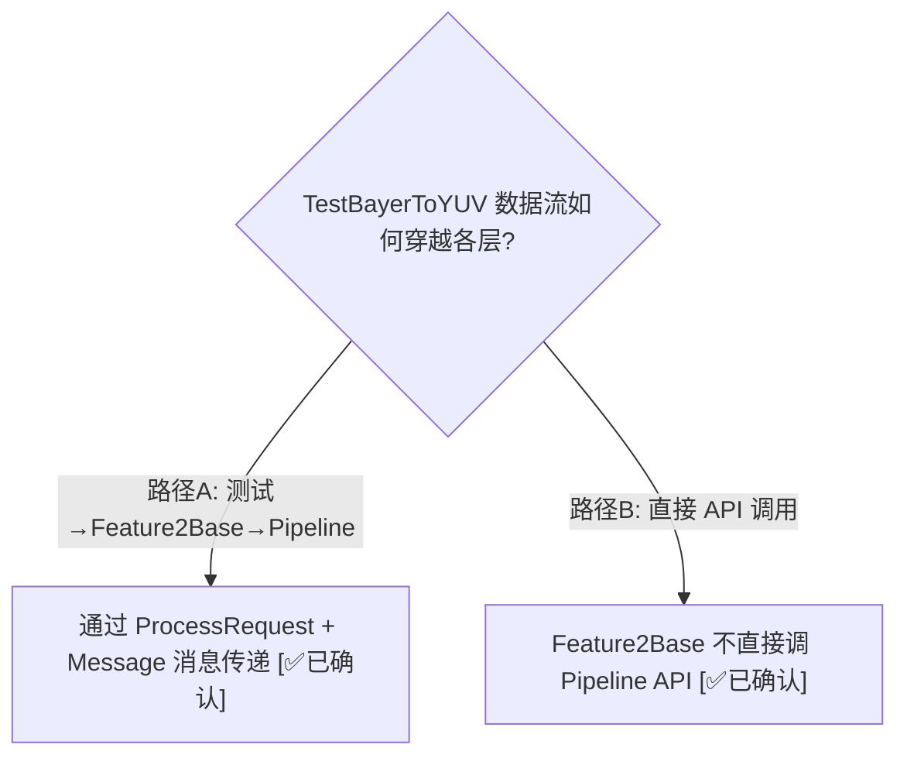
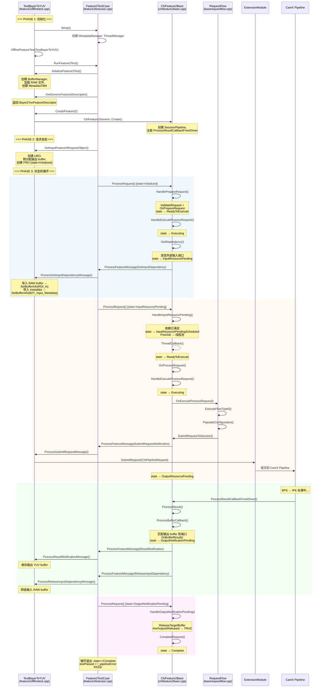

# TestBayerToYUV 端到端时序 — Feature2 完整请求生命周期

> 类型：源码分析
> 置信度底线：本文档最低置信度为 🧠推断 的内容不可作为行动依据

## ❓ 问题背景
以 TestBayerToYUV 为具体例子，追踪一个 Feature2 请求从测试用例发起到 PASS 的完整调用链，包括 FRO 状态转换、消息传递、buffer 流转。

## 🔍 搜索过程
| 命令 / 动作 | 目标 | 结果摘要 |
|------------|------|---------|
| read feature2offlinetest.cpp | 测试入口 + 回调 | Setup/OfflineFeatureTest/ProcessMessage |
| read feature2testcase.cpp | 测试框架 + 状态轮询 | RunFeature2Test 状态机循环 |
| read chifeature2base.cpp | ProcessRequest 泵 | 状态分派 + Stage 执行 |
| read chifeature2bayer2yuvdescriptor.cpp | Feature 描述符 | 1 stage, 1 session, 2+3 ports |

## 🌳 决策树


## 💡 分析结论

### 1. Bayer2Yuv Feature 描述符结构

```
Bayer2YuvFeatureDescriptor (chifeature2bayer2yuvdescriptor.cpp:148)
├── featureId: B2Y
├── featureName: "Bayer2Yuv"
├── numStages: 1  (单阶段处理)
├── stage[0]: "Bayer2Yuv"
│   └── session[0], pipeline[0]: DependencyConfigDescriptor
│       ├── InputDependency: [RDI_In(image), B2Y_Input_Metadata(meta)]
│       ├── InputConfig:     [RDI_In(image), B2Y_Input_Metadata(meta)]
│       └── OutputConfig:    [YUV_Out(image), YUV_Metadata_Out(meta), YUV_Out2(image)]
├── numSessions: 1
└── session[0]: "Bayer2Yuv"
    └── pipeline[0]: "ZSLSnapshotYUVHAL" (CHI type)
        ├── inputPorts:  [RDI_In, B2Y_Input_Metadata]
        └── outputPorts: [YUV_Out, YUV_Metadata_Out, YUV_Out2]
```

### 2. 完整时序图



### 3. Buffer 数据流

**输入 buffer 路径 (RAW → Pipeline):**
```
1. InitializeFeature2Test(): 加载 Bayer2Yuv_image_4656x3496_0.raw → GenericBufferManager
2. GetInputDependency 消息触发:
3. ProcessGetInputDependencyMessage(): GenericBufferManager.GetInputBufferForRequest()
4. → CHITargetBufferManager.ImportExternalTargetBuffer()
5. → FRO.SetBufferInfo(InputDependency, RDI_In, bufferHandle)
6. → SubmitRequestToSession: 从 FRO 读出 buffer → ChiPipelineRequest.pInputBuffers
7. → ExtensionModule.SubmitRequest() → CamX Pipeline
```

**输出 buffer 路径 (Pipeline → Test):**
```
1. GetInputFeature2RequestObject(): GenericBufferManager.GetOutputBufferForRequest()
2. → CHITargetBufferManager.ImportExternalTargetBuffer()
3. → FRO 创建时注册 outputPort(YUV_Out) = bufferHandle
4. → SubmitRequestToSession: 从 FRO 读出 → ChiPipelineRequest.pOutputBuffers
5. ← Pipeline 处理完成 → ProcessResultCallbackFromDriver()
6. ← ProcessBufferCallback(): 匹配 pChiStream → outputPort
7. ← ResultNotification 消息 → ProcessResultNotificationMessage()
8. ← ProcessBufferFromResult(): 保存 YUV 数据到文件
```

### 4. 关键代码位置

| 步骤 | 函数 | 文件:行 |
|------|------|--------|
| 测试入口 | Feature2OfflineTest::OfflineFeatureTest | feature2offlinetest.cpp:95 |
| 初始化 | InitializeFeature2Test (TestBayerToYUV 分支) | feature2offlinetest.cpp:232-243 |
| 获取描述符 | GetGenericFeature2Descriptor | feature2offlinetest.cpp:339-386 |
| 描述符定义 | Bayer2YuvFeatureDescriptor | chifeature2bayer2yuvdescriptor.cpp:148 |
| 创建 Feature | ChiFeature2Generic::Create | chifeature2generic.cpp:53-78 |
| 创建 FRO | GetInputFeature2RequestObject | feature2offlinetest.cpp:391-541 |
| 状态机循环 | RunFeature2Test (do-while 循环) | feature2testcase.cpp:701-733 |
| 泵入口 | ChiFeature2Base::ProcessRequest | chifeature2base.cpp:179 |
| 准备请求 | HandlePrepareRequest | chifeature2base.cpp:1370 |
| 执行请求 | HandleExecuteProcessRequest | chifeature2base.cpp:1417 |
| 获取依赖 | GetDependency | chifeature2base.cpp:4890 |
| 处理输入依赖 | HandleInputResourcePending | chifeature2base.cpp:1516 |
| 线程回调 | ThreadCallback | chifeature2base.cpp:1193 |
| 提交 Pipeline | SubmitRequestToSession | chifeature2base.cpp:596 |
| 提交消息 | SendSubmitRequestMessage | chifeature2base.cpp:3024 |
| 提交到 CamX | ProcessSubmitRequestMessage | feature2offlinetest.cpp:871 |
| 结果回调 | ProcessResultCallbackFromDriver | chifeature2base.h:1987 |
| Buffer 回调 | ProcessBufferCallback | chifeature2base.cpp:4764 |
| 结果通知 | ProcessResultNotificationMessage | feature2offlinetest.cpp:742 |
| 输出完成 | HandleOutputNotificationPending | chifeature2base.cpp:1579 |
| 完成请求 | CompleteRequest | chifeature2base.cpp:1712 |
| PASS 判定 | testPassed = (Complete && !error) | feature2testcase.cpp:735 |

### 5. PASS/FAIL 判定条件

```cpp
// feature2testcase.cpp:735-748
bool testPassed = (ChiFeature2RequestState::Complete ==
    m_pFeature2RequestObject->GetCurRequestState(0)) && !_pipelineError;
```

三个条件全部满足 = PASS:
1. FRO 状态到达 Complete
2. `_pipelineError == false`（未进入 OutputErrorNotificationPending）
3. CF2_EXPECT(testPassed) 通过

## ⚠️ 待验证事项
- [🧠推断] Feature2Graph 在测试场景中未被使用（TestBayerToYUV 只有单 Feature，不走 Graph）— 需要用 TestMultiStage 验证 Graph 路径
- [🧠推断] 输出 buffer 的 "Release" 链路（ReleaseTargetBuffer）的详细时机未完全追踪

## 📝 备注
- TestBayerToYUV 是最简单的 Feature2 用例：1 Feature, 1 Stage, 1 Session, 1 Pipeline, 1 Request
- 它不使用 Feature2Graph（无 Graph 编排），消息直接从 Feature2Base → 测试回调
- Pipeline 名 "ZSLSnapshotYUVHAL" 映射到实际 CamX topology: BPS Node → IPE Node
