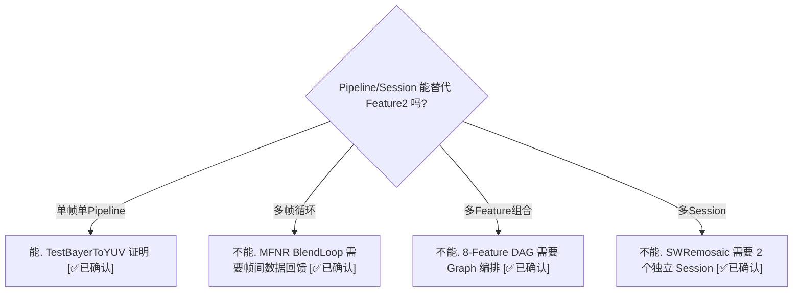

# Feature2 解决了什么问题 — Pipeline/Session 的能力边界与 Feature2 的价值

> 类型：源码分析
> 置信度底线：本文档所有结论均为 ✅已确认（基于 Feature Descriptor 源码阅读）

## ❓ 问题背景
TestBayerToYUV 只使用 1 个 Pipeline (ZSLSnapshotYUVHAL = BPS→IPE)，Pipeline/Session 已经能执行单帧处理并管理依赖。为什么还需要 Feature2 框架？

## 🔍 搜索过程
| 命令 / 动作 | 目标 | 结果摘要 |
|------------|------|---------|
| read chifeature2bayer2yuvdescriptor.cpp | B2Y 描述符 | 1 stage, 1 session, 0 internal links |
| read chifeature2mfnrdescriptor.cpp | MFNR 描述符 | 4 stages, 3 pipelines, 14 internal links |
| read chifeature2mfsrdescriptor.cpp | MFSR 描述符 | 4 stages, 3 pipelines, 17 internal links |
| read chifeature2graphdescriptors.cpp | Graph 描述符 | 最复杂: 8 features, 17 graph links |
| read chifeature2realtimedescriptor.cpp | RealTime 描述符 | SW Remosaic: 2 stages, 2 sessions |
| read chifeature2hdrtype1descriptor.cpp | HDR 描述符 | 1 stage, 3 YUV 帧合成 |

## 🌳 决策树


## 💡 分析结论

### 1. Pipeline/Session 的能力边界

Pipeline/Session 是 **同构多帧执行器**：每帧走相同的 Node DAG 拓扑，能做：
- 定义 Node DAG（BPS→IPE），连续处理多帧（如 Preview 连续跑几百帧）
- 用 DRQ 管理帧内依赖，支持跨帧 Property 依赖（如等前一帧 3A 结果）
- 用 Fence 同步完成
- Node 可跨帧维护内部状态

不能做（Feature2 补齐的 gap）：
| Pipeline 的限制 | 原因 | Feature2 如何解决 |
|----------------|------|-------------------|
| 不同帧不能走不同 Pipeline 拓扑 | Pipeline 拓扑创建时固定 | Stage 机制：不同 Stage 绑定不同 Pipeline |
| 无法 "N 帧→1 帧" 聚合 | 一次 SubmitRequest 处理一帧 | Stage/Sequence 漏斗：收集 N 次输出再送下一步 |
| DAG 无环，不能循环迭代 | Pipeline 是有向无环图 | BlendLoop Stage 循环执行 |
| 不同 Feature 无法串联 | Pipeline 边界独立 | Feature Graph 组成 DAG，消息传递 buffer |
| 外部异步数据无法编排 | DRQ 只管帧内依赖 | FRO 状态机 + ChiFence 异步等待 |

### 2. 三个具体例子

#### 例 1: MFNR — 4 阶段 × 3 Pipeline × 14 内部链路

```
MFNR Feature Descriptor (chifeature2mfnrdescriptor.cpp)
├── numStages: 4
│   Stage 0: Prefilter   ── Pipeline: MfnrPrefilter
│   Stage 1: BlendInit   ── Pipeline: MfnrBlend
│   Stage 2: BlendLoop   ── Pipeline: MfnrBlend (复用)
│   Stage 3: Postfilter  ── Pipeline: MfnrPostFilter
├── numSessions: 1
├── numPipelines: 3
└── numInternalLinks: 14

数据流:
RAW帧×8 → Prefilter(FULL/DS4/DS16/DS64/REG金字塔)
              ↓ (5条内部链路)
         BlendInit(初始化混合参考帧)
              ↓ (5条内部链路)
         BlendLoop ←→ 循环N次(累积降噪)
              ↓ (4条内部链路)
         Postfilter → 最终 YUV 输出
```

#### 例 2: Feature Graph — 8 Feature 组成拍照 DAG

最复杂 Graph: RTMFSRHDRT1JPEGFeatureGraph

```
RealTime → AnchorSync → Demux → MFSR → Serializer → HDRT1 → JPEG
                             └→ B2Y  ─┘
(8 Feature 实例, 17 Graph Links)
```

每一步的作用:
1. RealTime: 从传感器拿实时 RAW 帧
2. AnchorSync: 多帧中选定参考帧
3. Demux: 参考帧分流 — 主帧走 MFSR，参考帧走 B2Y
4. MFSR: 多帧超分辨率 (4 Stage 内部循环)
5. Serializer: 汇聚 MFSR + B2Y 结果
6. HDRT1: HDR 色调映射
7. JPEG: 编码输出

#### 例 3: TestBayerToYUV — 退化的最简情况

```
Bayer2YuvFeatureDescriptor (chifeature2bayer2yuvdescriptor.cpp:148)
├── numStages: 1, numSessions: 1, numPipelines: 1, numInternalLinks: 0
```

不需要 Feature2 的大部分能力，但统一使用 Feature2 框架。

### 3. 所有 Feature 描述符对比表

| Feature | numStages | numSessions | numPipelines | numInternalLinks | 复杂度 |
|---------|-----------|-------------|--------------|-------------------|--------|
| **MFNR** | 4 | 1 | 3 | 14 | 高 |
| **MFSR** | 4 | 1 | 3 | 17 | 高 |
| **RealTime+SWRemosaic** | 2 | 2 | 2 | 2 | 中 |
| **RealTime** | 1 | 1 | 5 | 3 | 中 |
| **HDR** | 1 | 1 | 1 | 0 | 低 |
| **Bayer2Yuv** | 1 | 1 | 2 | 0 | 低 |
| **JPEG/Bokeh/Fusion 等** | 1 | 1 | 1 | 0 | 低 |

### 4. 架构层级

```
┌─────────────────────────────────────────┐
│           应用层 (App)                   │
│      "我要拍一张 HDR 夜景照片"            │
└──────────────┬──────────────────────────┘
               ▼
┌─────────────────────────────────────────┐
│       Feature2 Graph (编排层)            │
│  RT→AnchorSync→MFSR→HDR→JPEG           │
│  多 Feature 组合, inter-feature buffer   │
└──────────────┬──────────────────────────┘
               ▼
┌─────────────────────────────────────────┐
│    Feature2 Base/Generic (状态机层)      │
│  FRO 十状态, Stage/Sequence 循环         │
│  一个 Feature = 多 Stage × 多 Pipeline   │
└──────────────┬──────────────────────────┘
               ▼
┌─────────────────────────────────────────┐
│     Pipeline / Session (执行层)          │
│  Node DAG, DRQ 依赖, Fence 同步          │
│  一条 Pipeline = 一次单帧硬件处理         │
└──────────────┬──────────────────────────┘
               ▼
┌─────────────────────────────────────────┐
│      CSL / HW Driver (硬件层)            │
│  BPS/IPE/JPEG 寄存器, DMA 传输           │
└─────────────────────────────────────────┘
```

### 5. 面试故事版 (30秒)

"Feature2 是高通 CamX 的特征编排框架。Pipeline/Session 只能执行单帧的硬件处理图，但现代手机拍照需要多帧合成（如夜景 8 帧降噪）、多 Pipeline 协调（如 MFNR 的 Prefilter→Blend→Postfilter 循环）、以及多 Feature 组合（如 RT→MFSR→HDR→JPEG 的 DAG）。Feature2 用 FRO 状态机管理每个请求的生命周期，用消息传递协调资源依赖，用 Feature Graph 将多个 Feature 组合成 DAG，实现了从'应用要一张照片'到'硬件执行 N 帧 × M 条流水线'的翻译层。"

## 📍 关键代码位置
- `chi-cdk/oem/qcom/feature2/chifeature2graphselector/chifeature2bayer2yuvdescriptor.cpp:148` — B2Y 描述符 (最简)
- `chi-cdk/oem/qcom/feature2/chifeature2graphselector/chifeature2mfnrdescriptor.cpp` — MFNR 描述符 (4 stage)
- `chi-cdk/oem/qcom/feature2/chifeature2graphselector/chifeature2mfsrdescriptor.cpp` — MFSR 描述符 (4 stage + CVP)
- `chi-cdk/oem/qcom/feature2/chifeature2graphselector/chifeature2graphdescriptors.cpp` — 所有 Graph 描述符
- `chi-cdk/oem/qcom/feature2/chifeature2graphselector/chifeature2realtimedescriptor.cpp` — RealTime 描述符
- `chi-cdk/core/chifeature2/chifeature2types.h:276` — ChiFeature2Descriptor 结构定义

## ⚠️ 待验证事项
- 无。所有结论基于 Feature Descriptor 源码直接阅读。

## 📝 备注
- TestBayerToYUV 不使用 Feature2Graph（直接 Feature2Base → 测试回调），是 Feature2 的最简退化情况
- MFNR 的 BlendLoop Stage 使用 FlowType1 (多帧循环)，详见后续章节 "Stages & Sequences"
- Feature Graph 的 Link 机制详见后续章节 "Feature Graph 多 Feature 组合"
