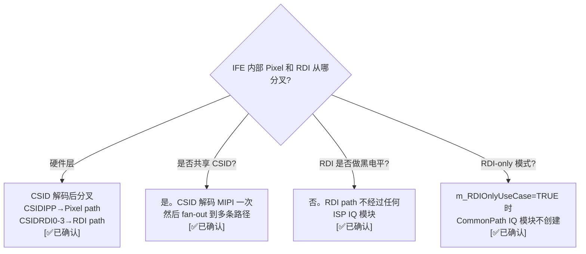
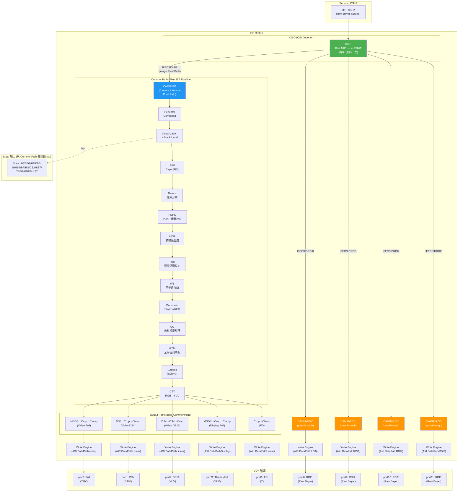

# IFE 内部处理流程 — Pixel Path vs RDI Path 分道扬镳

> 类型：源码分析
> 置信度底线：✅已确认（四路并行源码验证 + IQ Module 列表 + CSL 定义 + Pipeline 创建代码交叉确认）

## ❓ 问题背景
IFE 内部至少有 2 条处理路径（输出 YUV 的 Pixel path 和输出 Raw 的 RDI path）。二者是否共享 CSID 解析？是否都做黑电平校正？从哪里分道扬镳？

## 🔍 搜索过程
| 命令 / 动作 | 目标 | 结果摘要 |
|------------|------|---------| 
| read camxispiqmodule.h:518-540 | IFECSIDPath / IFECAMIFPath 枚举 | CSID 有 IPP+PPP+RDI0-3 共 6 条输出路径 |
| read camxispiqmodule.h:379-397 | IFEPipelinePath 枚举 | CommonPath(pixel) + RDI0-3Path 等 15 条路径 |
| read camxtitan480ife.cpp:60-131 | Titan480 IQ Module 列表 | CommonPath 16 个模块; RDI path 仅 CSID+CAMIF |
| read camxcslifedefs.h:18-174 | IFE 资源类型 + 路径掩码 | 0x3000-0x3018 输出资源; PXL/RDI/LCR 路径掩码 |
| read camxifenode.cpp:2750-2784 | CheckForRDIOnly | RDI-only 时跳过全部 CommonPath IQ 模块 |
| read camxifenode.cpp:6712-6762 | CreateIFEIQModules | RDI-only 不创建 CommonPath 模块 |
| read camxifenode.cpp:7341-7422 | InitialCAMIFConfig | KMD 路径掩码 → CAMIF 各路径使能 |
| read camxifebls12.cpp + camxifelinearization34.cpp | 黑电平校正模块 | BLS/Linearization 仅在 CommonPath |

## 🌳 决策树

## 💡 分析结论

### 核心答案

| 问题 | 答案 |
|------|------|
| 二者是否共享 CSID？ | **是**。CSID 解码 MIPI CSI 数据一次，然后 fan-out |
| 从哪里分道扬镳？ | **CSID 输出端**。`IFECSIDIPP` → Pixel pipeline，`IFECSIDRDI0-3` → RDI bypass |
| RDI 是否做黑电平校正？ | **否**。RDI path 不经过任何 ISP IQ 模块（无 BLS、无 Linearization、无 Demosaic、无任何处理） |
| CAMIF 是什么角色？ | 两条路径都经过 CAMIF，但 CAMIF-RDI 是纯 passthrough；CAMIF-PP 负责 pixel path 的帧接口控制 |

### IFE 内部完整处理流程图

### Pixel Path 模块链详解 (Titan 480 顺序)

| # | 模块 | IQ Module Type | 功能 |
|---|------|---------------|------|
| 1 | SWTMC | (SW) | 软件色调映射控制 |
| 2 | IFEHVX | `IFEHVX` | Hexagon DSP 自定义 IQ |
| 3 | **IFECAMIF** | `IFECAMIF` | Camera Interface — 帧接口控制 |
| 4 | **IFEPedestal** | `IFEPedestalCorrection` | 暗电流/基底校正 |
| 5 | **IFEABF** | `IFEABF` | Adaptive Bayer Filter — Bayer 域降噪 |
| 6 | **IFELinearization** | `IFELinearization` | 线性化 + 黑电平减除（Titan480 吸收了 BLS） |
| 7 | **IFEDemux** | `IFEDemux` | 像素解复用（HDR 多曝光分离） |
| 8 | **IFEPDPC** | `IFEPDPC` | PDAF 像素校正 |
| 9 | **IFEHDR** | `IFEHDR` | HDR 重建/运动伪影校正 |
| 10 | **IFELSC** | `IFELSC` | 镜头阴影校正 (Roll-off) |
| 11 | **IFEWB** | `IFEWB` | 白平衡增益 (R/G/B) |
| 12 | **IFEDemosaic** | `IFEDemosaic` | **Bayer → RGB 插值** (分道扬镳的标志性步骤) |
| 13 | **IFECC** | `IFECC` | 色彩校正矩阵 |
| 14 | **IFEGTM** | `IFEGTM` | 全局色调映射 |
| 15 | **IFEGamma** | `IFEGamma` | Gamma 校正 LUT |
| 16 | **IFECST** | `IFECST` | 色彩空间变换 (RGB → YUV) |

> **Titan 150/170/175 差异**: BLS 是独立模块（IFEBLS12），ABF 在 HDR/BPCBCC 之后（非之前）。

### RDI Path 模块链

| # | 模块 | IQ Module Type | 功能 |
|---|------|---------------|------|
| 1 | **IFECSID** | `IFECSID` | CSID 解码（共享） |
| 2 | **IFECAMIFRDIx** | `IFECAMIFRDI0..3` | Camera Interface RDI — 纯 passthrough，无 ISP 处理 |

**共计 2 个模块，零 ISP 处理。**

### 分道扬镳的 5 层证据

| # | 证据 | 来源 |
|---|------|------|
| 1 | CSID 枚举定义 `IFECSIDIPP` vs `IFECSIDRDI0-3` — 硬件级 fan-out | camxispiqmodule.h:518-527 |
| 2 | IFEPipelinePath 枚举 `CommonPath` vs `RDI0Path..RDI3Path` — 独立路径 | camxispiqmodule.h:379-397 |
| 3 | Titan480 IQ Module 列表: CommonPath=16 模块, RDI0Path=仅 CSID+CAMIF | camxtitan480ife.cpp:60-131 |
| 4 | `m_RDIOnlyUseCase=TRUE` 时 CommonPath IQ 模块**不创建** | camxifenode.cpp:6712-6716 |
| 5 | 路径掩码 `IFEPXLPathMask=0x1` vs `IFERDI0PathMask=0x8` — KMD 级独立使能 | camxcslifedefs.h:165-174 |

### 黑电平校正的 3 层证据（仅 Pixel Path）

| # | 证据 | 来源 |
|---|------|------|
| 1 | IFEBLS12 / IFELinearization34 的 `pipelinePath = CommonPath` | camxifebls12.cpp:325 / camxifelinearization34.cpp:396 |
| 2 | RDI path IQ Module 列表中无 BLS/Linearization | camxtitan480ife.cpp:125-131 (RDI0Path 仅 CSID+CAMIF) |
| 3 | `m_RDIOnlyUseCase=TRUE` → `ProgramIQEnable()` 被跳过 | camxifenode.cpp:3226-3228 |

### Pixel Raw Dump 诊断端口

IFE 还有 3 个诊断 Raw 输出端口（port 3/4/5），它们在 Pixel path **中间**截取：
- **port3 CAMIFRaw**: CAMIF 之后、BLS 之前的原始 Raw
- **port4 LSCRaw**: LSC 之后的 Raw（已做黑电平+镜头校正）
- **port5 GTMRaw**: GTM 之后的 Raw（已做色调映射）

这 3 个端口的 CSL 资源类型都是 `IFEOutputRaw (0x3003)`，与 RDI (0x3006-0x3009) 完全不同。

### 带宽模型差异

| 维度 | Pixel Path | RDI Path |
|------|-----------|----------|
| AXI Path | DataPathVideo / Display / Linear | DataPathRDI0-3 |
| CSL Usage | `IFEUsageLeftPixelPath` (1) | `IFEUsageRDIPath` (3) |
| BW 计算 | `CalculatePixelPortLineBandwidth()` + UBWC 压缩比 | `stride × bpp / lineTime` (无 UBWC) |
| 裁剪 | appliedCropInfo (FOV crop) | 无裁剪，全帧输出 |
| 压缩 | UBWC 支持 | 不支持 |

## 📍 关键代码位置
- `camx/src/hwl/ispiqmodule/camxispiqmodule.h:518-527` — IFECSIDPath 枚举 (IPP/RDI 分叉定义)
- `camx/src/hwl/ispiqmodule/camxispiqmodule.h:530-539` — IFECAMIFPath 枚举
- `camx/src/hwl/ispiqmodule/camxispiqmodule.h:379-397` — IFEPipelinePath 枚举
- `camx/src/hwl/isphwsetting/pipeline/ife/camxtitan480ife.cpp:60-131` — Titan480 IQ Module 列表
- `camx/src/csl/camxcslifedefs.h:18-174` — IFE 输出资源类型 + 路径掩码
- `camx/src/hwl/ife/camxifenode.cpp:2750-2784` — CheckForRDIOnly
- `camx/src/hwl/ife/camxifenode.cpp:6712-6762` — CreateIFEIQModules (路径判断)
- `camx/src/hwl/ife/camxifenode.cpp:3226-3228` — ProgramIQEnable 跳过逻辑
- `camx/src/hwl/ife/camxifenode.cpp:7341-7422` — InitialCAMIFConfig
- `camx/src/hwl/ispiqmodule/camxifebls12.cpp:325` — BLS 模块 (CommonPath only)
- `camx/src/hwl/ispiqmodule/camxifelinearization34.cpp:396` — Linearization (CommonPath only)

## ⚠️ 待验证事项
- [🧠推断] Titan 150/170/175 的 ABF 位置与 Titan 480 不同（ABF 在 HDR 之后而非之前），未逐行验证 Titan 170 列表
- [🧠推断] Stats 模块从 CommonPath 各阶段 tap 的具体位置未完整追踪
- [🧠推断] PDAF Pixel Path (IFECSIDPPP) 的详细 IQ 模块链未调查

## 📝 备注
- CSID 是共享的唯一 entry point，解码 MIPI 一次后 fan-out
- RDI 是纯硬件 bypass，零 ISP 处理，零黑电平校正
- Pixel Raw Dump (port 3/4/5) ≠ RDI (port 8-11)：前者在 pixel path 中间截取，后者是独立 bypass 路径
- `m_RDIOnlyUseCase` 不仅跳过执行，还**不创建** CommonPath IQ 模块实例，节省内存和初始化开销
- 同一 IFE 可以同时输出 Pixel path YUV 和 RDI Raw — 两条路径并行运行
