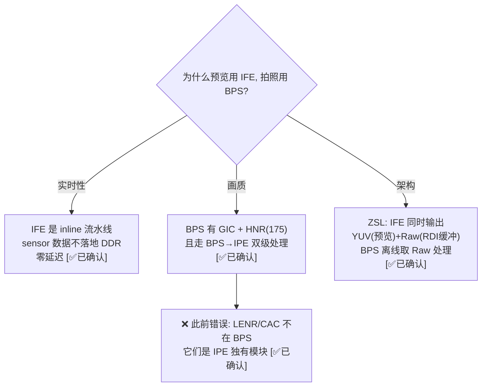
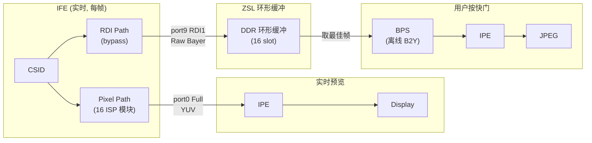

# IFE vs BPS 分工 — 预览用 IFE 做 B2Y，拍照用 BPS 做 B2Y 的原因

> 类型：源码分析
> 置信度底线：✅已确认（IQ Module 列表 + Pipeline 拓扑 + BPS 输入机制 + ZSL 环形缓冲全部源码验证）

## ❓ 问题背景
IFE 和 BPS 都具有 Bayer→YUV 的完整 ISP 能力，为什么预览数据流在 IFE 内部直接做 B2Y，而拍照数据流用 BPS 做 B2Y？

## 🔍 搜索过程
| 命令 / 动作 | 目标 | 结果摘要 |
|------------|------|---------| 
| ls camx/src/hwl/ispiqmodule/camxbps*.cpp | BPS IQ 模块文件 | 20 个文件 |
| read camxbpspipelinetitan175.cpp:37-148 | BPS IQ 模块有序列表 | 18 个模块 (16 enabled) |
| read camxbpspipelinetitan480.cpp:37-144 | Titan480 BPS 列表 | 17 个模块 (无 HNR) |
| grep LENR/HNR/CAC camx/src/hwl/ | 各子系统 IQ 模块对比 | LENR=IPE only, CAC=IPE only, HNR=BPS(175)+IPE |
| read camxbpsnode.cpp:1793-1863 | BPS 输入机制 | 从 DDR buffer 读取 (pImageBuffer) |
| read camxbpsnode.cpp:3454-3457 | BPS 是否总是离线 | "real-time or not BPS acts like offline" |
| read g_pipelines.h:10085-10088,10448 | Snapshot IFE→BPS 链路 | IFE port9 (RDI1) → BPS port0, ChiFormatRawMIPI |
| read chxadvancedcamerausecase.h ZSL | ZSL 环形缓冲 | 16-slot ring buffer, TARGET_BUFFER_RAW |

## 🌳 决策树


## 💡 分析结论

### 核心答案：三重因素

#### 1. 实时性约束 — IFE 必须做 B2Y

IFE 是 **inline 硬件流水线**，Sensor MIPI 数据流入 CSID 后直接灌入 ISP CommonPath，数据不落地 DDR。

```
预览:  Sensor ──MIPI──→ IFE [CSID→16个ISP模块→YUV] ──→ IPE → Display
                              ↑ inline, 数据不落地 DDR, 零额外延迟
```

如果预览改用 BPS：
```
Sensor → IFE RDI → DDR写 → BPS读 → DDR写 → IPE读 → Display
         ↑ +DDR带宽      ↑ +DDR带宽      ↑ 多2次DDR往返
```

BPS **始终从 DDR 读取**（即使配置为 "realtime" 模式），开发者注释明确说明：

> "real-time or not BPS acts like offline. Only delta is source of data read."
> — camxbpsnode.cpp:3454-3457

#### 2. 画质分级 — BPS+IPE 双级处理

拍照路径走 **BPS → IPE** 两级处理，比预览路径 **IFE → IPE** 多一个 BPS 级别的精处理。

**BPS 相比 IFE 的独有/差异化模块：**

| 模块 | BPS | IFE | 说明 |
|------|:---:|:---:|------|
| **GIC** (Green Imbalance Correction) | ✅ | ❌ | BPS 独有，修正绿色通道不平衡 |
| **HNR** (High-freq Noise Reduction) | ✅ (Titan175) | ❌ | BPS Titan175 独有（Titan480 移至 IPE） |
| **Reg1/Reg2 输出** | ✅ | ❌ | MFSR/MFNR 多帧超分/降噪的配准图像 |
| **DS64** | ✅ | ❌ | 1/64 降采样（IFE 仅到 DS16） |
| ABF (Bayer 降噪) | ✅ (v40) | ✅ (v34/v40) | 两者都有 |
| Demosaic | ✅ (v36) | ✅ (v36/v37) | 两者都有 |
| LSC | ✅ (v34/v40) | ✅ (v34/v40) | 两者都有 |

**IPE 在拍照路径上的额外处理（BPS→IPE 后）：**

| 模块 | 功能 | 预览路径也有？ |
|------|------|:---:|
| **LENR** | 低频降噪 | ✅ (但预览可能降级/跳过) |
| **CAC** | 色差校正 | ✅ |
| **TNR/TF** | 时域降噪 | ✅ (但拍照可用多帧参考) |
| **LTM** | 局部色调映射 | ✅ |
| **ANR** | 自适应降噪 | ✅ |

> **重要纠正**：LENR 和 CAC 是 **IPE 独有模块**（`camxipelenr10.cpp`、`camxipecac22.cpp`），不在 BPS 中。BPS 的独有优势是 GIC 和 HNR(Titan175)。

#### 3. ZSL 架构 — IFE 两路并行是基础



ZSL 环形缓冲机制（`chxadvancedcamerausecase.h`）：
- **队列深度**：16 slot（`BufferQueueDepth = 16`，chi.h:43）
- **每 slot**：RDI Raw buffer + Metadata，`isBufferReady`/`isMetadataReady` 标志
- **写入**：IFE RDI1 每帧写入 `TARGET_BUFFER_RAW`，`ReserveBufferQueueSlot()` 分配
- **读取**：快门触发 → `GetInputBufferFromRDIQueue()` 按帧号取 Raw → `CreateOfflineInputResource()` 送 BPS
- **释放**：`ReleaseRDIBufferReference()` 归还 buffer 到池

### Pipeline 拓扑证据

**预览 (UsecasePreview, g_pipelines.h:710)：**
```
IFE port0 (Full, YUV) ──ChiFormatUBWCTP10──→ IPE port0 → Display
```

**拍照 (UsecaseSnapshot, g_pipelines.h:10448)：**
```
IFE port9 (RDI1, Raw) ──ChiFormatRawMIPI──→ BPS port0 → IPE port0 → Snapshot
```

**ZSL 拍照 (UsecaseZSL)：**
```
预览 Pipeline: IFE port9 (RDI1) → TARGET_BUFFER_RAW (sink, 写入环形缓冲)
拍照 Pipeline: TARGET_BUFFER_RAW (source, 从环形缓冲读) → BPS port0 → IPE → JPEG
```

### IFE vs BPS 完整模块对比 (Titan480)

| 处理阶段 | IFE CommonPath | BPS Pipeline |
|----------|:---:|:---:|
| SWTMC (SW 色调映射) | — | ✅ |
| HVX (Hexagon DSP) | ✅ | — |
| CAMIF (帧接口) | ✅ | — |
| Pedestal (基底校正) | ✅ | ❌ (定义但禁用) |
| ABF (Bayer 降噪) | ✅ | ✅ |
| Linearization (线性化+黑电平) | ✅ | ✅ |
| Demux (像素解复用) | ✅ | ✅ |
| PDPC (PDAF 像素校正) | ✅ | ✅ (BPCPDPC 合并) |
| HDR (HDR 重建) | ✅ | ✅ |
| **GIC** (绿色不平衡校正) | **❌** | **✅** |
| LSC (镜头阴影校正) | ✅ | ✅ |
| WB (白平衡) | ✅ | ✅ |
| Demosaic (Bayer→RGB) | ✅ | ✅ |
| CC (色彩校正) | ✅ | ✅ |
| GTM (全局色调映射) | ✅ | ✅ |
| Gamma (伽马校正) | ✅ | ✅ |
| CST (RGB→YUV) | ✅ | ✅ |
| MNDS/DS4/DS16 (降采样) | ✅ (DS4/DS16) | ✅ (DS4/DS16/**DS64**) |
| Crop/Clamp (裁切/钳位) | ✅ | — |
| 3A Stats 输出 | ✅ (17种) | ✅ (AWBBG/HDRBHist) |
| **Reg1/Reg2** (配准输出) | **❌** | **✅** |

## 📍 关键代码位置
- `camx/src/hwl/isphwsetting/pipeline/bps/camxbpspipelinetitan175.cpp:37-148` — BPS Titan175 IQ Module 列表 (含 HNR)
- `camx/src/hwl/isphwsetting/pipeline/bps/camxbpspipelinetitan480.cpp:37-144` — BPS Titan480 IQ Module 列表 (无 HNR)
- `camx/src/hwl/ispiqmodule/camxbpshnr10.cpp` — BPS HNR 模块 (Titan175 only)
- `camx/src/hwl/ispiqmodule/camxbpsgic30.cpp` — BPS GIC 模块 (BPS 独有)
- `camx/src/hwl/ispiqmodule/camxipelenr10.cpp` — LENR 是 IPE 独有
- `camx/src/hwl/ispiqmodule/camxipecac22.cpp` — CAC 是 IPE 独有
- `camx/src/hwl/bps/camxbpsnode.cpp:3454-3457` — "real-time or not BPS acts like offline"
- `camx/src/hwl/bps/camxbpsnode.cpp:1793-1863` — BPS ExecuteProcessRequest (DDR 读取)
- `chi-cdk/core/lib/common/g_pipelines.h:710` — Preview: IFE port0→IPE
- `chi-cdk/core/lib/common/g_pipelines.h:10448` — Snapshot: IFE port9→BPS
- `chi-cdk/api/common/chi.h:43` — BufferQueueDepth = 16
- `chi-cdk/core/chiusecase/chxadvancedcamerausecase.h:84-121` — ZSL ring buffer 结构

## ⚠️ 待验证事项
- [🧠推断] BPS "realtime" 模式（BPSProcessingRealtime）的具体使用场景未调查（可能是低延迟拍照）
- [🧠推断] 预览路径 IPE 是否跳过/降级 LENR/CAC 以节省功耗，未验证具体 tuning 参数

## 📝 备注
- **LENR 和 CAC 不在 BPS 中** — 它们是 IPE 独有模块，之前的描述有误
- BPS 相比 IFE 的真正独有优势：GIC + HNR(Titan175) + Reg1/Reg2(MFSR) + DS64
- HNR 在 Titan480 上从 BPS 移到了 IPE，说明 ISP 模块归属在不同芯片代之间会迁移
- BPS 始终从 DDR 读取输入，即使标记为 "realtime" 模式
- IFE 的 Pixel path 和 RDI path 并行运行，是 ZSL 架构的硬件基础
