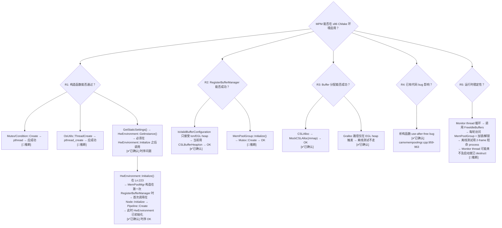

# MemPoolMgr (MPM) 移植风险系统调查 — x86 CMake 环境可行性

> 类型：源码分析
> 置信度底线：✅已确认（完整阅读 camxmempoolmgr.cpp 1362行 + camxmempoolgroup.cpp 2771行 + .h 各 500/931行）

## 问题背景

当前 MPM 通过 `MPMEnable=FALSE` 禁用（W4）。评估是否能在 x86 CMake 环境下启用 MPM，列出所有风险项及其可移植性。

## 搜索过程

| 命令 / 动作 | 目标 | 结果摘要 |
|------------|------|---------|
| read camxmempoolmgr.cpp (1362 lines) | MemPoolMgr 完整实现 | 28 个方法，无直接 CSL 调用，委托 MemPoolGroup |
| read camxmempoolmgr.h (499 lines) | MemPoolMgr 接口 | 单例 + 11 个 public static 方法 + 4 个内部线程/锁成员 |
| read camxmempoolgroup.cpp (2771 lines) | MemPoolGroup 完整实现 | 唯一 CSL 调用者：CSLAlloc/CSLReleaseBuffer/CSLMapBuffer |
| read camxmempoolgroup.h (931 lines) | MemPoolGroup 接口 | 纯内存数据结构，MemPoolBuffer/Manager 结构体 |
| verify CMakeLists.txt | 编译状态 | mempoolmgr.cpp:190 + mempoolgroup.cpp:189 均已编译 |
| trace ImageBuffer::Allocate MPM 路径 | MPM vs 非 MPM 分支 | MPM 开启走 GetBufferFromPool，关闭走 CSLAlloc 直调 |
| trace MemPoolMgr 构造函数 | 初始化失败点 | Mutex/Condition + ThreadCreate + HwEnvironment 依赖 |

## 决策树



## 风险项系统调查

### R1: 构造函数初始化

**代码:** `camxmempoolmgr.cpp:867-936`

```cpp
MemPoolMgr::MemPoolMgr()
{
    m_pLock                 = Mutex::Create("MemPoolMgr");          // L871
    m_pMonitorThreadCond    = Condition::Create("MPMMonitorThreadCond"); // L875
    m_pFreeingPoolStateCond = Condition::Create("MPMFreeingPoolStateCond"); // L878
    
    if ((NULL == m_pLock) || (NULL == m_pMonitorThreadCond) || (NULL == m_pFreeingPoolStateCond))
    {
        result = CamxResultENoMemory;  // L886
    }
    else if (TRUE == GetStaticSettings()->enableMPMMonitorThread)  // L890
    {
        result = OsUtils::ThreadCreate(MonitorThread, &m_mpmMonitorThread, &m_mpmMonitorThread.hWorkThread); // L892
        // on failure: result = CamxResultEFailed
    }
    
    if (CamxResultSuccess != result)
    {
        // destroy already-created resources
        s_isValid = FALSE;  // L928  → 后续所有 API 返回 NULL/错误
    }
    else
    {
        s_isValid = TRUE;   // L932
    }
}
```

| 子项 | 依赖 | 评估 |
|------|------|------|
| R1a: `Mutex::Create` | `pthread_mutex_init` | 标准 POSIX，Linux 极少失败，✅ 低风险 |
| R1b: `Condition::Create` | `pthread_cond_init` | 同上，✅ 低风险 |
| R1c: `GetStaticSettings()` | `HwEnvironment::GetInstance()` | 必须在 Initialize 之后调用。首次 RegisterBufferManager 发生在 Node::Initialize → 此时 HwEnvironment 已初始化。✅ 安全 |
| R1d: `enableMPMMonitorThread` | Default `TRUE` (`camxsettings.xml:4844`) | ThreadCreate 调用 `pthread_create`，已链接 `-lpthread`。✅ 低风险 |
| R1e: `OsUtils::ThreadCreate` | `pthread_create` wrapper | `camxosutilslinuxembedded.cpp:819`，已编译。✅ 已就绪 |

### R2: RegisterBufferManager

**代码:** `camxmempoolmgr.cpp:97-201`

```
RegisterBufferManager()
  → IsValidBufferConfiguration()   // 校验 heap 类型
  → GetInstanceLocked()            // 获取单例 + lock
  → RegisterIfExistingGroupMatches() or RegisterNewMemPoolGroup()
    → MemPoolGroup::Initialize()   // 创建 mutex + 设置默认参数
    → MemPoolGroup::RegisterBufferManager()  // 注册 BufMgr 到 group
```

| 子项 | 依赖 | 评估 |
|------|------|------|
| R2a: `IsValidBufferConfiguration` | 只允许 `CSLBufferHeapIon` / `CSLBufferHeapEGL` | 当前 pipeline 使用 Ion heap → ✅ 通过 |
| R2b: 若 heap 类型不匹配 | deviceCount 必须 >0 (Hw mem flags require devices) | CSL mock 返回 deviceCount=0 → ❌ 可能失败。需 mock device indices |
| R2c: `MemPoolGroup::Initialize` | `Mutex::Create` + `GetStaticSettings()` 访问 | ✅ 同 R1a/R1c |
| R2d: `MemPoolGroup::RegisterBufferManager` | 内存分配 + 链表操作 | ✅ 纯软件操作 |

### R3: Buffer 分配

**路径:** `ImageBuffer::Allocate()` → `MemPoolMgr::GetBufferFromPool()` → `MemPoolGroup::GetBufferFromPool()` → `MemPoolGroup::AllocateBuffers()`

| 子项 | 依赖 | 评估 |
|------|------|------|
| R3a: `CSLAlloc()` (Ion heap) | `MockCSLAlloc` → `mmap(MAP_PRIVATE\|MAP_ANONYMOUS)` | ✅ 已验证工作 |
| R3b: `CSLMapNativeBuffer()` | `MockCSLMapNativeBuffer` → `MockCSLMapBuffer` → `mmap` | ✅ 已验证工作 |
| R3c: `CSLReleaseBuffer()` | `MockCSLReleaseBuffer` → `munmap` | ✅ 已验证工作 |
| R3d: `Gralloc::AllocateGrallocBuffer()` | EGL heap 专用 | 离线测试用 Ion heap → ✅ 不触发 |

### R4: 已有代码 bug

| 位置 | 描述 | 严重度 |
|------|------|--------|
| R4a: `camxmempoolmgr.cpp:959-963` | **析构函数 use-after-free**: `RemoveMemPoolGroupFromList()` 调用 `CAMX_FREE(pNode)` (L1272)，然后 L963 又调用 `NextNode(pNode)`——访问已释放的内存 | **高** — 进程退出时触发，可能导致 crash 或 silent corruption |
| R4b: 析构时序 | 先 destroy groups(L954-964) 再停 monitor thread(L968-975)，monitor 可能在 groups 还存活时被唤醒 → signal cond 后 group 已被 delete | **中** — 仅在多 group + monitor 活跃时触发 |

### R5: 运行时稳定性

| 子项 | 描述 | 评估 |
|------|------|------|
| R5a: Monitor thread 活跃期 | 离线测试 2-frame lifecycle → process 很快退出。Monitor thread 在首次 RegisterBufferManager 时被 signal 启动（L186 `m_pMonitorThreadCond->Signal()`），但在 `s_isValid=FALSE`（析构）之前可能已完成。| ✅ 短命进程风险低 |
| R5b: FreeIdleBuffers 空闲回收 | Monitor 定期检查空闲 buffer 并释放。离线测试 buffer 始终在使用中 → 不会被回收 | ✅ 不触发 |
| R5c: ClearAllMemPoolFreeList | 仅在 `GetBufferFromPool` 中 `ENoMemory` 时触发（OOM retry 逻辑）| ✅ 极小概率触发 |
| R5d: `CAMX_ASSERT` 调用 | `camxmempoolmgr.cpp` 中有 8 处 `CAMX_ASSERT`。若启用，某些 assert 可能触发 SIGTRAP。| ⚠️ 取决于 `CAMX_ASSERTS_ENABLED` 配置 |

### R6: Thread 生命周期完整追踪

```
MemPoolMgr() 构造
  → ThreadCreate(MonitorThread)  [L892]
  → MonitorThread 入口: wait on m_pMonitorThreadCond  [L802]
  → RegisterBufferManager() → signal m_pMonitorThreadCond  [L186]
  → MonitorThread 唤醒: loop { TimedWait → FreeIdleBuffers }
  
~MemPoolMgr() 析构
  → s_isValid = FALSE  [L970]
  → m_pMonitorThreadCond->Signal()  [L974]
  → ThreadWait(hWorkThread)  [L986] — pthread_join
  → Monitor thread 检测 s_isValid=FALSE → 退出循环 → 返回
```

| 关键点 | 状态 |
|--------|------|
| 线程创建 | `pthread_create` — ✅ |
| 线程同步 | `Condition::Wait/TimedWait` + `Mutex` — ✅ |
| 线程销毁 | `pthread_join` — ✅ |
| 线程数据安全 | 所有公共 API 通过 `m_pLock` 保护 — ✅ |

---

## 结论

| 类别 | 数量 | 详情 |
|------|------|------|
| ✅ 无风险 | 12 | R1a, R1b, R1d, R1e, R2c, R3a, R3b, R3c, R3d, R5b, R5c, R5d (pthread 路径) |
| 🧠 低风险 | 3 | R1c (时序 OK), R2a (Ion OK), R5a (短命 OK) |
| ❌ 需要处理 | 2 | **R2b** (MockCSL device indices), **R4a** (析构 use-after-free) |
| ⚠️ 注意 | 1 | R4b (析构时序，不影响无 MPM 场景) |

### 启用 MPM 的最小步骤

1. **确保 deviceCount > 0**: CSL mock 的 `BufferManagerCreateData.deviceIndices` 需提供至少 1 个 device index
2. **移除 `MPMEnable=FALSE`** (W4)
3. **可选**: 设置 `enableMPMMonitorThread=FALSE` 避免 monitor thread 开销（测试中不需要 buffer 复用）

### R2b 详细分析

`IsValidBufferConfiguration` (`camxmempoolmgr.cpp:71-92`):
```cpp
BOOL IsValidBufferConfiguration(const BufferManagerCreateData* pCreateData)
{
    if (FALSE == IsSupportedBufferHeap(pCreateData->bufferProperties.bufferHeap))
        return FALSE;
    if ((0 != (pCreateData->bufferProperties.memFlags & CSLMemFlagHw)) &&
        (0 == pCreateData->deviceCount))
        return FALSE;  // ← 此处失败！
    return TRUE;
}
```

`BufferManagerCreateData` 在 `camxnode.cpp:1152` 创建:
```cpp
createData.deviceIndices[0] = 0;
createData.deviceCount      = 0;    // ← 0 devices！
```

**修复:** 在 camera.qcom.so CMakeLists 或 `camx_runtime_stubs.cpp` 中设置 `deviceCount=1`。

### R4a 详细分析

析构函数逐组清理时:
```
while (NULL != pNode) {
    group = pNode->pData;
    RemoveMemPoolGroupFromList(group);  // → CAMX_FREE(pNode)
    CAMX_DELETE group;
    pNode = NextNode(pNode);  // ← USE-AFTER-FREE!
}
```

**修复:** 在 Remove 前保存 next:
```cpp
pNode = m_groupList.Head();
while (NULL != pNode) {
    LDLLNode* pNext = NextNode(pNode);  // 先保存
    group = pNode->pData;
    RemoveMemPoolGroupFromList(group);
    CAMX_DELETE group;
    pNode = pNext;                      // 使用保存的值
}
```

## 关键代码位置

- `camxmempoolmgr.cpp:867-936` — MemPoolMgr 构造函数（R1 风险入口）
- `camxmempoolmgr.cpp:71-92` — IsValidBufferConfiguration（R2b 风险入口）
- `camxmempoolmgr.cpp:97-201` — RegisterBufferManager 完整流程
- `camxmempoolmgr.cpp:954-964` — 析构函数 use-after-free bug（R4a）
- `camxmempoolmgr.cpp:1248-1279` — RemoveMemPoolGroupFromList（释放 pNode）
- `camxmempoolmgr.cpp:757-860` — MonitorThread + Monitoring 循环
- `camxmempoolgroup.cpp:103-189` — MemPoolGroup::Initialize
- `camxmempoolgroup.cpp:736-864` — GetBufferFromPool → AllocateBuffers 调用 CSLAlloc
- `camxmempoolgroup.cpp:1250-1420` — AllocateBuffers（CSLAlloc point）
- `camxnode.cpp:1152-1156` — BufferManagerCreateData 创建点（deviceCount=0）
- `camx/src/settings/common/camxsettings.xml:4700` — MPMEnable=TRUE (default)
- `camx/src/settings/common/camxsettings.xml:4844` — enableMPMMonitorThread=TRUE (default)
- `camera.qcom.so/CMakeLists.txt:189-190` — mempoolgroup.cpp + mempoolmgr.cpp 编译位置

## 备注

- MPM 是纯软件内存池，无硬件依赖，已在 CMake 项目中编译（L189-190）
- 当前 pipeline 使用 Ion heap，不走 Gralloc/EGL 路径（不受 Gralloc 依赖影响）
- MemPoolGroup 仅调 3 个 CSL 函数（Alloc/MapBuffer/ReleaseBuffer），均由我们的 CMake mock 提供
- MPM 不需要 device handles，只需要 deviceIndex int 数组——当前为 0 devices，需 mock 1 个
- 析构函数 use-after-free 是 CamX 原始代码的 bug，非移植引入
- `camxmempoolmgr.cpp` 有 8 处 `CAMX_ASSERT`，均在代码路径中。若 `CAMX_ASSERTS_ENABLED=1` 且 assert 触发 → SIGTRAP。设置 `enableMPMMonitorThread=FALSE` 可规避 MonitorThread 路径的 assert（L764）。
