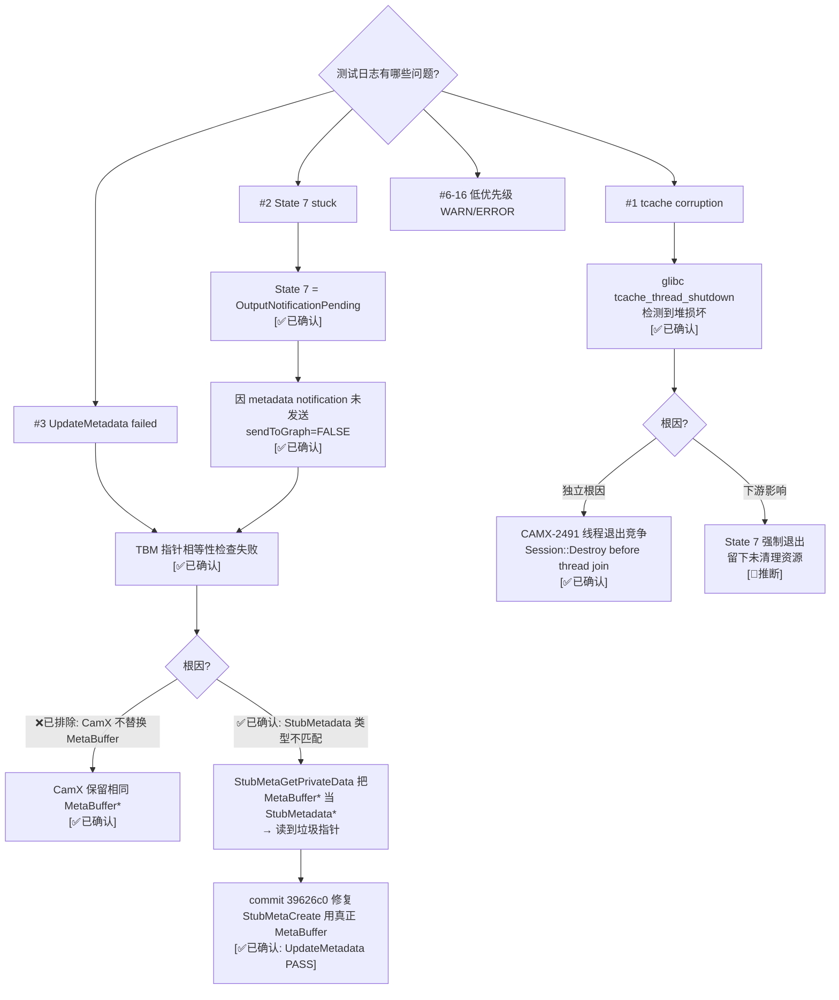

# 阶段性测试问题全量分析 — Phase 3 DummyNode E2E

> 类型：调试记录
> 置信度底线：本文档最低置信度为 ❓推测 的内容不可作为行动依据

## ❓ 问题背景
Phase 3 vendor tag 修复后的全量日志审查，系统分析所有非 INFO 级别消息。

## 🌳 决策树



## 💡 分析结论

### 因果链 — ✅已解决 (commit 39626c0)

```
chitargetbuffermanager.cpp:665 — TBM pointer equality check
  ├─ 根因 [✅已确认]: StubMetaCreate 创建 StubMetadata* (非 MetaBuffer*)
  │   chi-cdk ChiMetadata::m_metaHandle = StubMetadata* (via StubMetaCreate)
  │   CamX 要求 CHIMETAHANDLE 是 MetaBuffer* → 我们之前在 CamXAdapter 中包装
  │   CamX result 返回 MetaBuffer* (wrapper), chi-cdk 调 StubMetaGetPrivateData
  │   StubMetaGetPrivateData 把 MetaBuffer* 当 StubMetadata* → 读偏移处的垃圾值
  │   → InputMeta=0x739120002280 是 MetaBuffer 对象内某成员的地址 (非 ChiMetadata*)
  │
  ├─ 正解 [✅已实现]: StubMetaCreate → CamXAdapter_MetaCreate → MetaBuffer::Create(pPrivateData)
  │   chi-cdk 的 ChiMetadata 直接持有真正的 MetaBuffer*
  │   CamX 全程保留同一 MetaBuffer*, 返回结果时指针不变
  │   GetMetadataFromHandle → GetPrivateUserHandle → 正确的 ChiMetadata*
  │   TBM pointer check: pSrcMetadata == pMetadata[targetIdx] → ✅ PASS
  │
  ├─ 下游问题全部解决:
  │   #3 UpdateMetadata ✅ PASS
  │   #4 sendToGraph ✅ (not FALSE anymore)
  │   #5 metadata notification ✅ 正常发送
  │   #2 State 7 ✅ Feature2 自然到达 Complete (无 forced exit)
  │
  └─ #1 tcache corruption [仍存在]
        独立根因: CAMX-2491 线程退出竞争
        Session::Destroy 先销毁 pipeline/node, 后 join worker 线程
        与 metadata 修复无关
```

### Metadata 生命周期 — 完整代码分析 [✅已确认]

**正常设备流程 (real device):**
```
1. ChiMetadataManager::Get(clientId, seqId) → ChiMetadata* A
2. ChiMetadata::Initialize() → pCreate(&m_metaHandle, this)
     → CamX ChiMetabufferCreate → MetaBuffer::Create(pPrivateData=A)
     → MetaBuffer* M, M->m_phPrivateUserHandle = A
     → A->m_metaHandle = M
3. TBM::SetupTargetBuffer → pMetadata[i] = A (from step 1)
4. Feature2::SubmitRequestToSession
     → hInputMetadata = A->GetHandle() = M
     → pRequest.pInputMetadata = M
5. CamX Session::ProcessCaptureRequest
     → pInputMetabuffer = reinterpret_cast<MetaBuffer*>(M) // same M
     → pMetadataSlot->AttachMetabuffer(M) // stores same M, bumps refcount
6. Pipeline::ProcessMetadataRequestIdDone
     → GetMetabuffer(&pInputMetaBuffer) → returns same M
     → resultsData.pMetaBuffer[0] = M  // same M
7. Session::InjectResult
     → pHolder->pMetaBuffer[0] = M     // same M
8. Session::ProcessResultMetadata
     → m_pCaptureResult.pInputMetadata = M  // same M
9. CHISession::DispatchResults
     → ChiProcessCaptureResult(pResult) → result.pOutputMetadata = M
10. chi-cdk ProcessMetadataCallback
     → GetMetadataFromHandle(M) → pGetPrivateData(M) → M->GetPrivateUserHandle() → A
11. TBM::UpdateTarget → pSrcMetadata=A == pMetadata[i]=A → ✅ PASS
```

**mock 环境流程 (当前):**
```
1-3. 同上 (chi-cdk 是真实代码)
4. Feature2::SubmitRequestToSession
     → hInputMetadata = A->GetHandle() = M_orig
     → pRequest.pInputMetadata = M_orig
5. CamXAdapter_SubmitRequest 拦截:
     → origIn = M_orig
     → wrappedIn = MetaBuffer::Create(origIn)  // 新 MetaBuffer, privateHandle=M_orig
     → pRequest.pInputMetadata = wrappedIn
6-9. CamX 处理 wrappedIn, 返回 wrappedIn (保留同一指针)
10. chi-cdk GetMetadataFromHandle(wrappedIn)
     → wrappedIn->GetPrivateUserHandle() → M_orig
     → 但 M_orig 是 MetaBuffer*, 不是 ChiMetadata*!
     → pGetPrivateData 把 M_orig 当 MetaBuffer* 调 GetPrivateUserHandle()
     → 返回 M_orig->m_phPrivateUserHandle = A (原始 ChiMetadata*)
     → ❓ 或者如果 M_orig 非 MetaBuffer* 而是全零对象? → 返回垃圾值
```

**关键发现 [❓待验证]:**
- 我们的 wrapper MetaBuffer 的 privateUserHandle 设的是 `origIn` = chi-cdk 的原始 metadata handle
- 如果 `origIn` 是有效的 MetaBuffer* (来自 ChiMetadata::GetHandle()), 那 `GetPrivateUserHandle()` 会被调用两次 (双重解引用)
- 如果 `origIn` 不是有效的 MetaBuffer* (全零对象), 那 `GetPrivateUserHandle()` 返回垃圾
- **需要 debug 日志确认**: origIn 到底是什么? MetaBuffer::IsValid(origIn) 是否为 TRUE?

### CamX metadata 代码关键路径 [✅已确认]

| 步骤 | 文件:行号 | 操作 | 指针变化 |
|------|----------|------|---------|
| 提交 | camxsession.cpp:2488 | reinterpret_cast<MetaBuffer*> | 原始指针 |
| 附加 | camxmetadatapool.cpp:902 | m_pMetaBuffer = pMetabuffer | 同一指针 |
| 取出 | camxmetadatapool.cpp:921 | *ppMetabuffer = m_pMetaBuffer | 同一指针 |
| 合并 | camxpipeline.cpp:1028 | pOutput->Merge(pInput) | in-place, 不克隆 |
| 回调 | camxpipeline.cpp:2548-2549 | pMetaBuffer[0/1] = pInput/pOutput | 同一指针 |
| 存储 | camxsession.cpp:4499-4500 | pHolder->pMetaBuffer[0/1] = ... | 同一指针 |
| 分发 | camxsession.cpp:3220-3221 | pCaptureResult.pInput/pOutput = ... | 同一指针 |

### CAMX-2491 线程退出竞争 [✅已确认]

源码注释 (camxchicontext.cpp:195):
```
/// @todo (CAMX-2491) Is there a need to wait for all threads to retire
```

Session::Destroy 执行顺序:
1. Flush jobs (尝试停止新任务)
2. StreamOff 所有 pipeline
3. **Pipeline::Destroy** ← 销毁 pipeline/node 对象
4. Unregister job families
5. (后续) ThreadManager::Destroy → StopThreads → ThreadWait

步骤 3 和 5 之间, worker 线程可能仍在执行 pipeline/node 代码 → use-after-free → tcache corruption

### 低优先级问题清单 [✅已确认: 全部为 mock 环境预期]

| # | 消息 | 根因 | 严重性 |
|---|------|------|--------|
| 6 | pFeatureRequestObj is NULL | Feature2 teardown 顺序 | 无影响 |
| 7 | Number inputs 0 not matching | Pipeline descriptor 无 input stream | 无影响 |
| 8 | No init metadata | W1 workaround (session metadata NULL) | 已 workaround |
| 9 | NULL pSensorCaps | W2 workaround (无 sensor) | 已 workaround |
| 10 | maxImageBuffers(8) < required(10) | 自动调整, 非错误 | 无影响 |
| 11 | timestamp is 0 | 无 HW 时钟 | 无影响 |
| 12 | cannot find portId 0 | source port 查找, DummyNode 无 parent | 无影响 |
| 13 | camera info not found | CSL mock 无设备 | 无影响 |
| 14 | Unknown MessageType 4 | Feature2 未知消息类型 | 无影响 |
| 15 | Test data files missing | 无输入图像/stats 文件 | 预期 |
| 16 | Sensor module errors | 无 sensor XML | 预期 |
| 17 | Key not found ×850 | VendorTag hashmap cache miss (VERB 级) | 正常 |

## 📍 关键代码位置
- `chitargetbuffermanager.cpp:665` — 指针相等检查
- `chitargetbuffermanager.cpp:432` — pMetadata[i] = m_pMetadataManager->Get()
- `chifeature2base.cpp:4093-4106` — PopulatePortConfiguration: GetInputMetadataBuffer + GetMetadataBuffer
- `chifeature2base.cpp:744-752` — SubmitRequestToSession: hInputMetadata = pInputMetadata->GetHandle()
- `chifeature2base.cpp:895-900` — pRequest.pInputMetadata = hInputMetadata
- `chifeature2base.cpp:4692` — ProcessMetadataCallback: GetMetadataFromHandle(pChiResult->pOutputMetadata)
- `chifeature2base.cpp:7557` — OnMetadataResult: pBufferManager->UpdateTarget()
- `chifeature2base.cpp:7562` — sendToGraph=FALSE
- `chifeature2base.cpp:4728` — PortId not requested
- `chxmetadata.cpp:344-365` — ChiMetadata::Initialize → pCreate(&m_metaHandle, this)
- `chxmetadata.cpp:2012-2025` — GetMetadataFromHandle → pGetPrivateData
- `chxmetadata.h:768-771` — GetHandle() → m_metaHandle
- `camxchi.cpp:625-645` — ChiMetabufferCreate → MetaBuffer::Create(pPrivateData)
- `camxchi.cpp:1591-1610` — ChiMetaBufferGetPrivateData → GetPrivateUserHandle()
- `camxmetabuffer.cpp:1633` — m_phPrivateUserHandle = phPrivateUserHandle
- `camxmetabuffer.h:498-507` — GetPrivateUserHandle() → m_phPrivateUserHandle
- `camxmetabuffer.h:622-626` — IsValid 魔数检查 (0x28913080)
- `camxsession.cpp:2488-2489` — ProcessCaptureRequest: reinterpret_cast MetaBuffer*
- `camxsession.cpp:2603-2607` — AttachMetabuffer
- `camxsession.cpp:5344-5354` — CheckValidInputRequest 验证
- `camxchicontext.cpp:195` — CAMX-2491 todo
- `chifeature2requestobject.h:49-63` — State enum (7=OutputNotificationPending)

## ⚠️ 待验证事项
- [🧠推断] tcache corruption 可能因 Feature2 自然完成 (不再 force-complete) 而减轻 — 但仍存在 (CAMX-2491)
- [✅已确认] chi-cdk 传的原始 metadata handle 是 StubMetadata* (非 MetaBuffer*) — 根因已修复

## 📝 备注
- Git commits: `5da2bc6` vendor tag fix, `d3a56be` W6 wrapper improvement, `39626c0` W6 elimination (正解)
- 测试: `cd build && timeout 30 ./chifeature2test/chifeature2test -t Feature2OfflineTest.TestBayerToYUV -f 1`
- UpdateMetadata ✅ 已解决, State 7 ✅ 已解决
- 唯一剩余问题: tcache corruption (CAMX-2491 线程退出竞争, test PASS 后发生)
- **重要修正**: 之前假设 CamX 返回内部 pool MetaBuffer [❌已排除]
  代码分析确认 CamX 全程保留并返回提交的 MetaBuffer* 指针
  真正根因: StubMetaCreate 类型不匹配 → commit 39626c0 修复
