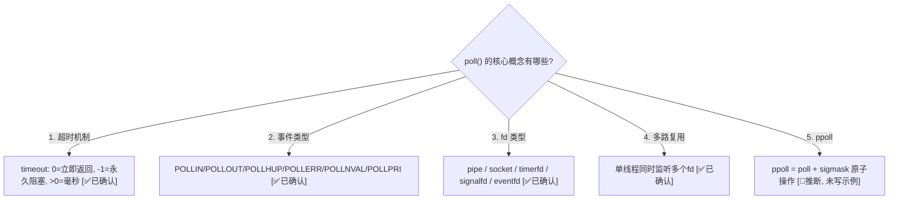
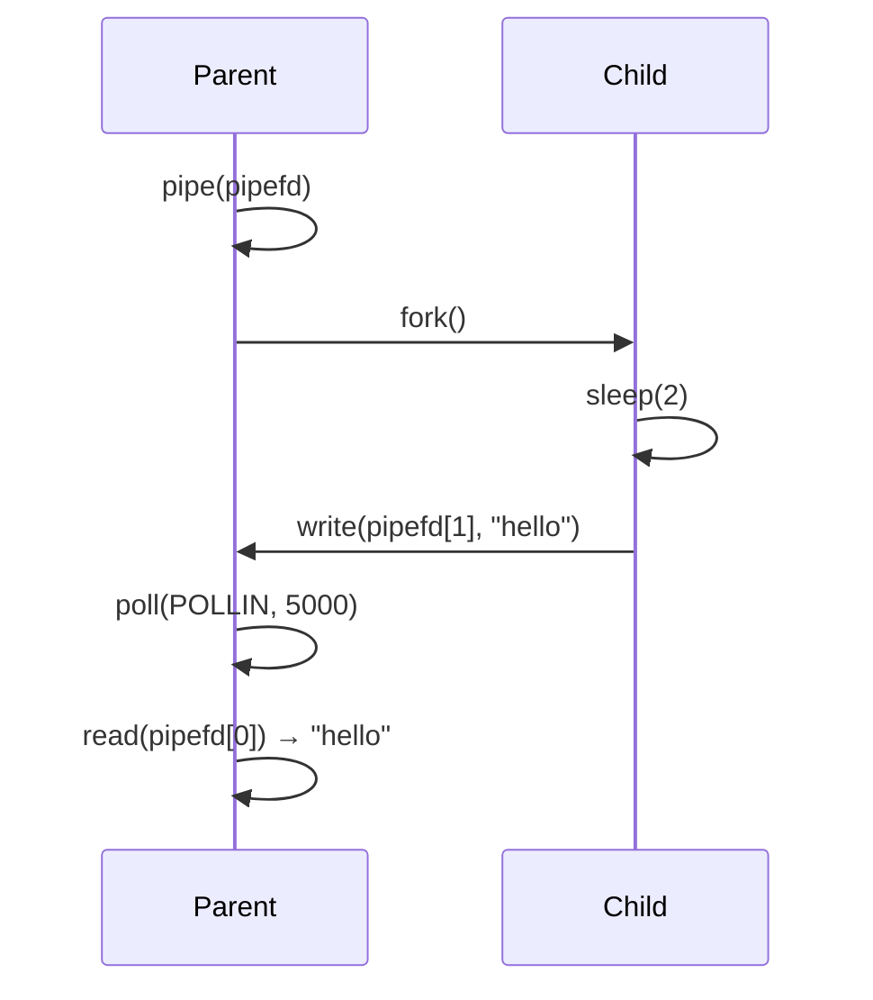
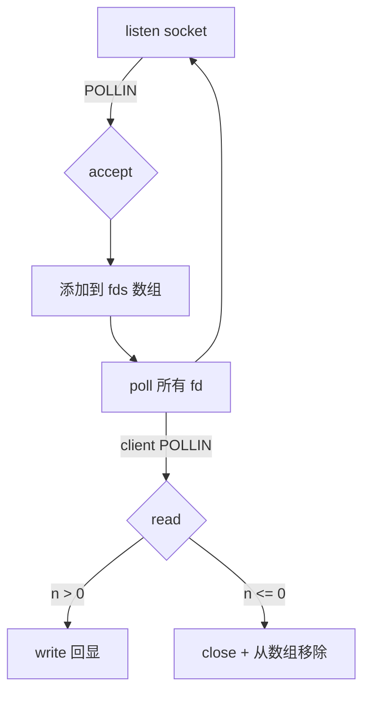

# poll() 系统调用 — 12 个递进示例全解析

> 类型：源码分析
> 置信度底线：本文档最低置信度为 🧠推断 的内容不可作为行动依据

## ❓ 问题背景
学习 Linux `poll()` 系统调用，通过 12 个从简到难的可独立运行 C 程序，覆盖 poll 的所有核心概念。

## 🔍 搜索过程
| 命令 / 动作 | 目标 | 结果摘要 |
|------------|------|---------|
| man 2 poll | 确认函数签名和语义 | 签名: `int poll(struct pollfd *fds, nfds_t nfds, int timeout)` |
| grep /usr/include/bits/poll.h | 确认事件宏定义 | POLLIN=0x001, POLLPRI=0x002, POLLOUT=0x004, POLLERR=0x008, POLLHUP=0x010, POLLNVAL=0x020 |

## 🌳 决策树



## 💡 分析结论

### API 签名

```c
#include <poll.h>

struct pollfd {
    int   fd;         /* 文件描述符 */
    short events;     /* 请求监听的事件 (输入) */
    short revents;    /* 实际发生的事件 (输出) */
};

int poll(struct pollfd *fds, nfds_t nfds, int timeout);
```

**参数说明：**
- `fds`: pollfd 数组指针，每个元素描述一个要监听的 fd
- `nfds`: 数组长度
- `timeout`: 毫秒。`0`=不阻塞立即返回，`-1`=永久阻塞，`>0`=最多等待N毫秒

**返回值：**
- `>0`: 有 revents 非零的 fd 数量
- `0`: 超时，无事件
- `-1`: 出错，设 errno（被信号中断时 errno=EINTR）

### 事件标志

| 标志 | 值 | events 设置 | revents 返回 | 含义 |
|------|----|------------|-------------|------|
| POLLIN | 0x001 | ✅ | ✅ | 有数据可读 |
| POLLPRI | 0x002 | ✅ | ✅ | 紧急数据(OOB/cgroup等) |
| POLLOUT | 0x004 | ✅ | ✅ | 可写不阻塞 |
| POLLERR | 0x008 | ❌忽略 | ✅ | 错误条件 |
| POLLHUP | 0x010 | ❌忽略 | ✅ | 挂断(对端关闭) |
| POLLNVAL | 0x020 | ❌忽略 | ✅ | fd 无效(未打开) |

**关键点：** POLLERR/POLLHUP/POLLNVAL 无需在 events 中设置，内核总会在 revents 中报告。

### fd=-1 技巧
将 `pollfd.fd` 设为 `-1`，poll 会跳过该条目（revents 返回 0）。这是临时禁用某个 fd 监听的标准做法。

### 12 个示例总览

| # | 文件 | 难度 | 核心知识点 |
|---|------|------|-----------|
| 01 | `01_timeout.c` | ★ | poll(NULL,0,ms) 纯超时,返回值0 |
| 02 | `02_stdin_read.c` | ★ | POLLIN 监听 stdin, 超时处理 |
| 03 | `03_pipe_basic.c` | ★★ | fork+pipe, 父 poll 子写 |
| 04 | `04_multi_pipe.c` | ★★ | 同时 poll 3个pipe, fd=-1 摘除已完成的 |
| 05 | `05_pollhup.c` | ★★ | 写端关闭→读端收 POLLHUP, read→0=EOF |
| 06 | `06_pollerr_pollnval.c` | ★★ | 故意触发 POLLERR(broken pipe) + POLLNVAL(无效fd) |
| 07 | `07_nonblock_connect.c` | ★★★ | O_NONBLOCK connect + EINPROGRESS + poll POLLOUT + getsockopt SO_ERROR |
| 08 | `08_tcp_echo_server.c` | ★★★ | 经典单线程 poll 多路复用 echo server |
| 09 | `09_timerfd.c` | ★★★ | timerfd_create + poll 定时器 |
| 10 | `10_signalfd.c` | ★★★ | sigprocmask + signalfd + poll 安全处理信号 |
| 11 | `11_eventfd.c` | ★★★★ | eventfd + pthread + poll 线程间通知 |
| 12 | `12_chat_server.c` | ★★★★ | 完整多人聊天: accept/昵称/广播/断线处理 |

### 各示例详解

---

#### 01 — 纯超时 `01_timeout.c`

```c
int ret = poll(NULL, 0, 2000);  // 不监听任何fd, 纯等2秒
// ret == 0 (超时)
```

**教学点：** `poll(NULL, 0, ms)` 是合法的，等同于 `usleep` 但可被信号中断。

---

#### 02 — stdin 可读 `02_stdin_read.c`

```c
struct pollfd fds[1];
fds[0].fd     = STDIN_FILENO;  // fd=0
fds[0].events = POLLIN;        // 请求"可读"通知
int ret = poll(fds, 1, 5000);  // 等5秒
if (ret > 0 && (fds[0].revents & POLLIN))
    read(STDIN_FILENO, buf, sizeof(buf));
```

**教学点：** 最典型用法——一个 fd + 一个事件 + 超时。

---

#### 03 — pipe 基础 `03_pipe_basic.c`



**教学点：** pipe 读端 + poll，子进程延迟写入。

---

#### 04 — 多 pipe `04_multi_pipe.c`

**教学点：**
- 同时监听 N 个 fd，谁先就绪读谁
- `fds[i].fd = -1` 摘除已完成的 fd（poll 会跳过 fd=-1 的条目）
- 循环直到所有 fd 都读完

---

#### 05 — POLLHUP `05_pollhup.c`

**教学点：**
- pipe 写端全部关闭 → 读端 poll 返回 `POLLHUP` (0x10)
- 注意: 有时 POLLIN 和 POLLHUP 同时设置（内核版本差异）
- `read()` 返回 0 = EOF

---

#### 06 — POLLERR + POLLNVAL `06_pollerr_pollnval.c`

**教学点：**
- `fd=9999`（未打开）→ POLLNVAL
- pipe 写端但读端已关闭 → POLLERR（broken pipe）
- `fd=-1` → revents=0（被忽略）
- 这三个标志无需在 events 中设置

---

#### 07 — 非阻塞 connect `07_nonblock_connect.c`

```c
fcntl(sockfd, F_SETFL, flags | O_NONBLOCK);
connect(sockfd, ...) → errno == EINPROGRESS
poll(&fds, 1, 5000);  // 等POLLOUT
getsockopt(sockfd, SOL_SOCKET, SO_ERROR, &err, &len);
// err==0 → 连接成功
```

**教学点：** 这是实战中最常见的 poll 用法之一——非阻塞 TCP 连接。

---

#### 08 — TCP echo server `08_tcp_echo_server.c`



**教学点：**
- 单线程处理多客户端的经典模式
- fds 数组动态增长/收缩
- listen fd 固定在 fds[0]

---

#### 09 — timerfd `09_timerfd.c`

```c
int tfd = timerfd_create(CLOCK_MONOTONIC, 0);
struct itimerspec ts = { .it_interval={1,0}, .it_value={1,0} };
timerfd_settime(tfd, 0, &ts, NULL);
// poll(POLLIN) → read 8字节 uint64_t (过期次数)
```

**教学点：** Linux 特有的 timerfd 把定时器变成 fd，可以和 poll 统一编程模型。

---

#### 10 — signalfd `10_signalfd.c`

```c
sigprocmask(SIG_BLOCK, &mask, NULL);  // 必须先阻塞
int sfd = signalfd(-1, &mask, 0);
// poll(POLLIN) → read struct signalfd_siginfo
```

**教学点：** 传统信号处理不安全（异步），signalfd 将信号转为 fd 读取，与 poll 配合实现同步安全的信号处理。

---

#### 11 — eventfd `11_eventfd.c`

**教学点：**
- `eventfd(0, 0)` 创建一个计数器 fd
- `write(efd, &val, 8)` 累加计数器
- `read(efd, &val, 8)` 读取并清零计数器
- 线程间通知的轻量级机制

---

#### 12 — 聊天服务器 `12_chat_server.c`

**教学点：** 综合运用前面所有知识：
- listen + accept（同08）
- 数组管理多客户端
- 状态机：未命名→已命名
- 广播消息给所有其他客户端
- 断线检测 + 从数组移除

测试方式：
```bash
./12_chat_server &
nc localhost 9991   # 终端1，输入昵称，然后聊天
nc localhost 9991   # 终端2
```

## 📍 关键代码位置
- `01_timeout.c:8` — poll(NULL,0,2000) 纯超时
- `06_pollerr_pollnval.c:20-29` — 构造 POLLNVAL/POLLERR/fd=-1 三种情况
- `07_nonblock_connect.c:30-35` — O_NONBLOCK + EINPROGRESS 模式
- `08_tcp_echo_server.c:37-67` — poll 多路复用主循环

## ⚠️ 待验证事项
- [🧠推断] ppoll 示例未编写（ppoll = poll + sigset 原子操作，用于解决 signal-race）
- [🧠推断] POLLPRI 用于 TCP OOB 数据的场景在现代编程中极少使用，未写示例

## 📝 备注
- 编译: `make all` (需 gcc, Linux)
- 11_eventfd 需要 `-pthread`
- 07_nonblock_connect 默认连接 93.184.216.34:80 (example.com)，可传参: `./07_nonblock_connect <ip> <port>`
- 08 和 12 是服务器程序，需 `Ctrl+C` 结束
