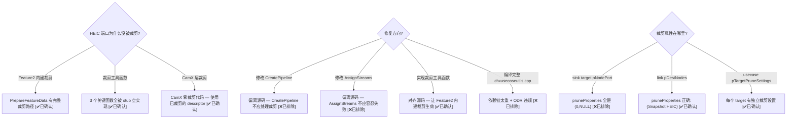

# PrunableVariant 裁剪机制 — 完整调查

> 类型：源码分析
> 置信度底线：本文档最低置信度为 🧠推断 的内容不可作为行动依据

## ❓ 问题背景
TestYUVToJpeg 失败：JPEG pipeline (InternalZSLYuv2Jpeg) 包含 HEIC 可裁剪端口，Feature2 创建 stream 时匹配失败 → Feature 创建中止。需要理解裁剪机制并正确实现。

## 🔍 搜索过程
| 命令 / 动作 | 目标 | 结果摘要 |
|------------|------|---------|
| grep PrunableVariant in topology XML | XML 定义格式 | 节点级和链接级两种裁剪标记 |
| read g_pipelines.h PruneGroup/PruneType | C 枚举定义 | PruneGroupSnapshot=3, PruneTypeJPEG=6, PruneTypeHEIC=5 |
| read chxusecaseutils.cpp:971-1535 | 完整裁剪实现 | ShouldPrune(60行) + PruneUsecaseDescriptor(470行) |
| read chxusecaseutils.cpp:2227-2558 | 克隆实现 | CloneUsecase(140行) + ClonePipelineDesc(200行) + CloneTarget(30行) |
| read chifeature2base.cpp:2569-2583 | Feature2 裁剪入口 | PrepareFeatureData → CloneUsecase → OnPruneUsecaseDescriptor → PruneUsecaseDescriptor |
| read chifeature2generic.cpp:641 | Feature2Generic 裁剪 | 添加 {Snapshot, JPEG/HEIC} 变体 |
| read chxusecaseutils.h (stub) | x86 stub 实现 | GetVariantGroup/Type 返回 0; PruneUsecaseDescriptor 是 no-op |
| grep camx/src/core prune | CamX 层裁剪 | 零代码 — CamX 不做裁剪 |
| diff chifeature2base.cpp | 源码对齐验证 | 仅 ValidateRequest 错误消息增强 (1行diff) |

## 🌳 决策树



## 💡 分析结论

### 裁剪架构 — 两层一个原则

**原则：裁剪在 CHI 层完成，CamX 使用已裁剪的 descriptor。**

| 层 | 函数 | 位置 | 裁剪对象 |
|----|------|------|---------|
| Layer 1: CHI Usecase | `PruneUsecaseByStreamConfig` → `PruneUsecaseDescriptor` | chxusecaseutils.cpp | pipeline topology: nodes, links, sinks |
| Layer 2: Feature2 | `PrepareFeatureData` → `OnPruneUsecaseDescriptor` → `PruneUsecaseDescriptor` | chifeature2base.cpp + chifeature2generic.cpp | 同上（通过调用 Layer 1 函数） |
| CamX Pipeline | 无 | — | 使用已裁剪的 descriptor，不做任何裁剪 |

### Feature2 内建裁剪流程 (chifeature2base.cpp:2569-2583)

```
PrepareFeatureData(pCreateInputInfo)
  │
  ├─ CloneUsecase(pUsecaseDesc, pipelineIndices)    // 深拷贝 usecase
  │   → m_pClonedUsecase                             // 存储为成员
  │
  ├─ OnPruneUsecaseDescriptor(pCreateInputInfo, pruneVariants)  // 虚函数
  │   │
  │   └─ ChiFeature2Generic 实现 (chifeature2generic.cpp:641):
  │       snapshotVariant.group = GetVariantGroup("Snapshot")
  │       snapshotVariant.type  = GetVariantType(bFrameworkHEICSnapshot ? "HEIC" : "JPEG")
  │       pruneVariants.push_back(snapshotVariant)
  │
  ├─ if (!pruneVariants.empty())
  │   PruneUsecaseDescriptor(m_pClonedUsecase, pruneVariants, &m_pUsecaseDesc)
  │                                                   // 创建裁剪后的新副本
  └─ else
      m_pUsecaseDesc = m_pClonedUsecase               // 无裁剪
```

### InternalZSLYuv2Jpeg 裁剪详情

| 可裁剪元素 | PruneVariant | JPEG 模式 | HEIC 模式 |
|-----------|-------------|-----------|-----------|
| JPEG0 node (65537) | {Snapshot, JPEG} | **保留** | 裁剪 |
| TARGET_BUFFER_HEIC_YUV sink | {Snapshot, HEIC} | 裁剪 | **保留** |
| TARGET_BUFFER_HEIC_BLOB sink | {Snapshot, HEIC} | 裁剪 | **保留** |
| TARGET_BUFFER_SNAPSHOT sink | {Snapshot, JPEG} | **保留** | 裁剪 |

### 根因：Stub 空实现

| Stub 函数 | 位置 | 行为 | 后果 |
|-----------|------|------|------|
| `GetVariantGroup(name)` | chxusecaseutils.h:156 | `return 0` | prune variant = {0, 0} = Invalid |
| `GetVariantType(name)` | chxusecaseutils.h:157 | `return 0` | 同上 |
| `PruneUsecaseDescriptor(...)` | chxusecaseutils.h:148-153 | `*ppPruned = pOriginal` | 裁剪无效果 |
| `CloneUsecase(...)` | chxusecaseutils.h:159-172 | 浅拷贝 pPipelineTargetCreateDesc | 真实需要深拷贝 nodes/links/sinks |
| `FreeUsecaseDescriptor(...)` | chxusecaseutils.h:158 | no-op | 内存泄漏 (测试可接受) |

### 完整实现方案

需要从 `chxusecaseutils.cpp` 提取并实现的函数：

| 函数 | 行数 | 依赖 | Android API | 复杂度 |
|------|------|------|------------|--------|
| `StringMapToIndex` | ~20 | g_stringMapVariant* | 无 | 低 |
| `ShouldPrune` | ~60 | PruneSettings/PruneVariant | 无 | 低 |
| `GetVariantGroup` | ~15 | StringMapToIndex | 无 | 极低 |
| `GetVariantType` | ~15 | StringMapToIndex | 无 | 极低 |
| `PruneUsecaseDescriptor` | ~470 | ShouldPrune, CHX_CALLOC | 无 | 高 |
| `CloneUsecase` | ~140 | ClonePipelineDesc | 无 | 中 |
| `ClonePipelineDesc` (2 overloads) | ~200 | CloneTarget, ChxUtils | 无 | 中 |
| `CloneTarget` | ~30 | CHX_CALLOC | 无 | 低 |

**总计 ~950 行**，全部无 Android/HAL3 依赖，纯 CHI 数据结构操作。

**实现策略**：
1. 从 stub header 中移除需实现函数的内联定义（改为声明）
2. 创建 `chxusecaseutils_pruning.cpp`，包含提取的真实实现
3. 移除 `feature2offlinetest.cpp` 中的 workaround 裁剪代码
4. `chifeature2base.cpp` 保持与源码一致（仅 ValidateRequest 错误消息增强）

## 📍 关键代码位置
- `chi.h:25-40` — PruneVariant, PruneSettings, PruneSettings 结构定义
- `chi.h:702` — CHINODE.pruneProperties
- `chi.h:712` — CHILINKNODEDESCRIPTOR.pruneProperties
- `g_pipelines.h:83-117` — EVariantGroup, EVariantType 枚举
- `g_pipelines.h:32138-32185` — InternalZSLYuv2Jpeg sink target + link 裁剪属性
- `chxusecaseutils.cpp:971-1028` — ShouldPrune 核心决策函数
- `chxusecaseutils.cpp:1063-1535` — PruneUsecaseDescriptor 完整实现
- `chxusecaseutils.cpp:2227-2558` — CloneUsecase + ClonePipelineDesc 深拷贝
- `chifeature2base.cpp:2569-2583` — PrepareFeatureData 裁剪入口
- `chifeature2generic.cpp:641` — OnPruneUsecaseDescriptor 添加 Snapshot 变体
- `chxusecaseutils.h:148-172` (stub) — 空实现的裁剪函数

## ⚠️ 待验证事项
- [✅已确认] PruneUsecaseDescriptor 提取后在 x86 上编译无问题（20 轮压测通过）
- [✅已确认] 深拷贝 CloneUsecase 与浅拷贝 stub 的行为差异不影响其他 4 个测试（5/5 PASS）

## ✅ 实现状态
- 提交 `6bb4d1f` implement PrunableVariant pruning — TestYUVToJpeg 5/5 PASS
- 20 轮 × 5 测试 = 100 次执行，0 失败
- 新增文件：`chifeature2test/stubs/chxusecaseutils_pruning.cpp`（~650 行）
- chifeature2base.cpp AssignStreams 已还原为源码行为（CDKResultENoMemory）

## 📝 备注
- 裁剪属性在 link descriptors 中（不在 sink target descriptors 的 pNodePort 中）— 之前的 workaround 读错了位置
- 源码中 `PruneUsecaseDescriptor` 创建全新 ChiUsecase（不修改输入），需要深拷贝 nodes/links/sinks 数组
- `ChiFeature2Generic::OnPruneUsecaseDescriptor` 检查 `bFrameworkHEICSnapshot` 标志决定裁剪 HEIC 还是 JPEG
- 编译完整 `chxusecaseutils.cpp` 不可行：依赖 `gr_priv_handle.h`、`chxadvancedcamerausecase.h` 等重量级头文件 + ODR 违规
