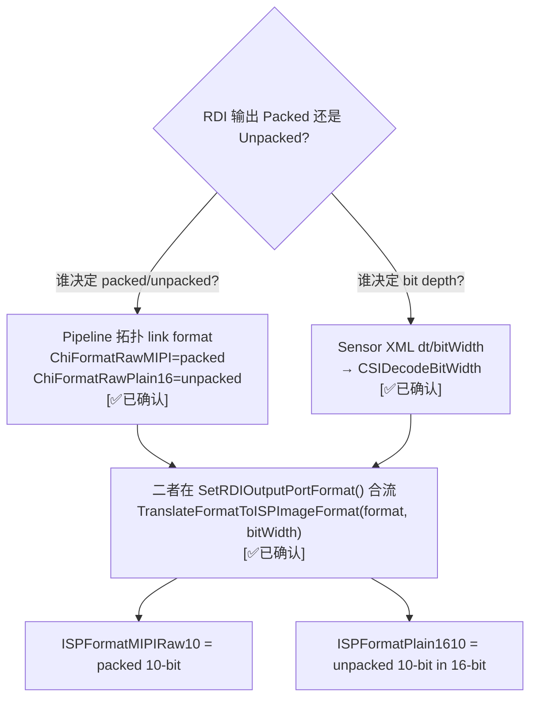

# RDI Raw 格式配置决定链 — Packed (MIPI) vs Unpacked (Plain16)

> 类型：源码分析
> 置信度底线：✅已确认（四路并行源码验证 + Pipeline 拓扑实例交叉确认）

## ❓ 问题背景
IFE RDI 端口输出的 Raw 数据是 MIPI Packed (10-bit packed in 5 bytes/4 pixels) 还是 Plain16 (16-bit per pixel, unpacked)？这是哪里配置决定的？

## 🔍 搜索过程
| 命令 / 动作 | 目标 | 结果摘要 |
|------------|------|---------| 
| read camxifenode.cpp:716-833 | SetRDIOutputPortFormat 函数 | 按 portSourceTypeId × format 二维分发 |
| read camxifenode.cpp:200-307 | TranslateFormatToISPImageFormat | RawMIPI→MIPIRaw{6,8,10,12,14}, RawPlain16→Plain16_{8,10,12,14} |
| read camxifenode.cpp:5800-5880 | SetupChannelResource 输入资源 | Sensor dt → m_CSIDecodeBitWidth |
| read camxifenode.cpp:6073-6260 | SetupChannelResource 输出资源 | 5 个 RDI 端口调用 SetRDIOutputPortFormat |
| read g_pipelines.h RDI links | Pipeline 拓扑 RDI 格式 | RawPlain16=104 次, RawMIPI=56 次 |
| read chi.h ChiFormat enum | 格式枚举定义 | RawMIPI=9, RawPlain16=10 |
| read imx586_sensor.xml | Sensor XML 格式声明 | dt=0x2B (RAW10), bitWidth=10 |
| read camxsensorproperty.h | CSI Data Type 常量 | 0x2A=RAW8, 0x2B=RAW10, 0x2C=RAW12, 0x2D=RAW14 |

## 🌳 决策树


## 💡 分析结论

### 核心答案：两层配置共同决定

RDI Raw 的 packed/unpacked 由 **两个独立配置源** 共同决定：

| 配置源 | 决定什么 | 在哪里设置 |
|--------|---------|-----------|
| **Pipeline 拓扑** (g_pipelines.h) | Packed (`ChiFormatRawMIPI`) or Unpacked (`ChiFormatRawPlain16`) | link 的 `ChiLinkBufferProperties.bufferFormat` |
| **Sensor XML** (xxx_sensor.xml) | Bit depth (8/10/12/14) | `streamConfiguration.dt` + `bitWidth` |

二者在 IFE Node 的 `SetRDIOutputPortFormat()` 中合流，通过 `TranslateFormatToISPImageFormat(format, CSIDecodeBitWidth)` 产出最终的 ISP 硬件格式。

### 完整数据流

```
                    ┌──────────────────────────────────┐
                    │  Sensor XML (imx586_sensor.xml)  │
                    │  dt=0x2B (RAW10), bitWidth=10    │
                    └──────────┬───────────────────────┘
                               │ PopulateSensorModeData
                               ▼
                    SensorMode.streamConfig[].dt
                               │ TranslateCSIDataTypeToCSIDecodeFormat()
                               ▼
                    m_CSIDecodeBitWidth = CSIDecode10Bit
                               │
                               │                     ┌──────────────────────────────────┐
                               │                     │  g_pipelines.h (Pipeline 拓扑)   │
                               │                     │  link format = ChiFormatRawMIPI  │
                               │                     │  or ChiFormatRawPlain16          │
                               │                     └──────────┬───────────────────────┘
                               │                                │ camxchicontext → camxnode
                               │                                │ InitializeNonSinkPortBufferProperties
                               │                                ▼
                               │                     outputPort.imageFormat.format
                               │                                │
                               ▼                                ▼
                    ┌───────────────────────────────────────────────┐
                    │  SetRDIOutputPortFormat(pOutputResource,      │
                    │                        format,                │  ← Pipeline 拓扑格式
                    │                        outputPortId,          │
                    │                        portSourceTypeId)      │  ← 端口类型
                    │                                               │
                    │  TranslateFormatToISPImageFormat(format,      │
                    │                                  decodeBW)    │  ← Sensor bit depth
                    └──────────────────────┬────────────────────────┘
                                           ▼
                              ┌──────────────────────────┐
                              │  最终 ISP 格式            │
                              │  MIPIRaw10 (packed)      │
                              │  或 Plain1610 (unpacked) │
                              └──────────────────────────┘
```

### 格式映射表 (TranslateFormatToISPImageFormat)

| Pipeline 格式 | CSIDecode | ISP 硬件格式 | 说明 |
|---------------|-----------|-------------|------|
| `RawMIPI` | `10Bit` | `ISPFormatMIPIRaw10` | 10-bit packed (5 bytes = 4 pixels) |
| `RawMIPI` | `12Bit` | `ISPFormatMIPIRaw12` | 12-bit packed (3 bytes = 2 pixels) |
| `RawMIPI` | `8Bit` | `ISPFormatMIPIRaw8` | 8-bit = 1 byte/pixel (无压缩增益) |
| `RawMIPI` | `14Bit` | `ISPFormatMIPIRaw14` | 14-bit packed |
| `RawPlain16` | `10Bit` | `ISPFormatPlain1610` | 10-bit 存 16-bit 容器，高 6 bit=0 |
| `RawPlain16` | `12Bit` | `ISPFormatPlain1612` | 12-bit 存 16-bit |
| `RawPlain16` | `8Bit` | `ISPFormatPlain168` | 8-bit 存 16-bit |

### PortSrcType 与 CSIDecode 的对应关系

同一个 RDI 端口可能服务于不同 Sensor Stream（IMAGE/PDAF/META/HDR），每种 stream 有独立的 bit depth：

| portSourceTypeId | CSIDecode 变量 | 来源 |
|-----------------|----------------|------|
| `Pixel` / `Undefined` (0/1) | `m_CSIDecodeBitWidth` | Sensor IMAGE stream dt |
| `PDAF` (2) | `m_PDAFCSIDecodeFormat` | PDAF stream bitWidth |
| `HDR` (3) | `m_HDRCSIDecodeFormat` | HDR stream bitWidth |
| `Meta` (4) | `m_metaCSIDecodeFormat` | Meta stream bitWidth |

### 实际 Pipeline 使用统计 (g_pipelines.h)

| 用途 | 常用格式 | 说明 |
|------|---------|------|
| PDAF 数据 (RDI1 portSrcType=2) | `ChiFormatRawPlain16` | 104 次。PDAF 需要逐像素读取做 AF 计算 |
| Raw 直出/ZSL buffer (RDI0 portSrcType=0) | `ChiFormatRawMIPI` | 56 次。节省带宽和存储 |
| Meta/HDR stream | `ChiFormatRawMIPI` 或 `Blob` | 取决于具体 stream |

### 关键设计洞察

1. **Packed (MIPI) 节省带宽**：10-bit packed = 1.25 bytes/pixel，Plain16 = 2 bytes/pixel。对 4K Raw (3840×2160) 单帧差 6.2MB。RDI Raw 直出首选 packed。
2. **Unpacked (Plain16) 便于计算**：PDAF 算法需要直接读取像素值做相位差计算，不想在软件层解 MIPI packing，所以 PDAF 端口默认 Plain16。
3. **硬件解包免费**：IFE RDI 路径支持硬件解包（CSID → IFE RDI datapath），所以选 Plain16 不增加 CPU 负担，只增加 DDR 带宽。
4. **`portSourceTypeId` 是隐藏的第三维**：同一 RDI 端口的 bit depth 取决于它服务哪种 Sensor stream，这由 Pipeline XML 中 output port descriptor 的第 4 个字段决定。

## 📍 关键代码位置
- `camx/src/hwl/ife/camxifenode.cpp:716-833` — SetRDIOutputPortFormat：按 portSourceTypeId × format 分发
- `camx/src/hwl/ife/camxifenode.cpp:200-307` — TranslateFormatToISPImageFormat：format × bitWidth → ISPFormat
- `camx/src/hwl/ife/camxifenode.cpp:384-417` — TranslateCSIDataTypeToCSIDecodeFormat：dt hex → CSIDecode enum
- `camx/src/hwl/ife/camxifenode.cpp:6196-6222` — SetupChannelResource 中 5 个 RDI 端口调用点
- `camx/src/hwl/ife/camxifenode.cpp:5805-5880` — 输入资源 CSIDecode 设置（按 stream type 分）
- `camx/src/core/camxsensorproperty.h:27-32` — CSI Data Type 常量 (0x2A-0x2D)
- `camx/src/core/camxsensorproperty.h:35-40` — CSIDecode enum (6/8/10/12/14 bit)
- `chi-cdk/api/common/chi.h:230-275` — ChiFormat enum (RawMIPI=9, RawPlain16=10)
- `chi-cdk/core/lib/common/g_pipelines.h` — Pipeline 拓扑 link 格式定义
- `chi-cdk/oem/qcom/sensor/imx586/imx586_sensor.xml:151,160` — dt=43(0x2B=RAW10), bitWidth=10

## ⚠️ 待验证事项
- [🧠推断] `FinalizeBufferProperties` 中 PDAF 端口可能将 RawPlain16 改为 Blob（取决于 PDAFNativeBufferFormat），此路径未完整追踪
- [🧠推断] HDR stream 的 Plain16 路径在 SetRDIOutputPortFormat 中无 case（只有 Blob 和 RawMIPI），暗示 HDR stream 不使用 Plain16

## 📝 备注
- RDI 是 IFE 的 bypass 路径，不经 Demosaic/ISP 处理，直出 Raw
- Pipeline 拓扑格式可被 usecase 层动态覆盖（`bIsOverrideImplDefinedWithRaw` flag），但静态拓扑中不使用此机制
- `PortSrcType` 定义在 camxhwdefs.h（Undefined=0, Pixel=1, PDAF=2, HDR=3, Meta=4），映射函数在 camxifenode.cpp:463-493
