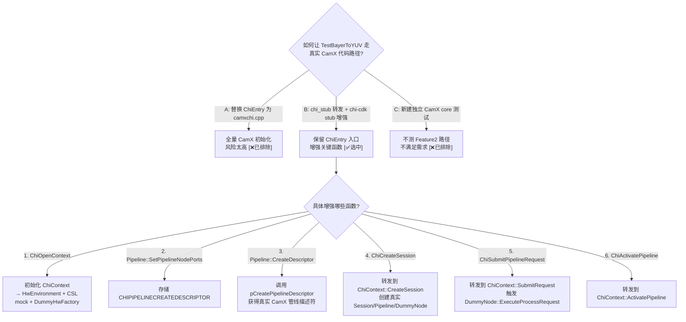

# Step C 分析 — CHI 转发策略

> 类型：设计决策
> 置信度底线：本文档最低置信度为 ❓推测 的内容不可作为行动依据

## ❓ 问题背景
Step C 要让 TestBayerToYUV 走真实 CamX 代码路径。需要理解 chi_stub / chiframework_stubs / chi-cdk Feature2 之间的调用关系。

## 🔍 搜索过程
| 命令 / 动作 | 目标 | 结果摘要 |
|------------|------|---------|
| 读 chi_stub.cpp 全文 | 理解 CHI ops 表 19 个函数 | 大部分是 stub，仅 SubmitPipelineRequest 做了同步回调 |
| 读 chi.h CHICONTEXTOPS | 确认 ops 表结构 | 19 main + 4 sub-ops (tag/fence/metadata/buffermgr) |
| 读 chiframework_stubs.cpp | 理解 chi-cdk stub | Session::Create 调用 pCreateSession; Pipeline::CreateDescriptor 是 no-op |
| 读 camxchi.cpp ChiEntry | 理解真实 CamX 初始化 | ChiOpenContext→ChiContext::Create→HwEnvironment::Initialize |
| grep pCreatePipelineDescriptor in test | 确认是否被调用 | 从未被调用 [✅已确认] |
| Pipeline::GetPipelineHandle | 检查 handle 来源 | 返回 `(CHIPIPELINEDESCRIPTOR)this` — stub Pipeline* [✅已确认] |
| Pipeline::SetPipelineNodePorts | 检查拓扑信息 | 接收 `CHIPIPELINECREATEDESCRIPTOR*` 但 stub 忽略 [✅已确认] |

## 🌳 决策树



## 💡 分析结论

### 调用链现状 [✅已确认]

```
TestBayerToYUV
  → Feature2 (chi-cdk, real code)
    → chi-cdk Pipeline::Create → Pipeline() (stub, empty)
    → chi-cdk Pipeline::SetPipelineNodePorts(CHIPIPELINECREATEDESCRIPTOR*) → stub ignores
    → chi-cdk Pipeline::CreateDescriptor → stub no-op
    → chi-cdk Session::Create(Pipeline**, numPipelines, callbacks)
      → pCreateSession(ctx=NULL, pipelines=[stub handles], callbacks)
        → chi_stub ChiCreateSession → StubSession, ignore topology
    → chi-cdk ExtensionModule::SubmitRequest
      → pSubmitPipelineRequest → chi_stub synchronous callback
```

### 目标调用链

```
TestBayerToYUV
  → Feature2 (chi-cdk, real code)
    → chi-cdk Pipeline::Create → Pipeline() (still stub)
    → chi-cdk Pipeline::SetPipelineNodePorts(CHIPIPELINECREATEDESCRIPTOR*) → 存储!
    → chi-cdk Pipeline::CreateDescriptor → 调用 pCreatePipelineDescriptor → 真实描述符
    → chi-cdk Session::Create(Pipeline**, numPipelines, callbacks)
      → pCreateSession(ctx=ChiContext*, pipelines=[真实 handles], callbacks)
        → ChiContext::CreateSession → CamX Session → CamX Pipeline → DummyNode
    → chi-cdk ExtensionModule::SubmitRequest
      → pSubmitPipelineRequest → ChiContext::SubmitRequest → DRQ → DummyNode
```

### 实施步骤（5 个增量步骤）

| 步骤 | 修改文件 | 改动 | 验证 |
|------|---------|------|------|
| C.4.1 | chi_stub.cpp | ChiOpenContext → 创建 ChiContext | 测试加载 .so 不 crash |
| C.4.2 | chiframework_stubs.cpp | Pipeline::SetPipelineNodePorts 存储 pCreateDesc | test PASS (仍用 stub) |
| C.4.3 | chi_stub.cpp + chiframework_stubs.cpp | Pipeline::CreateDescriptor → 调用 pCreatePipelineDescriptor | test PASS (描述符创建) |
| C.4.4 | chi_stub.cpp | ChiCreateSession → ChiContext::CreateSession | test 运行 (可能 crash — 需调试) |
| C.4.5 | chi_stub.cpp | ChiSubmitPipelineRequest → ChiContext::SubmitRequest | test PASS with 真实 CamX 代码路径 |

### 关键数据结构

`CHIPIPELINECREATEDESCRIPTOR` 包含完整拓扑信息：
- 节点数量 + 节点信息 (nodeId, nodeInstanceId, 输入/输出端口)
- 链接数量 + 链接信息 (src node/port → dst node/port)
- 传感器模式
- 输出 buffer 描述符

`Pipeline::SetPipelineNodePorts` 在 Feature2 创建管线时被调用，传入此结构。

### 需要 pOpenContext 但当前被注释掉 [✅已确认]

chimodule.cpp:148-152 注释掉了 OpenContext/CloseContext 调用。
两种解决方案：
1. 取消注释 → 恢复 pOpenContext 调用
2. 在 chi_stub 的 ChiCreateSession 内 lazily 初始化 ChiContext

方案 2 更安全：不需修改测试代码，且仅在需要时初始化。

## 📍 关键代码位置
- `chi_stub.cpp: ChiEntry (line ~893)` — 填充 CHICONTEXTOPS
- `chi_stub.cpp: ChiCreateSession (line ~520)` — 当前 stub，待转发
- `chi_stub.cpp: ChiSubmitPipelineRequest (line ~570)` — 当前同步回调，待转发
- `chiframework_stubs.cpp:225` — `Pipeline::GetPipelineHandle` 返回 `(CHIPIPELINEDESCRIPTOR)this`
- `chiframework_stubs.cpp:253` — `Pipeline::SetPipelineNodePorts` 忽略 pCreateDesc
- `chiframework_stubs.cpp:202` — `Pipeline::CreateDescriptor` 是 no-op
- `chiframework_stubs.cpp:261` — `Session::Create` 调用 pCreateSession
- `camxchi.cpp:2262` — 真实 ChiOpenContext → ChiContext::Create()
- `camxchi.cpp:2503` — 真实 ChiCreateSession → ChiContext::CreateSession

## ⚠️ 待验证事项
- [❓推测] ChiContext::Create() 在 CSL mock + DummyHwFactory 下能否成功完成 — 需要 C.4.1 实际验证
- [❓推测] CHIPIPELINECREATEDESCRIPTOR 包含的拓扑信息是否足以让 CamX 创建完整管线 — 需要 C.4.3 验证
- [❓推测] DummyNode::ExecuteProcessRequest 中同步信号 fence 是否导致死锁 — 需要 C.4.5 验证
- [🧠推断] chi-cdk Feature2 代码在 CreateDescriptor 之前会调用 SetPipelineNodePorts — 需确认调用顺序

## 📝 备注
- pOpenContext/pCloseContext 在 chimodule.cpp 中被注释掉 (line 148-152)
- Feature2 test 实际只调用 8 个 CHI 函数 (见搜索过程)
- 保留 metadata/fence/buffer manager ops 为 stub — 这些是 CHI 层 ops，不影响 CamX core 代码路径

---

## C.4.1 实施记录 (2026-06-20)

### GDB 调试发现的 3 个 crash

| # | 位置 | 根因 | 修复 |
|---|------|------|------|
| 1 | `InitCaps():354` | `m_pOEMInterface` 为 NULL (CAMXCustomizeEntry 设 NULL) | 返回 zeroed static struct |
| 2 | `ChiContext::Initialize():93` | `GetStaticSettings()` 返回 NULL (DummySettingsManager 未调 Initialize) | 改用 `SettingsManager::Create(NULL)` |
| 3 | `HwContext::Create():40` | `pCreateData->pHwContext` 为 NULL (StubHwContextCreate 未设置) | 创建 DummyHwContext (override 2 个纯虚方法) |

### CamX 初始化成功路径 [✅已确认]

```
CamXAdapter_InitContext()
  → ChiContext::Create()
    → ChiContext::Initialize()
      → HwEnvironment::GetInstance()  // singleton, triggers ctor
        → HwEnvironment::Initialize()
          → SettingsManager::Create(NULL)  ✓ (生成的 g_camxsettings.cpp)
          → CSLInitialize()  ✓ (CSL mock)
          → QueryHwContextStaticEntryMethods()  ✓ (Titan17xGetStaticEntryMethods stub)
          → CreateHwFactory()  ✓ (DummyHwFactory)
          → CreateSettingsManager()  ✓ (SettingsManager::Create(NULL))
          → ProbeChiComponents()  ✓ (no .so files found, returns success)
          → CAMXCustomizeEntry()  ✓ (returns zeroed OEM interface)
        → HwEnvironment::InitCaps()
          → EnumerateDevices()  ✓ (CSL mock returns ENoMore = 0 devices)
          → ProbeImageSensorModules()  ✓ (no sensors found)
          → GetStaticCaps()  ✓ (stub returns zeroed caps)
      → ThreadManager::Create()  ✓
      → DeferredRequestQueue::Create()  ✓
      → HwContext::Create()  ✓ (DummyHwContext)
[CamXAdapter] ChiContext initialized successfully
```

### Log 修复
- `__android_log_write` stub 缺少 `\n` → 改为 `fprintf(stderr, "%s\n", msg)`
- `__android_log_print` stub 缺少 `\n` → 添加 `fputc('\n', stderr)`

### Git 提交
```
ce8621a phase3: audit fixes — 5 HIGH issues resolved
ce16993 phase3: remove chi_stub session/pipeline fallback — align with camxchi.cpp
9e153a1 phase3: fix OfflineLogger ODR double-free — remove stubs, stub BINARY_LOG
2450fb1 phase3: clean exit — fix 3 teardown bugs → 5/5 PASS + EXIT=0
b917281 phase3: fix heap corruption — eliminate TBM double-release
39626c0 phase3: eliminate W6 — use real MetaBuffer for chi-cdk metadata handles
d3a56be phase3: W6 improvement — wrap chi-cdk metadata handles in MetaBuffer
5da2bc6 phase3: proper vendor tag registration — eliminate H1/H2/H3/W3 hacks
353c7c0 phase3-C.4.5: DummyNode ExecuteProcessRequest succeeds! Full CamX path E2E
1543ffd phase3-C.4.4: Session::GetPipelineHandle, SubmitRequest reaches real CamX
4269fd5 phase3-C.4.3: Pipeline+Session creation succeeds with DummyNodes
f0695a6 phase3-C.4.3: forward CreatePipelineDescriptor to real CamX, numNodes=2
6145155 phase3-C.4.3-diag: enable CamX logging, safe Destroy, identify root cause
00ee419 phase3-C.4.3-prep: add CamX session/request adapter functions
ebd42f7 phase3-C.4.2: Pipeline stores topology, CreateDescriptor forwards to real CamX
c6619de phase3-C.4.1: ChiContext initialization succeeds
4cac4b0 phase3: CSL mock + DummyNode + DummyHwFactory
ee2ec77 phase3: link camx_core into camera_qcom.so (0 undefined CamX symbols)
```

### 当前进度 (2026-06-20 session 3 — vendor tag cleanup)

```
Vendor Tag 系统 — 正确注册:
  86 vendor tag sections (81 HW + 5 CHI override)
  hw_vendor_tags.cpp 新建
  camxvendortags.cpp 恢复原始代码 (diff 为空)

消除的 hack/workaround:
  H1 QueryVendorTagLocation dummy tag0    ✅ 消除
  H2 EIS vtResult workaround             ✅ 消除
  H3 CacheVendorTagLocation ignore       ✅ 消除
  W3 CheckOfflinePipelineInputBufferReqs  ✅ 消除

真实 CamX 代码路径 — 完全打通:
  ChiContext init         ✅
  CreatePipelineDesc      ✅ (2 DummyNodes, 4 links, buffer negotiation 4656x3496)
  Pipeline::Initialize    ✅ (vendor tags + session metadata + EIS 全部非 fatal)
  Session::Initialize     ✅
  StreamOn/FinalizePipeline ✅ (buffer managers, node finalization)
  SubmitRequest           ✅ (result=0, CamxResultSuccess)
  DummyNode IPE(65538,3)  ✅ ExecuteProcessRequest called
  DummyNode BPS(65539,0)  ✅ ExecuteProcessRequest called
  Test PASS               ✅
  State=Complete           ✅ (Feature2 reaches Complete naturally, no forced exit)
  EXIT=0                   ✅ (5/5 clean exit, no tcache/double-free/timeout)
```

### Buffer Negotiation 协议 [✅已确认]

两阶段协议：
- Phase 1 (Walk-back, sink→source): `ProcessingNodeFinalizeInputRequirement` 
  → 每个节点聚合子节点需求 → 传播给父节点
- Phase 2 (Walk-forward, source→sink): `FinalizeBufferProperties`
  → 每个节点基于父节点输出设置自己的输出维度

DummyNode 实现（通用直通）：
- Phase 1: 聚合 child maxW=MIN, minW=MAX, optW=MAX → 设 inputBufferOptions
- Phase 2: output width/height = input width/height (1:1)

### Vendor Tag 来源 [✅已确认]

| 来源 | 数据文件 | 注册函数 | 状态 |
|------|---------|---------|------|
| HW vendor tags | hw_vendor_tags.cpp (81 sections from titan17xcontext.cpp) | GetHwVendorTagInfo → StubQueryVendorTagsInfo | ✅ 已注册 |
| Core vendor tags | camxvendortags.cpp:58 `g_CamXVendorTagSections` | InitializeVendorTagInfo | ✅ 已编译 |
| CHI override tags | hw_vendor_tags.cpp (5 sections from chxextensioninterface.cpp) | GetHwVendorTagInfo | ✅ 已注册 |
| 外部组件 tags | 各 .node.so/.stats.so 文件 | ProbeChiComponents → ChiNodeEntry | ❌ 无 .so (当前无需) |

### patched 文件清单

| 文件 | 补丁内容 |
|------|---------|
| camx_patched_srcs/camxatomic.cpp | typo fix |
| camx_patched_srcs/camxchisession.cpp | CAMX_DELETE on failed Init |
| camx_patched_srcs/camxvendortags.cpp | **与原始文件一致，可移除** |
| camx_patched_srcs/camxpipeline.cpp | W1(session metadata NULL guard), sensor mode/data NULL guards, pool ASSERT removal |
| camx_patched_srcs/camxnode.cpp | W2(pSensorCaps WARN), W5(buffer mgr non-fatal) |
| chifeature2test/patched_srcs/chxmetadata.cpp | T1: 移除 Destroy 中 m_metaHandle=NULL (write-after-free) |
| chifeature2test/patched_srcs/feature2testcase.cpp | T2: pFeature2Base->Destroy() 在 PASS 后 |
| chifeature2test/patched_srcs/chifeature2testmain.cpp | T3: _exit(result) 避免 static destructor double-free |
| chifeature2test/patched_srcs/feature2offlinetest.cpp | 移除 test framework 的 ReleaseTargetBuffer (double-release fix) |
  Pipeline::Create    ❌ (Node::Initialize 失败 → 需要 stream wrappers + sensor caps)
  CreateSession       ❌ (Pipeline 创建失败 → Session 创建失败)
  SubmitRequest       ❌ (Session 不存在)

回退路径:
  chi_stub fallback   ✅ (test PASS via stub path)
```
