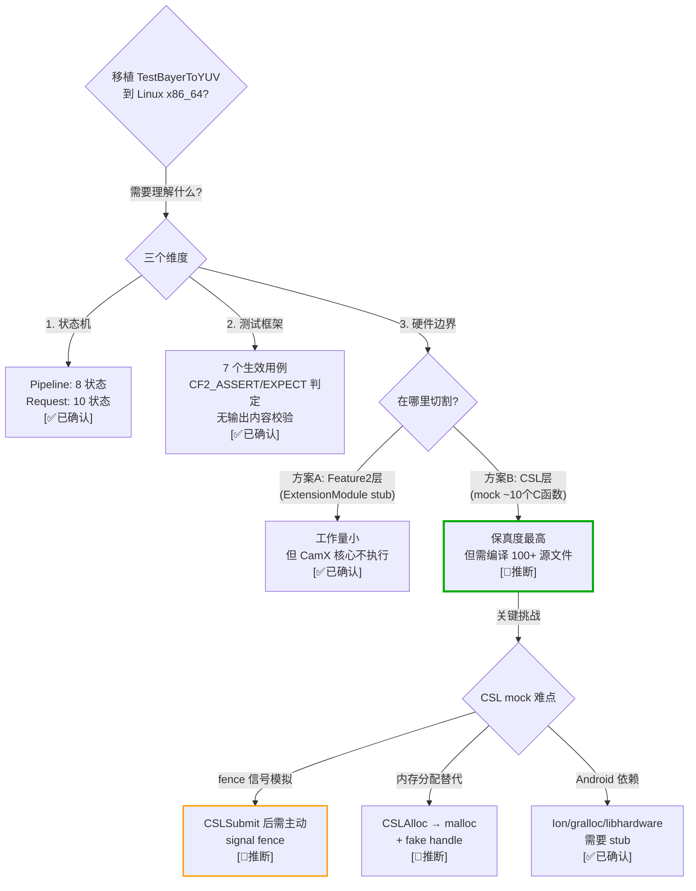
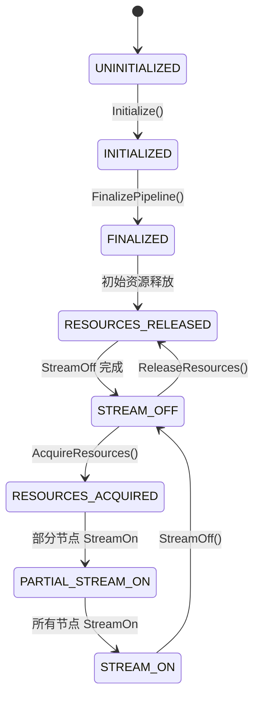
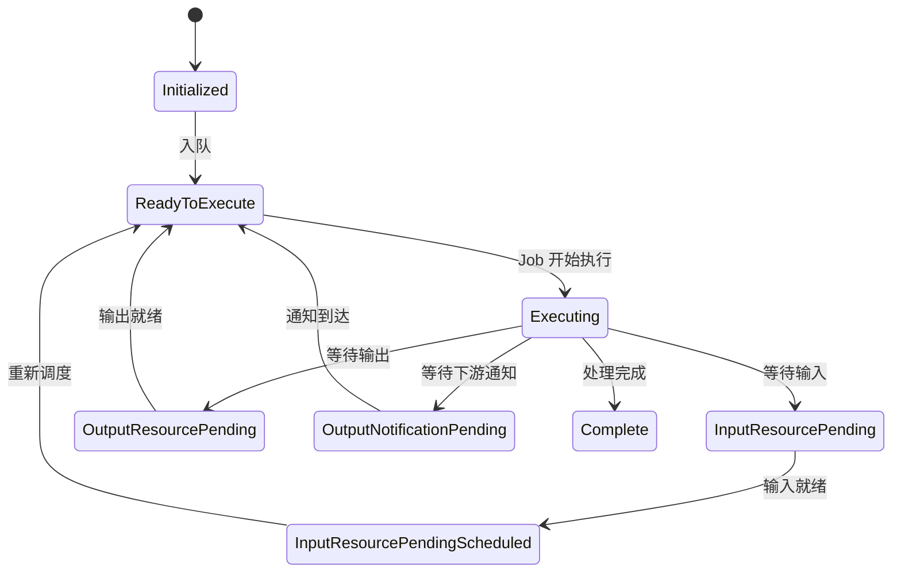
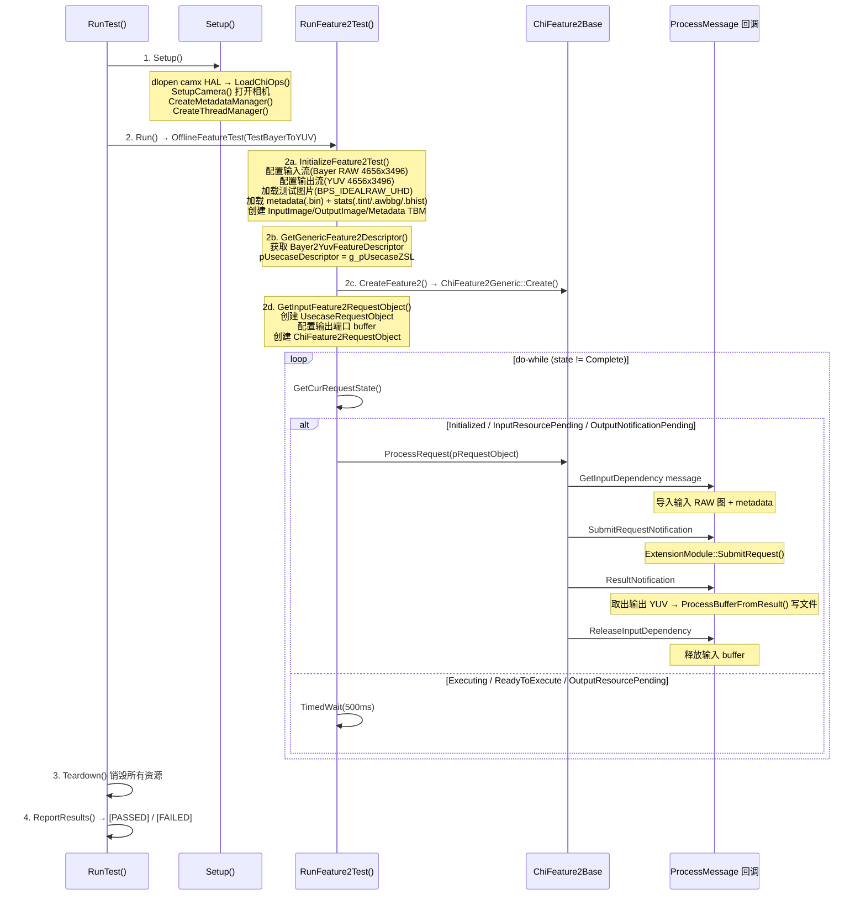
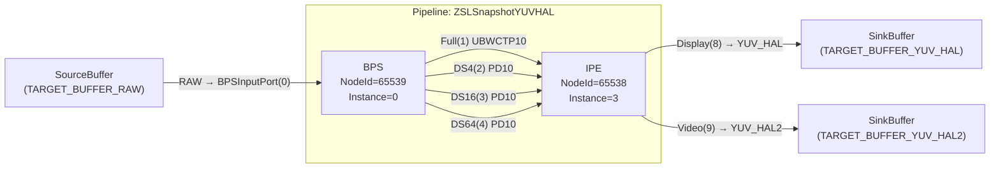
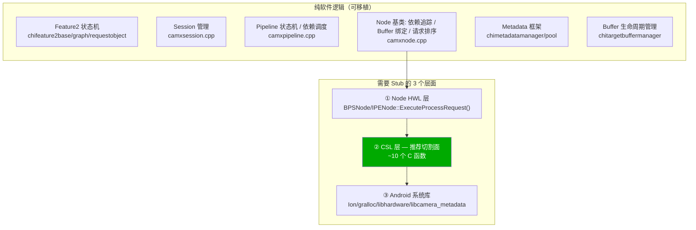

# CamX Feature2 离线测试全景分析 — 状态机、测试框架、调用链与 CSL Mock 移植方案

> 类型：源码分析
> 置信度底线：本文档最低置信度为 ❓推测 的内容不可作为行动依据

## ❓ 问题背景
以 `chifeature2test` 模块的 `Feature2OfflineTest::TestBayerToYUV` 用例为切入点，全面调查 CamX 的状态机、测试框架架构、硬件依赖边界，制定 CSL 层 Mock 移植方案。

## 🔍 搜索过程
| 命令 / 动作 | 目标 | 结果摘要 |
|------------|------|---------|
| grep "PipelineStatus" camx/src/core/ | Pipeline 状态枚举 | camxpipeline.h:60, 8 种状态 |
| grep "ChiFeature2RequestState" chi-cdk/ | Request 状态枚举 | chifeature2requestobject.h:49, 10 种状态 |
| glob "*test*" chi-cdk/ | 测试代码分布 | chi-cdk/test/ 下 5 个模块 |
| read Android.mk (chifeature2test) | 编译源文件 | 仅 chifeature2testmain.cpp |
| read Android.mk (libchifeature2testframework) | 框架库编译 | 16 个 cpp，不含 chifeature2testbase.cpp |
| grep "CHIFEATURE2TEST_TEST" | 用例注册 | 7 个 DEFAULT + 3 个 ORDERED（但后者不编译）|
| read feature2offlinetest.cpp | TestBayerToYUV 调用链 | line 92-137: RunFeature2Test() |
| read feature2testcase.cpp:655 | 状态机驱动主循环 | do-while 轮询至 Complete |
| read chifeature2test.cpp:80 | Check() PASS/FAIL 判定 | SetFailed() + 日志 |
| read chifeature2bayer2yuvdescriptor.cpp | Feature 描述符 | pipeline: ZSLSnapshotYUVHAL |
| read g_camxZSLSnapshotYUVHAL.xml | Pipeline 拓扑 | 2 Node, 7 Link |
| grep "CSL" camxbpsnode.cpp | BPS 硬件调用 | CSLAcquireDevice:2512, Submit:2008 |
| grep "CSL" camxipenode.cpp | IPE 硬件调用 | CSLAcquireDevice:7417, Submit:6856 |
| grep "CSL" camxpipeline.cpp | Pipeline 硬件调用 | CSLOpen/StreamOn/Link/OpenRequest |

## 🌳 决策树



---

## 💡 分析结论

### 一、CamX 核心状态机

#### 1.1 Pipeline 状态（8 种）

定义于 `camx/src/core/camxpipeline.h:60`：



| # | 状态 | 说明 |
|---|------|------|
| 1 | `UNINITIALIZED` | 初始状态 |
| 2 | `INITIALIZED` | Pipeline 初始化完成 |
| 3 | `FINALIZED` | Pipeline 终结完成 |
| 4 | `RESOURCES_RELEASED` | 流资源已释放 |
| 5 | `STREAM_OFF` | 流已关闭 |
| 6 | `RESOURCES_ACQUIRED` | 流资源已获取 |
| 7 | `PARTIAL_STREAM_ON` | 部分流已开启 |
| 8 | `STREAM_ON` | 流已开启，可处理请求 |

#### 1.2 Feature2 Request 状态（10 种）

定义于 `chi-cdk/core/chifeature2/chifeature2requestobject.h:49`：



| # | 状态 | 说明 |
|---|------|------|
| 1 | `Initialized` | 已初始化 |
| 2 | `ReadyToExecute` | 已入队，准备执行 |
| 3 | `Executing` | 正在执行 |
| 4 | `InputResourcePending` | 等待输入资源 |
| 5 | `InputResourcePendingScheduled` | 输入依赖已满足，已提交执行任务 |
| 6 | `OutputResourcePending` | 等待输出资源 |
| 7 | `OutputErrorResourcePending` | 等待输出资源（带错误） |
| 8 | `OutputNotificationPending` | 等待下游 Feature 的输出通知 |
| 9 | `OutputErrorNotificationPending` | 等待下游输出通知（带错误） |
| 10 | `Complete` | 请求处理完成 |

---

### 二、测试框架与用例分析

#### 2.1 CamX 仓库测试代码分布

| 模块 | 目录 | 文件数 | 用途 |
|------|------|--------|------|
| **nativechitest** | `chi-cdk/test/nativetest/nativechitest/` | 37 | CHI API 集成测试 |
| **chifeature2test** | `chi-cdk/test/chifeature2test/` | 3 | Feature2 测试二进制入口 |
| **libchifeature2testframework** | `chi-cdk/test/chifeature2testframework/` | 44 | Feature2 测试框架静态库 |
| **chiofflinepostproctest** | `chi-cdk/test/chiofflinepostproctest/` | 4 | 离线后处理测试 |
| **f2player** | `chi-cdk/test/f2player/` | 3 | Feature2 播放器 |
| camx 自测试 | `camx/src/core/camxtest.cpp/.h` | 2 | 框架内部自测试基类（stub） |

#### 2.2 chifeature2test 实际生效的用例（7 个）

`chifeature2test` 二进制编译 `chifeature2testmain.cpp`（1 个 cpp），静态链接 `libchifeature2testframework`（16 个 cpp）。

**注意**：`chifeature2testbase.cpp` 和 `chifeature2testrequestobject.cpp` 不在 `LOCAL_SRC_FILES` 中，因此其中注册的 3 个 `CHIFEATURE2TEST_TEST_ORDERED` 用例（TestBayer2Yuv、TestMFNR、TestRequestObject）**不会被编译**。

| # | 测试套件 | 用例名 | 注册位置 | 实现文件 |
|---|---------|--------|---------|---------|
| 1 | Feature2OfflineTest | TestBayerToYUV | chifeature2testmain.cpp:55 | feature2offlinetest.cpp |
| 2 | Feature2OfflineTest | TestYUVToJpeg | chifeature2testmain.cpp:60 | feature2offlinetest.cpp |
| 3 | Feature2OfflineTest | TestMultiStage | chifeature2testmain.cpp:65 | feature2offlinetest.cpp |
| 4 | Feature2OfflineTest | TestBPS | chifeature2testmain.cpp:80 | feature2offlinetest.cpp |
| 5 | Feature2OfflineTest | TestIPE | chifeature2testmain.cpp:85 | feature2offlinetest.cpp |
| 6 | Feature2RealTimeTest | RealTime | chifeature2testmain.cpp:70 | feature2realtimetest.cpp |
| 7 | Feature2MFXRTest | TestMFXR | chifeature2testmain.cpp:75 | feature2mfxrtest.cpp |

#### 2.3 PASS/FAIL 判定机制

测试框架使用自定义断言体系（非 GoogleTest），定义于 `chifeature2test.h:122-142`：

| 宏 | 失败行为 | 类比 |
|---|---------|------|
| `CF2_ASSERT(cond, msg)` | `Check()` → `SetFailed()` → `return`（终止） | gtest ASSERT_* |
| `CF2_EXPECT(cond, msg)` | `Check()` → `SetFailed()`（继续执行） | gtest EXPECT_* |
| `CF2_FAIL(msg)` | 无条件 `SetFailed()` → `return` | gtest FAIL() |

判定逻辑 (`chifeature2test.cpp:80`)：
```cpp
bool Check(ChiFeature2Test *funcObj, bool passed, ...) {
    if (!passed) {
        funcObj->SetFailed();       // result = 1 → FAIL
        CF2_LOG_ERROR("CONDITION FAILED! %s:%d ...");
    }
    return (passed);
}
```

宏生成类中的 `result` 字段初始为 `0`（PASS）。任何断言失败将其置为 `1`（FAIL）。

**关键发现**：测试**不校验输出图像内容**。`feature2testcase.cpp:744` 有注释：
```cpp
//ValidateResult(pFeatureRequestObject); //TODO: validate result
```

PASS 仅意味着：整个流程从 `Initialized` 跑到 `Complete`，没有崩溃，没有触发断言失败。

实际检查点：

| 位置 | 断言 | 含义 |
|------|------|------|
| feature2testcase.cpp:41 | `CF2_ASSERT(SetupCamera())` | 相机打开失败 |
| feature2testcase.cpp:42 | `CF2_ASSERT(LoadChiOps())` | HAL 加载失败 |
| feature2testcase.cpp:47 | `CF2_EXPECT(LoadBufferLibs())` | buffer 库加载失败 |
| feature2testcase.cpp:662 | `CF2_ASSERT(VerifyFeature2Interface())` | 接口函数指针为 NULL |
| feature2offlinetest.cpp:274 | `CF2_ASSERT(InitializeBufferManagers())` | buffer 分配失败 |
| feature2offlinetest.cpp:298 | `CF2_ASSERT(InitializeInputMetaBufferPool())` | metadata 加载失败 |

---

### 三、TestBayerToYUV 完整调用链

#### 3.1 执行流程



#### 3.2 详细调用链

```
main() [chifeature2testmain.cpp:21]
  └→ RunTests() [chifeature2test.cpp:207]
      └→ RunTest() [chifeature2test.cpp:165]
          ├→ Setup() [feature2offlinetest.cpp:52]
          │   └→ Feature2TestCase::Setup() [feature2testcase.cpp:25]
          │       ├→ SetupCamera() — 打开相机
          │       ├→ LoadChiOps() — dlopen HAL
          │       ├→ CreateMetadataManager()
          │       └→ CHIThreadManager::Create()
          │
          ├→ Run() → CHIFEATURE2TEST_TEST 宏展开
          │   └→ OfflineFeatureTest(TestBayerToYUV) [feature2offlinetest.cpp:92]
          │       └→ RunFeature2Test() [feature2testcase.cpp:655]
          │           ├→ VerifyFeature2Interface()
          │           ├→ InitializeFeature2Test() — 配置流/buffer/metadata
          │           ├→ GetGenericFeature2Descriptor() — 获取 Bayer2YuvFeatureDescriptor
          │           ├→ CreateFeature2() → ChiFeature2Generic::Create()
          │           │   └→ OnPipelineSelect("ZSLSnapshotYUVHAL")
          │           │
          │           └→ [per-frame loop] 状态机驱动
          │               ├→ Initialized → ProcessRequest → GetInputDependency 回调
          │               ├→ ReadyToExecute → ExecuteProcessRequest → SubmitRequest
          │               └→ ... → Complete
          │
          └→ Teardown() [feature2offlinetest.cpp:68]
              └→ Feature2TestCase::Teardown() — 销毁所有资源
```

---

### 四、ZSLSnapshotYUVHAL Pipeline 拓扑

定义于 `chi-cdk/oem/qcom/topology/usecase-components/pipelines/g_camxZSLSnapshotYUVHAL.xml`。

**2 个处理 Node，7 条连接**。使用**真实 CHI pipeline**（`ChiFeature2PipelineType::CHI`），离线模式从文件读入 RAW 图。



| # | 源端口 | → | 目标端口 | Buffer 格式 |
|---|--------|---|---------|------------|
| 1 | SourceBuffer:RAW | → | BPS:InputPort(0) | 外部输入 RAW |
| 2 | BPS:OutputPortFull(1) | → | IPE:InputPortFull(0) | ChiFormatUBWCTP10 |
| 3 | BPS:OutputPortDS4(2) | → | IPE:InputPortDS4(1) | ChiFormatPD10 |
| 4 | BPS:OutputPortDS16(3) | → | IPE:InputPortDS16(2) | ChiFormatPD10 |
| 5 | BPS:OutputPortDS64(4) | → | IPE:InputPortDS64(3) | ChiFormatPD10 |
| 6 | IPE:OutputPortDisplay(8) | → | SinkBuffer:YUV_HAL | 外部输出 YUV |
| 7 | IPE:OutputPortVideo(9) | → | SinkBuffer:YUV_HAL2 | 外部输出 YUV |

Feature 描述符定义于 `chifeature2bayer2yuvdescriptor.cpp:148`：
```cpp
CDK_VISIBILITY_PUBLIC extern const ChiFeature2Descriptor Bayer2YuvFeatureDescriptor = {
    static_cast<UINT32>(ChiFeature2Type::B2Y),
    "Bayer2Yuv",
    CHX_ARRAY_SIZE(Bayer2YuvStageDescriptor), &Bayer2YuvStageDescriptor[0],
    CHX_ARRAY_SIZE(Bayer2YuvSessionDescriptors), &Bayer2YuvSessionDescriptors[0],
};
```

---

### 五、硬件依赖边界 — 三层分析



#### 5.1 层① Node HWL（最上层硬件触点）

| 函数 | BPS 位置 | IPE 位置 | 作用 |
|------|---------|---------|------|
| `ExecuteProcessRequest()` | camxbpsnode.cpp:2008 | camxipenode.cpp:6856 | IQ 模块编程 + Submit 包 |
| `AcquireDevice()` | camxbpsnode.cpp:2512 | camxipenode.cpp:7417 | CSLAcquireDevice 获取 HW |
| `ReleaseDevice()` | camxbpsnode.cpp:2558 | camxipenode.cpp:7467 | CSLReleaseDevice 释放 HW |
| `AllocateScratchBuffers()` | — | camxipenode.cpp:11594 | CSLAlloc 分配 scratch 内存 |

BPS 的 CSL 直接调用：
| CSL 函数 | 行号 | 上下文 |
|---------|------|--------|
| CSLAlloc | 2490 | AcquireDevice: 分配 FW config IO buffer |
| CSLAcquireDevice | 2512 | AcquireDevice: 获取 BPS 硬件设备 |
| CSLReleaseDevice | 2558 | ReleaseDevice: 释放设备 |
| CSLReleaseBuffer | 272 | 析构: 释放 m_configIOMem |
| HwContext::Submit | 1292, 2008 | 提交 firmware region info / IQ packet |

IPE 的 CSL 直接调用：
| CSL 函数 | 行号 | 上下文 |
|---------|------|--------|
| CSLAlloc | 2441, 7386, 11594, 11698 | UBWC stats / config IO / scratch buffer 分配 |
| CSLAcquireDevice | 7417 | AcquireDevice: 获取 IPE 硬件设备 |
| CSLReleaseDevice | 7467 | ReleaseDevice: 释放设备 |
| CSLReleaseBuffer | 415, 7864, 7875, 11550 | 析构/释放 scratch/UBWC stats buffer |
| HwContext::Submit | 5925, 6856 | 提交 firmware region info / IQ packet |

#### 5.2 层② CSL（推荐切割面）

CSL (`camx/src/csl/camxcsl.h`) 是 UMD→KMD 的纯 C API 边界。Pipeline 中的 CSL 调用：

| CSL 函数 | Pipeline 行号 | 作用 |
|---------|-------------|------|
| CSLClose | 91 | 析构: 关闭 CSL session |
| CSLRegisterMessageHandler | 671, 2035 | StreamOn/FinalizePipeline: 注册消息回调 |
| CSLOpenRequest | 1067, 1075 | ProcessRequest: 开启 CSL 请求 |
| CSLAddReference | 1796 | Initialize: 共享 session 引用 |
| HwContext::StreamOn | 727 | StreamOn → CSLStreamOn |
| HwContext::StreamOff | 816 | StreamOff → CSLStreamOff |
| HwContext::Link | 891 | StreamOn → CSLLink |
| HwContext::Unlink | 915 | StreamOff → CSLUnlink |

完整的硬件提交调用链：
```
BPSNode/IPENode::ExecuteProcessRequest()
  └→ ProgramIQConfig()              — IQ 模块编程（填充 cmd buffer）
  └→ GetHwContext()->Submit()        — camxhwcontext.cpp:241
      └→ CSLSubmit()                 — camxcsl.cpp:440 (JumpTable 派发)
          └→ CSLHwInternalDefaultSubmit()  — camxcslhwinternal.cpp:3202
              └→ ioctl(fd, VIDIOC_CAM_CONTROL, &ioctlCmd)  ← ★ 硬件边界
```

需要 mock 的 CSL 核心函数清单（~10 个）：

| CSL 函数 | Mock 行为 |
|---------|----------|
| `CSLOpen` | 返回 fake session handle |
| `CSLClose` | no-op |
| `CSLAcquireDevice` | 返回 fake device handle |
| `CSLReleaseDevice` | no-op |
| `CSLAlloc` | malloc + 返回 fake buffer handle |
| `CSLReleaseBuffer` | free |
| `CSLSubmit` | **立即 signal 完成 fence** |
| `CSLStreamOn` | no-op |
| `CSLStreamOff` | no-op |
| `CSLLink` / `CSLUnlink` | no-op |
| `CSLOpenRequest` | 返回 success |
| `CSLCreateFence` | 创建 fake fence 对象 |
| `CSLFenceAsyncWait` | 记录回调，在 Submit 时触发 |
| `CSLRegisterMessageHandler` | 记录回调 |

#### 5.3 层③ Android 系统库

| 库 | 替代方案 |
|---|---------|
| `libhardware` (hw_get_module) | stub: 返回 mock camera_module_t |
| `libcamera_metadata` | 可直接编译 AOSP 源码（纯 C） |
| Ion/gralloc (buffer 分配) | CSLAlloc mock 覆盖 |
| `libutils/libcutils` | stub 或移植（参考 refbase-port 条目） |
| `liblog` | 重定向到 printf |

---

### 六、CSL 层 Mock 移植方案

#### 6.1 架构概览

```
┌──────────────────────────────────────────────────────────────┐
│                    chifeature2test binary                    │
├──────────────────────────────────────────────────────────────┤
│ Feature2 框架 (REAL)                                         │
│   chifeature2base / graph / requestobject / generic          │
├──────────────────────────────────────────────────────────────┤
│ CHI Override 层 (REAL)                                       │
│   ExtensionModule → ChiOverride → CamX HAL                  │
├──────────────────────────────────────────────────────────────┤
│ CamX Core (REAL)                                             │
│   Session → Pipeline → DRQ → Node → BPS/IPE                 │
│   状态机、依赖调度、buffer 绑定、metadata 传播               │
├──────────────────────────────────────────────────────────────┤
│ CSL Mock 层 (STUB) ← ★ 切割面                               │
│   mock_csl.cpp: ~10 个 C 函数                                │
│   - CSLAlloc → malloc                                        │
│   - CSLSubmit → signal fence (模拟 HW 即时完成)              │
│   - CSLAcquireDevice → 返回 fake handle                      │
│   - CSLStreamOn/Off → no-op                                  │
├──────────────────────────────────────────────────────────────┤
│ ✗ KMD / 硬件 (不需要)                                        │
└──────────────────────────────────────────────────────────────┘
```

#### 6.2 CSL JumpTable — 天然的 Mock 入口

CSL 使用函数指针表 (`CSLJumpTable`, `camx/src/csl/camxcsljumptable.h`) 派发所有调用。Mock 只需替换这张表：

```cpp
// mock_csl.cpp
static CSLJumpTable g_mockCSLJumpTable = {
    .CSLOpen              = MockCSLOpen,
    .CSLClose             = MockCSLClose,
    .CSLAcquireDevice     = MockCSLAcquireDevice,
    .CSLReleaseDevice     = MockCSLReleaseDevice,
    .CSLAlloc             = MockCSLAlloc,
    .CSLReleaseBuffer     = MockCSLReleaseBuffer,
    .CSLSubmit            = MockCSLSubmit,        // 关键：触发 fence signal
    .CSLStreamOn          = MockCSLStreamOn,
    .CSLStreamOff         = MockCSLStreamOff,
    .CSLLink              = MockCSLLink,
    .CSLUnlink            = MockCSLUnlink,
    .CSLOpenRequest       = MockCSLOpenRequest,
    .CSLCreateFence       = MockCSLCreateFence,
    .CSLFenceAsyncWait    = MockCSLFenceAsyncWait,
    // ...
};
```

#### 6.3 关键难点：Fence 信号模拟

真实硬件处理完成后，KMD 通过 fence 通知 UMD。Mock 中需要模拟这个机制：

```
真实流程:
  CSLSubmit(packet) → KMD 处理 → 硬件完成 → KMD signal fence → Node 收到完成通知

Mock 流程:
  MockCSLSubmit(packet) → 解析 packet 中的 output fence → 直接 signal fence
```

需要关注的点：
- fence signal 的线程模型（同步 vs 异步）
- 是否需要延迟 signal（模拟处理耗时）
- output buffer 内容（mock 中为空/全零，不影响框架逻辑测试）

#### 6.4 内存分配替代

```cpp
CamxResult MockCSLAlloc(const char* pStr, CSLBufferInfo* pBufferInfo,
                         size_t bufferSize, size_t alignment,
                         uint32_t flags, ...) {
    void* pMem = aligned_alloc(alignment, bufferSize);
    pBufferInfo->hHandle = GenerateFakeHandle();
    pBufferInfo->pVirtualAddr = pMem;
    pBufferInfo->size = bufferSize;
    pBufferInfo->fd = -1;  // 无真实 fd
    return CamxResultSuccess;
}
```

#### 6.5 分阶段实施计划

**Phase 1: 基础 Mock CSL + 最小编译集**

| 步骤 | 内容 | 工作量估计 |
|------|------|----------|
| 1.1 | 实现 mock_csl.cpp（~10 个函数） | 1 天 |
| 1.2 | 编译 camx/src/core/ 核心文件（Session, Pipeline, Node, DRQ, HwContext, Topology） | 2-3 天 |
| 1.3 | 编译 camx/src/hwl/bps/ 和 camx/src/hwl/ipe/（Node 实现） | 1-2 天 |
| 1.4 | 处理 Android 系统库依赖 stub | 2-3 天 |
| 1.5 | 端到端联调：TestBayerToYUV 跑通到 Complete 状态 | 2-3 天 |

**Phase 2: 增强与验证**

| 步骤 | 内容 |
|------|------|
| 2.1 | 验证 Pipeline 状态机完整流转（8 状态） |
| 2.2 | 验证 Request 状态机完整流转（10 状态） |
| 2.3 | 跑通其余 6 个测试用例 |
| 2.4 | 添加输出 buffer dump，可视化验证 |

**Phase 3: 扩展**

| 步骤 | 内容 |
|------|------|
| 3.1 | 支持 nativechitest 模块测试 |
| 3.2 | 支持 Realtime pipeline（需要 mock sensor/IFE node） |
| 3.3 | 性能分析：框架本身的 overhead profiling |

---

## 📍 关键代码位置

**状态机定义**:
- `camx/src/core/camxpipeline.h:60` — PipelineStatus 枚举（8 状态）
- `chi-cdk/core/chifeature2/chifeature2requestobject.h:49` — ChiFeature2RequestState 枚举（10 状态）

**测试入口**:
- `chi-cdk/test/chifeature2test/chifeature2testmain.cpp:55` — CHIFEATURE2TEST_TEST 注册
- `chi-cdk/test/chifeature2testframework/feature2offlinetest.cpp:92` — OfflineFeatureTest()
- `chi-cdk/test/chifeature2testframework/feature2testcase.cpp:655` — RunFeature2Test() 状态机主循环

**PASS/FAIL 判定**:
- `chi-cdk/test/chifeature2testframework/chifeature2test.h:122` — CF2_ASSERT 宏
- `chi-cdk/test/chifeature2testframework/chifeature2test.cpp:80` — Check() 函数
- `chi-cdk/test/chifeature2testframework/chifeature2test.cpp:152` — ReportResults()

**Pipeline 定义**:
- `chi-cdk/oem/qcom/topology/usecase-components/pipelines/g_camxZSLSnapshotYUVHAL.xml` — XML 拓扑
- `chi-cdk/oem/qcom/feature2/chifeature2graphselector/chifeature2bayer2yuvdescriptor.cpp:148` — Bayer2YuvFeatureDescriptor

**BPS/IPE 节点**:
- `camx/src/hwl/bps/camxbpsnode.cpp` — BPS Node 实现
- `camx/src/hwl/ipe/camxipenode.cpp` — IPE Node 实现

**CSL 硬件边界**:
- `camx/src/csl/camxcsl.h` — CSL API 声明
- `camx/src/csl/camxcsljumptable.h` — CSLJumpTable 函数指针表（Mock 入口）
- `camx/src/csl/hw/camxcslhwinternal.cpp:3224` — ioctl(VIDIOC_CAM_CONTROL) 硬件边界
- `camx/src/core/camxhwcontext.cpp:241` — HwContext::Submit → CSLSubmit

**Pipeline CSL 调用**:
- `camx/src/core/camxpipeline.cpp:91` — CSLClose
- `camx/src/core/camxpipeline.cpp:727` — HwContext::StreamOn
- `camx/src/core/camxpipeline.cpp:816` — HwContext::StreamOff
- `camx/src/core/camxpipeline.cpp:1067` — CSLOpenRequest

## ⚠️ 待验证事项
- [🧠推断] Phase 1 需要编译 100+ 源文件 — 实际数量取决于 BPS/IPE IQ 模块的引入深度，可能通过条件编译减少
- [🧠推断] CSL mock 的 fence signal 需要匹配 CamX 的回调线程模型 — 需要确认 CSLFenceAsyncWait 是否在独立线程池中执行回调
- [❓推测] BPS/IPE 的 IQ 模块（3A 算法参数、tuning data 加载）可能依赖固件文件或硬件寄存器映射 — 需要验证是否可以用空 tuning data 绕过
- [🧠推断] CSLJumpTable 的替换时机 — 需要确认是在 CSLInitialize() 中设置还是编译时静态链接

## 📝 备注
- chifeature2testbase.cpp 和 chifeature2testrequestobject.cpp 不在 Android.mk 的 LOCAL_SRC_FILES 中，其 3 个 ORDERED 用例不会被编译进最终二进制
- 测试框架不使用 GoogleTest，使用自定义 CHIFEATURE2TEST_TEST 宏 + CF2_ASSERT/CF2_EXPECT 断言体系
- 测试不校验输出图像正确性（ValidateResult 被注释为 TODO）
- CSL 的 JumpTable 模式天然适合 mock 替换，是最清晰的 stub 边界
- 输入测试图像路径基于 bayer2yuvinputdata.h 中的常量定义
- 此测试必须在带高通 ISP 硬件的真机上运行（除非完成 CSL mock 移植）
