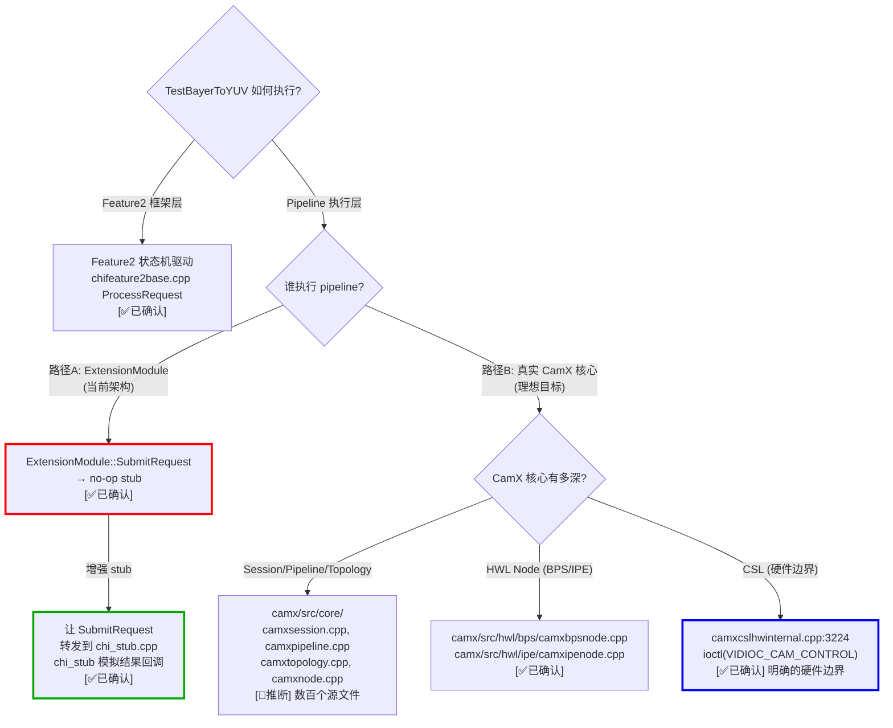
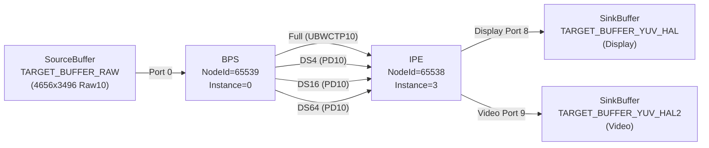

# TestBayerToYUV 移植分析 — Feature2 离线测试的完整调用链与 stub 策略

> 类型：源码分析
> 置信度底线：本文档最低置信度为 ❓推测 的内容不可作为行动依据

## ❓ 问题背景
移植 chifeature2test 的 `Feature2OfflineTest::TestBayerToYUV` 用例到 CMake/Linux x86_64。该用例使用 ZSLSnapshotYUVHAL pipeline（BPS + IPE 两个硬件节点），需要确定硬件边界并制定 stub 策略。

## 🔍 搜索过程
| 命令 / 动作 | 目标 | 结果摘要 |
|------------|------|---------|
| grep "TestBayerToYUV" chi-cdk/test/ | 找到测试注册点 | chifeature2testmain.cpp:55, feature2offlinetest.h:23 |
| read feature2offlinetest.cpp | 追踪 OfflineFeatureTest 调用链 | line 92-137: 设置流/描述符后调 RunFeature2Test() |
| read feature2testcase.cpp | RunFeature2Test 主循环 | line 655-727: ProcessRequest 状态机驱动 |
| grep "ZSLSnapshotYUVHAL" chi-cdk/ | 找 pipeline 定义 | XML: camxZSLSnapshotYUVHAL.xml, C struct: g_pipelines.h:31660 |
| read chifeature2generic.cpp | OnPipelineSelect | line 676-681: 匹配 "ZSLSnapshotYUVHAL" |
| read camxbpsnode.cpp | BPS 硬件调用入口 | ExecuteProcessRequest:1331, Submit:2008 |
| read camxipenode.cpp | IPE 硬件调用入口 | ExecuteProcessRequest:5967, Submit:6856 |
| read camxcslhwinternal.cpp | CSL→KMD ioctl 边界 | CSLHwInternalDefaultSubmit:3202, ioctl:3224 |
| read chiframework_stubs.cpp | 当前 stub 实现 | ExtensionModule::SubmitRequest 是 no-op |
| make chifeature2test | 检查编译状态 | 失败: chifeature2testbase.cpp 缺少宏定义 |

## 🌳 决策树



## 💡 分析结论

### 一、核心发现：当前测试架构有两层隔离

```
┌─────────────────────────────────────────────────────┐
│ chifeature2test binary (测试可执行文件)                │
│                                                     │
│  ┌───────────────────────────────────────────┐      │
│  │ Feature2 框架 (REAL)                       │      │
│  │  chifeature2base.cpp — 状态机             │      │
│  │  chifeature2graph.cpp — 图管理             │      │
│  │  chifeature2graphmanager.cpp               │      │
│  │  chifeature2requestobject.cpp              │      │
│  │  chitargetbuffermanager.cpp                │      │
│  │  chithreadmanager.cpp                      │      │
│  └───────────────────────┬───────────────────┘      │
│                          │ 调用                      │
│  ┌───────────────────────▼───────────────────┐      │
│  │ ExtensionModule (STUB)                     │      │
│  │  CreatePipelineDescriptor → stub           │      │
│  │  CreateSession → stub                      │      │
│  │  ActivatePipeline → stub                   │      │
│  │  SubmitRequest → NO-OP ← ★ 断裂点         │      │
│  └───────────────────────────────────────────┘      │
└─────────────────────────────────────────────────────┘

┌─────────────────────────────────────────────────────┐
│ libcamera_qcom.so (dlopen 加载)                      │
│                                                     │
│  ┌───────────────────────────────────────────┐      │
│  │ chi_stub.cpp (STUB)                        │      │
│  │  ChiSubmitPipelineRequest → 同步回调       │      │
│  │  ChiCreateSession → 保存 callbacks         │      │
│  │  ... 完整的 ChiOps mock                    │      │
│  └───────────────────────────────────────────┘      │
└─────────────────────────────────────────────────────┘
```

**关键发现**: 当前 chifeature2test 中 ExtensionModule::SubmitRequest() 是 no-op，chi_stub.cpp 的 ChiSubmitPipelineRequest 有完整的结果回调逻辑但从未被调用。两层 stub 各自独立，没有连通。

### 二、TestBayerToYUV 完整调用链

```
main() [chifeature2testmain.cpp:21]
  └→ RunTests() → CHIFEATURE2TEST_TEST(Feature2OfflineTest, TestBayerToYUV)
      └→ OfflineFeatureTest(TestBayerToYUV) [feature2offlinetest.cpp:92]
          └→ RunFeature2Test() [feature2testcase.cpp:655]
              ├→ InitializeFeature2Test() [feature2offlinetest.cpp:145]
              │   └─ m_pInputStream = &Bayer2YuvStreamsInput  (4656x3496, Raw10)
              │   └─ m_pOutputStream[0] = &Bayer2YuvStreamsOutput (4656x3496, YCbCr420_888)
              │   └─ 创建 buffer managers, metadata pools
              │
              ├→ GetGenericFeature2Descriptor() [feature2offlinetest.cpp:335]
              │   └─ pFeatureDescriptor = &Bayer2YuvFeatureDescriptor
              │   └─ pUsecaseDescriptor = g_pUsecaseZSL
              │
              ├→ CreateFeature2() [feature2offlinetest.cpp:914]
              │   └→ ChiFeature2Generic::Create()
              │       └→ Initialize()
              │           └→ OnPipelineSelect("ZSLSnapshotYUVHAL") [chifeature2generic.cpp:676]
              │           └→ ExtensionModule::CreatePipelineDescriptor()  ← STUB
              │           └→ ExtensionModule::CreateSession()  ← STUB
              │
              └→ [per-frame loop: ProcessRequest 状态机]
                  ├→ Initialized → OnProcessRequest → HandlePrepareRequest
                  │   └→ GetInputDependency message
                  │       └→ ProcessGetInputDependencyMessage() — 导入输入图像/metadata buffer
                  │
                  ├→ ReadyToExecute → HandleExecuteProcessRequest
                  │   └→ OnExecuteProcessRequest [chifeature2base.cpp:7183]
                  │       └→ Feature2GraphManager::ExecuteProcessRequest
                  │           └→ ChiFeature2Graph::ExecuteProcessRequest
                  │               └→ SubmitRequestNotification message
                  │                   └→ ProcessSubmitRequestMessage() [feature2offlinetest.cpp:870]
                  │                       └→ ExtensionModule::SubmitRequest()  ← NO-OP!
                  │
                  └→ Complete (需要收到 capture result 回调才能到达)
```

### 三、ZSLSnapshotYUVHAL Pipeline 拓扑



BPS 有 1 个输入端口 + 4 个输出端口（Full, DS4, DS16, DS64），IPE 有 4 个输入端口 + 2 个输出端口（Display, Video）。中间 buffer 使用 ChiFormatUBWCTP10 和 ChiFormatPD10 格式，BufferHeapIon 分配。

### 四、硬件边界分析

BPS 和 IPE 的硬件调用链完全相同：

```
BPSNode/IPENode::ExecuteProcessRequest()
  └→ ProgramIQConfig()          — IQ 模块编程（填充 cmd buffer）
  └→ GetHwContext()->Submit()
      └→ CSLSubmit()             — CSL API
          └→ CSLJumpTable        — 函数指针派发
              └→ CSLSubmitHW()   — session/device 验证
                  └→ CSLHwInternalDefaultSubmit()
                      └→ ioctl(fd, VIDIOC_CAM_CONTROL, &ioctlCmd)  ← ★ 硬件边界
```

CSL 层的关键函数：
| 函数 | 用途 | 是否涉及硬件 |
|------|------|------------|
| CSLAcquireDevice | 获取 ICP 设备句柄 | ✅ |
| CSLReleaseDevice | 释放设备 | ✅ |
| CSLAlloc / CSLReleaseBuffer | 分配/释放共享内存 | ✅ (ION/DMA-BUF) |
| CSLSubmit | 提交处理包 | ✅ |
| CSLStreamOn / CSLStreamOff | 启停设备 | ✅ |
| CSLCreateFence / CSLReleaseFence | 创建/释放 fence | ✅ |
| CSLFenceAsyncWait | 等待 fence 信号 | ✅ |
| CSLFlushLock / CSLCancelRequest | 刷新/取消 | ✅ |

### 五、两种 stub 方案对比

#### 方案 A: Feature2 层 stub（当前架构增强）

**原理**: 修复 ExtensionModule stub，让它转发到 chi_stub.cpp 的 ChiOps，由 chi_stub 模拟结果回调。

**修改点**:
1. ExtensionModule::SubmitRequest() → 调用 ChiModule::GetInstance()->GetChiOps()->pSubmitPipelineRequest
2. ExtensionModule::CreateSession() → 转发到 ChiOps 的 pCreateSession（传入 CHICALLBACKS）
3. ExtensionModule::ActivatePipeline() → 转发到 ChiOps 的 pActivatePipeline
4. chi_stub.cpp 已有完整的回调逻辑，无需修改

**保留的真实代码**: Feature2 框架（~95%），包括状态机、图管理、请求对象、buffer 管理
**stub 的代码**: ExtensionModule → chi_stub.cpp（整个 CamX 核心被跳过）

**优点**: 工作量小（修改几个 stub 方法），Feature2 框架逻辑完整测试
**缺点**: CamX 核心（Session, Pipeline, Topology, Node, BPS, IPE）完全不执行

#### 方案 B: CSL 层 stub（构建完整 CamX 核心）

**原理**: 编译真实的 CamX 核心代码，仅在 CSL 层（ioctl 边界）stub。

**需要编译的源码**:
- camx/src/core/: ~30+ 文件 (Session, Pipeline, Topology, Node, DRQ, HwContext, ...)
- camx/src/hwl/bps/: ~5 文件 (BPSNode + IQ modules)
- camx/src/hwl/ipe/: ~5 文件 (IPENode + IQ modules)
- camx/src/csl/: ~10 文件 (提供 mock CSLJumpTable)
- camx/src/utils/: ~20 文件 (内存、线程、OS 抽象)
- 总计: **100+ 源文件**，大量 Android 系统依赖需要 stub

**Mock CSL 实现**:
- CSLAcquireDevice → 返回 fake device handle
- CSLAlloc → malloc/mmap 普通内存
- CSLSubmit → 立即信号完成 fence（模拟 HW 即时完成）
- CSLStreamOn/Off → no-op
- CSLCreateFence → 创建 fake fence 对象

**保留的真实代码**: ~99%（Feature2 + CamX core + BPS/IPE IQ 编程）
**stub 的代码**: 仅 CSL 层（~10 个函数）

**优点**: 最大保真度，BPS/IPE 的 IQ 模块编程代码真实执行
**缺点**: 工作量巨大（100+ 源文件编译，大量 Android 依赖需要 mock）

### 六、推荐策略：分阶段递进

**Phase 1（立即目标）**: 方案 A — 连通 Feature2 → chi_stub.cpp
1. 修复编译错误（chifeature2testbase.cpp 宏定义缺失）
2. 修复 ExtensionModule stub 转发到 ChiOps
3. 验证 TestBayerToYUV 状态机完整跑通

**Phase 2（进阶目标）**: 方案 B — 逐步引入 CamX 核心
1. 替换 chi_stub.cpp 为真实 CamX HAL（CHI Override → CamX Core）
2. 构建 mock CSL JumpTable
3. 逐步编译 camx/src/core/, camx/src/hwl/ 源码
4. 处理 Android 系统依赖（ION, Gralloc, HWL firmware loading 等）

### 七、当前编译问题

chifeature2testbase.cpp 有以下编译错误：
1. 缺少宏 `CHIFEATURE2TEST_CHECK2` — 未在 chifeature2test.h 中定义
2. 宏 `CHIFEATURE2TEST_TEST_ORDERED` 需要 3 个参数但只传了 2 个
3. `GetCurRequestState()` 函数签名不匹配

这些是 API 版本不匹配的问题，需要检查 chifeature2test.h 的宏定义。

## 📍 关键代码位置

**测试入口**:
- `chi-cdk/test/chifeature2test/chifeature2testmain.cpp:55` — CHIFEATURE2TEST_TEST(Feature2OfflineTest, TestBayerToYUV)
- `chi-cdk/test/chifeature2testframework/feature2offlinetest.cpp:92` — OfflineFeatureTest()
- `chi-cdk/test/chifeature2testframework/feature2offlinetest.cpp:870` — ProcessSubmitRequestMessage() → SubmitRequest

**Feature2 框架**:
- `chi-cdk/core/chifeature2/chifeature2base.cpp:174` — ProcessRequest 状态机
- `chi-cdk/core/chifeature2/chifeature2base.cpp:1417` — HandleExecuteProcessRequest
- `chi-cdk/core/chifeature2/chifeature2graph.cpp:103` — Graph::ExecuteProcessRequest

**Pipeline 定义**:
- `chi-cdk/oem/qcom/topology/usecase-components/usecases/UsecaseZSL/pipelines/camxZSLSnapshotYUVHAL.xml` — XML 定义
- `chi-cdk/core/lib/common/g_pipelines.h:31660` — C struct 定义 (ZSLSnapshotYUVHAL)
- `chi-cdk/oem/qcom/feature2/chifeature2graphselector/chifeature2bayer2yuvdescriptor.cpp:148` — Bayer2YuvFeatureDescriptor

**BPS/IPE 节点**:
- `camx/src/hwl/bps/camxbpsnode.cpp:1331` — BPS::ExecuteProcessRequest
- `camx/src/hwl/bps/camxbpsnode.cpp:2008` — BPS HwContext::Submit
- `camx/src/hwl/ipe/camxipenode.cpp:5967` — IPE::ExecuteProcessRequest
- `camx/src/hwl/ipe/camxipenode.cpp:6856` — IPE HwContext::Submit

**硬件边界 (CSL)**:
- `camx/src/csl/camxcsl.cpp:440` — CSLSubmit (JumpTable 派发)
- `camx/src/csl/hw/camxcslhwinternal.cpp:3202` — CSLHwInternalDefaultSubmit
- `camx/src/csl/hw/camxcslhwinternal.cpp:3224` — **ioctl(VIDIOC_CAM_CONTROL)** ← 硬件边界
- `camx/src/csl/camxcsljumptable.h:28` — CSLJumpTable 函数指针表

**当前 CMake 构建**:
- `CAMX_SAIPAN_LA.UM.8.13.R1_cmake/chifeature2test/CMakeLists.txt` — 36 个源文件
- `CAMX_SAIPAN_LA.UM.8.13.R1_cmake/chifeature2test/stubs/chiframework_stubs.cpp:233` — ExtensionModule::SubmitRequest (NO-OP)
- `CAMX_SAIPAN_LA.UM.8.13.R1_cmake/camera.qcom.so/chi_stub.cpp:363` — ChiSubmitPipelineRequest (有回调逻辑)

## ⚠️ 待验证事项
- [🧠推断] 方案 B 需要编译 100+ 源文件 — 实际数量取决于 BPS/IPE IQ 模块的引入深度
- [🧠推断] CSL mock 需要模拟 fence 信号机制 — 需要确认 CSLFenceAsyncWait 的回调线程模型
- [❓推测] BPS/IPE 的 IQ 模块（3A 算法、ISP 参数）可能依赖固件文件或硬件寄存器映射 — 需要验证是否可以跳过

## 📝 备注
- 当前 chifeature2test 编译未通过，需要先修复宏定义问题
- chifeature2testbase.cpp 通过 `#include` 方式内联了 chifeature2generic.cpp，因此不能单独编译 chifeature2generic.cpp
- `Bayer2YuvFeatureDescriptor` 在 chiframework_stubs.cpp 中被定义为空结构体 `{}`，需要替换为真实的描述符（来自 chifeature2bayer2yuvdescriptor.cpp）
- 输入测试图像路径硬编码为 `Bayer2Yuv_image_4656x3496_0.raw` (bayer2yuvinputdata.h:15)
- CSL 的 JumpTable 模式（函数指针表）天然适合 mock 替换，是最清晰的 stub 边界
