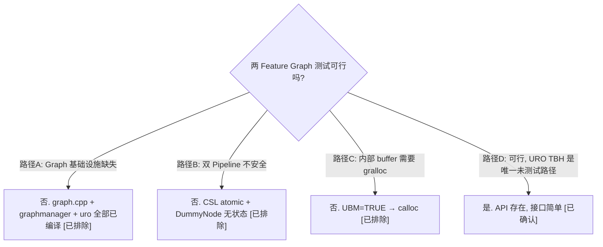

# 两 Feature Graph 测试用例可行性评估

> 类型：设计决策
> 置信度底线：本文档所有结论为 ✅已确认（基于六路并行源码阅读）

## ❓ 问题背景
当前 5 个 Feature2 测试用例全部是单 Feature（含 TestMultiStage 的 1 Feature + 2 Stage）。评估写出包含 2 个 Feature（B2Y→JPEG）的 Graph 测试用例的可行性。

## 🔍 搜索过程
| 命令 / 动作 | 目标 | 结果摘要 |
|------------|------|---------|
| read feature2offlinetest.cpp 5 个测试 | 确认全部单 Feature | 全部 ChiFeature2Generic::Create，无 Graph |
| grep ChiFeature2Graph across codebase | Graph 测试代码 | 零个 Graph 测试存在 |
| read CMakeLists.txt | Graph 编译状态 | chifeature2graph.cpp + graphmanager + uro 全部编译 |
| read chifeature2graphmanager.cpp | Feature callback 设置 | Graph::ProcessMessage 是 static，在 Feature 创建时设置 |
| read chifeature2graph.cpp ProcessFeatureMessage | 消息路由 | Graph 拦截 GetInputDep/ReleaseInputDep/Result/Metadata，转发 Submit/Message |
| read chifeature2graph.cpp ExecuteProcessRequest | 两阶段机制 | Initialized→WalkAllExtSinkLinks→InputConfigPending→WalkAllExtSrcLinks→OutputPending |
| read chitargetbuffermanager.cpp + chi_stub.cpp | 内部 buffer 分配 | UBM=TRUE → calloc 路径，不需要 gralloc |
| read csl_mock.cpp + dummy_node.cpp | 双 Pipeline 安全 | atomic handles，无全局状态 |
| read chifeature2usecaserequestobject.cpp | URO 输入机制 | SetInputTargetBufferHandle 存在但测试从未调用 |
| read chifeature2bayer2yuvdescriptor.cpp + jpegdescriptor.cpp | 端口映射 | globalId 已知，可精确匹配 |

## 🌳 决策树

## 💡 分析结论

### 1. 当前测试全部是单 Feature

| 用例 | Feature 数 | Graph | Stage 数 | 内部链接 |
|------|-----------|-------|---------|---------|
| TestBayerToYUV | 1 | 无 | 1 | 0 |
| TestBPS | 1 | 无 | 1 | 0 |
| TestIPE | 1 | 无 | 1 | 0 |
| TestYUVToJpeg | 1 | 无 | 1 | 0 |
| TestMultiStage | 1 | 无 | 2 | 1 (B2Y→YuvToYuv) |

TestMultiStage 是 1 个 ChiFeature2Generic + 2 个 Stage 的内部链接，NOT Graph。

### 2. 已确认无阻塞 (5/6)

| 维度 | 状态 | 关键证据 |
|------|------|---------|
| Feature 回调接线 | ✅ | Graph::ProcessMessage 是 static (graph.h:267), pGraphPrivateData 运行时发现 Graph (graph.cpp:1588) |
| 双 Pipeline 并发 | ✅ | CSL mock atomic handle, DummyNode 无 static 成员, ExtensionModule session handle 路由 |
| 内部 buffer 分配 | ✅ | EnableUnifiedBufferManager()==TRUE → StubBufferManagerGetImageBuffer → calloc |
| 端口映射 | ✅ | B2Y output {0,0,0,ExtOutput,Image} → JPEG input {0,0,0,ExtInput,Image}, metadata 同理 |
| Graph 编译状态 | ✅ | CMakeLists.txt:56-60 编译 graph + graphmanager + uro |

### 3. 唯一风险点: URO 外部输入 TBH

Graph::ExecuteProcessRequest 内部两阶段:
- Phase 1: WalkAllExtSinkLinks → InputConfigPending (记录输入需求)
- Phase 2: WalkAllExtSrcLinks → 读 URO.m_inputBufferTBHs (提供输入 buffer)

SetInputTargetBufferHandle (usecaserequestobject.cpp:403) 是设置器, 但当前测试从未调用。
在真实 Android 中由 Feature2Wrapper 负责 (仅 reprocess 路径, chifeature2wrapper.cpp:786)。

应对: 在 EPR 前手动调用 SetInputTargetBufferHandle(pChiStream, TBH)。

### 4. 方案 A: 完整 Graph 集成

工作项:
1. 定义 B2Y→JPEG GraphDesc (~50 行静态数据)
2. 写 TestB2YJPEG 测试函数 (~150 行)
3. 实现 GraphManagerCallbacks (~30 行)
4. URO 输入 TBH 设置 (~50 行)
5. 调试 buffer/metadata 路由 (不确定)

总计: ~300-400 行, 2-3 天

### 5. 方案 B: 手动双 Feature 桥接

1. 创建两个独立 Feature (各自 callback = test ProcessMessage)
2. 先驱动 B2Y (单 Feature 模式)
3. B2Y 的 ResultNotification 回调中, 手动将输出 buffer 设为 JPEG 的输入
4. 再驱动 JPEG (单 Feature 模式)

总计: ~150-200 行, 1 天
不测试真实 Graph 代码, 面试价值有限

### 6. 推荐方案 A

理由:
- 核心基础设施全部就绪
- 面试价值高 — "我写了 Feature Graph 级别的集成测试"
- 唯一未测试路径 (URO TBH) 的 API 已存在且接口简单
- 验证 Graph 完整路径: WalkBackFromLink 反向激活, 内部 buffer 路由, ONP 释放链

## 📍 关键代码位置
- `chi-cdk/core/chifeature2/chifeature2graph.cpp:103-132` — ExecuteProcessRequest 两阶段
- `chi-cdk/core/chifeature2/chifeature2graph.cpp:137-162` — ProcessMessage static 方法
- `chi-cdk/core/chifeature2/chifeature2graph.cpp:636-847` — Initialize (port-link 匹配)
- `chi-cdk/core/chifeature2/chifeature2graph.cpp:1429-1463` — ChiFeature2GraphCallbackData 创建
- `chi-cdk/core/chifeature2/chifeature2graph.h:267-268` — ProcessMessage static 声明
- `chi-cdk/core/chifeature2/chifeature2graphmanager.cpp:72` — 设 callback = Graph::ProcessMessage
- `chi-cdk/core/chifeature2/chifeature2usecaserequestobject.cpp:403-439` — SetInputTargetBufferHandle
- `chi-cdk/core/chifeature2/chitargetbuffermanager.cpp:442-455` — InternalBuffer SetupTargetBuffer
- `chi-cdk/oem/qcom/feature2/chifeature2graphselector/chifeature2graphdescriptors.cpp:906-992` — RTBayer2YUVJPEG 参考 GraphDesc
- `chi-cdk/oem/qcom/feature2/chifeature2graphselector/chifeature2bayer2yuvdescriptor.cpp:25-51` — B2Y 端口定义
- `chi-cdk/oem/qcom/feature2/chifeature2graphselector/chifeature2jpegdescriptor.cpp:18-51` — JPEG 端口定义
- `camera.qcom.so/csl_mock.cpp` — atomic handle 分配, 双 pipeline 安全
- `camera.qcom.so/dummy_node.cpp` — 无 static 成员, 多实例安全
- `camera.qcom.so/chi_stub.cpp:645-667` — StubBufferManagerCreate/GetImageBuffer (calloc 路径)
- `chifeature2test/stubs/chiframework_stubs.cpp:190` — EnableUnifiedBufferManager() = TRUE

## ⚠️ 待验证事项
- [🧠推断] SetInputTargetBufferHandle 在我们的 mock 环境中可正常工作 — API 存在但从未在测试中调用
- [🧠推断] Graph 的 port→link 匹配在手动构造的 GraphDesc 上可正确运行 — 未实际运行
- [🧠推断] metadata 通过内部链路传递时 metadata stubs 无缺口 — 未实际验证
- [🧠推断] Graph 销毁时 ChiFeature2GraphCallbackData 正确释放 — 未追踪析构路径

## 📝 备注
- 全 codebase 不存在任何 Graph 级别的测试 — 我们将是第一个
- TestMultiStage 容易被误认为 Graph 测试, 实际是单 Feature 多 Stage
- GraphSelector (动态选择 GraphDesc) 不需要 — 我们手动构造 GraphDesc
- GraphManager 可选 — 可直接使用 ChiFeature2Graph::Create, 绕过 PoolManager 和 Selector
- StubFeatureGraphDescriptor (graphdescriptors.cpp:829) 是最简单的 2-Feature Graph 参考, 但用了 RealTime Feature (我们没有编译)
