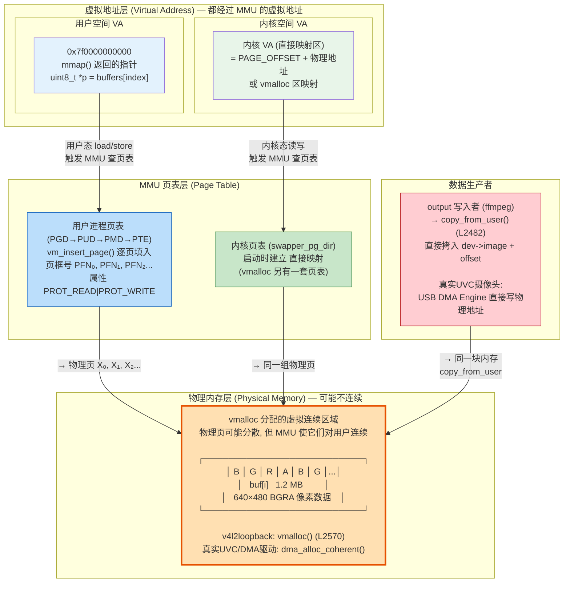
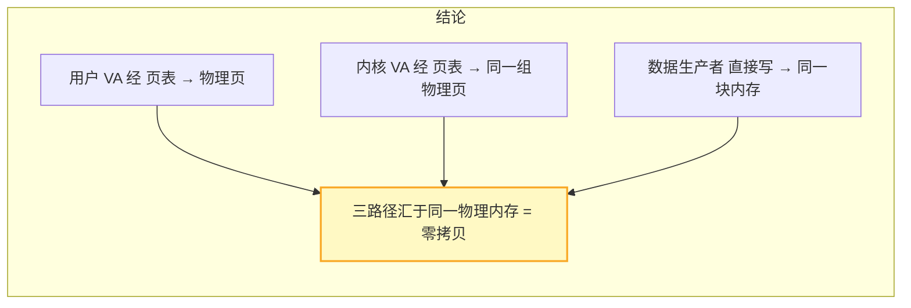
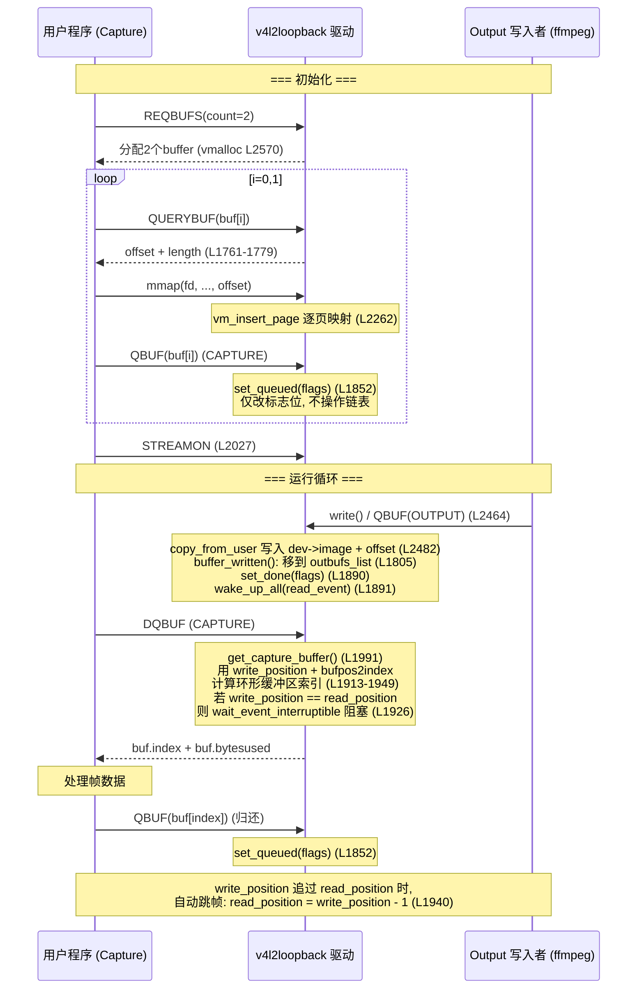
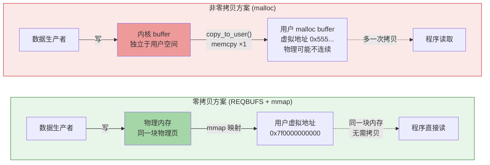
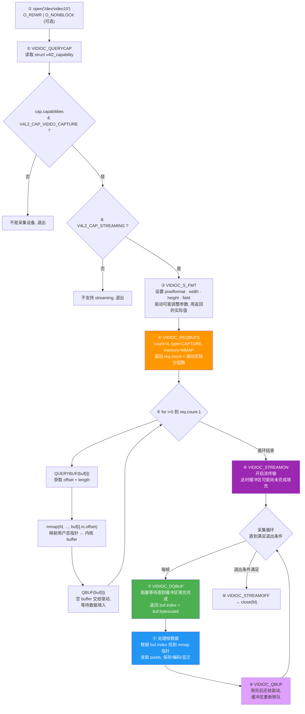
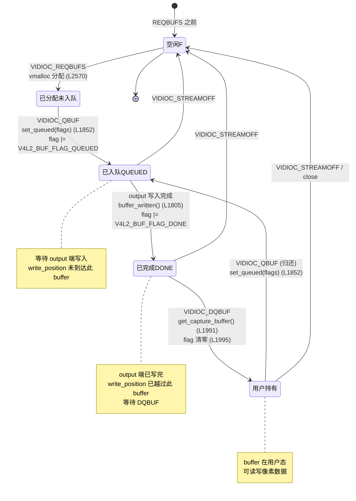
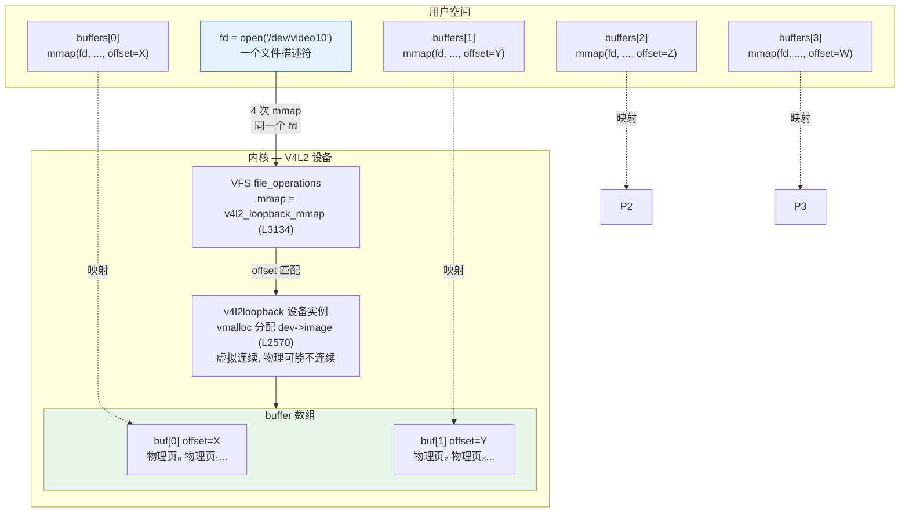

# V4L2 深度分析 — API流程、DMA架构、状态机 (v4l2loopback 源码验证)

## 问题背景
学习 V4L2 框架，搭建 v4l2loopback 虚拟摄像头测试环境，从零写 C 程序采集帧，逐步深入理解 DMA buffer 零拷贝、mmap 原理、QBUF/DQBUF 队列模型。所有分析结论均与 `/usr/src/v4l2loopback-0.15.3/v4l2loopback.c` 逐行对照验证。

---

## 一、REQBUFS + mmap 零拷贝全景



**图解要点：**

```
  用户 VA ──页表──▶ 物理页 X₀,X₁,X₂... ◀──页表── 内核 VA
                         ▲
                         │ copy_from_user (v4l2loopback) 或 DMA (UVC)
                     数据生产者

  v4l2loopback 实际情况 (基于 v4l2loopback.c):
    - 内存分配: vmalloc() (L2570), 虚拟连续, 物理可能不连续
    - mmap: vm_insert_page() 逐页映射 (L2262), 不是 remap_pfn_range
    - 数据写入: copy_from_user() (L2482), 不是 DMA
    - 标志位: set_queued() + set_done() 标记状态 (L1852, L1887-1890)

  真实 UVC 摄像头:
    - 内存分配: dma_alloc_coherent(), 物理连续
    - 数据写入: USB DMA Engine 直接写物理地址

  p = mmap(...);          // p = 0x7f0000000000 (这是虚拟地址)
  p[0] = 0xff;            // CPU 执行: MMU 把虚拟地址 → PFN, 写入对应物理页
```



> **v4l2loopback vs 真实驱动关键差异：**
>
> | | v4l2loopback | 真实 UVC/硬件驱动 |
> |--|-------------|------------------|
> | 内存分配 | `vmalloc()` — 物理可能不连续 | `dma_alloc_coherent()` — 物理连续 |
> | mmap 实现 | `vm_insert_page()` 逐页 (L2262) | `dma_mmap_coherent()` 或 `remap_pfn_range` |
> | 数据写入 | `copy_from_user()` 软件拷贝 (L2482) | DMA Engine 硬件写 |
> | 状态管理 | flag 位 (QUEUED/DONE) + 环形数组 | VB2 框架的 done_list/queued_list |
> | V4L2 API | **完全相同**: QUERYCAP/S_FMT/REQBUFS/QUERYBUF/QBUF/DQBUF/STREAMON | 相同 |

---

## 二、QBUF / DQBUF 队列模型 — v4l2loopback 实际行为



**v4l2loopback 实际数据结构（基于源码）：**

```
  struct v4l2_loopback_device {          CAPTURE 侧 ring buffer:
    struct v4l2l_buffer buffers[MAX];       bufpos2index[pos] → buffers[index]
    struct list_head outbufs_list;       // OUTPUT DQBUF 用, CAPTURE 不用
    int bufpos2index[MAX_BUFFERS];      // write_position % count → index
    s64  write_position;                // output 写完 ++
    // 每个 opener 有 read_position
    wait_queue_head_t read_event;       // DQBUF 阻塞在此
  }
```

> **v4l2loopback 与 VB2 框架的区别：**
>
> v4l2loopback **不使用** VB2 (`videobuf2`)。VB2 有 `done_list` / `queued_list` 双链表，v4l2loopback
> 用 `write_position` + `read_position` 环形数组。只有 OUTPUT 侧的 QBUF 才将 buffer
> 挂到 `outbufs_list` (L1805)，供 OUTPUT 类型 DQBUF 取出 (L2000-2003)。
> CAPTURE 类型的 DQBUF 直接计算索引，不经过链表。

---

## 三、零拷贝 vs 拷贝



---

## 四、完整 API 调用流程 (10步)



**对照 `v4l2_capture.c`:**

| 步骤 | ioctl / 系统调用 | 代码行 |
|------|-----------------|--------|
| ① | `open()` | L37 |
| ② | `VIDIOC_QUERYCAP` + 能力检查 | L44-60 |
| ③ | `VIDIOC_S_FMT` | L70 |
| ④ | `VIDIOC_REQBUFS` | L84 |
| ⑤ | `for` 循环: QUERYBUF → mmap → QBUF | L91-112 |
| ⑥ | `VIDIOC_STREAMON` | L116 |
| ⑦ | `VIDIOC_DQBUF` | L127 |
| ⑧ | 处理帧 (按 `buf.index` 取 `buffers[index]`) | L134-136 |
| ⑨ | `VIDIOC_QBUF` (归还) | 循环中隐含, 程序只取一帧 |
| ⑩ | `VIDIOC_STREAMOFF` → `close()` | L140-141 |

---

## 五、Buffer 状态机 — V4L2 标准 + v4l2loopback 实现



**V4L2 标准 flag 定义 (`videodev2.h:1161-1165`):**

| 常量 | 值 | v4l2loopback 设置位置 |
|------|----|---------------------|
| `V4L2_BUF_FLAG_MAPPED` | `0x0001` | mmap 成功后自动设置 |
| `V4L2_BUF_FLAG_QUEUED` | `0x0002` | QBUF → `set_queued()` (L1852, L1887) |
| `V4L2_BUF_FLAG_DONE` | `0x0004` | output 写完 → `set_done()` (L1890, L2494) |
| (清除全部) | `0x0000` | DQBUF → `unset_flags()` (L1995) |

**v4l2loopback CAPTURE DQBUF 不通过链表 (L1990-1995):**

```c
case V4L2_BUF_TYPE_VIDEO_CAPTURE:
    index = get_capture_buffer(file);      // 用 write_position + bufpos2index 计算
    *buf = dev->buffers[index].buffer;     // 直接拷贝 buffer 内容
    unset_flags(buf->flags);               // 清除 MAPPED|QUEUED|DONE 所有标志
    break;
```

> v4l2loopback **不使用 VB2 框架**，而是自己管理环形缓冲区。CAPTURE DQBUF 用 `write_position` + `bufpos2index` 计算索引，不经过链表。只有 OUTPUT 侧使用 `outbufs_list`。

**v4l2loopback 特殊行为：**

| 现象 | 代码依据 |
|------|---------|
| output 端 write() 永不阻塞，直接 `copy_from_user` 覆盖 | L2479-2495：无 `wait_event`，无 `EAGAIN` |
| write_position 追过 read_position 时自动跳帧 | L1940: `read_position = write_position - 1` |
| sustain_framerate 用定时器重复旧帧 | L2692-2703: `reread_count++` + `wake_up_all` |
| timeout 后使用 timeout_image 填充 | L2718-2719: `timeout_happened = 1` |
| capture 端 DQBUF 阻塞在 `read_event` | L1926: `wait_event_interruptible(dev->read_event, ...)` |

---

## 六、一个 fd 对应多个 mmap — 设备文件模型



**offset 是区分符，fd 代表整个设备：**

```c
buffers[0] = mmap(NULL, length, PROT_READ|PROT_WRITE, MAP_SHARED,
                   fd,                    // ← 同一个 fd
                   buf[0].m.offset);      // ← offset 不同，选不同 buf

// v4l2loopback 内核 mmap 实际实现 (L2248-2278):
addr = dev->image + offset;               // vmalloc 虚址 + offset
while (size > 0) {
    struct page *page = vmalloc_to_page(addr);  // 逐页获取物理页 (L2260)
    vm_insert_page(vma, start, page);           // 逐页插入用户页表 (L2262)
    start += PAGE_SIZE;
    addr  += PAGE_SIZE;
    size  -= PAGE_SIZE;
}
```

**为什么不用独立 fd：**

```
❌ 如果每个 buffer 一个 fd:
   fd0 = open("/dev/video10/buf0")   — 这种文件不存在
   fd1 = open("/dev/video10/buf1")   — /dev 下只有一个设备节点
   ioctl(fd0, QBUF), ioctl(fd1, QBUF) — 4个fd要协调队列,极其复杂

✅ 现状: 一个 fd + offset:
   ioctl(fd, REQBUFS)    — 全局分配
   ioctl(fd, QBUF, &buf) — buf.index 区分
   ioctl(fd, DQBUF, &buf)— 驱动返回 buf.index
   mmap(fd, ..., offset) — offset 选物理页
   → fd = 设备实例, offset = 资源选择器
```

Unix 设备模型：`/dev/fb0` 也是同一个 fd 映射整个显存，靠 offset 选择 framebuffer 的不同 plane。

---

## 关键代码位置
- `/usr/src/v4l2loopback-0.15.3/v4l2loopback.c:2570` — `vmalloc()` buffer 分配
- `/usr/src/v4l2loopback-0.15.3/v4l2loopback.c:2248-2278` — `v4l2_loopback_mmap()` 用 `vmalloc_to_page` + `vm_insert_page`
- `/usr/src/v4l2loopback-0.15.3/v4l2loopback.c:2464-2498` — `v4l2_loopback_write()` output 端 `copy_from_user`
- `/usr/src/v4l2loopback-0.15.3/v4l2loopback.c:1822-1898` — `vidioc_qbuf()` CAPTURE/OUTPUT 行为差异
- `/usr/src/v4l2loopback-0.15.3/v4l2loopback.c:1969-2020` — `vidioc_dqbuf()` CAPTURE 用 index 计算, OUTPUT 用 outbufs_list
- `/usr/src/v4l2loopback-0.15.3/v4l2loopback.c:1913-1949` — `get_capture_buffer()` 环形缓冲区 index 计算
- `/usr/include/linux/videodev2.h:1161-1165` — V4L2 buffer flag 定义
- (完整采集示例见下方「附录」)

## 相关概念
v4l2, video4linux2, v4l2loopback, mmap, zero-copy, DMA, vmalloc, copy_from_user, vm_insert_page, V4L2_BUF_FLAG_QUEUED, V4L2_BUF_FLAG_DONE, QBUF, DQBUF, REQBUFS, QUERYBUF, STREAMON, STREAMOFF, videobuf2, VB2, ring buffer, state machine

## 备注
- 全部结论基于 `/usr/src/v4l2loopback-0.15.3/v4l2loopback.c` 逐行验证
- v4l2loopback 是不使用 VB2 框架的特殊 V4L2 驱动，但用户空间 API 完全兼容
- 真实 UVC/USB 摄像头使用 VB2 + dma_alloc_coherent, 内存模型不同但 API 相同
- 测试环境: WSL2 + v4l2loopback-0.15.3 + kernel 6.18.26

---

## 附录：完整采集示例代码 + 编译测试流程

### 代码 (`v4l2_capture.c`)

```c
#include <stdio.h>
#include <stdlib.h>
#include <string.h>
#include <fcntl.h>
#include <unistd.h>
#include <errno.h>
#include <sys/ioctl.h>
#include <sys/mman.h>
#include <linux/videodev2.h>

#define DEVICE "/dev/video10"
#define WIDTH   640
#define HEIGHT  480
#define FRAME_COUNT 1

static int xioctl(int fd, unsigned long request, void *arg)
{
    int r;
    do {
        r = ioctl(fd, request, arg);
    } while (r == -1 && errno == EINTR);
    return r;
}

int main()
{
    int fd;
    struct v4l2_capability cap;
    struct v4l2_format fmt;
    struct v4l2_requestbuffers req;
    struct v4l2_buffer buf;
    void *buffers[4];
    unsigned int i;
    FILE *fout;

    /* 1. 打开设备 */
    fd = open(DEVICE, O_RDWR);
    if (fd < 0) {
        perror("open");
        return 1;
    }

    /* 2. 查询设备能力 */
    if (xioctl(fd, VIDIOC_QUERYCAP, &cap) < 0) {
        perror("VIDIOC_QUERYCAP");
        return 1;
    }
    printf("Driver : %s\n", cap.driver);
    printf("Card   : %s\n", cap.card);
    printf("Bus    : %s\n", cap.bus_info);
    printf("Cap    : 0x%08X\n", cap.capabilities);

    if (!(cap.capabilities & V4L2_CAP_VIDEO_CAPTURE)) {
        fprintf(stderr, "Not a capture device\n");
        return 1;
    }
    if (!(cap.capabilities & V4L2_CAP_STREAMING)) {
        fprintf(stderr, "No streaming support\n");
        return 1;
    }

    /* 3. 设置格式 */
    memset(&fmt, 0, sizeof(fmt));
    fmt.type                = V4L2_BUF_TYPE_VIDEO_CAPTURE;
    fmt.fmt.pix.width       = WIDTH;
    fmt.fmt.pix.height      = HEIGHT;
    fmt.fmt.pix.pixelformat = V4L2_PIX_FMT_BGRA32;
    fmt.fmt.pix.field       = V4L2_FIELD_NONE;

    if (xioctl(fd, VIDIOC_S_FMT, &fmt) < 0) {
        perror("VIDIOC_S_FMT");
        return 1;
    }
    printf("Format : %dx%d, size=%u, stride=%u\n",
           fmt.fmt.pix.width, fmt.fmt.pix.height,
           fmt.fmt.pix.sizeimage, fmt.fmt.pix.bytesperline);

    /* 4. 请求缓冲区 */
    memset(&req, 0, sizeof(req));
    req.count  = 4;
    req.type   = V4L2_BUF_TYPE_VIDEO_CAPTURE;
    req.memory = V4L2_MEMORY_MMAP;

    if (xioctl(fd, VIDIOC_REQBUFS, &req) < 0) {
        perror("VIDIOC_REQBUFS");
        return 1;
    }
    printf("Buffers: %u allocated\n", req.count);

    /* 5 & 6. 查询并 mmap 每个缓冲区, 再入队 */
    for (i = 0; i < req.count; i++) {
        memset(&buf, 0, sizeof(buf));
        buf.type   = V4L2_BUF_TYPE_VIDEO_CAPTURE;
        buf.memory = V4L2_MEMORY_MMAP;
        buf.index  = i;

        xioctl(fd, VIDIOC_QUERYBUF, &buf);

        void *ptr = mmap(NULL, buf.length,
                         PROT_READ | PROT_WRITE,
                         MAP_SHARED, fd, buf.m.offset);
        if (ptr == MAP_FAILED) {
            perror("mmap");
            return 1;
        }
        printf("Buf[%u]: addr=%p, size=%u\n", i, ptr, buf.length);

        buffers[i] = ptr;  /* 保存地址，之后按 buf.index 取用 */

        /* 6. 缓冲区入队 */
        xioctl(fd, VIDIOC_QBUF, &buf);
    }

    /* 7. 开始流 */
    enum v4l2_buf_type type = V4L2_BUF_TYPE_VIDEO_CAPTURE;
    if (xioctl(fd, VIDIOC_STREAMON, &type) < 0) {
        perror("VIDIOC_STREAMON");
        return 1;
    }
    printf("Streaming started\n");

    /* 8. 出队一帧 */
    memset(&buf, 0, sizeof(buf));
    buf.type   = V4L2_BUF_TYPE_VIDEO_CAPTURE;
    buf.memory = V4L2_MEMORY_MMAP;

    if (xioctl(fd, VIDIOC_DQBUF, &buf) < 0) {
        perror("VIDIOC_DQBUF");
        return 1;
    }
    printf("Frame[%u]: bytesused=%u\n", buf.index, buf.bytesused);

    /* 9. 保存到文件 (用驱动返回的 index 取正确的 buffer) */
    fout = fopen("/tmp/frame.raw", "wb");
    fwrite(buffers[buf.index], buf.bytesused, 1, fout);
    fclose(fout);
    printf("Saved /tmp/frame.raw (%u bytes)\n", buf.bytesused);

    /* 10. 停止流, 清理 */
    xioctl(fd, VIDIOC_STREAMOFF, &type);
    close(fd);
    printf("Done\n");

    return 0;
}
```

### 环境搭建

```bash
# 1. 安装依赖
sudo apt update
sudo apt install v4l-utils v4l2loopback-dkms v4l2loopback-utils ffmpeg

# 2. 加载虚拟摄像头模块
sudo modprobe v4l2loopback devices=2 video_nr=10,11 card_label="VirtualCam0","VirtualCam1"

# 3. 验证设备
ls /dev/video*
# 应看到: /dev/video10  /dev/video11
v4l2-ctl -d /dev/video10 --all
# 应看到: Driver name: v4l2 loopback, Card type: VirtualCam0
```

### 编译

```bash
gcc -o v4l2_capture v4l2_capture.c
```

### 运行

```bash
# 终端1: 向虚拟摄像头灌测试画面
sudo ffmpeg -f lavfi -i testsrc=size=640x480:rate=30 -pix_fmt bgra -f v4l2 /dev/video10 &

# 终端2: 运行采集程序
sudo ./v4l2_capture

# 预期输出:
# Driver : v4l2 loopback
# Card   : VirtualCam0
# Bus    : platform:v4l2loopback-010
# Cap    : 0x85200003
# Format : 640x480, size=1228800, stride=2560
# Buffers: 2 allocated
# Buf[0]: addr=0x..., size=1228800
# Buf[1]: addr=0x..., size=1228800
# Streaming started
# Frame[0]: bytesused=1228800
# Saved /tmp/frame.raw (1228800 bytes)
# Done
```

### 验证抓到的帧

```bash
# 查看文件大小 (应为 640×480×4 = 1228800 bytes)
ls -l /tmp/frame.raw

# 转为可视图片
ffmpeg -f rawvideo -pix_fmt bgra -s 640x480 -i /tmp/frame.raw /tmp/frame.png

# 查看 (WSL2 环境下可复制到 Windows)
cp /tmp/frame.png /mnt/c/Users/$USER/Desktop/frame.png
```
